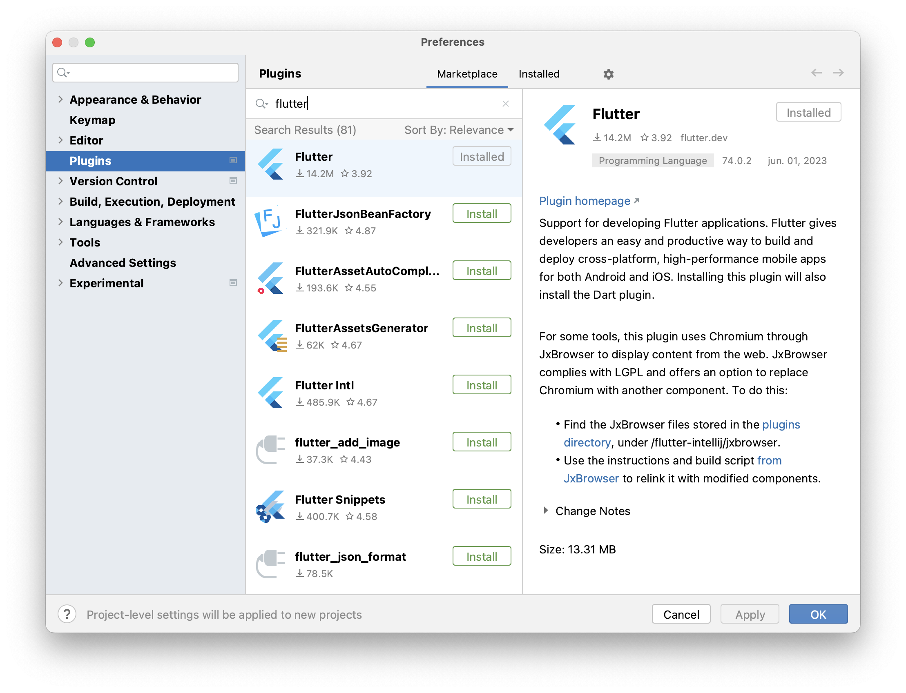
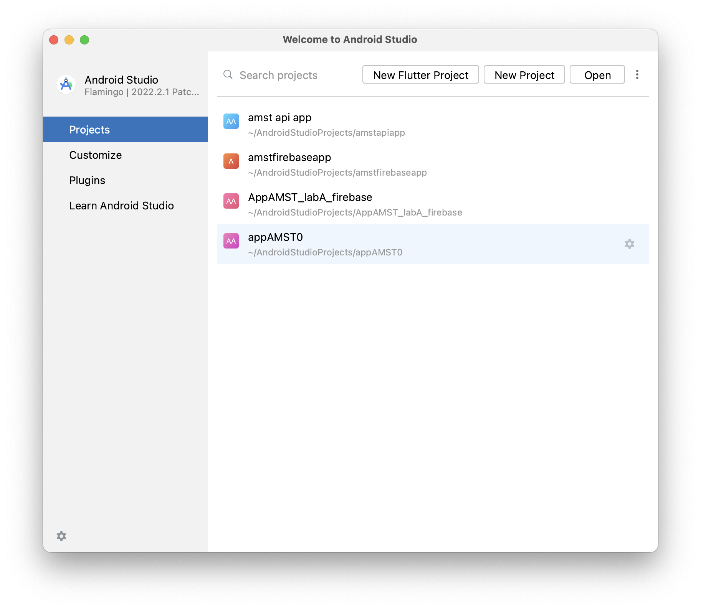

[Regresar](/Aplicaciones-Moviles-y-Servicios-Telematicos/)

# Práctica de Laboratorio 4
## DESARROLLO DE APLICACIÓN MÓVIL HÍBRIDA BÁSICA CON FLUTTER

## 🎯 Objetivo de Aprendizaje
Desarrollar aplicaciones móviles sencillas considerando las características de la programación de dispositivos móviles.

**Recursos:** 
Android Studio.

**Duración:** 
10 horas.


**Introducción**
Flutter es un conjunto de herramientas de interfaz de usuario multiplataforma que está diseñado para permitir la reutilización de código en sistemas operativos como iOS y Android, al mismo tiempo que permite que las aplicaciones interactúen directamente con los servicios de la plataforma subyacente. El objetivo es permitir que los desarrolladores entreguen aplicaciones de alto rendimiento que se sientan naturales en diferentes plataformas, adoptando las diferencias donde existen mientras comparten la mayor cantidad de código posible.

**Beneficios de Flutter**
- Alta productividad al ser multiplataforma.
- Desarrollo rápido y sencillo.
- Compatibilidad.
- De código abierto.

**Desventajas de Flutter**

- Las aplicaciones creadas con Flutter tienden a ser pesadas.
- Pocas librerías de terceros.

**Limitaciones de Flutter**
- Flutter está usando un lenguaje de programación llamado Dart. 
- Complejidad limitada.


**Actividades**

### **Paso 1: Instalar Flutter**

**Requerimientos**

Antes de continuar hay que tener en cuenta los siguientes requerimientos para instalar Flutter.

**Hardware**
En primera instancia se recomienda un sistema con:
- Mínimo 8gb de ram.
- Espacio libre en disco: 6 gb mínimo.
- *Si posee tarjeta de video mucho mejor debido a que el emulador del dispositivo Android consume muchos recursos.

**Software**

Windows:
- Windows 7 SP1 o posterior (64 bits), x86-64 
- Windows Powershell 5.0 o posterior. (Preinstalado en Windows 10)
- Git for Windows 2.x (Debe permitir ejecutar comandos “git” en el command promt o powershell)

MacOS:

- MacOS (64-bit)
- Xcode (Incluye git, aunque puede ser instalado por separado)

Linux:

- Linux (64-bit)


1)	Descargar el archivo SDK en su última versión estable en el siguiente enlace, ahí podrán encontrar los diferentes archivos para cada tipo de sistema operativo.:
a.	https://flutter.dev/docs/development/tools/sdk/releases

2)	Extraemos el archivo zip.
- En Windows podemos dar click derecho al archivo y damos click en extraer todo.
- En MacOS podemos dar click derecho al archivo y dar click en abrir, con esto de descomprimirá el archivo.

3) La carpeta extraída la alojamos en la siguiente localización. (En caso de no existir el directorio, crearlo).
- En Windows: 
```
C:\Users\<tu-nombre-de-usuario>\Documents
```

- En Mac: 
```
<Disco Principal>/Users/<tu-nombre-de-usuario>/development
```

4)	Debemos agregar el path a las variables del sistema:

**En Windows**

- En el inicio buscamos panel de control y lo abrimos.
- En la parte derecha superior seleccionamos Ver por: “Iconos grandes”
- Luego damos click en Sistema.

- Dependiendo de la versión de Windows puede que se mantenga en el mismo panel de control o se inicie una nueva ventana de configuración.
- En esta nueva ventana buscaremos “Configuración avanzada del sistema”, si se mantuvo en el panel de control aparecerá en un panel izquierda. En el otro caso de que se haya abierto la ventana de configuración esta opción está en el panel derecho.
- Se abrirá la ventana de Propiedades del sistema, ahí daremos click en variables de entorno.
- En el cuadro inferior de “Variables del sistema” buscaremos la variable llamada “Path” y le daremos doble click.

- Se abrirá una nueva ventana, ahí presionaremos en el botón nuevo.
- Escribiremos la ruta donde se alojó la carpeta de flutter. Ejemplo: C:\Users\<tu-nombre-de-usuario>\Documents\flutter\bin
- Daremos en aceptar en las ventanas hasta cerrarlas todas.

**En MacOS**

- Abriremos una terminal.
- Nos dirigiremos al directorio del usuario con el comando: cd /Users/<tu-nombre-de-usuario>
- Edita el archivo rc para su shell. Si escribes echo $SHELL en tu Terminal te dirá qué shell estás usando. Si estás usando Bash, edita $HOME/.bash_profile o $HOME/.bashrc. Si utilizas el shell Z, edita $HOME/.zshrc. Si utilizas un shell distinto, la ruta y el nombre del archivo serán diferentes en tu máquina.
- Presionamos la tecla i para empezar a editar el archivo creado.
- Escribiremos: export PATH=”$PATH:/Users/<tu-nombre-de-usuario>/development/flutter/bin” (el path agregado debe coincidir con el path donde se encuentra la carpeta de flutter alojada.)
- Para salir de vim escribiremos “:wq!”
- Cerramos y volvemos a abrir la terminal.

5)	Para verificar que hemos agregado correctamente flutter a nuestro path abriremos una instancia de cmd en Windows o una nueva terminal en MacOS.
6)	Escribimos el comando flutter --version, deberá aparecer la versión actualmente instalada de flutter, en caso de error verificar los pasos anteriores.

```
adi@host-200-126-27-205 ~ % flutter --version
Flutter 3.10.5 • channel stable • https://github.com/flutter/flutter.git
Framework • revision 796c8ef792 (19 hours ago) • 2023-06-13 15:51:02 -0700
Engine • revision 45f6e00911
Tools • Dart 3.0.5 • DevTools 2.23.1

  ╔════════════════════════════════════════════════════════════════════════════╗
  ║                 Welcome to Flutter! - https://flutter.dev                  ║
  ║                                                                            ║
  ║ The Flutter tool uses Google Analytics to anonymously report feature usage ║
  ║ statistics and basic crash reports. This data is used to help improve      ║
  ║ Flutter tools over time.                                                   ║
  ║                                                                            ║
  ║ Flutter tool analytics are not sent on the very first run. To disable      ║
  ║ reporting, type 'flutter config --no-analytics'. To display the current    ║
  ║ setting, type 'flutter config'. If you opt out of analytics, an opt-out    ║
  ║ event will be sent, and then no further information will be sent by the    ║
  ║ Flutter tool.                                                              ║
  ║                                                                            ║
  ║ By downloading the Flutter SDK, you agree to the Google Terms of Service.  ║
  ║ Note: The Google Privacy Policy describes how data is handled in this      ║
  ║ service.                                                                   ║
  ║                                                                            ║
  ║ Moreover, Flutter includes the Dart SDK, which may send usage metrics and  ║
  ║ crash reports to Google.                                                   ║
  ║                                                                            ║
  ║ Read about data we send with crash reports:                                ║
  ║ https://flutter.dev/docs/reference/crash-reporting                         ║
  ║                                                                            ║
  ║ See Google's privacy policy:                                               ║
  ║ https://policies.google.com/privacy                                        ║
  ╚════════════════════════════════════════════════════════════════════════════╝


The Flutter CLI developer tool uses Google Analytics to report usage and
diagnostic data
along with package dependencies, and crash reporting to send basic crash
reports.
This data is used to help improve the Dart platform, Flutter framework, and
related tools.

Telemetry is not sent on the very first run.
To disable reporting of telemetry, run this terminal command:

flutter --disable-telemetry.
If you opt out of telemetry, an opt-out event will be sent,
and then no further information will be sent.
This data is collected in accordance with the
Google Privacy Policy (https://policies.google.com/privacy).

You have received two consent messages because the flutter tool is migrating to
a new analytics system. Disabling analytics collection will disable both the
legacy and new analytics collection systems. You can disable analytics reporting
by running `flutter --disable-telemetry`
```

7)	Una vez verificado, ejecutamos el siguiente comando:
```flutter doctor```

8)	En caso de pedir aceptar algunas opciones de firmas y datos lo hacemos.

### **Paso 2: Configuración de Android Studio**

Para esto ya deben tener instalado Android Studio y actualizado a la última versión.

1)	Abriremos Android Studio.
2)	Abriremos configure > settings.
3)	En la parte derecha seleccionaremos la pestaña Plugins.
4)	Buscaremos el Marketplace el nombre el plugin llamado “flutter”
5)	Una vez encontrado presionaremos en el icono de Install, para instalar el plugin.
6)	En caso de mostrarnos un mensaje de que existe dependencia con dart, le damos a install también.
7)	Esperamos a que termine y se mostrará un botón de reiniciar IDE de Andrid Studio, presionamos y esperamos.

<p align="center">
  
</p>

8)	Para verificar que la instalación fue correcta en la página de inicio nos aparecerá una nueva pestaña que dice: ***New Flutter Project***.

<p align="center">
  
</p>

### **Paso 3: Crear nuevo proyecto**
Crearemos un nuevo proyecto para familiarizarnos con los archivos de flutter.
1)	Abriremos Android Studio.
2)	Daremos click en “Create new flutter project”.
3)	Donde dice Flutter SDK path deberíamos tener el directorio de nuestra carpeta de flutter, en caso de no tenerla:
- Presionar en los 3 puntos a la derecha.
- Buscar y seleccionar el directorio de la carpeta de flutter (Donde se la guardó cuando se instaló).
4)	Le damos click en Next.
5)	En la siguiente página podremos poner el nombre y la localización del proyecto, en nuestro caso llamaremos el proyecto “g0amst”, donde 0 es el número de grupo.
6)	Damos click en Finish.
7)	Se nos abrirá la app de ejemplo que viene por defecto en flutter.
8)	Para correrla debemos de tener un dispositivo Android conectado, o iniciado un dispositivo virtual.
9) Presionamos en el icono de run para que empiece a compilar la aplicación y automáticamente se abrirá en el dispositivo la aplicación.

10)	Con esto se nos abrira una aplicación que la genera flutter como demostracion. Eliminaremos todos los comentarios que encontramos en el archivo ./lib/main.dart.
11)	OJO* Algunos comentarios que son nombres de widgets como “MaterialAPP o ThemeData” se generan automaticamente por Android Studio para mejor facilidad de visualizacion de los componentes. Con esto estamos listos para el desarrollo de la app.

### **Paso 4: Esqueleto de la aplicación**

En caso de tener más interés en el desarrollo de flutter, y tiene experiencia en el desarrollo en Android nativo, se recomienda visitar el siguiente enlace: https://flutter.dev/docs/get-started/flutter-for/android-devs. Aquí se explica a un programador de Android, cuáles son sus equivalentes en flutter. Así mismo encontrara para desarrolladores de IOS, web y más.
Los recursos e imágenes se deben guardar en una nueva carpeta llamada assets -> images dentro del proyecto principal:

Una vez creada la carpeta, añadir en el archivo pubspec.yaml las siguientes líneas debajo del comentario de assets:


El proyecto simula una aplicación básica de compra con inicio de sesión, registro, configuración, vista de promociones y carrito de compra.

1)	Primero dentro del paquete lib se va a crear un nuevo archivo .dart llamado exampleapp. Es recomendable separar los archivos por carpetas para una mejor organización. En este caso se creó una carpeta llamada ui donde se colocarán todos los archivos de la interfaz de usuario.
Botón derecho -> crear nuevo archivo .dart.
Nota: Al crear cualquier archivo .dart importar primero material.dart:
import 'package:flutter/material.dart';

2)	Dentro del archivo vamos a crear la clase ExampleApp. Para eso vamos a copiar el siguiente código:

````
import 'package:flutter/material.dart';

class ExampleApp extends StatefulWidget {
  const ExampleApp({Key? key}) : super(key: key);

  @override
  State<ExampleApp> createState() => _ExampleApp();
}

class _ExampleApp extends State<ExampleApp> {
  @override
  void initState() {
    super.initState();
  }

  @override
  Widget build(BuildContext context) {
    // TODO: implement build
    throw UnimplementedError();
  }

}
````

3)	ExampleApp será la clase principal, por lo que vamos a modificar main.dart para que al iniciarse se ejecute nuestra nueva clase (Borramos todo el código afuera del void main()):


En runApp colocamos el nombre de la clase que creamos, que sería ExampleApp. Así mismo hay que importarla: import 'package:g0amst/ui/exampleapp.dart';

4)	En nuestra clase principal necesitamos definir los componentes que se van a ejecutar a lo largo de la aplicación. Para eso modificamos la función build para que retorne los materiales necesarios:

````
@override
Widget build(BuildContext context) {
  return MaterialApp(
    debugShowCheckedModeBanner: false,
    theme: ThemeData(
        primarySwatch: AppColors.mainColor,
        visualDensity: VisualDensity.adaptivePlatformDensity,
        brightness: Brightness.light),
    initialRoute: '/',
    onGenerateRoute: Routes.generateRoute,
  );
}
````

**Nota:**  Aquello subrayado es porque aún no ha sido creado.

Con esto definimos los siguientes componentes:

- debugShowCheckedModeBanner: Variable que indica que la APP está en modo debug. 

Theme: 
- PrimarySwatch: Acá se definen los colores principales de la aplicación
- visualDensity y brightness son variables que definen densidad y brillo de la aplicación.

InitialRoute: Indica la ruta donde comenzará la aplicación

- onGenerateRoute: Detalla las rutas disponibles para la aplicación

5)	En Flutter las rutas son las que permiten navegar entre pestañas. En este caso se crea el archivo .dart routes en la carpeta ui.
Dentro se crea la clase Routes junto a la función estática generateRoute, como se puede ver en el código de abajo:

````
import 'package:flutter/material.dart';

class Routes {
  static Route<dynamic> generateRoute(RouteSettings settings){
    final args = settings.arguments;
    
    switch (settings.name) {
      default:
		//Aquí se irán agregando las rutas por cada clase dart creada.
        return _errorRoute();
    }
  }
  static Route<dynamic> _errorRoute() {
    return MaterialPageRoute(builder: (_) {
      return Scaffold(
        appBar: AppBar(
          title: const Text("Error"),
          centerTitle: true,
        ),
        body: const Center(
          child: Text("ERROR"),
        ),
      );
    });
  }
}
````

errorRoute se utiliza para cuando se desea ingresar a una ruta inexistente.
Cada vez que se cree una nueva pestaña, hay que agregar la ruta respectiva en esta clase.

6)	Para el diseño de la aplicación se crea el archivo colors.dart, para esto se creó una nueva carpeta llamada constants. Dentro de este archivo crearemos la clase AppColors, donde definiremos la función mainColor para la aplicación. De la misma forma dentro de esta clase se pueden definir todos los colores que se vayan a utilizar durante la aplicación:

````
import 'package:flutter/material.dart';

class AppColors {
  static final MaterialColor mainColor = const MaterialColor(
    0xFF162447,
    const <int, Color>{
      50: const Color(0xFF162447),
      100: const Color(0xFF162447),
      200: const Color(0xFF162447),
      300: const Color(0xFF162447),
      400: const Color(0xFF162447),
      500: const Color(0xFF162447),
      600: const Color(0xFF162447),
      700: const Color(0xFF162447),
      800: const Color(0xFF162447),
      900: const Color(0xFF162447),
    },
  );

  //static const PrimaryColor = Color(0xFF0C4B8D);
  static const primaryColor = Color(0xFF162447);

  static const Color yellow = Color(0xFFEEC415);
  static const Color green = Color(0xFF61BF33);
  static const Color orange = Color(0xFFE96B1A);
  static const Color red = Color(0xFFDF1919);
  static const Color background = Colors.white24;

  static const Color text_light = Colors.black87;
  static const Color text_dark = Colors.white;

  // Shimmer Colors
  static final Color shimmerBackground = Colors.grey.shade300;
  static final Color shimmerBaseColor = Colors.grey.shade300;
  static final Color shimmerHighlightColor = Colors.grey.shade100;
}
````

Esta clase puede ser personalizada de cualquier manera.

7)	Una vez completados pasos 5 y 6 volver a ExampleApp para importar las clases recién creadas:

````
import 'package:g0amst/constants/colors.dart';
import 'package:g0amst/ui/routes.dart';
````

### **Paso 5: Creación de componentes**

Una vez seguidos los pasos anteriores se puede empezar por crear los componentes de la aplicación. Estos componentes ya se encuentran desarrollados por flutter, en la librería material y son adaptados al proyecto.

La lista de componentes se puede observar en este link: https://docs.flutter.dev/development/ui/widgets/material
Estos se los creará en una nueva carpeta dentro de ui llamada views:

Para mayor organización se crea una carpeta nueva dentro de views por cada componente.
1)	Splash
Se crea una pantalla de inicio que se muestre por un periodo corto.
a.	Creamos un archivo llamado splash.dart, donde se definirá la clase SplashView:

````
class SplashView extends StatefulWidget {
  @override
  _SplashView createState() => _SplashView();
}

class _SplashView extends State<SplashView> {
  Timer? _delaySplash;

  @override
  void initState() {
    super.initState();
    _delaySplash = Timer(const Duration(seconds: 3), () {
      Navigator.of(context).pushReplacementNamed("/login");
    });
  }

  @override
  void dispose() {
    super.dispose();
    _delaySplash!.cancel();
  }

  @override
  Widget build(BuildContext context) {
    return Scaffold(
      body: Container(
        width: double.infinity,
        height: double.infinity,
        color: AppColors.primaryColor,
        child: Column(
          mainAxisAlignment: MainAxisAlignment.center,
                    crossAxisAlignment: CrossAxisAlignment.center,
          children: [
            Container(
              width: Util.sizeScreen(context: context).width * 0.40,
              height: Util.sizeScreen(context: context).width * 0.40,
              child: Icon(Icons.shopping_cart, color: AppColors.text_dark,size: 150,),
            ),
            const SizedBox(
              height: 16,
            ),
            const Text(
              "AMST LABORATORIO 05!",
              style: TextStyle(
                  fontSize: 32,
                  color: AppColors.text_dark,
                  fontWeight: FontWeight.bold),
              textAlign: TextAlign.center,
            ),
          ],
        ),
      ),
    );
  }
}
````

Nota: No olvidar importar las librerías que sean necesarias
Lo subrayado indica que aún no se ha creado

Hay algunas funciones que se necesitarán a lo largo de toda la aplicación, como sizeScreen que retorna el tamaño de la pantalla del dispositivo. Por lo mismo es muy conveniente crear una clase donde se coloquen todas estas funciones. 

- Crear el archivo .dart util en una nueva carpeta dentro de lib llamada utils. Dentro se definirá la clase Util:

````
import 'package:flutter/material.dart';

class Util {
  static Size sizeScreen({required BuildContext context}) {
    MediaQueryData queryData = MediaQuery.of(context);
    return queryData.size;
  }
}
````

- Importar la clase en splash.dart
- Ahora se agrega el splash view a la clase Route dentro del switch, como ruta principal:

````
switch (settings.name) {
  case '/':
    return MaterialPageRoute(builder: (_) => SplashView());
  default:
    return _errorRoute();
}
````

2)	**Login y registro**
Por este laboratorio ni el login ni el registro van a tener funcionalidad puesto que el objetivo de esta práctica está enfocado más en el diseño de los componentes
- Dentro de views -> login se crea un nuevo archivo .dart llamado login_bottom_sheet_view que contendrá el formulario de inicio de sesión:

````
import 'package:flutter/material.dart';
import 'package:NOMBREPROYECTO/constants/colors.dart';

class LoginBottomSheet extends StatefulWidget {
  @override
  _LoginBottomSheet createState() => _LoginBottomSheet();
}

class _LoginBottomSheet extends State<LoginBottomSheet> {
  final TextEditingController _controllerUser = TextEditingController();
  final PasswordInput _passwordInput = PasswordInput();

  @override
  void initState() {
    super.initState();
  }

  @override
  Widget build(BuildContext context) {
    return _content(context);
  }

  _content(context) {
    return Container(
      margin: EdgeInsets.only(top: 32, left: 16, right: 16, bottom: 60),
      child: Column(
        mainAxisSize: MainAxisSize.min,
        children: <Widget>[
          Text(
            "Observador",
            style: TextStyle(
              fontSize: 22,
              color: AppColors.primaryColor,
              fontWeight: FontWeight.w600,
            ),
            textAlign: TextAlign.center,
          ),
          SizedBox(
            height: 16,
          ),
          TextField(
            controller: _controllerUser,
            keyboardType: TextInputType.emailAddress,
            decoration: InputDecoration(
                prefixIcon: Icon(Icons.person_rounded),
                contentPadding: EdgeInsets.fromLTRB(20.0, 15.0, 20.0, 15.0),
                hintText: "Ingrese su Email",
                labelText: "Email",
                border: OutlineInputBorder(
                    borderRadius: BorderRadius.circular(32.0))),
          ),
          SizedBox(
            height: 16,
          ),
          _passwordInput,
          SizedBox(
            height: 16,
          ),
          Container(
            width: double.infinity,
            margin: EdgeInsets.only(left: 8, right: 8),
            child: ElevatedButton(
              onPressed: () => Navigator.of(context).pushReplacementNamed("/home"),
              style: ElevatedButton.styleFrom(
                  padding: EdgeInsets.only(top: 16, bottom: 16),
                  textStyle: TextStyle(fontSize: 16, color: Colors.white),
                  primary: AppColors.primaryColor,
                  shape: RoundedRectangleBorder(
                      borderRadius: BorderRadius.circular(30))),
              child: Text("Ingresar",style: TextStyle(color: AppColors.text_dark),),
            ),
          ),
        ],
      ),
    );
  }
}


class PasswordInput extends StatefulWidget {
  final TextEditingController controller = TextEditingController();

  String hint;
  String label;

  PasswordInput({
    this.hint = "Ingrese su Contraseña",
    this.label = "Contraseña",
  });

  @override
  _PasswordInput createState() => _PasswordInput();
}

class _PasswordInput extends State<PasswordInput> {
  bool _hiddenPassword = true;
  IconData _currentVisibility = Icons.visibility_off;

  @override
  void initState() {
    super.initState();
  }

  void _onTapVisibility() {
    setState(() {
      _hiddenPassword = !_hiddenPassword;
      _currentVisibility =
      (_hiddenPassword) ? Icons.visibility_off : Icons.visibility;
    });
  }

  @override
  Widget build(BuildContext context) {
    return TextField(
      obscureText: _hiddenPassword,
      controller: widget.controller,
      decoration: InputDecoration(
          prefixIcon: Icon(
            (_hiddenPassword) ? Icons.lock_rounded : Icons.lock_open_rounded,
          ),
          suffixIcon: IconButton(
            icon: Icon(_currentVisibility),
            onPressed: _onTapVisibility,
          ),
          contentPadding: EdgeInsets.fromLTRB(20.0, 15.0, 20.0, 15.0),
          hintText: widget.hint,
          labelText: widget.label,
          border:
          OutlineInputBorder(borderRadius: BorderRadius.circular(32.0))),
    );
  }
}
````
Las clases definidas dentro de este archivo serán llamadas en la vista login (nuevo archivo .dart)
- Se crea la vista de login: login_view de la siguiente forma:

````

import 'package:NOMBREPROYECTO/constants/colors.dart';
import 'package:NOMBREPROYECTO/ui/views/login/login_bottom_sheet_view.dart';
import 'package:NOMBREPROYECTO /utils/util.dart';
import 'package:flutter/material.dart';

class LoginView extends StatefulWidget {
  @override
  _LoginView createState() => _LoginView();
}

class _LoginView extends State<LoginView> {
  String _imageBackground = "bg2.jpg";

  @override
  void initState() {
    super.initState();
  }

  @override
  Widget build(BuildContext context) {
    return Scaffold(
        body: Container(
            constraints: BoxConstraints.expand(),
            decoration: BoxDecoration(
              image: DecorationImage(
                  colorFilter: ColorFilter.mode(
                      Colors.black.withOpacity(0.55), BlendMode.darken),
                  image: AssetImage("assets/images/" + _imageBackground),
                  fit: BoxFit.fitHeight),
            ),
            child: _bodyLogin()));
  }

  Widget _bodyLogin() {
    return SingleChildScrollView(
      child: Container(
          height: Util.sizeScreen(context: context).height,
          child: Padding(
            padding:
                const EdgeInsets.only(left: 16, right: 16, top: 48, bottom: 40),
            child: Column(
              mainAxisAlignment: MainAxisAlignment.center,
              crossAxisAlignment: CrossAxisAlignment.center,
              children: [
                Container(height: 300),
                const Text(
                  "EcommerceApp",
                  style: TextStyle(
                      fontSize: 36,
                      fontWeight: FontWeight.bold,
                      color: Colors.white),
                  textAlign: TextAlign.center,
                ),
                Container(height: 16),
                const Text(
                  "Ejemplo de aplicación",
                  style: TextStyle(
                      fontSize: 18,
                      fontWeight: FontWeight.bold,
                      color: Colors.white),
                  textAlign: TextAlign.center,
                ),
                Container(height: 8),
                const Text(
                  "Aplicación de ejemplo para el laboratorio",
                  style: TextStyle(fontSize: 16, color: Colors.white),
                  textAlign: TextAlign.center,
                ),
                Spacer(flex: 1),
                Container(
                  width: double.infinity,
                  child: ElevatedButton(
                    onPressed: _onLoginTap,
                    style: ElevatedButton.styleFrom(
                        padding: EdgeInsets.only(top: 16, bottom: 16),
                        textStyle: TextStyle(fontSize: 16, color: Colors.white),
                        primary: Colors.white,
                        shape: RoundedRectangleBorder(
                            borderRadius: BorderRadius.circular(30))),
                    child: Text(
                      "Iniciar Sesión",
                      style: TextStyle(color: AppColors.text_light),
                    ),
                  ),
                ),
                Container(height: 20),
                Container(
                  width: double.infinity,
                  child: ElevatedButton(
                    onPressed: () =>
                        Navigator.of(context).pushReplacementNamed("/register"),
                    style: ElevatedButton.styleFrom(
                        padding: EdgeInsets.only(top: 16, bottom: 16),
                        textStyle: TextStyle(fontSize: 16, color: Colors.white),
                        primary: Colors.white,
                        shape: RoundedRectangleBorder(
                            borderRadius: BorderRadius.circular(30))),
                    child: Text(
                      "Registrarse",
                      style: TextStyle(color: AppColors.text_light),
                    ),
                  ),
                ),
              ],
            ),
          )),
    );
  }

  void _onLoginTap() {
    Util.showBottomSheet(context: context, bottomSheet: LoginBottomSheet());
  }
}
````

- Regresamos a la clase Util para crear la función estática showBottomSheet que nos permitirá cargar el formulario de inicio de sesión dentro de la vista
st

````
static Future<void> showBottomSheet(
    {required BuildContext context, required Widget bottomSheet}) async {
  double _radius = 16;
  return showModalBottomSheet<void>(
      context: context,
      isScrollControlled: true,
      backgroundColor: Colors.transparent,
      builder: (context) {
        return Padding(
          padding: EdgeInsets.only(
              bottom: MediaQuery.of(context).viewInsets.bottom),
          child: Container(
              decoration: BoxDecoration(
                  color: Colors.white,
                  borderRadius: BorderRadius.only(
                      topLeft: Radius.circular(_radius),
                      topRight: Radius.circular(_radius))),
              child: SingleChildScrollView(child: bottomSheet)),
        );
      });
}
````

- Para registro se utilizará el componente stepper, y se creará dentro de views->register como register_view.dart:

````

import 'package:flutter/cupertino.dart';
import 'package:flutter/material.dart';
import 'package:NOMBREPROYECTO/constants/colors.dart';

class Registerview extends StatefulWidget {
  const Registerview({Key? key}) : super(key: key);

  @override
  _Registerview createState() => _Registerview();
}

class _Registerview extends State<Registerview> {
  int _currentStep = 0;

  @override
  void initState() {
    super.initState();
  }

  @override
  Widget build(BuildContext context) {
    return Scaffold(
      appBar: AppBar(
        leading: IconButton(
          icon: Icon(Icons.arrow_back,color: Colors.black87,),
          onPressed: () => Navigator.of(context).pushReplacementNamed("/login"),
        ),
        backgroundColor: AppColors.background,
        elevation: 0,
        title: Text(
          "Register",
          style: TextStyle(color: AppColors.text_light),
        ),
      ),
      body: _body(),
    );
  }

  Widget _body() {
    return Container(
      child: Column(
        crossAxisAlignment: CrossAxisAlignment.start,
        children: [
          Container(
            padding: const EdgeInsets.only(left: 20, top: 20),
            child: const Text(
              "Complete la siguiente información",
              style: TextStyle(
                  fontSize: 16,
                  color: AppColors.primaryColor,
                  fontWeight: FontWeight.bold),
            ),
          ),
          Expanded(
            child: Stepper(
              currentStep: _currentStep,
              type: StepperType.vertical,
              steps: _form(),
              onStepTapped: (step) => setState(() => _currentStep = step),
              onStepContinue: _currentStep == _form().length - 1
                  ? () {Navigator.of(context).pushReplacementNamed("/home");
              }
                  : () {
                final isLastStep = _currentStep == _form().length - 1;
                if (isLastStep) {
                  print("complete");
                } else {
                  setState(() => _currentStep += 1);
                }
              },
              onStepCancel: _currentStep == 0
                  ? () {}
                  : () {
                setState(() => _currentStep -= 1);
              },
            ),
          ),
        ],
      ),
    );
  }

  List<Step> _form() => [
    Step(
      title: const Text("Nombre y Apellido"),
      isActive: _currentStep >= 0,
      content: Column(
        children: [
          Container(
            margin: EdgeInsets.only(bottom: 20, top: 20),
            child: TextField(
              key: ValueKey("Nombre"),
              controller: TextEditingController(text: ""),
              decoration: InputDecoration(
                  prefixIcon: Icon(Icons.person_rounded),
                  labelText: "Nombre",
                  contentPadding:
                  EdgeInsets.fromLTRB(20.0, 15.0, 20.0, 15.0),
                  hintText: "Ingrese su nombre completo",
                  border: OutlineInputBorder(
                      borderRadius: BorderRadius.circular(16.0))),
            ),
          )
        ],
      ),
    ),
    Step(
      title: const Text("Correo"),
      isActive: _currentStep >= 0,
      content: Column(
        children: [
          Container(
            margin: EdgeInsets.only(bottom: 20, top: 20),
            child: TextField(
              key: ValueKey("Correo"),
              controller: TextEditingController(text: ""),
              decoration: InputDecoration(
                  prefixIcon: Icon(Icons.email),
                  labelText: "Correo",
                  contentPadding:
                  EdgeInsets.fromLTRB(20.0, 15.0, 20.0, 15.0),
                  hintText: "Ingrese su correo",
                  border: OutlineInputBorder(
                      borderRadius: BorderRadius.circular(16.0))),
            ),
          )
        ],
      ),
    ),
    Step(
      title: const Text("Telefono"),
      isActive: _currentStep >= 0,
      content: Column(
        children: [
          Container(
            margin: EdgeInsets.only(bottom: 20, top: 20),
            child: TextField(
              key: ValueKey("Telefono"),
              controller: TextEditingController(text: ""),
              decoration: InputDecoration(
                  prefixIcon: Icon(Icons.phone),
                  labelText: "Telefono",
                  contentPadding:
                  EdgeInsets.fromLTRB(20.0, 15.0, 20.0, 15.0),
                  hintText: "Ingrese su telefono",
                  border: OutlineInputBorder(
                      borderRadius: BorderRadius.circular(16.0))),
            ),
          )
        ],
      ),
    )
  ];
}
````

- Regresamos a routes.dart para agregar las rutas de los componentes recién creados:
````
case '/login':
  return MaterialPageRoute(builder: (_) => LoginView());
case '/register':
  return MaterialPageRoute(builder: (_) => Registerview());
````

No olvidar importar las clases

3)	Home
Esta vista representa el menú principal, y se utilizarán componentes como pageController o CurvedNavigationBar
- Crear el archivo home_view.dart dentro de views->home

**CurvedNavigationBar** es un componente no oficial de flutter (creado por la comunidad) y por lo tanto para instalarlo hay que seguir ciertos pasos:

- Abrir el terminal, puede ser el del mismo Android studio, y ejecutar: 
flutter pub add curved_navigation_bar

- Esto añadirá una nueva dependencia, por lo que en la clase home_view podremos importar: import 'package:curved_navigation_bar/curved_navigation_bar.dart';
- De ser necesario vuelva a correr flutter pub get y flutter doctor
Referencias: 
	https://pub.dev/packages/curved_navigation_bar/install
	https://github.com/usebastian97/curved_navigation_bar


Dentro de home_view se coloca lo siguiente:

````
class HomeView extends StatefulWidget {
  _HomeView createState() => _HomeView();
}

class _HomeView extends State<HomeView> {
  int _currentPage = 1;
  PageController? _pageController;

  @override
  void initState() {
    super.initState();
    _pageController = PageController(initialPage: _currentPage, keepPage: true);
  }

  @override
  Widget build(BuildContext context) {
    return Scaffold(
      bottomNavigationBar: _bottomBar(),
      body: PageView(
        controller: _pageController,
        children: [Explore(),ForYouView(),Settings()],
        onPageChanged: (int index) {
          setState(() {
            _currentPage = index;
          });
        },
      ),
    );
  }

  CurvedNavigationBar _bottomBar() {
    return CurvedNavigationBar(
      index: _currentPage,
      color: AppColors.primaryColor,
      backgroundColor: AppColors.background,
      animationDuration: const Duration(milliseconds: 300),
      items: const <Widget>[
        Icon(Icons.auto_awesome_mosaic_rounded, size: 30, color: AppColors.text_dark,),
        Icon(Icons.home, size: 30, color: AppColors.text_dark,),
        Icon(Icons.settings, size: 30, color: AppColors.text_dark,),
      ],
      onTap: (int index) {
        setState(() {
          _currentPage = index;
          _pageController!.animateToPage(index,
              duration: const Duration(milliseconds: 300), curve: Curves.ease);
        });
      },
    );
  }
}
````
Donde lo subrayado serían los próximos componentes para implementar. No olvidar importar las librerías que se requiera.
- Ahora creamos dentro de home el archivo settings_view.dart que simulará la pestaña de configuración de la aplicación:

````
import 'dart:ui';
import 'package:flutter/material.dart';
import 'package:NOMBREPROYECTO/constants/colors.dart';

class Settings extends StatefulWidget {
  const Settings({Key? key}) : super(key: key);

  @override
  _Settings createState() => _Settings();
}

class _Settings extends State<Settings> {

  @override
  void initState() {
    super.initState();
  }

  @override
  Widget build(BuildContext context) {
    return Scaffold(
      appBar: AppBar(
        automaticallyImplyLeading: false,
        backgroundColor: AppColors.background,
        elevation: 0,
        title: Text(
          "Profile",
          style: TextStyle(color: AppColors.text_light),
        ),
      ),
      body: _body(),
    );
  }

  Widget _body(){
    return Container(
      child: Column(
        children: [
          Expanded(flex: 1, child: _topSection()),
          Expanded(
            flex: 2,
            child: _profileContent(),
          ),
        ],
      ),
    );
  }

  Widget _topSection() {
    double _size = 130;
    return ListView(
      children: [
        const SizedBox(
          height: 45,
        ),
        Container(
            width: _size,
            height: _size,
            child: CircleAvatar(
                backgroundColor: AppColors.primaryColor,
                child: ClipRRect(
                  child: Text(
                    "us",
                    style: TextStyle(
                      color: AppColors.text_dark,
                      fontSize: 36,
                      fontWeight: FontWeight.bold,
                    ),
                  ),
                  borderRadius: BorderRadius.circular(200),
                )))
      ],
    );
  }

  Widget _profileContent() {
    return Container(
      decoration: BoxDecoration(
        color: Colors.white,
        boxShadow: [
          BoxShadow(
              offset: Offset(0, -15),
              blurRadius: 20,
              color: Colors.black.withOpacity(0.05))
        ],
        borderRadius: BorderRadius.only(
            topLeft: Radius.circular(60),
            topRight: Radius.circular(60)),
      ),
      child: Padding(
        padding: const EdgeInsets.only(left: 35, right: 35),
        child: Column(crossAxisAlignment: CrossAxisAlignment.start, children: [
          Padding(
            padding: const EdgeInsets.only(left: 8, right: 8, top: 30,bottom: 30),
            child: Row(
              children: const [
                Text("Información de la Cuenta",
                    textAlign: TextAlign.center,
                    style: TextStyle(
                        color: AppColors.text_light,
                        fontSize: 16,
                        fontWeight: FontWeight.bold)),
                Spacer(flex: 1),
              ],
            ),
          ),
          Expanded(
            child: _formItems(),
          ),
          Padding(
            padding: const EdgeInsets.symmetric(vertical: 20.0),
            child: Container(
              width: double.infinity,
              margin: EdgeInsets.only(left: 8, right: 8),
              child: ElevatedButton(
                onPressed: () => Navigator.of(context).pushReplacementNamed("/login"),
                style: ElevatedButton.styleFrom(
                    padding: EdgeInsets.only(top: 16, bottom: 16),
                    textStyle: TextStyle(fontSize: 16, color: Colors.white),
                    primary: AppColors.primaryColor,
                    shape: RoundedRectangleBorder(
                        borderRadius: BorderRadius.circular(30))),
                child: Text("Cerrar Sesión",style: TextStyle(color: AppColors.text_dark),),
              ),
            ),
          ),
        ]),
      ),
    );
  }


  ListView _formItems() {
    return ListView(
      children: [
        FormItem(text: "email@espol.edu.ec",label: "Email", hintText: "Ingrese su email",),
        FormItem(text: "Peter Rodriguez",hintText: "Nombre", label: "Ingrese su nombre",),
        FormItem(text: "0987654321",label: "Celular", hintText: "Ingrese su celular",),
        FormItem(text: "Tarjeta de credito",label: "Metodo de pago", hintText: "Seleccione su metodo de pago",),
      ],
    );
  }
}

class FormItem extends StatelessWidget {
  final String? text;
  final String? label;
  final String? hintText;

  const FormItem({
    Key? key,
    this.text,
    this.label,
    this.hintText,
  }) : super(key: key);

  @override
  Widget build(BuildContext context) {
    return Container(
      margin: EdgeInsets.only(bottom: 20),
      child: TextField(
        key: ValueKey(text),
        enabled: false,
        controller: TextEditingController(text: text),
        decoration: InputDecoration(
            prefixIcon: Icon(Icons.person_rounded),
            labelText: label,
            contentPadding: EdgeInsets.fromLTRB(20.0, 15.0, 20.0, 15.0),
            hintText: hintText,
            border: OutlineInputBorder(
                borderRadius: BorderRadius.circular(16.0))),
      ),
    );
  }
}
````

**Importarlo en home_view**
- Para las siguientes vistas de home se va a necesitar un modelo de producto, que es lo que se observará en la pantalla. Para eso creamos una nueva carpeta en lib llamada models.
- Dentro de models creamos un archivo llamado product.dart, de la siguiente manera que representa un producto y sus variables:

````
import 'package:flutter/material.dart';

class Product{
  final String image,title,description;
  final int price, size, id;
  final Color color;

  Product(this.image, this.title, this.description, this.price, this.size,
      this.id, this.color);
} 
````

Además, dentro del mismo paquete models, creamos un archivo filter_chip.dart que representará un modelo para filtrar búsquedas:

````
import 'package:flutter/material.dart';

class Product{
  final String image,title,description;
  final int price, size, id;
  final Color color;

  Product(this.image, this.title, this.description, this.price, this.size,
      this.id, this.color);
} 
````
Además, dentro del mismo paquete models, creamos un archivo filter_chip.dart que representará un modelo para filtrar búsquedas:

````
class FilterChipData {
  String label;
  bool isSelected;

  FilterChipData(this.label, this.isSelected);
}

List<FilterChipData> categories = [
  FilterChipData("Shirts", false),
  FilterChipData("Pants", false),
  FilterChipData("Shoes", false),
  FilterChipData("Watchs", false)
];

````

- En la carpeta utils también creamos un nuevo archivo: info.dart, que tendrá una lista de productos de ejemplos que se mostrarán en pantalla. Se puede editar la información de cualquier manera.

````
import 'package:NOMBREPROYECTO/models/product.dart';
import 'package:flutter/material.dart';

List<Product> promos = [
  Product("assets/images/shoes2.png", "Adidas CF Lite", "Shoes Gray color", 115, 12, 1,
      Color(0XFFE3E2DC)),
  Product("assets/images/shoes1.png", "Nike Air", "White-red Daily Shoes", 84, 12, 2,
      Color(0XFFE8E6CE)),
  Product("assets/images/shoes4.png", "Nike React Miler", "Blue-Orange Running shoes", 95, 12, 3,
      Color(0XFFD1E8CE)),
  Product("assets/images/shoes1.png", "Adidas Kaptir Shoes", "Shoes gray color", 105, 12, 4,
      Color(0XFFF9DFB5)),
];

````

- De vuelta a la carpeta home, se crea el archivo que mostrará la lista de los productos disponibles: explore_view.dart

````
import 'package:NOMBREPROYECTO/constants/colors.dart';
import 'package:NOMBREPROYECTO/models/filter_chip.dart';
import 'package:NOMBREPROYECTO/models/product.dart';
import 'package:NOMBREPROYECTO/utils/info.dart';
import 'package:flutter/cupertino.dart';
import 'package:flutter/material.dart';

class Explore extends StatefulWidget {
  const Explore({Key? key}) : super(key: key);

  @override
  _Explore createState() => _Explore();
}

class _Explore extends State<Explore> {
  @override
  void initState() {
    super.initState();
  }

  @override
  Widget build(BuildContext context) {
    return Scaffold(
      appBar: AppBar(
        automaticallyImplyLeading: false,
        backgroundColor: AppColors.background,
        elevation: 0,
        title: Text(
          "Explore",
          style: TextStyle(color: AppColors.text_light),
        ),
      ),
      body: _body(),
    );
  }

  Widget _body() {
    return Column(
        crossAxisAlignment: CrossAxisAlignment.center,
        children: [
      Padding(
        padding: const EdgeInsets.symmetric(horizontal: 20.0),
        child: Wrap(runSpacing: 5, spacing: 15, children: _buildFilterChips()),
      ),
      Expanded(
          child: GridView.builder(
            padding: EdgeInsets.only(left: 15),
        itemCount: promos.length,
        gridDelegate: SliverGridDelegateWithFixedCrossAxisCount(
          crossAxisCount: 2,
          childAspectRatio: 0.85,
        ),
        itemBuilder: (context, index) => ItemCard(product: promos[index]),
      )),
    ]);
  }

  List<Widget> _buildFilterChips() {
    return List.generate(categories.length, (index) => chip(categories[index]));
  }

  Widget chip(FilterChipData data) => FilterChip(
      selected: data.isSelected,
      label: Text(data.label),
      onSelected: (isSelected) {
        setState(() {
          data.isSelected = isSelected;
        });
      });
}

class ItemCard extends StatelessWidget {
  final Product product;

  const ItemCard({
    Key? key,
    required this.product,
  }) : super(key: key);

  @override
  Widget build(BuildContext context) {
    return Column(
      crossAxisAlignment: CrossAxisAlignment.start,
      children: [
        Container(
          height: 180,
          width: 180,
          decoration: BoxDecoration(
            color: product.color,
            borderRadius: BorderRadius.circular(16),
          ),
          child: Padding(
              padding: EdgeInsets.all(10),
              child: Hero(
                  tag: "${product.id}", child: Image.asset(product.image))),
        ),
        Column(
          crossAxisAlignment: CrossAxisAlignment.start,
          children: [
            Text(
              product.title,
              style: TextStyle(fontWeight: FontWeight.w900),
            ),
            Text("\$" + product.price.toString())
          ],
        )
      ],
    );
  }
}
````

**Importarlo en home_view**

- Ahora creamos un nuevo componente dentro de home. El componente for_you.dart utiliza un widget externo llamado carousel_slider que hay que instalar externamente igual que curved_navigation_bar
- Se utiliza el comando: flutter pub add carousel_slider y para importar: import 'package:carousel_slider/carousel_slider.dart';

**Referencia:**

https://pub.dev/packages/carousel_slider/install
https://github.com/serenader2014/flutter_carousel_slider 

- Dentro de for_you.dart se crea lo siguiente:

````
import 'package:carousel_slider/carousel_slider.dart';
import 'package:NOMBREPROYECTO/utils/info.dart';
import 'package:flutter/material.dart';
import 'package:flutter/rendering.dart';
import 'package:NOMBREPROYECTO/constants/colors.dart';

class ForYouView extends StatefulWidget {
  const ForYouView({Key? key}) : super(key: key);

  @override
  _ForYouView createState() => _ForYouView();
}

class _ForYouView extends State<ForYouView> {


  @override
  void initState() {
    super.initState();
  }

  @override
  Widget build(BuildContext context) {
    return Scaffold(
      appBar: AppBar(
        automaticallyImplyLeading: false,
        backgroundColor: AppColors.background,
        elevation: 0,
        actions: [
          IconButton(
            icon: Icon(
              Icons.shopping_cart,
              color: AppColors.text_light,
            ),
            onPressed: () => Navigator.of(context)
                .pushNamed("/cart-view"),
          ),
        ],
        title: Text(
          "For You",
          style: TextStyle(color: AppColors.text_light),
        ),
      ),
      body: _body(),
    );
  }

  Widget _body() {
    return ListView(
      children: [
        _carousel(),
        Padding(
          padding: EdgeInsets.all(10),
          child: Text("Discounts",
              style: TextStyle(
                  color: AppColors.text_light,
                  fontSize: 34,
                  fontWeight: FontWeight.bold)),
        ),
        _promo(),
        Padding(
          padding: EdgeInsets.all(10),
          child: Text("Shirts",
              style: TextStyle(
                  color: AppColors.text_light,
                  fontSize: 30,
                  fontWeight: FontWeight.bold)),
        ),
        _shirts(),
        Padding(
          padding: EdgeInsets.all(10),
          child: Text("Pants",
              style: TextStyle(
                  color: AppColors.text_light,
                  fontSize: 30,
                  fontWeight: FontWeight.bold)),
        ),
        _pants(),
      ],
    );
  }

  Widget _carousel() {
    return CarouselSlider(
      options: CarouselOptions(
        height: 180,
        enlargeCenterPage: true,
        autoPlay: true,
        aspectRatio: 16 / 9,
        autoPlayCurve: Curves.fastOutSlowIn,
        enableInfiniteScroll: false,
        autoPlayAnimationDuration: Duration(milliseconds: 800),
        autoPlayInterval: Duration(seconds: 8),
      ),
      items: [
        _carouselImage("assets/images/carousel1.jpg"),
        _carouselImage("assets/images/carousel2.jpg"),
        _carouselImage("assets/images/carousel3.jpg"),
      ],
    );
  }

  Widget _carouselImage(String path) {
    return Container(
      margin: EdgeInsets.all(5),
      decoration: BoxDecoration(
          borderRadius: BorderRadius.circular(10),
          image: DecorationImage(
            image: AssetImage(path),
            fit: BoxFit.cover,
          )),
    );
  }

  Widget _promo() {
    return SingleChildScrollView(
      scrollDirection: Axis.horizontal,
      child: Padding(
        padding: EdgeInsets.only(left: 20),
        child: Row(
          children: _itemListPromo(),
        ),
      ),
    );
  }

  List<Widget> _itemListPromo() {
    return List.generate(
        promos.length,
            (index) => GestureDetector(
          onTap: () => Navigator.of(context)
              .pushNamed("/product-view", arguments: promos[index]),
          child: Stack(
            alignment: Alignment.bottomLeft,
            children: [
              Container(
                margin: EdgeInsets.only(right: 20),
                height: 180,
                width: 180,
                decoration: BoxDecoration(
                  color: promos[index].color,
                  borderRadius: BorderRadius.circular(16),
                ),
                child: Padding(
                    padding: EdgeInsets.only(bottom: 30,left: 30,right: 30),
                    child: Hero(
                        tag: "${promos[index].id}",child: Image.asset(promos[index].image))),
              ),
              Padding(
                padding: const EdgeInsets.symmetric(vertical: 10.0,horizontal: 20),
                child: Column(
                  crossAxisAlignment: CrossAxisAlignment.start,
                  children: [
                    Text(
                      promos[index].title,
                      style: TextStyle(fontWeight: FontWeight.w900),
                    ),
                    Text("\$" + promos[index].price.toString())
                  ],
                ),
              )
            ],
          ),
        ));
  }

  List<Widget> _itemListShirts() {
    return List.generate(
        promos.length,
            (index) => Stack(
          alignment: Alignment.bottomRight,
          children: [
            Container(
              margin: EdgeInsets.only(left: 20),
              height: 180,
              width: 260,
              decoration: BoxDecoration(
                color: promos[index].color,
                borderRadius: BorderRadius.circular(16),
              ),
              child: Padding(
                  padding: EdgeInsets.only(bottom: 50,top: 10),
                  child: Image.asset(promos[index].image,)),
            ),
            Padding(
              padding: const EdgeInsets.all(15),
              child: Column(
                children: [
                  Text(
                    promos[index].title,
                    style: TextStyle(fontWeight: FontWeight.w900),
                  ),
                  Text("\$" + promos[index].price.toString())
                ],
              ),
            )
          ],
        ));
  }

  Widget _shirts() {
    return SingleChildScrollView(
      scrollDirection: Axis.horizontal,
      child: Padding(
        padding: EdgeInsets.only(right: 20),
        child: Row(
          children: _itemListShirts(),
        ),
      ),
    );
  }

  Widget _pants() {
    return SingleChildScrollView(
      scrollDirection: Axis.horizontal,
      child: Padding(
        padding: EdgeInsets.only(right: 20),
        child: Row(
          children: _itemListShirts(),
        ),
      ),
    );
  }
}
````
**Importarlo en home_view – Lo subrayado aún no está definido**

- Regresamos a routes.dart para agregar la ruta del componente recién creado:

````
case '/home':
  return MaterialPageRoute(builder: (_) => HomeView());
````

### **Paso 6: Desarrollo de funcionalidad para componente**

Para este paso se creará un carrito de compras que permita añadir y eliminar productos.

1)	Primero agregamos un nuevo modelo en la carpeta models que representará al carrito de compras: cart.dart:

````
import 'package:NOMBREPROYECTO/utils/info.dart';
import 'package:NOMBREPROYECTO/models/product.dart';

class Cart{
  final Product product;
  int numOfItems;

  Cart(this.product, this.numOfItems);

  int getTotal(){
    return product.price * numOfItems;
  }

}

class ShoppingCart{
  List<Cart> carItems;

  ShoppingCart(this.carItems);

  int getTotal(){
    int total = 0;
    for (Cart item in carItems){
      total += item.getTotal();
    }
    return total;
  }

  Cart getItem(index){
    return carItems[index];
  }

  void removeAt(index){
    carItems.removeAt(index);
  }

  int getLenght(){
    return carItems.length;
  }

  void addItem(Product product){
    for(Cart item in carItems) {
      if (item.product == product){
        item.numOfItems += 1;
        return;
      }
    };
    carItems.add(new Cart(product, 1));
  }
}
ShoppingCart demoCarts = new ShoppingCart([
  Cart(promos[0], 1),
  Cart(promos[2], 2)
]);

````

Este contiene la funcionalidad del carrito de compras, es decir, agregar y quitar un producto cada vez que se requiera. Además, retorna el total de los productos comprados.

2)	El componente for_you tiene la funcionalidad de que por cada producto que se selecciona se abre una pestaña diferente con información solo para ese producto.
Entonces se crea en views una carpeta llamada product con su archivo .dart product_view
3)	Dentro se crea una clase que va a mostrar información del producto y a su vez lo dejará ser añadido al carrito de compras:

````
import 'package:NOMBREPROYECTO/models/cart.dart';
import 'package:NOMBREPROYECTO/models/product.dart';
import 'package:flutter/material.dart';
import 'package:NOMBREPROYECTO/constants/colors.dart';

class ProductView extends StatelessWidget {
  final Product product;

  ProductView(this.product);

  @override
  Widget build(BuildContext context) {
    return Scaffold(
      backgroundColor: product.color,
      appBar: AppBar(
        backgroundColor: product.color,
        elevation: 0,
        actions: [
          IconButton(
            icon: Icon(
              Icons.shopping_cart,
              color: AppColors.text_light,
            ),
            onPressed: () => Navigator.of(context)
                .pushNamed("/cart-view"),//Aún no está creado
          ),
        ],
      ),
      body: _body(),
    );
  }

  Widget _body() {
    return Column(
      children: [
        Expanded(
            flex: 2,
            child: Padding(
                padding: EdgeInsets.symmetric(horizontal: 20),
                child: Column(
                  children: [
                    Text(
                      product.title,
                      style:
                          TextStyle(fontSize: 38, fontWeight: FontWeight.bold),
                    ),
                    Expanded(
                        child:
                            Stack(alignment: Alignment.bottomRight, children: [
                      Padding(
                        padding: const EdgeInsets.only(bottom: 80.0),
                        child: Hero(
                            tag: "${product.id}",
                            child: Image.asset(product.image)),
                      ),
                      Padding(
                        padding: const EdgeInsets.all(15),
                        child: Column(
                            crossAxisAlignment: CrossAxisAlignment.start,
                            mainAxisAlignment: MainAxisAlignment.end,
                            children: [
                              Text(
                                "Price",
                                style: TextStyle(
                                    fontSize: 18, fontWeight: FontWeight.w500),
                              ),
                              Text(
                                "\$" + product.price.toString(),
                                style: TextStyle(
                                    fontSize: 36,
                                    fontWeight: FontWeight.normal),
                              ),
                            ]),
                      ),
                    ]))
                  ],
                ))),
        Expanded(
          flex: 2,
          child: Container(
            decoration: BoxDecoration(
              color: Colors.white,
              borderRadius: BorderRadius.only(
                topLeft: Radius.circular(36),
                topRight: Radius.circular(36),
              ),
            ),
            child: Column(children: [
              Padding(
                padding: EdgeInsets.all(50),
                child: Text(
                    "Lorem ipsum dolor sit amet, consectetur adipiscing elit, sed do eiusmod tempor incididunt ut labore et dolore magna aliqua. Ut enim ad minim veniam, quis nostrud exercitation ullamco laboris nisi ut aliquip ex ea commodo consequat. Duis aute irure dolor in reprehenderit in voluptate velit esse cillum dolore eu fugiat nulla pariatur. Excepteur sint occaecat cupidatat non proident, sunt in culpa qui officia deserunt mollit anim id est laborum."),
              ),
              Material(
                type: MaterialType.transparency,
                child: Ink(
                  decoration: BoxDecoration(
                    border: Border.all(color: Colors.black, width: 3.0),
                    shape: BoxShape.circle,
                  ),
                  child: InkWell(
                    borderRadius: BorderRadius.circular(1000),
                    onTap: () => {
                      demoCarts.addItem(product)
                    },
                    child: Padding(
                      padding: const EdgeInsets.all(15),
                      child: Icon(Icons.shopping_cart),
                    ),
                  ),
                ),
              )
            ]),
          ),
        )
      ],
    );
  }
}
````

4)	Una vez agregada esa clase se añade su ruta a routes.dart:

````
case '/product-view':
  Product _product = args as Product;
  return MaterialPageRoute(builder: (_) => ProductView(_product));
````

5)	Ahora implementaremos la vista del carrito de compras. Para eso creamos en views una carpeta cart con el archivo cart_view.dart:
imp

````
import 'package:flutter/cupertino.dart';
import 'package:flutter/material.dart';
import 'package:NOMBREPROYECTO/models/cart.dart';
import 'package:NOMBREPROYECTO/constants/colors.dart';

class CartView extends StatefulWidget {
  @override
  State<CartView> createState() => _CartViewState();
}

class _CartViewState extends State<CartView> {
  @override
  Widget build(BuildContext context) {
    return Scaffold(
      appBar: _buildAppBar(context),
      body: _body(context),
      bottomNavigationBar: _bottomNavBar(context),
    );
  }

  AppBar _buildAppBar(context) {
    return AppBar(
      centerTitle: true,
      backgroundColor: Colors.transparent,
      title: Column(
        children: [
          const Text(
            "Your Cart",
            style: TextStyle(color: Colors.black),
          ),
          Text("${demoCarts.getLenght()} items",
              style: Theme.of(context).textTheme.caption)
        ],
      ),
      elevation: 0,
    );
  }

  Widget _body(context) {
    return _itemListPromo(context);
  }

  ListView _itemListPromo(context) {
    return ListView.builder(
        itemExtent: 80,
        itemCount: demoCarts.getLenght(),
        itemBuilder: (context, index) => Dismissible(
              direction: DismissDirection.endToStart,
              onDismissed: (direction) {
                setState(() {
                  demoCarts.removeAt(index);
                });
              },
              key: Key(demoCarts.getItem(index).product.id.toString()),
              background: Container(
                padding: EdgeInsets.symmetric(horizontal: 20),
                decoration: BoxDecoration(color: Color(0xFFFFE6E6)),
                child: Row(
                  children: [
                    Spacer(),
                    Icon(
                      Icons.delete,
                      color: Colors.red,
                    )
                  ],
                ),
              ),
              child: ListTile(
                leading: Container(
                  height: 200,
                  width: 100,
                  decoration: BoxDecoration(
                    color: Colors.black12,
                    borderRadius: BorderRadius.circular(16),
                  ),
                  child: Padding(
                      padding: EdgeInsets.all(5),
                      child:
                          Image.asset(demoCarts.getItem(index).product.image)),
                ),
                title: Column(
                  mainAxisAlignment: MainAxisAlignment.center,
                  crossAxisAlignment: CrossAxisAlignment.start,
                  children: [
                    Text(
                      demoCarts.getItem(index).product.title,
                      style: TextStyle(fontWeight: FontWeight.w900),
                    ),
                    Text("\$" +
                        demoCarts.getItem(index).product.price.toString())
                  ],
                ),
                trailing: Column(
                    mainAxisAlignment: MainAxisAlignment.center,
                    crossAxisAlignment: CrossAxisAlignment.center,
                    children: [
                      Text(
                        "Cantidad",
                        style: TextStyle(fontWeight: FontWeight.w900),
                      ),
                      Text("${demoCarts.getItem(index).numOfItems}"),
                    ]),
              ),
            ));
  }

  Widget _bottomNavBar(context) {
    return Container(
      height: 174,
      decoration: BoxDecoration(
          color: AppColors.primaryColor,
          borderRadius: BorderRadius.only(
              topLeft: Radius.circular(30), topRight: Radius.circular(30)),
          boxShadow: [
            BoxShadow(
                offset: Offset(0, -15),
                blurRadius: 20,
                color: Colors.black.withOpacity(0.05))
          ]),
      child: Row(
        mainAxisAlignment: MainAxisAlignment.spaceAround,
        children: [
          Column(
            crossAxisAlignment: CrossAxisAlignment.start,
            mainAxisAlignment: MainAxisAlignment.center,
            children: [
              Text(
                "Total:",
                style: TextStyle(
                    color: Colors.white,
                    fontWeight: FontWeight.bold,
                    fontSize: 16),
              ),
              Text("\$ ${demoCarts.getTotal()}",
                  style: TextStyle(color: Colors.white, fontSize: 28))
            ],
          ),
          TextButton(
            style: TextButton.styleFrom(
              primary: AppColors.primaryColor,
              backgroundColor: Colors.white,
              shape: RoundedRectangleBorder(borderRadius: BorderRadius.all(Radius.circular(18)))
            ),
              onPressed: () => {
              },
              child: Padding(
                padding: const EdgeInsets.symmetric(vertical: 10.0,horizontal: 20),
                child: Text(
                  "Check Out",
                  style: TextStyle(fontSize: 24,fontWeight: FontWeight.w400),
                ),
              ))
        ],
      ),
    );
  }
}
````
6)	Una vez agregada esa clase se añade su ruta a routes.dart:

````
case '/cart-view':
  return MaterialPageRoute(builder: (_) => CartView());
````

### **Paso 7: Compilación de la aplicación**

A continuación, realizaremos la compilación de la aplicación para los 2 principales sistemas móviles. 

**Nota:** Si sale un error como este “Cannot run with sound null safety, because the following dependencies don't support null safet”
	
La solución más práctica y sencilla es ir al main.dart y escribir al inicio de todo esta linea de código:

````
// @dart=2.9
````

**Referencia:**

 https://www.fluttercampus.com/guide/108/how-to-solve-cannot-run-without-sound-null-safety-error-in-flutter-app/ 


**Android**

1)	Para compilar para Android, desde Android Studio en la parte superior encontraremos la opción Build, seleccionaremos esa opción, luego seleccionamos flutter y por último Build APK.


2)	Se abrirá un terminal donde automáticamente iniciará la compilación de la aplicación, esperamos hasta que finalice. 

3)	La apk la encontraremos en el directorio, ./build/app/outputs/flutter-apk/app-release.apk como se muestra a continuación:

4)	Esta apk la moveremos dentro de nuestro dispositivo móvil y lo instalaremos. En caso de error de instalación, activar la instalación de terceros en la configuración. Esto se da debido a que la aplicación no esta debidamente firmada por una cuenta asociada a la play store.

**IOS**

Para compilar nuestra aplicación para IOS necesitamos obligatoriamente tener una computadora macOS, debido a que necesitamos el programa xCode para poder compilarla. Esto es debido a que flutter usa los componentes nativos de IOS para compilar la aplicación. 

1)	Abrimos nuestro proyecto en Android Studio, desde ahí buscamos el siguiente archivo: ./ios/Runner/AppDelegate.swift 

2)	Una vez ahí, veremos a la derecha arriba una opción que dice OpenIOS module in Xcode, la seleccionamos y esta exportara y conectara a xcode con nuestro proyecto para compilarlo. Esperaremos un momento hasta que xCode se abra.

3)	Una vez abierto, en deployment info asegurarnos que este en la versión 14.1 de IOS.

4)	Dentro de la tira de opciones encontraremos una pestaña llamada “Singinig & capabilities” 

5)	En la sección que dice “Team” deberemos agregar nuestra cuenta de desarrollador* (Probar con icloud). 

6)	*En caso de querer ver la aplicación en nuestro dispositivo iphone”: Una vez realizado esto, podemos conectar nuestro dispositivo iphone a nuestra macOS, en la parte superior debemos seleccionar nuestro dispositivo y luego darle en el botón de play.

7)	*Para compilar la aplicación*: En la parte superior en la opción “product”, buscaremos “destinations”, y escogeremos en “any Ios Devices (arm64)”.

8)	Iremos nuevamente a la opción “product” y escogemos la opción archive. Con eso se empezará a generar un archivo, esperaremos hasta que finalice.

9)	Una vez finalizado nos mostrara el archivo en una ventana de archivos. A la derecha nos mostrara dos botones, escogeremos el que dice “Distribute App”

10)	Seleccionamos el método iOS App Store y presionamos en Next.

11)	Seleccionamos el destino en Export y presionamos en Next.

12)	En App Store distribution opios, dejamos igual y presionamos Next.

13)	En Re-sign Runner, seleccionamos “Automatically manage signing” y presionamos next.

14)	Por último, esperaremos y presionaremos el botón export.

15)	Seleccionamos a donde quieren ser exportados nuestros archivos y damos en el botón Export.

16)	Nos dirigimos a la carpeta creada y ahí encontraremos los archivos para la instalación. El más importante es el archivo .ipa que lo usaremos para instalar en nuestros dispositivos iphone.

Una vez compilada la aplicación va a quedar así:


**Investigar**

1)	¿Qué otros fameworks tienen características similares a flutter?

**TAREA DESAFÍO**
1)	Agregar un nuevo widget a la aplicación, puede ser oficial de flutter: https://docs.flutter.dev/development/ui/widgets/material o creado por la comunidad: https://pub.dev/packages/flutter_rating_bar https://pub.dev/packages/photo_view https://pub.dev/packages/video_player 
Más paquetes en: https://pub.dev/packages
2)	Modificar la aplicación con sus propios colores e imágenes, cambiar la temática de la tienda. Ejemplo: En esta práctica es una tienda de ropa, se puede variar a tienda de mascotas, de comida, de dulces, etc.

**EXTRA:**

Referencia para el desarrollo de la aplicación:
https://github.com/OERS-libraries/laboratorio-5


### **FORMATO DE LA PRÁCTICA**
El trabajo autónomo será desarrollado en el siguiente formato:

- Nombre del archivo: AMST_Práctica de Laboratorio A_Grupo B_Apellido1_Apellido2_Apellido3
- (*) Siendo A el número de la práctica y B el número del grupo
- Nombre de la materia
- Título de la práctica: Ejemplo: Trabajo Autónomo A - Tema
- Nombre de la profesora
- Número de grupo
- Nombres/Apellidos de los integrantes del grupo que hayan desarrollado el trabajo
- Fecha de inicio y fin del trabajo
- Resultados de las actividades planteadas: 

- Explicación de las actividades ejecutadas, incluyendo las imágenes del proceso. Además, incluir el enlace del repositorio del proyecto en Github y el archivo ejecutable (apk) de la aplicación móvil.

- Conclusiones y Recomendaciones: Respecto a lo aprendido durante el desarrollo del trabajo.

- Referencias bibliográficas: Colocar los documentos, enlaces web o libros consultados.

Referencias
https://docs.flutter.dev/get-started/install/macos?gclid=CjwKCAjwyqWkBhBMEiwAp2yUFhGrLPNrs9s4X4M4g7wirHc39ACojm1-x1WmEZlCzipePgIPSywDPBoCx6AQAvD_BwE&gclsrc=aw.ds
