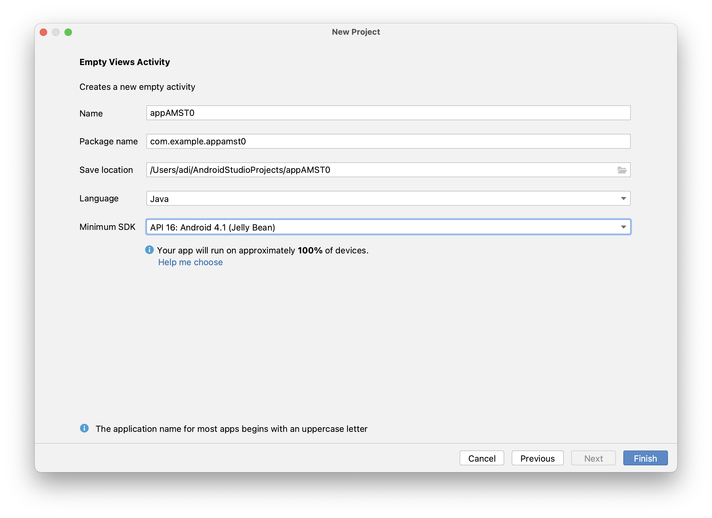
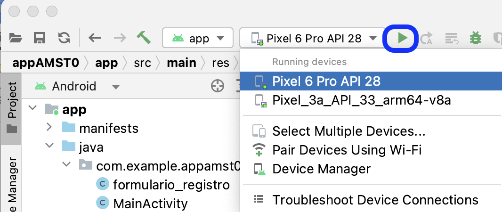
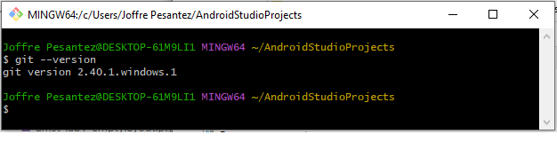

[Regresar](/Aplicaciones-Moviles-y-Servicios-Telematicos/)

# Práctica de laboratorio 1
## DESARROLLO DE UNA APLICACIÓN MÓVIL USANDO CONTROLES AVANZADOS

## 🎯 Objetivo de Aprendizaje
Desarrollar aplicaciones móviles considerando las características de la programación en dispositivos móviles.

**Recursos:** Android Studio, GitBash, GitHub online.

**Duración:** 5 horas

**Instrucciones**

Desarrolle un aplicativo móvil usando componentes avanzados como menú, y cargue el código fuente en un repositorio de GitHub.


**Actividades**

### Paso 1: Crear un nuevo proyecto en Android Studio.

1. Al abrir Android Studio, podemos crear, abrir, o importar proyectos. Seleccione “New Project”.
<p align="center">
  
</p>

2. Seleccionar el tipo de proyecto: Para esta práctica escogeremos la pestaña **Phone and Tablet > Empty Views Activity.** Otro tipo de actividades viene por defecto con componentes no necesarios para este taller.

<p align="center">
  
</p>

3.  Configuración inicial del proyecto.

- Name: Colocaremos el nombre de nuestra app. (Recuerde que este nombre será reflejado en el PlayStore al momento de publicarlo). Para este taller, usaremos appAMST(NúmeroGrupo). 
-	PackageName: Paquete principal de código java, se obtiene automáticamente del nombre.
-	Save Location: Dirección donde se ubica el proyecto en nuestra PC
-	Language: Java
- Minimum SDK: Escoger el primero que aparece en la lista. (API 16: Android 4.1)

4. Seleccionamos Finish.

<p align="center">
  
</p>

(*) Como resultado se creará un proyecto, el cual solo presenta el mensaje “Hello World”.

5. Seleccione en la ruta app > res > layout > activity_main.xml.

6. En la parte superior seleccione la pestaña “Design” para comenzar a diseñar la interfaz de usuario de la aplicación usando controles personalizados.

<p align="center">
  
</p>


7. En la pestaña de Design encontrará la “Palette” que contiene los controles para agregar a la aplicación, si conoce el nombre del control puede iniciar una búsqueda.

<p align="center">
  
</p>


8.	Crear la interfaz de usuario con: 2 cuadros de texto (Plain Text), uno para el nombre del usuario y otro para la clave del usuario; y 2 botones (Button), uno para logearse y otro para registrarse como nuevo usuario.

<p align="center">
  
</p>


9. Para visualizar el código en formato xml en la ruta app > res > layout > activity_main.xml, en la parte superior seleccione la pestaña de Code.

**Archivo: activity_main.xml**
```
<?xml version="1.0" encoding="utf-8"?>
<androidx.constraintlayout.widget.ConstraintLayout xmlns:android="http://schemas.android.com/apk/res/android"
    xmlns:app="http://schemas.android.com/apk/res-auto"
    xmlns:tools="http://schemas.android.com/tools"
    android:layout_width="match_parent"
    android:layout_height="match_parent"
    android:orientation="vertical"
    tools:context=".MainActivity"
    tools:ignore="MissingConstraints">

    <LinearLayout
        android:orientation="vertical"
        android:layout_width="fill_parent"
        android:layout_height="fill_parent"
        android:padding="20dip"
        tools:ignore="MissingConstraints">

        <EditText
            android:id="@+id/edtUsuario"
            android:layout_width="fill_parent"
            android:layout_height="wrap_content"
            android:hint="Usuario" />

        <EditText
            android:id="@+id/edtClave"
            android:layout_width="fill_parent"
            android:layout_height="wrap_content"
            android:hint="Clave" />

        <Button
            android:id="@+id/btnLogin"
            android:layout_height="wrap_content"
            android:layout_width="wrap_content"
            android:text="Login"
            android:layout_gravity="center_horizontal"
            android:paddingLeft="15dip"
            android:paddingRight="15dip"
            android:onClick="login"/>

        <Button
            android:id="@+id/btnRegistro"
            android:layout_width="wrap_content"
            android:layout_height="wrap_content"
            android:layout_gravity="center_horizontal"
            android:onClick="registrarse"
            android:paddingLeft="15dip"
            android:paddingRight="15dip"
            android:text="Registrarse" />

    </LinearLayout>

</androidx.constraintlayout.widget.ConstraintLayout>
```

10.	Seleccionar la ruta app > java> com.example.appamst0 > MainActivity.java donde se programa las funcionalidades de la aplicación en lenguaje Java.

**Archivo: MainActivity.java**

```
package com.example.appamst0;

import androidx.appcompat.app.AppCompatActivity;

import android.content.Intent;
import android.os.Bundle;
import android.util.Log;
import android.view.View;
import android.widget.Button;
import android.widget.EditText;
import android.widget.Toast;

public class MainActivity extends AppCompatActivity {

    private EditText edtUsuario, edtClave;
    private Button btnLogin, btnRegistro;

    @Override
    protected void onCreate(Bundle savedInstanceState) {
        super.onCreate(savedInstanceState);
        setContentView(R.layout.activity_main);

        //Referencias a los controles del diseño
        edtUsuario = (EditText) findViewById(R.id.edtUsuario);
        edtClave = (EditText) findViewById(R.id.edtClave);

        btnLogin = (Button) findViewById(R.id.btnLogin);
        btnRegistro = (Button) findViewById(R.id.btnRegistro);
    }

    public void registrarse(View view) {
        Intent intent = new Intent(this, formulario_registro.class);
        startActivity(intent);
    }

    public void login(View view) {
        Toast toast=Toast.makeText(getApplicationContext(),"Usted no cuenta con un usuario",Toast.LENGTH_SHORT);

        toast.show();
    }

    public void onClick(View v) {
        if(v.getId() == R.id.btnLogin){
            Log.d("mensaje","ïngreso");

        }else if(v.getId() == R.id.btnRegistro) {
        }
    }
}
```

11.	Dar clic derecho en la ruta app > java y seleccione New > Activity > Empty Activity para crear una nueva actividad con el nombre de formulario_registro. Con esto se crearán dos archivos:
+	formulario_registro.java
+	activity_formulario_registro.xml

<p align="center">
  
</p>

<p align="center">
  
</p>

12.	Modifique el archivo formulario_registro.java para poder enviar la notificación de registro.

**Archivo: formulario_registro.java**
```
package com.example.appamst0;

import android.app.NotificationChannel;
import android.app.NotificationManager;
import android.app.PendingIntent;
import android.content.Context;
import android.content.Intent;
import android.os.Bundle;
import android.view.View;

import androidx.appcompat.app.AppCompatActivity;
import androidx.core.app.NotificationCompat;

public class formulario_registro extends AppCompatActivity {

    @Override
    protected void onCreate(Bundle savedInstanceState) {
        super.onCreate(savedInstanceState);
        setContentView(R.layout.activity_formulario_registro);
    }

    //insertarpaciente
    public void insertarpaciente(View v) {
        addNotification();

    }

    private void addNotification() {
        if (android.os.Build.VERSION.SDK_INT >= android.os.Build.VERSION_CODES.O) {
            String id ="canal";
            String description = "AMST";
            int importance = NotificationManager.IMPORTANCE_HIGH;
            NotificationChannel channel = new NotificationChannel(id, description, importance);

            NotificationCompat.Builder builder =
                    new NotificationCompat.Builder(this,id)
                            .setSmallIcon(R.drawable.medicalcare)
                            .setContentTitle("Se ha registrado con exito")
                            .setContentText("Revise su correo electronico en los proximos 2 dias")
                            .setAutoCancel(true)
                            .setPriority(NotificationCompat.PRIORITY_DEFAULT);

            Intent notificationIntent = new Intent(this, formulario_registro.class);
            notificationIntent.addFlags(Intent.FLAG_ACTIVITY_CLEAR_TOP);
            notificationIntent.putExtra("message", "This is a notification message");

            PendingIntent pendingIntent = PendingIntent.getActivity(this, 0, notificationIntent,
                    PendingIntent.FLAG_UPDATE_CURRENT);
            builder.setContentIntent(pendingIntent);
            NotificationManager manager = (NotificationManager) getSystemService(Context.NOTIFICATION_SERVICE);
            manager.createNotificationChannel(channel);
            manager.notify(0, builder.build());
        }}
}
```

13. En la ruta res > layout seleccione el archivo activity_formulario_registro.xml registro en la pestaña “Text” que contiene el código xml del formulario de registro para los nuevos usuarios que deseen utilizar la aplicación.

**Archivo: activity_formulario_registro.xml**
```
<?xml version="1.0" encoding="utf-8"?>
<androidx.constraintlayout.widget.ConstraintLayout xmlns:android="http://schemas.android.com/apk/res/android"
    xmlns:tools="http://schemas.android.com/tools"
    android:layout_width="match_parent"
    android:layout_height="match_parent"
    tools:context=".formulario_registro">

    <LinearLayout xmlns:android="http://schemas.android.com/apk/res/android"
        android:orientation="vertical" android:layout_width="match_parent"
        android:layout_height="match_parent">

        <LinearLayout
            android:layout_width="wrap_content"
            android:layout_height="wrap_content"
            android:orientation="horizontal">

            <TextView
                android:id="@+id/txtNombre"
                android:layout_width="wrap_content"
                android:layout_height="wrap_content"
                android:text="Nombres:"/>

            <EditText
                android:id="@+id/edtNombre"
                android:layout_width="match_parent"
                android:layout_height="wrap_content"
                android:ems="10"
                android:inputType="textPersonName"
                android:text=""/>

        </LinearLayout>

        <LinearLayout
            android:layout_width="wrap_content"
            android:layout_height="wrap_content"
            android:orientation="horizontal">

            <TextView
                android:id="@+id/txtApellido"
                android:layout_width="wrap_content"
                android:layout_height="wrap_content"
                android:text="Apellidos:"/>

            <EditText
                android:id="@+id/edtApellido"
                android:layout_width="wrap_content"
                android:layout_height="wrap_content"
                android:ems="10"
                android:inputType="textPersonName"
                android:text=""/>

        </LinearLayout>

        <LinearLayout
            android:layout_width="wrap_content"
            android:layout_height="wrap_content"
            android:orientation="horizontal">

            <TextView
                android:id="@+id/txtCedula"
                android:layout_width="wrap_content"
                android:layout_height="wrap_content"
                android:text="Cedula:"/>

            <EditText
                android:id="@+id/edtCedula"
                android:layout_width="wrap_content"
                android:layout_height="wrap_content"
                android:ems="10"
                android:inputType="number"
                android:text=""/>
        </LinearLayout>

        <LinearLayout
            android:layout_width="wrap_content"
            android:layout_height="wrap_content"
            android:orientation="horizontal">

            <TextView
                android:id="@+id/txtEdad"
                android:layout_width="wrap_content"
                android:layout_height="wrap_content"
                android:text="Edad:"/>

            <EditText
                android:id="@+id/edtEdad"
                android:layout_width="wrap_content"
                android:layout_height="wrap_content"
                android:ems="10"
                android:inputType="number"
                android:text=""/>
        </LinearLayout>

        <LinearLayout
            android:layout_width="wrap_content"
            android:layout_height="wrap_content"
            android:orientation="horizontal">

            <TextView
                android:id="@+id/txtAltura"
                android:layout_width="wrap_content"
                android:layout_height="wrap_content"
                android:text="Altura:"/>

            <EditText
                android:id="@+id/edtAltura"
                android:layout_width="wrap_content"
                android:layout_height="wrap_content"
                android:ems="10"
                android:inputType="numberDecimal"
                android:text=""/>
        </LinearLayout>

        <LinearLayout
            android:layout_width="wrap_content"
            android:layout_height="wrap_content"
            android:orientation="horizontal">

            <TextView
                android:id="@+id/txtPeso"
                android:layout_width="wrap_content"
                android:layout_height="wrap_content"
                android:text="Peso:"/>
            <EditText
                android:id="@+id/edtPeso"
                android:layout_width="wrap_content"
                android:layout_height="wrap_content"
                android:ems="10"
                android:inputType="numberDecimal"
                android:text=""/>
        </LinearLayout>

        <LinearLayout
            android:layout_width="wrap_content"
            android:layout_height="wrap_content"
            android:orientation="horizontal">

            <TextView
                android:id="@+id/txtEmail"
                android:layout_width="wrap_content"
                android:layout_height="wrap_content"
                android:text="Email:"/>

            <EditText
                android:id="@+id/edtEmail"
                android:layout_width="wrap_content"
                android:layout_height="wrap_content"
                android:ems="10"
                android:inputType="textEmailAddress"
                android:text=""/>
        </LinearLayout>

        <LinearLayout
            android:layout_width="wrap_content"
            android:layout_height="wrap_content"
            android:orientation="horizontal">

            <TextView
                android:id="@+id/txtUsuario"
                android:layout_width="wrap_content"
                android:layout_height="wrap_content"
                android:text="Usuario:"/>

            <EditText
                android:id="@+id/edtUsuario"
                android:layout_width="wrap_content"
                android:layout_height="wrap_content"
                android:ems="10"
                android:text=""/>
        </LinearLayout>

        <LinearLayout
            android:layout_width="wrap_content"
            android:layout_height="wrap_content"
            android:orientation="horizontal">

            <TextView
                android:id="@+id/txtClave"
                android:layout_width="wrap_content"
                android:layout_height="wrap_content"
                android:text="Clave:"/>

            <EditText
                android:id="@+id/edtClave"
                android:layout_width="wrap_content"
                android:layout_height="wrap_content"
                android:ems="10"
                android:inputType="textPassword"
                android:text=""/>
        </LinearLayout>

        <Button
            android:id="@+id/btnGrabaregistro"
            android:layout_width="wrap_content"
            android:layout_height="wrap_content"
            android:layout_gravity="center_horizontal"
            android:text="Grabar"
            android:onClick="insertarpaciente"/>
    </LinearLayout>
</androidx.constraintlayout.widget.ConstraintLayout>
```

<p align="center">
  
</p>

### Paso 2: Ejecución de la aplicación móvil. (30 puntos)

14.	Ejecutar el aplicativo móvil “appAMST#” seleccionando el device selecter al lado de la opción Run ‘app’, en la cual se puede escoger entre 2 opciones: el dispositivo móvil conectado a través del cable USB de datos, o el emulador que usa los dispositivos virtuales disponibles.

<p align="center">
  
</p>

15.	Para la primera opción de ejecución de la aplicación se usa un teléfono móvil conectado vía USB a la computadora que contiene la aplicación móvil, posterior indicará que instale un apk que contiene la ejecución de la aplicación. Se puede ver más de eso a partir del Paso 4: Habilitación de opciones para el desarrollador en el teléfono móvil con sistema operativo Android.

16. Para la segunda opción de ejecución de la aplicación se usa el emulador seleccionando el dispositivo virtual que le aparezca, en este caso Pixel 6 Pro API 28. En caso de que no tenga instalado ningún dispositivo virtual continúe al literal 17.

**Nota: Verificar que la API del dispositivo sea mayor a 26, caso contrario continuar al literal 17.**

<p align="center">
  
</p>

16.1 Durante la ejecución de la aplicación mediconline se debe ingresar un usuario y contraseña. No hay usuarios registrados para la aplicación por lo que debe salir el mensaje: “Usted no cuenta con un usuario”

<p align="center">
  
</p>

16.2 Cuando da clic en el botón Registrarse, debe ingresar sus datos y dar click a grabar para que aparezca la notificación. La interfaz de usuario se encuentra diseñada en el archivo activity_formulario_registro.xml.


<p align="center">
  
</p>

17. Si no tiene instalado una versión de SDK para emular la ejecución de la aplicación en un dispositivo móvil, seleccione la opción AVD Manager (Android Virtual Device Manager).

<p align="center">
  
</p>

18.	Crear un dispositivo virtual.

19.	Seleccionar el hardware “Pixel 6 PRO”, luego dar click en el botón siguiente. El hardware seleccionado no es relevante para la práctica, pero es recomendable escoger aquellos con símbolo del Play Store.

<p align="center">
  
</p>

20.	Seleccionar la imagen del API 33, luego dar click en el botón siguiente.

<p align="center">
  
</p>

21. En caso de no tener activado el botón next, dar clic a Download para descargar el API 33 y aceptar el acuerdo de la licencia de Android Software Development Kit.

<p align="center">
  
</p>


### Paso 3: Generación del APK (archivo ejecutable de Android) para instalación de aplicación en el teléfono celular. (5 puntos)

1.	Seleccionar el menú Build > Build APK(s) para generar al archivo con extensión apk, que es un paquete para el sistema operativo Android. 
(*) Este archivo permite ejecutar la aplicación desde el celular.

<p align="center">
  
</p>

<p align="center">
  
</p>

2.	Cuando se da clic en el enlace “locate” o en la advertencia podrá ingresar a la ruta donde se encuentra el archivo apk.

<p align="center">
  
</p>

### Paso 4: Habilitación de opciones para el desarrollador en el teléfono móvil con sistema operativo Android. (5 puntos)

**Activar modo de desarrollo y depuración USB en Android**
1.	Vamos a los “Ajustes” o “Configuración” de nuestro dispositivo, dependiendo de la versión de Android.
2.	Nos desplazamos hasta la opción de “Acerca del dispositivo” o “Información del teléfono”.
3.	Buscamos la opción “Número de compilación” o “Número de versión” y presionamos 7 veces seguidas sobre esta opción.

<p align="center">
  
</p>

**Habilitar depuración por USB**

1.	Una vez habilitado el modo desarrollador, puede acceder a las opciones avanzadas.
2.	Habilite la opción “Depuración por USB” o “USB Debugging”.
3.	Cuando se conecte el celular mediante USB, aparecerá el mensaje “Permitir depuración por USB” o “Allow USB Debugging”.

<p align="center">
  
</p>

### Paso 5: Ejecución de la aplicación en el teléfono móvil. (5 puntos)
En el Select Device del menú se puede observar como ya está configurado su dispositivo móvil, al hacer click en “run” puede observar cómo se ejecuta la aplicación en el mismo.

<p align="center">
  
</p>


## Paso 6: Crear un repositorio (30 puntos).

1.	Dentro de la carpeta del proyecto creado en el paso anterior, abra la línea de comandos de GIT (GIT CLI). Podemos encontrarlo dando clic derecho en la carpeta y escogiendo la opción “GIT BASH HERE”.

<p align="center">
  
</p>

- En caso de que no se disponga de GIT CLI, también se puede utilizar CMD de Windows/Ubuntu. Para probar que GIT ha sido instalado correctamente, utilice el comando “git --version”.

<p align="center">
  
</p>

***GIT en línea de comandos de Windows***

<p align="center">
  
</p>

***GIT BASH propia***

2.	Para crear un nuevo repositorio, utilice el siguiente comando “git init”.

<p align="center">
  
</p>

***Esto creará un archivo oculto [.git] para el manejo del repositorio y nos ubicará directamente en la rama “master”***

3.	Agregamos todos los archivos del proyecto a nuestro repositorio local con el comando: “git add --all”.

<p align="center">
  
</p>

4.	Ahora realizamos un commit, esto realizará nuestros cambios permanentes en el repositorio local. Pero debemos asignarle un mensaje [-m “mensaje”] para indicar los cambios que hemos realizado.

<p align="center">
  
</p>

**Importante:** Para poder realizar un commit es necesario configurar previamente su correo y nombre de usuario, por lo que debe poseer un usuario de GitHub. Los comandos por utilizar para configurar sus credenciales son: 

git config --global user.email "miusuario@example.com"
git config --global user.name "Tu nombre"

Una vez configurado su usuario en git podrá subir su commit.

<p align="center">
  
</p>

5.	Creamos un repositorio en línea. Ahora usaremos GitHub (Requerirá una cuenta gratuita). Del lado superior izquierdo, encontrara el botón “NEW”.

<p align="center">
  
</p>

6.	La información requerida para crear un repositorio se muestra a continuación:

**Nombre del repositorio:** El nombre de nuestro repositorio que será publicado en línea.  Para este taller, usaremos AMST[numeroGrupo].

**Descripción (opcional)** Descripción sobre lo que realiza nuestro proyecto

**Tipo** Público o privado (para saber si es visible en línea)

**Archivo Readme** Archivo inicial del repositorio. Agregamos indicaciones para otros programadores

**Agregar. gitignore** Archivo para seleccionar los archivos que no queremos subir a nuestro repositorio

**Licencia** Tipo de licencia: OpenSouce, MIT, Apache, etc.

<p align="center">
  
</p>

  Una vez ingresados todos los campos, se da clic en “Create repository”.

<p align="center">
  
</p>

***Vista del repositorio vacío.***

7.	Damos clic en el botón verde “Code” donde estará visible el **URL** para su manejo y presionamos el botón de copiar.

<p align="center">
  
</p>

8.	Para obtener el repositorio en línea, obtenemos la rama de externa con el comando:

$ git branch -M main (Es necesario un cambio de rama)

$ git remote add origin [link URL del repositorio]


<p align="center">
  
</p>

9.	Ahora tendremos que publicar los cambios:

$ git push -u origin main
<p align="center">
  
</p>

10.	Se puede observar como ahora el repositorio está actualizado

<p align="center">
  
</p>

**Preguntas de investigación:**
1.	¿Qué otro tipo de servicios en línea (como GITHUB) existen?
2.	¿Para qué sirve el archivo .gitignore y como se utiliza?
3.	¿Qué limitaciones tiene GITHUB?
4.	¿Qué es una rama?
5.	¿Cuál es el link de su repositorio?
6.	¿Por qué los nuevos repositorios de GitHub ya no utilizan como rama principal master?
7.	¿Cuál es la diferencia entre crear un repositorio público o privado?

## Paso 7: Invitar a otros miembros del grupo a mi proyecto (incluya a todos los miembros del grupo) (5 puntos)

1.	Para habilitar la modificación a otros miembros de mi grupo, debemos darle acceso. [Incluso si el proyecto es libre, solo pueden modificarlo quienes han sido invitados]. Para esto de clic en el tab “Settings/Configuración” > Manage Access / Administrar acceso

2.	Buscamos y agregamos a otros usuarios (usuario de GitHub).


<p align="center">
  
</p>

3.	Una vez agregados, es necesario aceptar las invitaciones para poder realizar PUSH (cambios al repositorio). Puede revisar las invitaciones en la campana a lado del usuario o en su correo electrónico para aceptarlas.


<p align="center">
  
</p>

## Paso 8: Crear una rama [Branch] (Trabajo individual) (15 puntos)

1.	Los estudiantes que no crearon el repositorio clonar el proyecto en su computadora con el comando 

$ git clone [web URL del repositorio]

2.	Tenemos el proyecto principal en main, cualquier otro cambio puede ser realizado sin dañar el proyecto principal. Utilizamos el comando: 
git checkout -b “nombre_rama”

***Para este taller, crearemos una rama de la siguiente forma: “nombre_apellido1”***

<p align="center">
  
</p>

3.	Ahora realizamos algunos cambios en nuestro proyecto local. 


<p align="center">
  
</p>


4.	Estos cambios son únicamente reflejados dentro de nuestra rama. Ahora subimos los cambios, para ello realizamos los siguientes comandos.

  **Git add --all:** Agrega todos los cambios a nuestra rama.

  **Git commit -m “cambios a mi rama”** Agrega un commit en mi rama, indicando los cambios que realice.

  **Git push origin [nombre rama]** Subimos los cambios al repositorio (pero solo dentro de la página).

  <p align="center">
  
</p>


5.	Podemos revisar todas las ramas dentro de GitHub (así mismo podemos cambiar entre ramas para revisar diferentes versiones de código).

<p align="center">
  
</p>

### Paso 8: Unir ramas al proyecto principal [Branch] (15 puntos).
Las ramas funcionan como proyectos paralelos del proyecto principal, pero para avanzar con el proyecto es necesario unir las ramas una vez han sido probadas.


<p align="center">
  
</p>

1.	En caso de realizar algún cambio en el repositorio principal.
a.	git fetch origin main (obtiene todos los cambios realizados en main)

2.	Nos cambiamos a la rama principal.
a.	git checkout main

3.	Traemos los cambios realizados en la rama única.
a.	git merge [nombre rama]


<p align="center">
  
</p>

***Nota: Esto indica los archivos que han sido modificados.***

4.	Ahora de vuelta al repositorio, los cambios han sido actualizados. En caso de que salga el siguiente mensaje, dar clic en el mismo (Compare & pull request).

<p align="center">
  
</p>

5.	Llenar con una descripción y hacer clic en create pull request.

<p align="center">
  
</p>

6.	Una vez hecho eso se debe aceptar el pull request, y automáticamente se agregarán los cambios.

<p align="center">
  
</p>


Preguntas de investigación
1.	¿Para qué sirve el comando merge?
2.	¿Qué hace el comando git push?
3.	¿Para qué sirve el pull request de GitHub?


**TAREAS DE DESAFÍO (30 puntos):**

1.	Dentro del proyecto de su repositorio, por grupo cree un menú donde cada integrante usará un componente diferente. Componentes por usar:
- Video view: Obtener un video de YouTube.
- Calendar view: Mostrar el calendario con una tarea.
- Mostrar un mapa con Google Maps.
- Mostrar un gráfico lineal estático.

2.	Pueden escoger cualquiera de las 3 opciones para crear el menú:
- Menú con botón flotante

<p align="center">
  
</p>

- Menú lateral

<p align="center">
  
</p>

- Menú de opciones

<p align="center">
  
</p>

### FORMATO DEL TRABAJO
La práctica de laboratorio será desarrollada en el siguiente formato:

- Nombre del archivo: AMST_LabA_Grupo B_Apellido1_Apellido2_Apellido3
- (*) Siendo A el número del trabajo y B el número del grupo
- Nombre de la materia y paralelo 1
- Título del trabajo: Ejemplo: Laboratorio A - Tema
- Nombre de la profesora
- Número de grupo
- Nombres/Apellidos de los integrantes del grupo que hayan desarrollado el trabajo
- Fecha de inicio y fin del trabajo
- Resultados de las actividades planteadas: Explicación de las actividades ejecutadas, incluyendo las imágenes del proceso.
- Conclusiones y Recomendaciones: Respecto a lo aprendido durante el desarrollo del trabajo.
- Referencias bibliográficas: Colocar los documentos, enlaces web o libros consultados.


