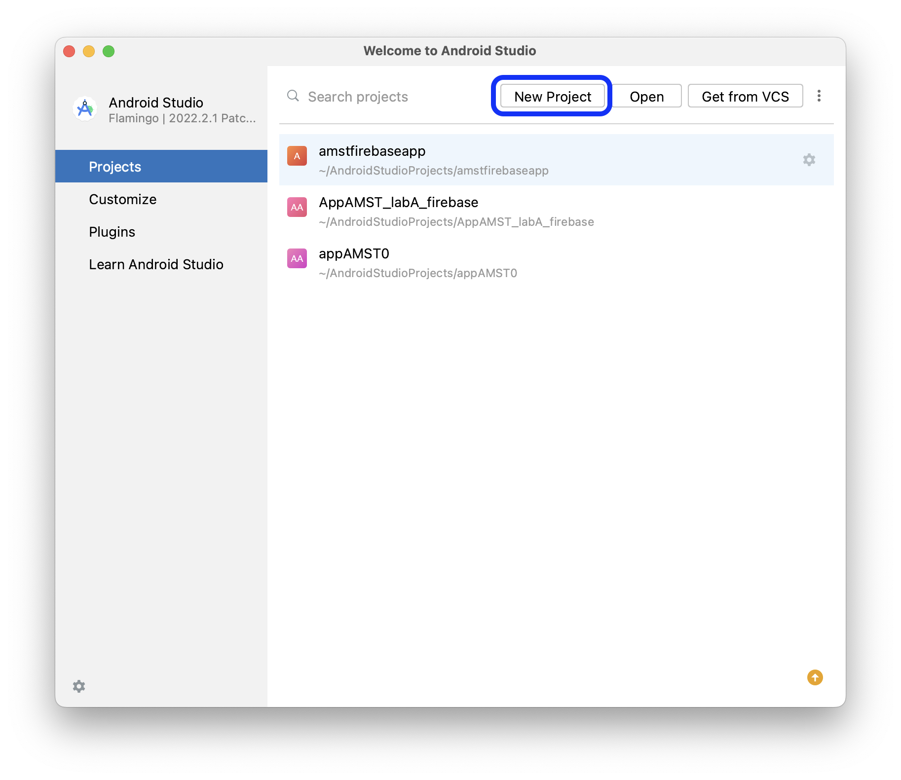
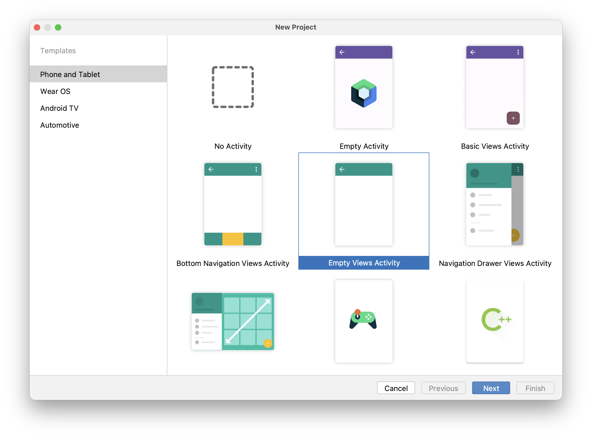
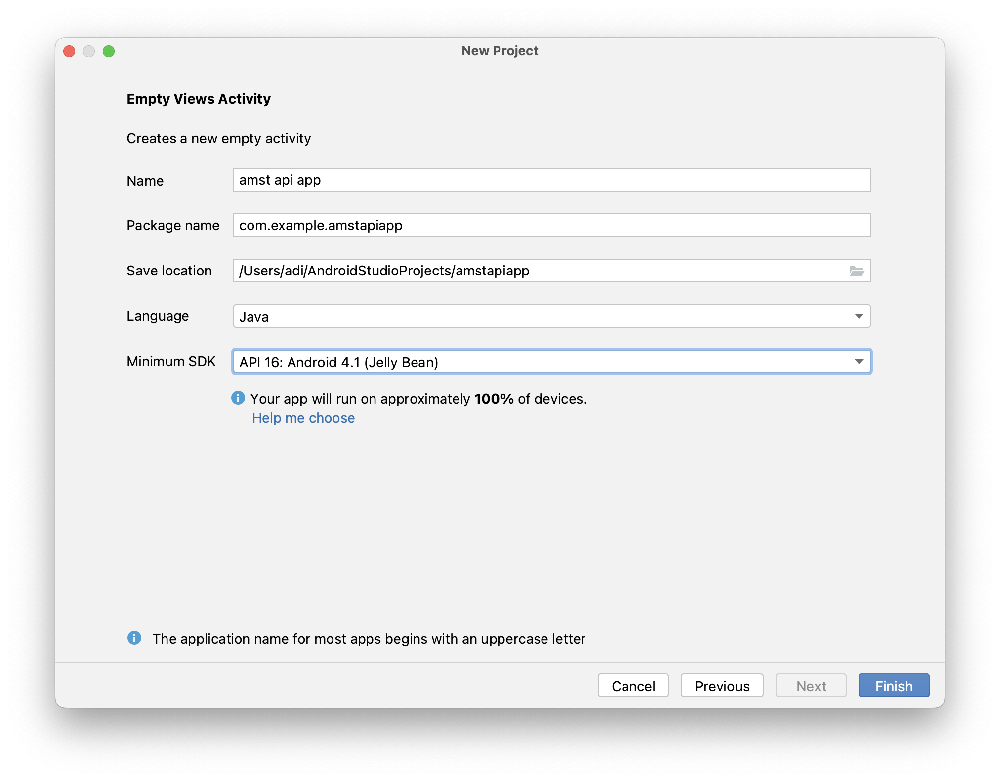
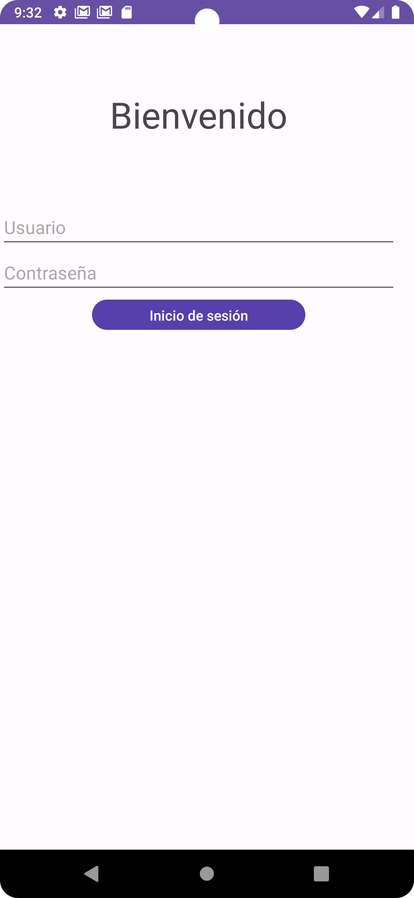
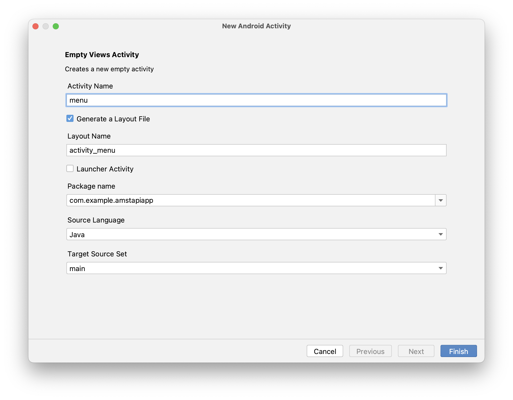
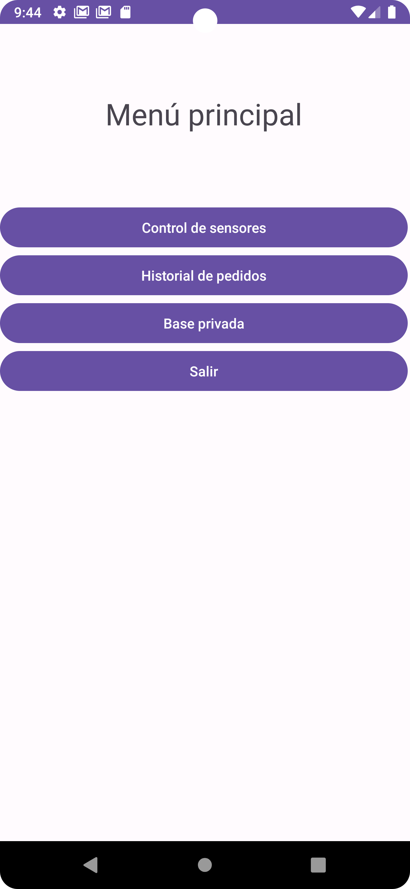
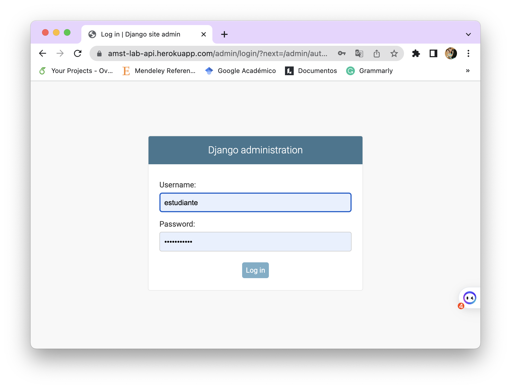
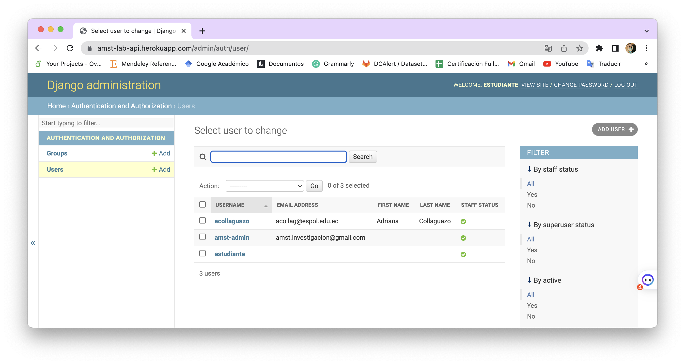
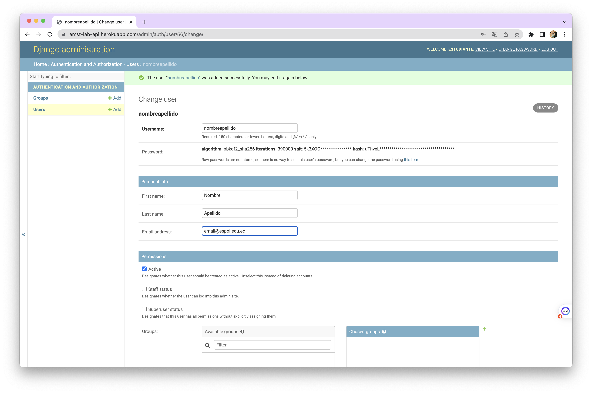

[Regresar](/Aplicaciones-Moviles-y-Servicios-Telematicos/)

# Prácticas de Laboratorio 3
## DESARROLLO DE UNA APLICACIÓN MÓVIL CON INTEGRACIÓN DE BASE DE DATOS EXTERNAS Y PRIVADAS UTILIZANDO REST API

**Objetivo de Aprendizaje:**
Desarrollar aplicaciones móviles sencillas considerando las características de la programación de dispositivos móviles.

**Recursos:**
Android Studio, REST API del curso, REST API privada, bases de datos PostgreSQL usando formato JSON.

**Duración:**
8 horas

**Instruciones**

Crear una aplicación que interactúe con 3 tipos de base de datos utilizadas actualmente durante el desarrollo de aplicaciones móviles:
1.	Base de datos externa PostgreSQL para el inicio de sesión y la consulta de datos.
2.	Uso de token de autorización.
3.	Base de datos privadas con REST APIs disponibles para desarrollo.
Para lograr la integración de aplicaciones móviles con bases de datos externas y privadas utilizando REST API y autorización de seguridad mediante web tokens.

**Actividades**

### **Paso 1:** Crear un nuevo proyecto en Android Studio**
1)	Al abrir Android Studio seleccione ***New project*.**

<p align="center">
  
</p>

2)	Seleccionar el tipo de proyecto: Para esta práctica escogeremos la pestaña Phone and Tablet **> Empty Activity**. 
**Nota:** Otro tipo de actividades viene por defecto con componentes no necesarios para este taller.

<p align="center">
  
</p>

3) Configuración inicial del proyecto.

- Name: Colocaremos el nombre de nuestra app. (Recuerde que este nombre será reflejado en el PlayStore al momento de publicarlo). Para este laboratorio, usaremos **amst api app** donde A es el número de la práctica de laboratorio.
- PackageName: Paquete principal de código java, se obtiene automáticamente del nombre.
- [Save Location]: DirecciÓn donde se ubica el proyecto en nuestra PC.
- Languaje: Java

4) Seleccionamos FINISH. Como resultado se creará un proyecto vacío, solo presentado el mensaje “Hello World”.

<p align="center">
  
</p>

<p align="center">
  
</p>

### **Paso 2:** Crear interfaz de usuario

Para esta aplicación crearemos una interfaz de usuario de inicio de sesión y un menú principal. Al momento de abrir la aplicación, se ejecutará MainActivity.java y activity_main.xml

1)	Dentro del archivo activity_main.xml que se encuentra en la ruta app > res > layout, vamos a colocar los siguientes elementos:
- (1 Layout vertical) para el arreglo de los elementos
- (1 EditText) un titulo
- (2 Inputs) Ingresar usuario y contraseña
- (1 button) Botón de ingreso

**Diseño de inicio de sesión: activity_main.xml**
```
<?xml version="1.0" encoding="utf-8"?>
<androidx.constraintlayout.widget.ConstraintLayout
    xmlns:android="http://schemas.android.com/apk/res/android"
    xmlns:app="http://schemas.android.com/apk/res-auto"
    xmlns:tools="http://schemas.android.com/tools"
    android:layout_width="match_parent"
    android:layout_height="match_parent"
    tools:context=".MainActivity">

    <LinearLayout
        android:layout_width="395dp"
        android:layout_height="340dp"
        android:orientation="vertical"
        tools:layout_editor_absoluteX="8dp"
        tools:layout_editor_absoluteY="8dp"
        tools:ignore="MissingConstraints">

        <TextView
            android:id="@+id/txtBienvenido"
            android:layout_width="match_parent"
            android:layout_height="179dp"
            android:gravity="center"
            android:text="Bienvenido"
            android:textSize="36sp" />

        <EditText
            android:id="@+id/txtUsuario"
            android:layout_width="match_parent"
            android:layout_height="wrap_content"
            android:ems="10"
            android:hint="Usuario"
            android:inputType="text" />

        <EditText
            android:id="@+id/txPassword"
            android:layout_width="match_parent"
            android:layout_height="wrap_content"
            android:ems="10"
            android:hint="Contraseña"
            android:inputType="textPassword" />

        <Button
            android:id="@+id/btnInicio"
            android:layout_width="212dp"
            android:layout_height="38dp"
            android:layout_gravity="center"
            android:onClick="irMenuPrincipal"
            android:text="Inicio de sesión"
            app:backgroundTint="#320DDA" />
    </LinearLayout>
</androidx.constraintlayout.widget.ConstraintLayout>
```

<p align="center">
  
</p>

**Importante:**
- En el titulo (TextView) utilizamos propiedades como textsize y gravity.

- En los inputs usamos propiedades como hint y input type para personalizar el formulario.

- Las propiedades customizan nuestra aplicación.

### **Preguntas de desafío:**
- ¿Qué atributo me permitiría cambiar el tipo de letra de mi ventana? (Escriba la línea de código que usaría).
- ¿Que hace el atributo type? (mencione otros 5 valores que puede tener el atributo type diferentes al que se usa en el código).


2) Crear una segunda actividad a mi aplicación para redirigir al usuario cuando este ha completado con éxito el inicio de sesión.
- Para crear una nueva actividad, damos clic derecho en “app”.
- Seleccionar New > Activity > Empty Activity.

<p align="center">
  
</p>

- Ingresamos un el nombre para la nueva actividad [menu], lo que generara dos archivos:
-	menu.java
-	menu.xml

3) Creamos un menú básico (15 minutos):
- (1 Layout vertical) para el arreglo de los elementos
- (1 EditText) un título
- (4 Botones) un título

```
<?xml version="1.0" encoding="utf-8"?>
<androidx.constraintlayout.widget.ConstraintLayout
    xmlns:android="http://schemas.android.com/apk/res/android"
    xmlns:app="http://schemas.android.com/apk/res-auto"
    xmlns:tools="http://schemas.android.com/tools"
    android:layout_width="match_parent"
    android:layout_height="match_parent"
    tools:context=".menu">

    <LinearLayout
        android:layout_width="409dp"
        android:layout_height="729dp"
        android:orientation="vertical"
        tools:layout_editor_absoluteX="1dp"
        tools:layout_editor_absoluteY="1dp"
        tools:ignore="MissingConstraints">

        <TextView
            android:id="@+id/txtTitulo"
            android:layout_width="match_parent"
            android:layout_height="wrap_content"
            android:textAlignment="center"
            android:textSize="30dp"
            android:layout_marginVertical="70dp"
            android:text="Menú principal"
            android:gravity="center_horizontal"/>

        <Button
            android:id="@+id/btnSensores"
            android:layout_width="match_parent"
            android:layout_height="wrap_content"
            android:onClick="revisarSensores"
            android:text="Control de sensores" />

        <Button
            android:id="@+id/btnPedidos"
            android:layout_width="match_parent"
            android:layout_height="wrap_content"
            android:text="Historial de pedidos" />

        <Button
            android:id="@+id/btnPrivatedb"
            android:layout_width="match_parent"
            android:layout_height="wrap_content"
            android:text="Base privada" />

        <Button
            android:id="@+id/btnSalir"
            android:layout_width="match_parent"
            android:layout_height="wrap_content"
            android:onClick="Salir"
            android:text="Salir" />
    </LinearLayout>
</androidx.constraintlayout.widget.ConstraintLayout>
```

<p align="center">
  
</p>

4)	Creamos una transición de una actividad a otra para (De inicio de sesión -> Menú principal)
- Seleccionamos el botón de Iniciar sesion > atributo(onClick) (dentro de activity_main.xml)
- Escribirnos el nombre de la función irMenuPrincipal
- Creamos la función irMenuPrincipal dentro de MainActivity.java

**Paso 3: Inicio de sesión con Base de datos externa (REST API).**

Una REST API o API de desarrollo permite interactuar con una base de datos externa por medio de llamados HTTP, devolviendo información en formato Json


<p align="center">
  
</p>

La REST API que usaremos para este taller será https://amst-lab-api.herokuapp.com/db. Esta API está desarrollada en Django Python con autenticación JWT.  De esta manera, el teléfono puede acceder a grandes cantidades de información sin tener que alojarla de forma interna. A cambio requiere conexión a internet (lo cual en casos puede llegar a ser costosa).

1)	Dar permisos para el uso de internet. Nuestra aplicación debe permitir conectarse a internet por medio del teléfono. Para ello, agregamos la siguiente línea en el archivo manifesto (El archivo de configuraciones generales)
- El archivo se encuentra en app > manifests > AndroidManifest.xml
- Agregamos la siguiente línea (para conceder permisos de Internet): 
```
<uses-permission android:name="android.permission.INTERNET"/>
```

Se agrega antes del tag aplicaciones:
```
<?xml version="1.0" encoding="utf-8"?>
<manifest xmlns:android="http://schemas.android.com/apk/res/android"
    package="com.example.amst02">
    <uses-permission android:name="android.permission.INTERNET"/>
    <application
        android:allowBackup="true"
```

2)	Instalamos las dependencias necesarias (Librería Volley para request http).
- Agregamos la librería Volley en el archivo **build.gradle** que se encuentra en “Gradle Scripts” - build.gradle (modulo app).

- Agregamos la siguiente línea:

```
dependencies {
    implementation 'com.android.volley:volley:1.2.1'
}
```

3)	Una vez ingresada se actualizará el Gradle (Paquete de librerías) [En caso de no sincronizarse puede sincronizarlo manualmente con File > Sync Project with Grandle files].

### **Paso 4:** Inicio de sesión con Base de datos externa (REST API).

Creamos la función Iniciar sesión en MainActivity.java
Ahora creamos la función que va a recibir como parámentros nuestro usuario y contraseña y retornará el token de seguridad o el mensaje de que el usuario no es válido.

1)	Creamos una variable lista (queue) de las solicitudes (request) a ejecutar.

```
public class MainActivity extends AppCompatActivity {
private RequestQueue mQueue = null;
}
```

2)	Debe crearse un usuario, accediendo al portal 
[API Usuarios Heroku](https://amst-lab-api.herokuapp.com/admin/auth/user/)

Usuario: estudiante, contraseña:stud3ntam5t

<p align="center">
  
</p>

Cree un usuario, y esas serán las credenciales que usará para su aplicación (tabla Users > +Add).

<p align="center">
  
</p>

Ingrese el nombre del usuario y una clave.

<p align="center">
  
</p>

Al hacer clic en guardar el usuario estará creado. Aparecerá otro formulario. Modificar solamente los campos a continuación:

<p align="center">
  
</p>

- Dirigirse al final y presionar el botón SAVE.  

3)	Creamos la función IniciarSesion(). Para realizar la siguiente llamada HTTP:
- Url: https://amst-lab-api.herokuapp.com/api/db/nuevo-jwt
- Método: POST
- Cuerpo: {username, password}
- Retorno: {token de usuario}

**Clase: MainActivity.java**

```
package com.example.amstapiapp;

import androidx.appcompat.app.AlertDialog;
import androidx.appcompat.app.AppCompatActivity;

import android.content.DialogInterface;
import android.os.Bundle;
import android.view.View;
import android.content.Intent;
import android.widget.EditText;

import com.android.volley.Request;
import com.android.volley.RequestQueue;
import com.android.volley.Response;
import com.android.volley.VolleyError;
import com.android.volley.toolbox.JsonObjectRequest;
import com.android.volley.toolbox.Volley;

import org.json.JSONObject;

import java.util.HashMap;
import java.util.Map;

public class MainActivity extends AppCompatActivity {
    private RequestQueue mQueue;
    private String token = null;

    @Override
    protected void onCreate(Bundle savedInstanceState) {

        super.onCreate(savedInstanceState);
        setContentView(R.layout.activity_main);
        mQueue = Volley.newRequestQueue(this);
    }

    public void irMenuPrincipal(View v){
        final EditText usuario = (EditText) findViewById(R.id.txtUsuario);
        final EditText password = (EditText) findViewById(R.id.txtPassword);
        String str_usuario = usuario.getText().toString();
        String str_password = password.getText().toString();

        iniciarSesion(str_usuario, str_password);
    }


    private void iniciarSesion(String usuario, String password){
        Map<String, String> params = new HashMap();
        params.put("username", usuario);
        params.put("password", password);
        JSONObject parametros = new JSONObject(params);

        String login_url = " https://amst-lab-api.herokuapp.com/db/nuevo-jwt";
        JsonObjectRequest request = new JsonObjectRequest(
                Request.Method.POST, login_url, parametros,
                new Response.Listener<JSONObject>() {
                    @Override
                    public void onResponse(JSONObject response) {
                        System.out.println(response);
                        try {
                            token = response.getString("access");
                            Intent menuPrincipal = new Intent(getBaseContext(), menu.class);
                            menuPrincipal.putExtra("access", token);
                            startActivity(menuPrincipal);

                        } catch (Exception e) {
                            e.printStackTrace();
                        }

                    }
                }, new Response.ErrorListener() {
            @Override
            public void onErrorResponse(VolleyError error) {
                AlertDialog alertDialog = new AlertDialog.Builder(MainActivity.this).create();
                alertDialog.setTitle("Alerta");
                alertDialog.setMessage("Credenciales Incorrectas");
                alertDialog.setButton(AlertDialog.BUTTON_NEUTRAL, "OK",
                        new DialogInterface.OnClickListener() {
                            public void onClick(DialogInterface dialog, int which) {
                                dialog.dismiss();
                            }
                        });
                alertDialog.show();
            }
        });
        mQueue.add(request);
    }
}
```

***Importante: Realice la importación de las librerías que sean necesarias.***


### **Paso 5:** Obtenemos el token en el menú

**Archivo: Menu.java**

```
package com.example.amstapiapp;

import androidx.appcompat.app.AppCompatActivity;

import android.content.Intent;
import android.os.Bundle;
import android.view.View;

public class menu extends AppCompatActivity {

    String token = "";

    @Override
    protected void onCreate(Bundle savedInstanceState) {
        super.onCreate(savedInstanceState);
        setContentView(R.layout.activity_menu);
        Intent login = getIntent();
        this.token = (String)login.getExtras().get("token");
    }
    public void Salir(View v){
        this.finish();
        System.exit(0);
    }
    public void revisarSensores(View v){
        Intent red_sensores = new Intent(getBaseContext(), red_sensores.class);
        red_sensores.putExtra("token", token);
        startActivity(red_sensores);
    }
}
```


### **Paso 6:** Creación de nueva actividad de red de sensores
Creamos una nueva actividad, dando clic derecho en app > Activity > Empty Activity > redes_sensores
Ingresamos un el nombre para la nueva actividad [red_sensores], lo que generara dos archivos:
a.	red_sensores.java
b.	activity_red_sensores.xml

Utilizaremos imágenes para indicar los diferentes sensores. Puede utilizar imágenes de internet: Formato png menos a 500mb. Estas imágenes deben ser agregadas al siguiente directorio: app >  res > drawable

**Clase: red_sensores.java**

```
package com.example.amstapiapp;

import android.content.Intent;
import android.os.Bundle;
import android.widget.TextView;

import androidx.appcompat.app.AppCompatActivity;

import com.android.volley.AuthFailureError;
import com.android.volley.Request;
import com.android.volley.RequestQueue;
import com.android.volley.Response;
import com.android.volley.VolleyError;
import com.android.volley.toolbox.JsonObjectRequest;
import com.android.volley.toolbox.Volley;

import org.json.JSONObject;

import java.util.HashMap;
import java.util.Map;

public class red_sensores extends AppCompatActivity {

    private RequestQueue mQueue;

    private String token = "";

    @Override
    protected void onCreate(Bundle savedInstanceState) {
        super.onCreate(savedInstanceState);
        setContentView(R.layout.activity_red_sensores);
        mQueue = Volley.newRequestQueue(this);

        Intent login = getIntent();
        this.token = (String)login.getExtras().get("token");
        revisarSensores();
    }

    private void revisarSensores(){

        final TextView tempValue = (TextView) findViewById(R.id.tempVal);
        final TextView pesoValue = (TextView) findViewById(R.id.pesoVal);
        final TextView humedadValue = (TextView) findViewById(R.id.humedadVal);

        String url_temp = "https://amst-lab-api.herokuapp.com/api/sensores/1";
        JsonObjectRequest request = new JsonObjectRequest(
                Request.Method.GET, url_temp, null,
                new Response.Listener<JSONObject>() {
                    @Override
                    public void onResponse(JSONObject response) {
                        System.out.println(response);
                        try {
                            tempValue.setText(response.getString("temperatura")+ " °C");
                        } catch (Exception e) {
                            e.printStackTrace();
                        }
                    }
                }, new Response.ErrorListener() {
            @Override
            public void onErrorResponse(VolleyError error) {
            }
        }){
            @Override
            public Map<String, String> getHeaders() throws AuthFailureError {
                Map<String, String> params = new HashMap<String, String>();
                params.put("Authorization", "JWT " + token);
                System.out.println(token);
                return params;
            }
        };;
        mQueue.add(request);

        String url_humedad="https://amst-lab-api.herokuapp.com/api/sensores/2";
        JsonObjectRequest request_humedad = new JsonObjectRequest(
                Request.Method.GET, url_humedad, null,
                new Response.Listener<JSONObject>() {
                    @Override
                    public void onResponse(JSONObject response) {
                        System.out.println(response);
                        try {
                            humedadValue.setText(response.getString("humedad")+ " %");
                        } catch (Exception e) {
                            e.printStackTrace();
                        }
                    }
                }, new Response.ErrorListener() {
            @Override
            public void onErrorResponse(VolleyError error) {
            }
        }){
            @Override
            public Map<String, String> getHeaders() throws AuthFailureError {
                Map<String, String> params = new HashMap<String, String>();
                params.put("Authorization", "JWT " + token);
                System.out.println(token);
                return params;
            }
        };;
        mQueue.add(request_humedad);

        String url_peso = "https://amst-lab-api.herokuapp.com/api/sensores/3";
        JsonObjectRequest request_peso = new JsonObjectRequest(
                Request.Method.GET, url_peso, null,
                new Response.Listener<JSONObject>() {
                    @Override
                    public void onResponse(JSONObject response) {
                        System.out.println(response);
                        try {
                            pesoValue.setText(response.getString("peso")+ " g");
                        } catch (Exception e) {
                            e.printStackTrace();
                        }
                    }
                }, new Response.ErrorListener() {
            @Override
            public void onErrorResponse(VolleyError error) {
            }
        }){
            @Override
            public Map<String, String> getHeaders() throws AuthFailureError {
                Map<String, String> params = new HashMap<String, String>();
                params.put("Authorization", "JWT " + token);
                System.out.println(token);
                return params;
            }
        };;
        mQueue.add(request_peso);
    }
}
```


Nota: Realice la importación de las librerías que sean necesarias.


**Diseño: activity_red_sensores.xml**

```
<?xml version="1.0" encoding="utf-8"?>
<androidx.constraintlayout.widget.ConstraintLayout xmlns:android="http://schemas.android.com/apk/res/android"
    xmlns:app="http://schemas.android.com/apk/res-auto"
    xmlns:tools="http://schemas.android.com/tools"
    android:layout_width="match_parent"
    android:layout_height="match_parent"
    tools:context=".red_sensores">

    <LinearLayout
        android:layout_width="395dp"
        android:layout_height="715dp"
        android:orientation="vertical"
        tools:layout_editor_absoluteX="8dp"
        tools:layout_editor_absoluteY="8dp"
        tools:ignore="MissingConstraints">

        <LinearLayout
            android:layout_width="match_parent"
            android:layout_height="85dp"
            android:orientation="horizontal">

            <ImageView
                android:id="@+id/img1"
                android:layout_width="75dp"
                android:layout_height="wrap_content"
                app:srcCompat="@drawable/temperature" />

            <TextView
                android:id="@+id/tempTx"
                android:layout_width="wrap_content"
                android:layout_height="63dp"
                android:layout_weight="1"
                android:gravity="center_vertical"
                android:text="Temperatura Actual"
                android:textSize="24sp" />

            <TextView
                android:id="@+id/tempVal"
                android:layout_width="wrap_content"
                android:layout_height="wrap_content"
                android:layout_weight="1"
                android:gravity="right|center_vertical"
                android:text="00"
                android:textSize="24sp" />
        </LinearLayout>

        <LinearLayout
            android:layout_width="match_parent"
            android:layout_height="81dp"
            android:orientation="horizontal">

            <ImageView
                android:id="@+id/img2"
                android:layout_width="75dp"

                android:layout_height="wrap_content"
                app:srcCompat="@drawable/humidity"/>

            <TextView
                android:id="@+id/humedadTx"
                android:layout_width="wrap_content"
                android:layout_height="63dp"
                android:layout_weight="1"
                android:gravity="center_vertical"
                android:text="Humedad"
                android:textSize="24sp" />

            <TextView
                android:id="@+id/humedadVal"
                android:layout_width="wrap_content"
                android:layout_height="wrap_content"
                android:layout_weight="1"
                android:gravity="right|center_vertical"
                android:text="°C"
                android:textSize="24sp"/>
        </LinearLayout>

        <LinearLayout
            android:layout_width="match_parent"
            android:layout_height="wrap_content"
            android:orientation="horizontal">

            <ImageView
                android:id="@+id/img3"
                android:layout_width="75dp"

                android:layout_height="wrap_content"
                app:srcCompat="@drawable/weight"/>

            <TextView
                android:id="@+id/pesotx"
                android:layout_width="wrap_content"
                android:layout_height="63dp"
                android:layout_weight="1"
                android:gravity="center_vertical"
                android:text="Peso"
                android:textSize="24sp"/>

            <TextView
                android:id="@+id/pesoVal"
                android:layout_width="wrap_content"
                android:layout_height="wrap_content"
                android:layout_weight="1"
                android:gravity="right|center_vertical"
                android:text=" %"
                android:textSize="24sp" />
        </LinearLayout>
    </LinearLayout>
</androidx.constraintlayout.widget.ConstraintLayout>
```

**Diseño: Aplicación móvil de sensado de temperatura, humedad y peso.**


### **Preguntas de desafío:**
a)	¿Qué son los métodos POST y GET?
b)	¿Qué otros métodos como esos existen?
c)	¿Qué es Django y para qué sirve?
d)	Realizar una actividad que me permita enviar nuevos valores de humedad, peso y temperatura a la base de datos actual. Pista: Utilice el método POST como en el inicio de sesión, pero en vez de crear el token, enviar los parámetros de los nuevos valores y la función getHeaders del método get usado. 
e)	Usar la ruta: https://amst-lab-api.herokuapp.com/api/sensores/


## FORMATO DEL TRABAJO

El trabajo autónomo será desarrollado en el siguiente formato:

- Nombre del archivo: AMST_LaboratorioA_Grupo B_Apellido1_Apellido2_Apellido3
- (*) Siendo A el número de la práctica y B el número del grupo
- Nombre de la materia y paralelo 1
- Título del trabajo: Ejemplo: Práctica de Laboratorio A - Tema
- Nombre de la profesora
- Número de grupo
- Nombres/Apellidos de los integrantes del grupo que hayan desarrollado el trabajo
- Fecha de inicio y fin del trabajo
- Resultados de las actividades planteadas: Explicación de las actividades ejecutadas, incluyendo las imágenes del proceso. Además, incluir el enlace de su repositorio de github para la revisión del código fuente y el archivo ejecutable del app (*.apk).
- Conclusiones y Recomendaciones: Respecto a lo aprendido durante el desarrollo del trabajo.
- Referencias bibliográficas: Colocar los documentos, enlaces web o libros consultados.
