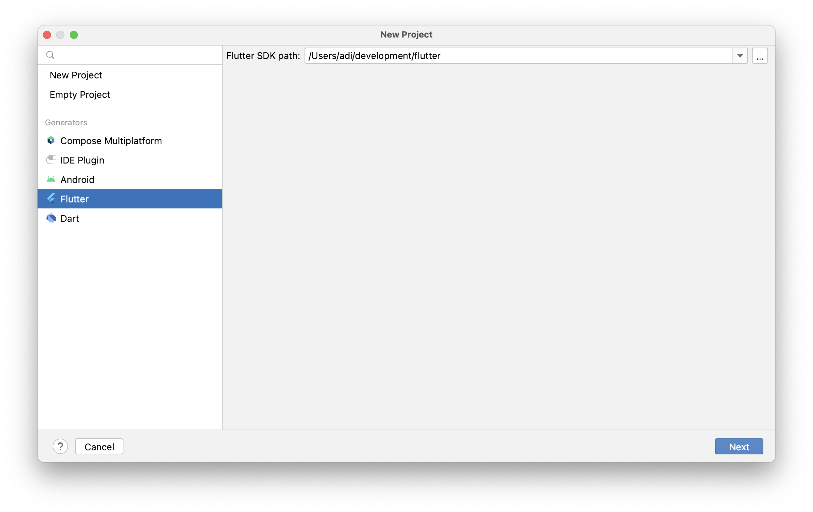
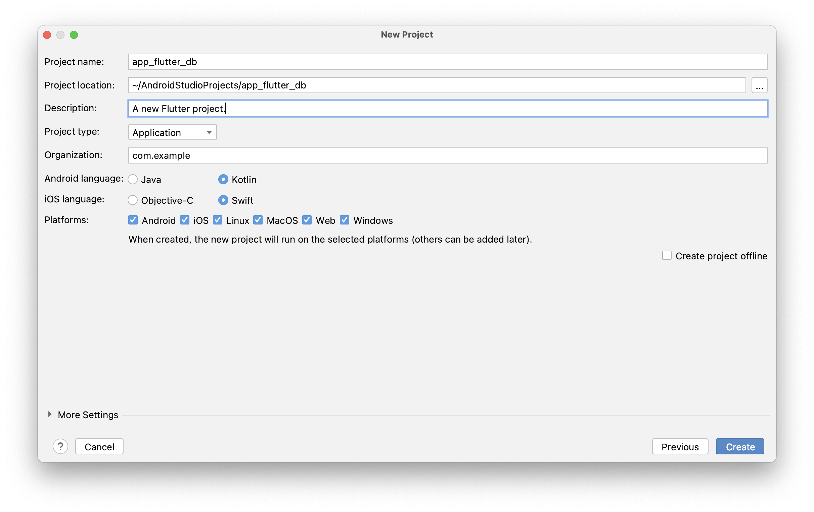
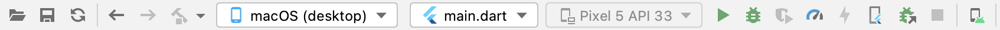
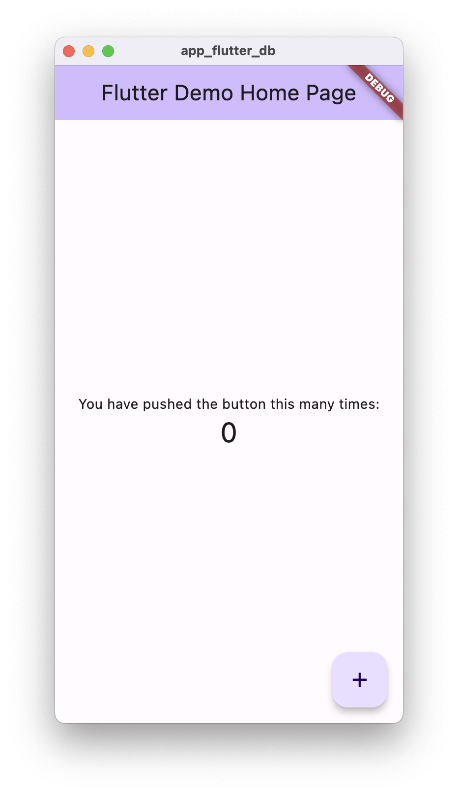
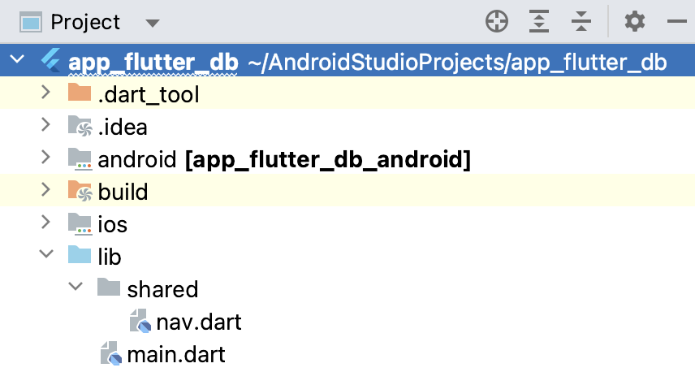

[Regresar](/Aplicaciones-Moviles-y-Servicios-Telematicos/)

# Práctica de Laboratorio 5
## DESARROLLO DE UNA APLICACIÓN MÓVIL HÍBRIDA CON BASE DE DATOS EXTERNA

## 🎯 Objetivo de Aprendizaje
Demostrar el acceso a los recursos en red para la programación de aplicaciones móviles avanzadas.

**Recursos:** 
Android Studio. SDK Flutter.

**Duración:** 
10 horas.

**Introducción**
Flutter es un conjunto de herramientas de interfaz de usuario multiplataforma que está diseñado para permitir la reutilización de código en sistemas operativos como iOS y Android, al mismo tiempo que permite que las aplicaciones interactúen directamente con los servicios de la plataforma subyacente. El objetivo es permitir que los desarrolladores entreguen aplicaciones de alto rendimiento que se sientan naturales en diferentes plataformas, adoptando las diferencias donde existen mientras comparten la mayor cantidad de código posible.

**Actividades**

### Paso 1. Crear un nuevo proyecto.
Crearemos un nuevo proyecto para familiarizarnos con los archivos de flutter.
1.	Abriremos Android Studio.
2.	Daremos click en “Create new flutter project”.

<p align="center">
  
</p>

3.	Donde dice Flutter SDK path deberíamos tener el directorio de nuestra carpeta de flutter, en caso de no tenerla:
a.	Presionar en los 3 puntos a la derecha.
b.	Buscar y seleccionar el directorio de la carpeta de flutter (Donde se la guardó cuando se instaló).
4.	Le damos click en Next.
5.	En la siguiente página podremos poner el nombre y la localización del proyecto, en nuestro caso llamaremos el proyecto “app flutter db”. Coloquen el nombre según el grupo.

<p align="center">
  
</p>
 
6.	Dar clic en Create.
7.	Se nos abrirá la app de ejemplo que viene por defecto en Flutter.
8.	Para correrla debemos de tener un dispositivo Android conectado, o iniciado un dispositivo virtual.
9.	Presionamos en el icono de run para que empiece a compilar la aplicación y automáticamente se abrirá en el dispositivo la aplicación.

<p align="center">
  
</p>

10.	Con esto se nos abrira una aplicación que la genera flutter como demostracion. Eliminaremos todos los comentarios que encontramos en el archivo ./lib/main.dart.

<p align="center">
  
</p>
 
11.	OJO* Algunos comentarios que son nombres de widgets como “MaterialAPP o ThemeData” se generan automaticamente por Android Studio para mejor facilidad de visualizacion de los componentes. Con esto estamos listos para el desarrollo de la app.

### Paso 2. Desarrollo de la aplicación
En caso de tener más interés en el desarrollo de flutter, y tiene experiencia en Android nativo, se recomienda visitar el siguiente enlace: https://flutter.dev/docs/get-started/flutter-for/android-devs. Aquí se explica a un programador de Android, cuáles son sus equivalentes en Flutter. Así mismo encontrará para desarrolladores de IOS, Web, y más.

1.	Primero debemos cambiar nuestra app de ser un StatelessWidget a un StatefullWidget, para esto debemos de modificar la clase dejándola de esta manera. Además, eliminar la constante del void main.

```
void main() {
  runApp(MyApp());
}

class MyApp extends StatefulWidget {
  _AppState createState() => _AppState();
}
```

2.	Consecutivamente eliminaremos la clase MyHomePage y la clase _MyHomePageState.

```
class MyHomePage extends StatefulWidget {
   ...
}

class _MyHomePageState extends State<MyHomePage> {
   ...
}
```

3.	Crearemos una nueva clase llamada _AppState definida de la siguiente manera:

```
class _AppState extends State<MyApp> {
  final GlobalKey<NavigatorState> navigatorKey =
  new GlobalKey<NavigatorState>();

  @override
  void initState() {
    super.initState();
  }

  @override
  Widget build(BuildContext context) {
    return MaterialApp(
      title: 'Vacheck',
      navigatorKey: navigatorKey,
      initialRoute:'nav',
      routes:{
        'nav': (context) => Nav(),
      },
      theme: ThemeData(
        primaryColor: Colors.red[400],
      ),
    );
  }
}
```

4.	Aún falta crear nuestro componente Nav, que será el navegador entre las páginas.  Para esto en la carpeta lib del proyecto crearemos una carpeta llamada shared. Y allí crearemos nuestro archivo “nav.dart” tal como se muestra.

<p align="center">
  
</p>

5.	Una vez creado el archivo, importaremos el paquete material.dart y definiremos la clase Nav:

```
import 'package:flutter/material.dart';

class Nav extends StatefulWidget {
  @override
  _NavState createState() => _NavState();
}
```

6.	Continuaremos definiendo el _NavState de la página de la siguiente forma:

```
class _NavState extends State<Nav> {

  int _currentIndex = 1;

  @override
  Widget build(BuildContext context){
    return Scaffold(
      appBar: AppBar(
        title: Text('Vacheck'),
      ),
      body: _llamarPagina(_currentIndex),
      bottomNavigationBar: _crearNavigationBar(),
    );
  }
  Widget _crearNavigationBar() {
    return BottomNavigationBar(
        unselectedItemColor: Color.fromRGBO(168, 97, 93, 0.4),
        iconSize: 30.0,
        unselectedIconTheme: IconThemeData(size: 25.0),
        currentIndex: _currentIndex,
        onTap: (index) {
          setState(() {
            _currentIndex = index;
          });
        },
        items: [
          BottomNavigationBarItem(
              icon: Icon(Icons.data_usage), label: 'Data'),
          BottomNavigationBarItem(
              icon: Icon(Icons.home), label: 'Home'),
          BottomNavigationBarItem(
              icon: Icon(Icons.bar_chart), label: 'Chart'),
        ]);
  }

  Widget _llamarPagina(int paginaActual) {
    switch (paginaActual) {
      default:
        return Text("Hola Mundo");
    }
  }
}
```

La primera variable current index, nos ayudara luego para poder usar la barra de navegación entre páginas.

La función build es la que genera el widget que se muestra, el cual tiene título, barra de navegación y cuerpo. En el caso de la barra de navegación llamamos a la función _crearNavigationBar que crea una barra de navegación con 3 ítems, y que cambia el índice de la página en la que nos encontramos al presionar en el botón.

Por último, está la función _llamarPagina que se encarga de llamar a la página que el usuario seleccione, por ahora hemos dejado el switch en default para que en cualquier caso nos muestre siempre el mensaje Hola mundo.

7.	Ahora debemos dirigirnos al archivo main.dart para importar la clase Nav que necesitábamos. 

```
import 'package:app_flutter_db/shared/nav.dart';
```

8.	Una vez hecho esto, podemos ejecutar la app para visualizar los avances (En caso de que siga teniendo la app ejecutándose desde el inicio del proyecto, por favor detenerla y volverla a iniciar, debido a que se hizo el cambio de estado a la aplicación).

9.	Ahora crearemos la página de bienvenida super básica. Iremos al directorio “lib” y crearemos una nueva carpeta llamada “pages” y dentro crearemos un archivo llamado “home_page.dart”.

10.	Dentro del archivo **home_page.dart** empezaremos a definir la clase HomePage

```
import 'package:flutter/material.dart';

class HomePage extends StatefulWidget{
  @override
  _HomePageState createState() => _HomePageState();
}

class _HomePageState extends State<HomePage>
    with WidgetsBindingObserver {
  @override
  Widget build(BuildContext context){
    return Container(
      color: Colors.red[300],
      padding: EdgeInsets.symmetric(horizontal: 18),
      child: Column(
        mainAxisAlignment: MainAxisAlignment.center,
        children: [
        Icon(Icons.airport_shuttle,color:
      Colors.white,size: 190,),
      Text("Welcome",
        style: TextStyle(
            color: Colors.white,
            fontSize: 60,
            fontWeight:
            FontWeight.bold
        ),
      ),
      Text("Bienvenido a la app para visualizar la informacion de temperatura de los camiones que transportan las vacunas",
          style: TextStyle(
          color: Colors.white,
          fontWeight: FontWeight.w300
      )
      ,)
    ]),
    );
  }
}
```

En _HomePageState con la función build, crearemos el contenedor que va en el body del widget principal. ***En caso de error en el texto quitar los saltos de línea y dejarlo en una sola línea.***

11.	Ahora esta página la llevaremos para que la clase Nav la use. Editaremos la función _llamarPagina que se encuentra en **nav.dart** para que retorne la instancia de la clase HomePage.

```
Widget _llamarPagina(int paginaActual) {
    switch (paginaActual) {
      default:
        return HomePage();
    }
  }
```


Recordar importar el archivo home_page para no tener errores, guardamos y ahora se nos muestra un mensaje de bienvenida simple.

```
import 'package:app_flutter_db/pages/home_page.dart';
```

12.	Continuaremos ahora con la página de los datos, así mismo crearemos en la carpeta “pages” un nuevo archivo llamado “data.dart”.

### Paso 3. Conexión con Firebase.
