[Regresar](/Aplicaciones-Moviles-y-Servicios-Telematicos/)

# Práctica de Laboratorio 5
## DESARROLLO DE UNA APLICACIÓN MÓVIL HÍBRIDA CON BASE DE DATOS EXTERNA

## 🎯 Objetivo de Aprendizaje
Demostrar el acceso a los recursos en red para la programación de aplicaciones móviles avanzadas.

**Recursos:** 
Android Studio. SDK Flutter.

**Duración:** 
10 horas.

**Introducción**
Flutter es un conjunto de herramientas de interfaz de usuario multiplataforma que está diseñado para permitir la reutilización de código en sistemas operativos como iOS y Android, al mismo tiempo que permite que las aplicaciones interactúen directamente con los servicios de la plataforma subyacente. El objetivo es permitir que los desarrolladores entreguen aplicaciones de alto rendimiento que se sientan naturales en diferentes plataformas, adoptando las diferencias donde existen mientras comparten la mayor cantidad de código posible.

**Actividades**

### Paso 1. Crear un nuevo proyecto.
Crearemos un nuevo proyecto para familiarizarnos con los archivos de flutter.
1.	Abriremos Android Studio.
2.	Daremos click en “Create new flutter project”.

<p align="center">
  
</p>


3. Donde dice Flutter SDK path deberíamos tener el directorio de nuestra carpeta de flutter, en caso de no tenerla:
a.	Presionar en los 3 puntos a la derecha.
b.	Buscar y seleccionar el directorio de la carpeta de flutter (Donde se la guardó cuando se instaló).
4.	Le damos click en Next.
5.	En la siguiente página podremos poner el nombre y la localización del proyecto, en nuestro caso llamaremos el proyecto “app flutter db”. Coloquen el nombre según el grupo.

<p align="center">
  
</p>


6.	Dar clic en Create.
7.	Se nos abrirá la app de ejemplo que viene por defecto en Flutter.
8.	Para correrla debemos de tener un dispositivo Android conectado, o iniciado un dispositivo virtual.
9.	Presionamos en el icono de run para que empiece a compilar la aplicación y automáticamente se abrirá en el dispositivo la aplicación.

<p align="center">
  
</p>

10.	Con esto se nos abrira una aplicación que la genera flutter como demostracion. Eliminaremos todos los comentarios que encontramos en el archivo ./lib/main.dart.

<p align="center">
  
</p>
 
11.	OJO* Algunos comentarios que son nombres de widgets como “MaterialAPP o ThemeData” se generan automaticamente por Android Studio para mejor facilidad de visualizacion de los componentes. Con esto estamos listos para el desarrollo de la app.

### Paso 2. Desarrollo de la aplicación
En caso de tener más interés en el desarrollo de flutter, y tiene experiencia en Android nativo, se recomienda visitar el siguiente enlace: https://flutter.dev/docs/get-started/flutter-for/android-devs. Aquí se explica a un programador de Android, cuáles son sus equivalentes en Flutter. Así mismo encontrará para desarrolladores de IOS, Web, y más.

1.	Primero debemos cambiar nuestra app de ser un StatelessWidget a un StatefullWidget, para esto debemos de modificar la clase dejándola de esta manera. Además, eliminar la constante del void main.

```
void main() {
  runApp(MyApp());
}

class MyApp extends StatefulWidget {
  _AppState createState() => _AppState();
}
```

2.	Consecutivamente eliminaremos la clase MyHomePage y la clase _MyHomePageState.

```
class MyHomePage extends StatefulWidget {
   ...
}

class _MyHomePageState extends State<MyHomePage> {
   ...
}
```

3.	Crearemos una nueva clase llamada _AppState definida de la siguiente manera:

```
class _AppState extends State<MyApp> {
  final GlobalKey<NavigatorState> navigatorKey =
  new GlobalKey<NavigatorState>();

  @override
  void initState() {
    super.initState();
  }

  @override
  Widget build(BuildContext context) {
    return MaterialApp(
      title: 'Vacheck',
      navigatorKey: navigatorKey,
      initialRoute:'nav',
      routes:{
        'nav': (context) => Nav(),
      },
      theme: ThemeData(
        primaryColor: Colors.red[400],
      ),
    );
  }
}
```

4.	Aún falta crear nuestro componente Nav, que será el navegador entre las páginas.  Para esto en la carpeta lib del proyecto crearemos una carpeta llamada shared. Y allí crearemos nuestro archivo “nav.dart” tal como se muestra.

<p align="center">
  
</p>

5.	Una vez creado el archivo, importaremos el paquete material.dart y definiremos la clase Nav:

```
import 'package:flutter/material.dart';

class Nav extends StatefulWidget {
  @override
  _NavState createState() => _NavState();
}
```

6.	Continuaremos definiendo el _NavState de la página de la siguiente forma:

```
class _NavState extends State<Nav> {

  int _currentIndex = 1;

  @override
  Widget build(BuildContext context){
    return Scaffold(
      appBar: AppBar(
        title: Text('Vacheck'),
      ),
      body: _llamarPagina(_currentIndex),
      bottomNavigationBar: _crearNavigationBar(),
    );
  }
  Widget _crearNavigationBar() {
    return BottomNavigationBar(
        unselectedItemColor: Color.fromRGBO(168, 97, 93, 0.4),
        iconSize: 30.0,
        unselectedIconTheme: IconThemeData(size: 25.0),
        currentIndex: _currentIndex,
        onTap: (index) {
          setState(() {
            _currentIndex = index;
          });
        },
        items: [
          BottomNavigationBarItem(
              icon: Icon(Icons.data_usage), label: 'Data'),
          BottomNavigationBarItem(
              icon: Icon(Icons.home), label: 'Home'),
          BottomNavigationBarItem(
              icon: Icon(Icons.bar_chart), label: 'Chart'),
        ]);
  }

  Widget _llamarPagina(int paginaActual) {
    switch (paginaActual) {
      default:
        return Text("Hola Mundo");
    }
  }
}
```

La primera variable current index, nos ayudara luego para poder usar la barra de navegación entre páginas.

La función build es la que genera el widget que se muestra, el cual tiene título, barra de navegación y cuerpo. En el caso de la barra de navegación llamamos a la función _crearNavigationBar que crea una barra de navegación con 3 ítems, y que cambia el índice de la página en la que nos encontramos al presionar en el botón.

Por último, está la función _llamarPagina que se encarga de llamar a la página que el usuario seleccione, por ahora hemos dejado el switch en default para que en cualquier caso nos muestre siempre el mensaje Hola mundo.

7.	Ahora debemos dirigirnos al archivo main.dart para importar la clase Nav que necesitábamos. 

```
import 'package:app_flutter_db/shared/nav.dart';
```

8.	Una vez hecho esto, podemos ejecutar la app para visualizar los avances (En caso de que siga teniendo la app ejecutándose desde el inicio del proyecto, por favor detenerla y volverla a iniciar, debido a que se hizo el cambio de estado a la aplicación).

9.	Ahora crearemos la página de bienvenida super básica. Iremos al directorio “lib” y crearemos una nueva carpeta llamada “pages” y dentro crearemos un archivo llamado “home_page.dart”.

10.	Dentro del archivo **home_page.dart** empezaremos a definir la clase HomePage

```
import 'package:flutter/material.dart';

class HomePage extends StatefulWidget{
  @override
  _HomePageState createState() => _HomePageState();
}

class _HomePageState extends State<HomePage>
    with WidgetsBindingObserver {
  @override
  Widget build(BuildContext context){
    return Container(
      color: Colors.red[300],
      padding: EdgeInsets.symmetric(horizontal: 18),
      child: Column(
        mainAxisAlignment: MainAxisAlignment.center,
        children: [
        Icon(Icons.airport_shuttle,color:
      Colors.white,size: 190,),
      Text("Welcome",
        style: TextStyle(
            color: Colors.white,
            fontSize: 60,
            fontWeight:
            FontWeight.bold
        ),
      ),
      Text("Bienvenido a la app para visualizar la informacion de temperatura de los camiones que transportan las vacunas",
          style: TextStyle(
          color: Colors.white,
          fontWeight: FontWeight.w300
      )
      ,)
    ]),
    );
  }
}
```

En _HomePageState con la función build, crearemos el contenedor que va en el body del widget principal. ***En caso de error en el texto quitar los saltos de línea y dejarlo en una sola línea.***

11.	Ahora esta página la llevaremos para que la clase Nav la use. Editaremos la función _llamarPagina que se encuentra en **nav.dart** para que retorne la instancia de la clase HomePage.

```
Widget _llamarPagina(int paginaActual) {
    switch (paginaActual) {
      default:
        return HomePage();
    }
  }
```


Recordar importar el archivo home_page para no tener errores, guardamos y ahora se nos muestra un mensaje de bienvenida simple.

```
import 'package:app_flutter_db/pages/home_page.dart';
```

12.	Continuaremos ahora con la página de los datos, así mismo crearemos en la carpeta “pages” un nuevo archivo llamado “data.dart”.

### Paso 3. Conexión con Firebase.

- Un miembro del grupo crea un proyecto en la [consola de FireBase](https://console.firebase.google.com/) usando una cuenta de gmail. Siga los pasos de las imágenes mostradas:

<p align="center">
  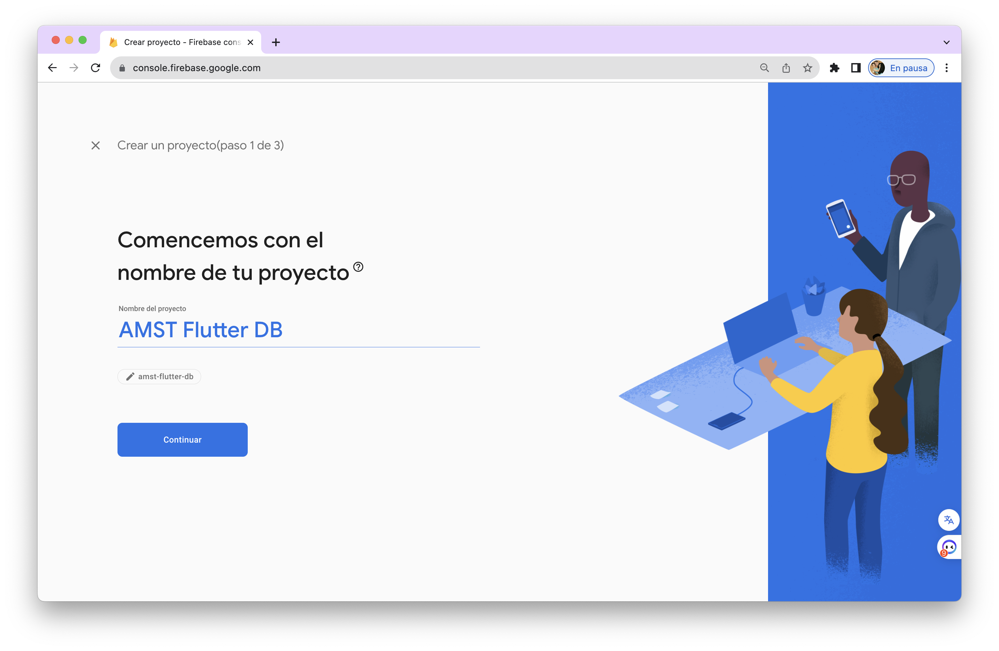
</p>

<p align="center">
  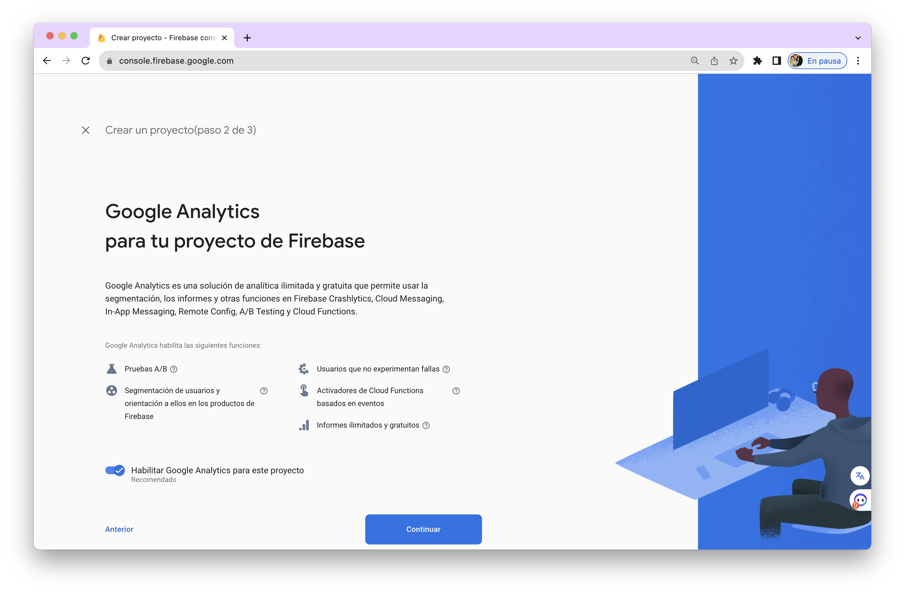
</p>

<p align="center">
  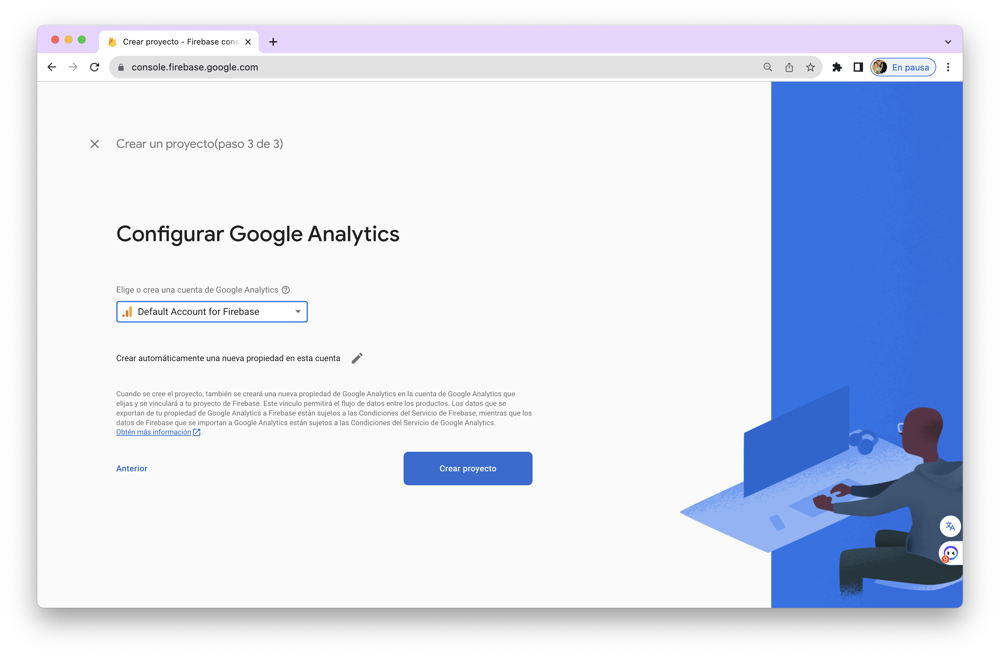
</p>

2.	Una vez creado el proyecto dirigirse a Realtime Database y dar click en crear una base de datos.

<p align="center">
  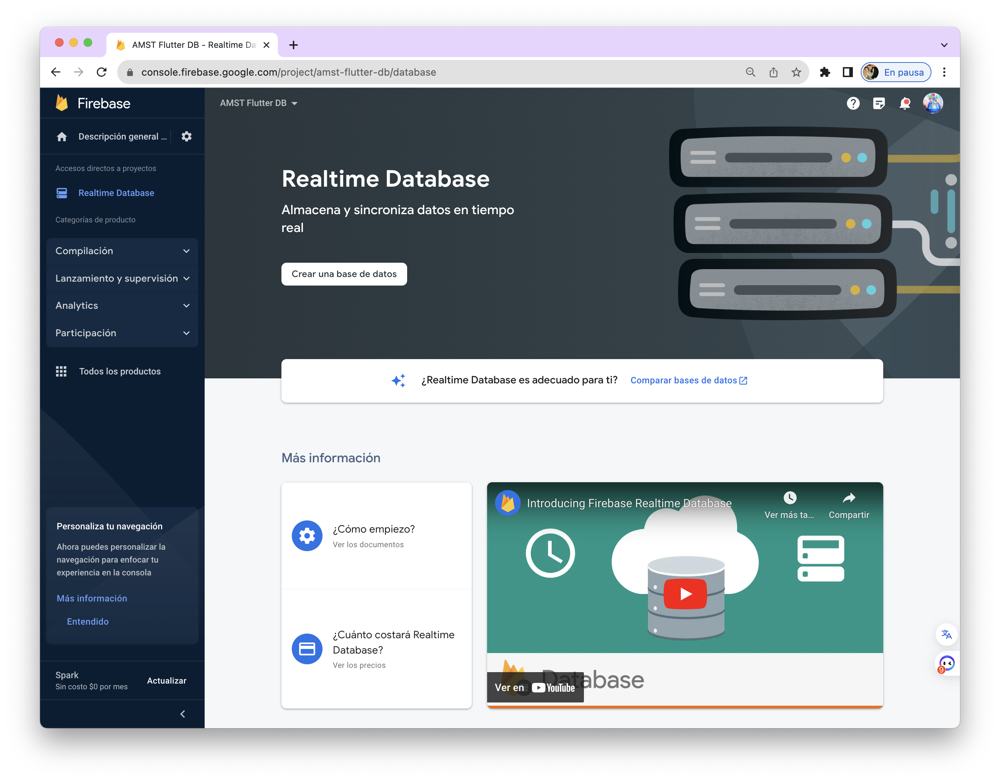
</p>

3.	Seleccionen los datos de la ubicación de Realtime Database como Estados Unidos (us-central1) y dar clic en Siguiente.

<p align="center">
  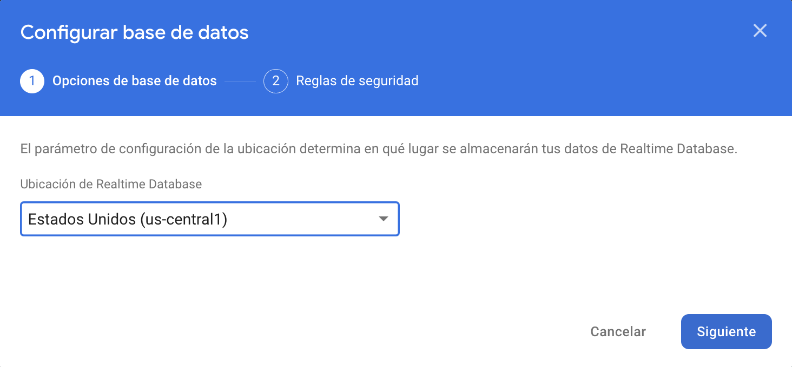
</p>

4.  Luego colocar las reglas de seguridad por defecto.

<p align="center">
  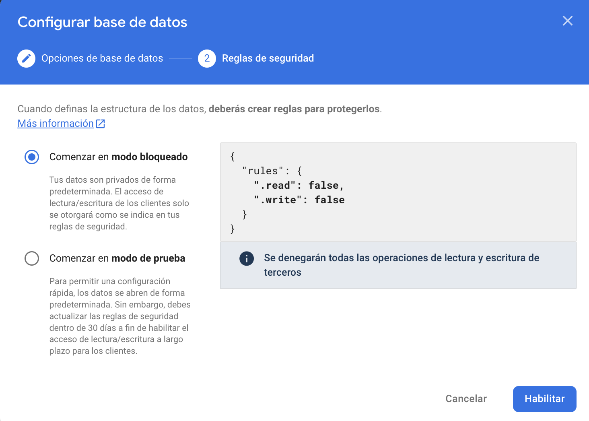
</p>

5.	Una vez creada cambiar las reglas de seguridad a true como se muestra:

<p align="center">
  
</p>

6.	Importar el [archivo json](amst_lab5-ac69-default-rtdb-export.json) a la Realtime Database mediante la consola de Firebase.

<p align="center">
  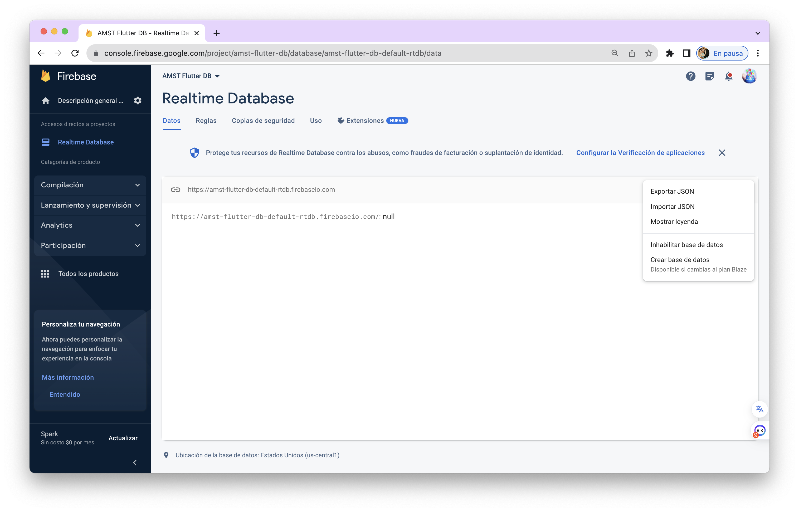
</p>

<p align="center">
  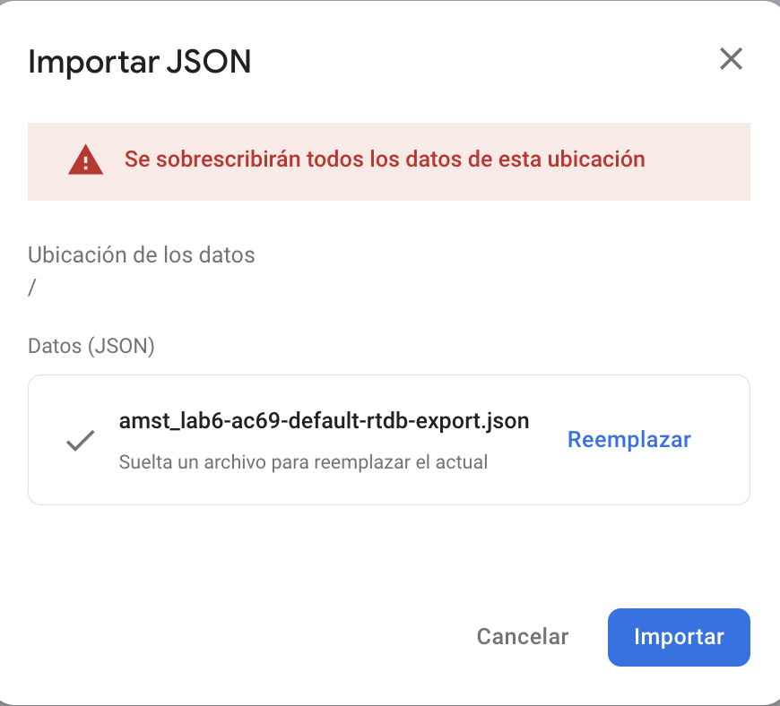
</p>

<p align="center">
  
</p>

7.	Antes de continuar, revisar que la configuración de versiones de SDK en Android/app/build.graddle esté de la siguiente manera:

```
minSdkVersion 21
targetSdkVersion 31
```

8.	En caso de no haber trabajado antes con flutter-firebase, se ejecuta el siguiente comando en el CMD para instalar Firebase CLI con npm:

```
sh-3.2# npm install -g firebase-tools
```

***Nota: En caso de no tener instalado el gestor de paquetes npm puede ir al siguiente enlace para buscar otras alternativas de instalación: https://firebase.google.com/docs/cli#windows-npm***

9.	Puede acceder a Firebase con la cuenta de Google con la que creamos el proyecto en la consola ejecutando el siguiente comando:

```
sh-3.2# firebase login
i  Firebase optionally collects CLI and Emulator Suite usage and error reporting information to help improve our products. Data is collected in accordance with Google's privacy policy (https://policies.google.com/privacy) and is not used to identify you.

? Allow Firebase to collect CLI and Emulator Suite usage and error reporting information? Yes
i  To change your data collection preference at any time, run `firebase logout` and log in again.

Visit this URL on this device to log in:
https://accounts.google.com/o/oauth2/auth?client_id=563584335869-fgrhgmd47bqnekij5i8b5pr03ho849e6.apps.googleusercontent.com&scope=email%20openid%20https%3A%2F%2Fwww.googleapis.com%2Fauth%2Fcloudplatformprojects.readonly%20https%3A%2F%2Fwww.googleapis.com%2Fauth%2Ffirebase%20https%3A%2F%2Fwww.googleapis.com%2Fauth%2Fcloud-platform&response_type=code&state=301795975&redirect_uri=http%3A%2F%2Flocalhost%3A9005

Waiting for authentication...

✔  Success! Logged in as amst.investigacion@gmail.com
```

<p align="center">
  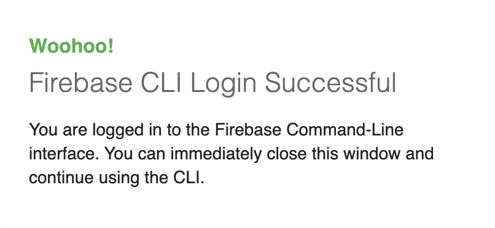
</p>

10.	Para instalar la CLI de FlutterFire, ejecutamos el siguiente comando desde cualquier directorio:

```
sh-3.2# dart pub global activate flutterfire_cli
```

11.	Desde el directorio del proyecto de Flutter, ejecutaremos el siguiente comando para iniciar el flujo de trabajo de configuración de la app:

```
adi@Adrianas-MacBook-Pro ~ % flutterfire configure
```

Nota: En caso de problemas con este comando agregar: C:\Users\*username*\AppData\Local\Pub\Cache\bin a las variables del sistema y reiniciar el equipo.

11.	Aparecerá una lista, donde debe seleccionar el proyecto en el cual va a trabajar.

<p align="center">
  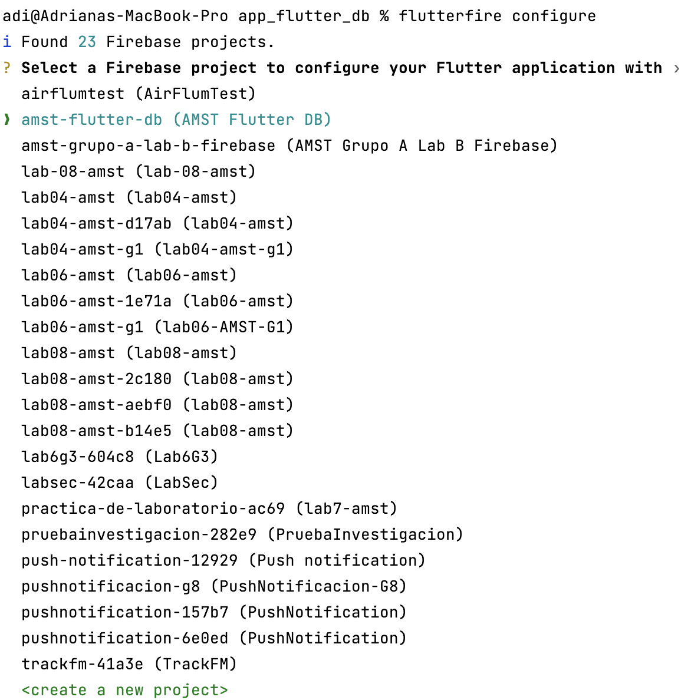
</p>

12.	Luego pedirá que seleccionemos las plataformas que se van a configurar. Vienen por defecto Android y IOS que es lo que seleccionará. Dar enter para continuar.

<p align="center">
  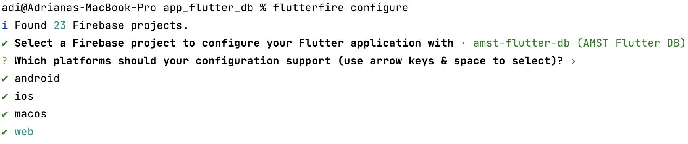
</p>


```
adi@Adrianas-MacBook-Pro app_flutter_db % flutterfire configure
i Found 23 Firebase projects.                                                                                                 
✔ Select a Firebase project to configure your Flutter application with · amst-flutter-db (AMST Flutter DB)                                                  
✔ Which platforms should your configuration support (use arrow keys & space to select)? · ios, macos, web, android                                                           
i Firebase android app com.example.app_flutter_db is not registered on Firebase project amst-flutter-db.                                                               
i Registered a new Firebase android app on Firebase project amst-flutter-db.                    
i Firebase ios app com.example.appFlutterDb is not registered on Firebase project amst-flutter-db.            
i Registered a new Firebase ios app on Firebase project amst-flutter-db.                                            
i Firebase macos app com.example.appFlutterDb.RunnerTests is not registered on Firebase project amst-flutter-db. 
i Registered a new Firebase macos app on Firebase project amst-flutter-db.                                         
i Firebase web app app_flutter_db (web) is not registered on Firebase project amst-flutter-db.                     
i Registered a new Firebase web app on Firebase project amst-flutter-db.                                          
✔ The files android/build.gradle & android/app/build.gradle will be updated to apply Firebase configuration and gradle build plugins. Do you want to continue? · yes
Firebase configuration file lib/firebase_options.dart generated successfully with the following Firebase apps:

Platform  Firebase App Id
web       1:1012422970186:web:80789bc9ffdb59b41b4fb3
android   1:1012422970186:android:55e09570ebc3aff71b4fb3
ios       1:1012422970186:ios:e09405689505518b1b4fb3
macos     1:1012422970186:ios:243d7c6a2c77968c1b4fb3

Learn more about using this file and next steps from the documentation:
 > https://firebase.google.com/docs/flutter/setup
adi@Adrianas-MacBook-Pro app_flutter_db % 
```

13.	Para verificar nos dirigimos a la consola de firebase y podremos observar las apps creadas.

<p align="center">
  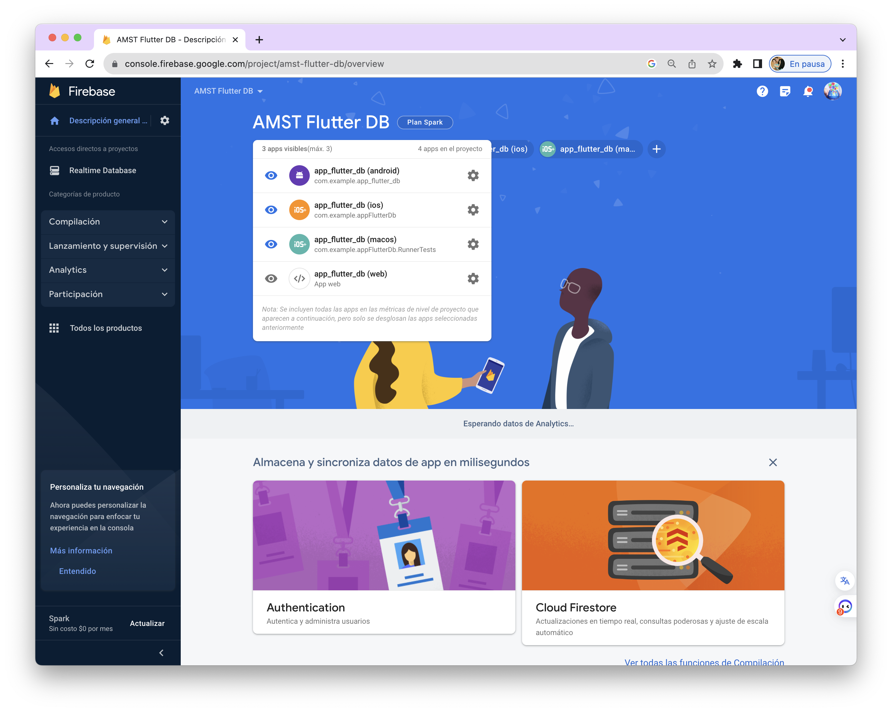
</p>

14.	Desde el directorio del proyecto de Flutter, ejecutemos el siguiente comando para instalar el complemento principal:

```
adi@Adrianas-MacBook-Pro app_flutter_db % flutter pub add firebase_core
Resolving dependencies... 
  collection 1.17.1 (1.18.0 available)
+ firebase_core 2.15.0
+ firebase_core_platform_interface 4.8.0
+ firebase_core_web 2.6.0
+ flutter_web_plugins 0.0.0 from sdk flutter
  matcher 0.12.15 (0.12.16 available)
  material_color_utilities 0.2.0 (0.8.0 available)
+ plugin_platform_interface 2.1.5
  source_span 1.9.1 (1.10.0 available)
  stack_trace 1.11.0 (1.11.1 available)
  stream_channel 2.1.1 (2.1.2 available)
  test_api 0.5.1 (0.6.1 available)
Changed 5 dependencies!
```

***Podemos utilizar la terminal de Android studio.***

15.	Otra forma de instalar los plugins es agregarlos directamente al pusbec.yaml. En este caso nos dirigimos a ese archivo y agregamos lo siguiente. Luego dar clic a Pub get o ejecutarlo como comando

```
dependencies:
  flutter:
    sdk: flutter

  # The following adds the Cupertino Icons font to your application.
  # Use with the CupertinoIcons class for iOS style icons.
  cupertino_icons: ^1.0.2
  firebase_core: ^2.15.0
  expandable: ^5.0.1
  firebase_database: ^10.2.4
  google_fonts: ^5.1.0
  charts_flutter: ^0.12.0
```

16.	Ejecutamos nuevamente el comando flutterfire configure para asegurar de que la configuración de Firebase de la app de Flutter esté actualizada. Colocamos la misma configuración que en los pasos anteriores.

17.	Ahora vamos al archivo lib/main.dart, donde importamos el complemento principal de Firebase y el archivo de configuración que fue generado antes:

```
import 'package:firebase_core/firebase_core.dart';
import 'firebase_options.dart';
```

18.	Además, en lib/main.dart, inicializamos Firebase con el objeto DefaultFirebaseOptions exportado por el archivo de configuración:

```
Future<void> main() async {
  WidgetsFlutterBinding.ensureInitialized();
  await Firebase.initializeApp();
  runApp(MyApp());
}
```

Reemplazar esta función:
```
void main() {
  runApp(MyApp());
}
```

19.	Corremos la aplicación para verificar que todo esté en orden. De todo salir bien, no saldrá ningún error y la pantalla se verá igual que antes de la configuración.

### Paso 4. Desarrollo.

1.	Ahora si iremos a el archivo ./lib/pages/data.dart para definir la clase.

```
import 'dart:developer';

import 'package:firebase_database/ui/firebase_animated_list.dart';
import 'package:flutter/material.dart';
import 'package:firebase_database/firebase_database.dart';

class Data extends StatefulWidget {
  @override
  _DataState createState() => _DataState();
}

class _DataState extends State<Data> {
  late final dataD;
  late DatabaseReference _dataref;
  @override
  void initState() {
    _dataref = FirebaseDatabase.instance.ref('data');
    super.initState();
  }

  @override
  Widget build(BuildContext context) {
    return Column(
        children: [
          Tab(
            child: Text("Data from database"),
          ),
          _crearListado(context),
        ]);
  }

  Widget _crearListado(BuildContext context) {
    return Flexible(child: FirebaseAnimatedList(
        query: _dataref,
        itemBuilder: (BuildContext context, DataSnapshot snapshot,
            Animation<double> animation, int index) {
          var id = ((snapshot.value as dynamic)["end_device_ids"]["device_id"]).toString();
          var humedad = ((snapshot.value as dynamic)["uplink_message"]["decoded_payload"]["humedad"]).toString();
          var temperatura = ((snapshot.value as dynamic)["uplink_message"]["decoded_payload"]["temperatura"]).toString();
          var fecha = ((snapshot.value as dynamic)["received_at"]).toString();
          return Container(
            margin: EdgeInsets.symmetric(vertical: 5,horizontal: 10),
            decoration: BoxDecoration(
              color: Colors.blueGrey[50],
              borderRadius: BorderRadius.circular(5),
            ),
            child: ListTile(
                title: Text("ID: " + id,
                    style: TextStyle(fontWeight: FontWeight.bold)),
                subtitle: Text("Humedad: "+humedad +"\n"
                    + "Temperatura: " + temperatura
                ),
                trailing: Column(
                  mainAxisAlignment: MainAxisAlignment.center,
                  children: [
                    Text("Fecha: " + fecha.split("T")[0]),
                    Text("Hora: " + fecha.split(".")[0].split("T")[1]),
                  ],
                )
            ),
          );
        }
    ),
    );
  }
}
```

Dentro de esta clase inicializamos “_dataref” que es la referencia a la sección de datos que nos vamos a enfocar, en nuestro caso “data”, como podemos ver en la base de datos.
 

Luego tenemos una función build que construye la columna que se mostrara en pantalla, pero esta clase dentro de sus hijos llama a la función “_crearListado” que es la que realiza la magia.
Dentro de esta función lo que hacemos es crear un widget de tipo Flexible, que tiene como hijo una FirebaseAdminList, este widget permite conectarse a tiempo real a la base de datos de firebase, y mostrar los cambios que se hagan a tiempo real.
Dentro del itemBuilder de ese widget se ejecuta una función lambda que realiza la conexión hacia un query que es la referencia a la sección de la base, obteniendo los datos en una variable llamada snapshot desde donde saca la información como fecha, id, etc. Con esto generamos un container y alojamos la información de cómo queremos que se vea y automáticamente dart realizara el listado de todos los datos que reciba.

2.	Ahora dentro de la clase Nav(), debemos agregar la clase Data para que cuando presionamos en la pestaña de datos se renderice esta página. Lo que haremos es agregar un nuevo case en nuestro switch para llamar a la instancia de esta manera (Recordar importar el archivo data.dart): 

```
Widget _llamarPagina(int paginaActual) {
  switch (paginaActual) {
    case 0:
      return Data();
    default:
      return HomePage();
  }
}
```

3.	Una vez realizado esto, guardar los archivos. Detener el proceso de debug y volver a ejecutar la app para que se compile la app con las nuevas dependencias. Al terminar si nos vamos a la pestaña de data veremos como ya obtiene los datos desde la base de datos.
 
4.	Ahora crearemos la página del gráfico, crearemos un nuevo archivo “chart.dart” dentro de ./lib/pages/

5.	Dentro añadiremos las siguientes líneas.

```
import 'package:flutter/material.dart';
import 'package:charts_flutter/flutter.dart' as charts;
import 'package:firebase_database/firebase_database.dart';

class Chart extends StatefulWidget {

  @override
  _ChartState createState() => _ChartState();
}

class _ChartState extends State<Chart> {
  late List<Registro> _data;
  late List<charts.Series<Registro,String>> _chardata;
  late DatabaseReference _dataref;

  void _makeData(){
    _chardata.add(
        charts.Series(
          domainFn: (Registro registro,_) =>
          registro.fecha + " "+ registro.hora,
          measureFn: (Registro registro,_) =>
          registro.temperatura,
          id: 'Registros',
          data: _data,

        )
    );
  }

  @override
  void initState(){
    final FirebaseDatabase database = FirebaseDatabase.instance;
    _dataref = database.reference().child("data");
    _data = <Registro>[];
    _chardata = <charts.Series<Registro, String>>[];
  }

  @override
  Widget build(BuildContext context) {
    return Scaffold(
      body: _buildBody(context),
    );
  }

  Widget _buildBody(context){
    return StreamBuilder(
        stream: _dataref.onValue,
        builder: (context,snapshot){
          print(snapshot.data);
          if(!snapshot.hasData){
            return LinearProgressIndicator();
          }else{
            List<Registro> registros = <Registro>[];
            Map data = (snapshot.data as dynamic).snapshot.value;
            for(Map childata in data.values){
              var fecha =
              childata["received_at"].toString();
              var temperatura =
              childata["uplink_message"]["decoded_payload"]["temperatura"].toString();
              var humedad =
              childata["uplink_message"]["decoded_payload"]["humedad"].toString();
              registros.add(Registro(fecha,temperatura,humedad
              ));
            }
            return _builChart(context,registros);
          }
        }
    );
  }

  Widget _builChart(BuildContext context, List<Registro> registros){
    _data = registros;
    _makeData();
    return Padding(
      padding: EdgeInsets.all(8.0),
      child: Container(
        child: Center(
          child: Column(
            children: <Widget>[
              Text("Diagrama de barras de temperaturas"),
              SizedBox(height: 10.0),
              Expanded(
                child: charts.BarChart(_chardata,
                  animate: true,
                  animationDuration: Duration(seconds: 1),
                  vertical: false,
                ),
              )
            ],
          ),
        ),
      ),
    );
  }
}

class Registro{
  String fecha='';
  String hora='';
  double temperatura=0;
  double humedad=0;

  Registro(fecha,temperatura,humedad){
    this.fecha = fecha.split("T")[0];
    this.hora = fecha.split(".")[0].split("T")[1];
    this.temperatura = double.parse(temperatura);
    this.humedad = double.parse(humedad);
  }
}
```
	
En esta clase definimos las listas donde se guardarán los datos, además de las referencias que son luego inicializadas.
La función _makeData lo que hace es definir la configuración del gráfico y define como se usara la data que se entrega.
Luego se define la función _buildBody que es llamada por la función _build para crear lo que se mostrara en el dispositivo. Se crea un widget tipo StreamBuilder, que desde información obtenida desde una base de datos genera lo que sea que le indiquemos. Recibimos los datos desde firebase y verificamos que lleguen correctamente, y con información para luego obtener cada dato y enviarlo a la siguiente función.
_BuildChart lo que hace es ya indicar a dart como tiene que crear el chart en el dispositivo.
Por último, agregamos una inner class que nos ayuda a manejar la información de los registros, y entregarlos ordenados al módulo de charts de flutter.

6.	Finalmente necesitamos agregar esta página al switch de nuestra barra de navegación, por lo que la agregamos como se muestro a continuación.

```
Widget _llamarPagina(int paginaActual) {
    switch (paginaActual) {
      case 0:
        return Data();
      case 2:
        return Chart();
      default:
        return HomePage();
    }
  }
```

7.	Guardamos los cambios, y podremos visualizar los datos en nuestra aplicación sin problema.
 
***Nota: Les podría aparecer el siguiente error, pero no es motivo de preocupación por este laboratorio, puesto que viene directo de la librería que se está utilizando. Referirse a https://docs.flutter.dev/development/tools/sdk/release-notes/release-notes-3.0.0 para mas información.***
 

Paso 5: Compilación de la aplicación

A continuación, realizaremos la compilación de la aplicación para los 2 principales sistemas móviles. 

**Android**
1.	Para compilar para Android, desde Android Studio en la parte superior encontraremos la opción Build, seleccionaremos esa opción, luego seleccionamos flutter y por último Build APK.
 
2.	Se abrirá un terminal donde automáticamente iniciará la compilación de la aplicación, esperamos hasta que finalice. 
3.	La apk la encontraremos en el directorio, ./build/app/outputs/flutter-apk/app-release.apk como se muestra a continuación:
 
4.	Esta apk la moveremos dentro de nuestro dispositivo móvil y lo instalaremos. En caso de error de instalación, activar la instalación de terceros en la configuración. Esto se da debido a que la aplicación no esta debidamente firmada por una cuenta asociada a la play store.

**IOS**
Para compilar nuestra aplicación para IOS necesitamos obligatoriamente tener una computadora macOS, debido a que necesitamos le programa xCode para poder compilarla. Esto es debido a que flutter usa los componentes nativos de IOS para compilar la aplicación. 
1.	Abrimos nuestro proyecto en Android Studio, desde ahí buscamos el siguiente archivo: ./ios/Runner/AppDelegate.swift 
 
2.	Una vez ahí, veremos a la derecha arriba una opción que dice OpenIOS module in Xcode, la seleccionamos y esta exportara y conectara a xcode con nuestro proyecto para compilarlo. Esperaremos un momento hasta que xCode se abra.
3.	Una vez abierto, en deployment info asegurarnos que este en la versión 14.1 de IOS.
4.	Dentro de la tira de opciones encontraremos una pestaña llamada “Singinig & capabilities” 
5.	En la sección que dice “Team” deberemos agregar nuestra cuenta de desarrollador* (Probar con icloud). 
 
6.	*En caso de querer ver la aplicación en nuestro dispositivo iphone”: Una vez realizado esto, podemos conectar nuestro dispositivo iphone a nuestra macOS, en la parte superior debemos seleccionar nuestro dispositivo y luego darle en el botón de play.

7.	*Para compilar la aplicación*: En la parte superior en la opción “product”, buscaremos “destinations”, y escogeremos en “any Ios Devices (arm64)”.

8.	Iremos nuevamente a la opción “product” y escogemos la opción archive. Con eso se empezará a generar un archivo, esperaremos hasta que finalice.

9.	Una vez finalizado nos mostrara el archivo en una ventana de archivos. A la derecha nos mostrara dos botones, escogeremos el que dice “Distribute App”.

10.	Seleccionamos el método iOS App Store y presionamos en Next.

11.	Seleccionamos el destino en Export y presionamos en Next.

12.	En App Store distribution opios, dejamos igual y presionamos Next.

13.	En Re-sign Runner, seleccionamos “Automatically manage signing” y presionamos next.

14.	Por último, esperaremos y presionaremos el botón export.

15.	Seleccionamos a donde quieren ser exportados nuestros archivos y damos en el botón Export.

16.	Nos dirigimos a la carpeta creada y ahí encontraremos los archivos para la instalación. El más importante es el archivo .ipa que lo usaremos para instalar en nuestros dispositivos iphone.

**Desafío**
1.	Investigar
a.	¿Qué otros fameworks tienen características similares a flutter?
b.	¿De qué otras manera pueden mostrar datos de forma gráfica?


### **Formato de la práctica**
La práctica de laboratorio será desarrollado en el siguiente formato:

- Nombre del archivo: AMST_Práctica de Laboratorio A_Grupo B_Apellido1_Apellido2_Apellido3

- (*) Siendo A el número de la práctica y B el número del grupo
- Nombre de la materia
- Título de la práctica: Ejemplo: Trabajo Autónomo A - Tema
- Nombre de la profesora
- Número de grupo
- Nombres/Apellidos de los integrantes del grupo que hayan desarrollado el trabajo
- Fecha de inicio y fin del trabajo
- Resultados de las actividades planteadas: 
- Explicación de las actividades ejecutadas, incluyendo las imágenes del proceso. Además, incluir el enlace del repositorio del proyecto en Github y el archivo ejecutable (apk) de la aplicación móvil.
- Conclusiones y Recomendaciones: Respecto a lo aprendido durante el desarrollo del trabajo.
- Referencias bibliográficas: Colocar los documentos, enlaces web o libros consultados.