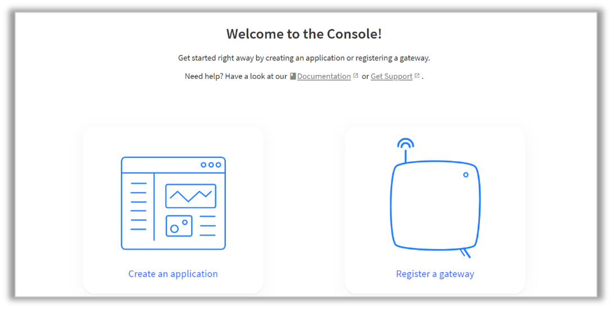
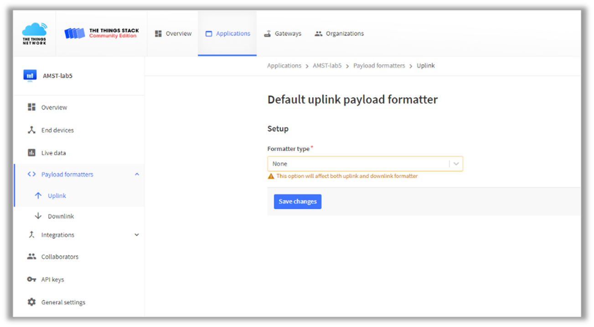
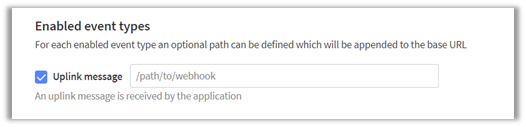
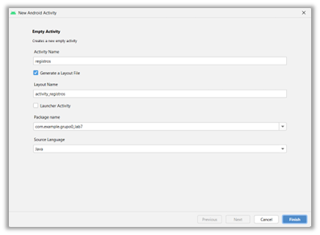

[Regresar](/Aplicaciones-Moviles-y-Servicios-Telematicos/)

# Práctica de Laboratorio 6
## DESARROLLO DE UNA APLICACIÓN MÓVIL AVANZADA INTEGRANDO HARDWARE IoT CON CONEXIÓN A LA RED DE LORAWAN

**Objetivo de Aprendizaje:** Diseñar aplicaciones que utilicen los sensores embebidos en dispositivos móviles para la entrega de información a los usuarios en tiempo real.

**Recursos:** Sensores IoT simulados, Backend de LoRaWan, Android Studio, FireBase, Ubidots.
Duración: 7 horas

**Introducción:** 
Los microcontroladores mbed son una serie de placas de desarrollo de microcontroladores ARM diseñadas para la creación rápida de prototipos. 
El microcontrolador mbed NXP LPC1768 en particular está diseñado para crear prototipos de todo tipo de dispositivos, especialmente aquellos que incluyen Ethernet, USB y la flexibilidad de muchas interfaces periféricas y memoria FLASH. Está empaquetado como un pequeño factor de forma DIP para la creación de prototipos con PCB, tableros y placas de prueba, e incluye un programador USB FLASH incorporado.

<p align="center">
  
</p>

Incluye 512 KB de FLASH, 32 KB de RAM y muchas interfaces, incluidas Ethernet, host y dispositivo USB, CAN, SPI, I2C, ADC, DAC, PWM y otras interfaces de E / S. El pinout anterior muestra las interfaces de uso común y sus ubicaciones. Tenga en cuenta que todos los pines numerados (p5-p30) también se pueden usar como interfaces DigitalIn y DigitalOut.
LoRaWAN es una especificación de redes LPWAN (Low Power Wide Area Network). Tomando como base los niveles OSI, sería capa 2 (Enlace de Datos). Es lo que se conoce como MAC (Media Access Control). LoRaWAN se encarga de unir diferentes dispositivos LoRa gestionando sus canales y parámetros de conexión: canal, ancho de banda, cifrado de datos, etc.
En la capa 1 del modelo OSI, capa física, encontramos la tecnología LoRa de comunicación. Esta tecnología permite el envío y recepción de información punto-a-punto. Lo que caracteriza a un dispositivo LoRa es su largo alcance con un mínimo dispositivo. Para ello emplea la técnica de espectro ensanchado, donde la señal a mandar utiliza más ancho de banda que el necesario teóricamente pero que permite una recepción de múltiples señales a la vez que tengan distinta velocidad.

<p align="center">
  
</p>

### Tipos de comunicación
1. **Modo LoRa:** Comunicación punto a punto
En modo Lora los nodos pueden funcionar con una conexión punto-a-punto (P2P) o mesh la principal característica de este modo es que no se requiere un dispositivo intermediario que administre la comunicación, los dispositivos pueden enviar entre ellos información directamente, esto es perfecto para comunicaciones sencillas y simples por ejemplo controlar el encendido y apagado de un motor.


<p align="center">
  
</p>

La otra manera es de tipo mesh donde encontramos un nodo que se encarga de coordinar la red, sus desventajas son que está limitada a 255 redes de 255 nodos y a que el nodo coordinador solo puede escuchar un nodo a la vez.


<p align="center">
  
</p>


2. ### Modo LoRaWAN

En modo LoRaWAN los nodos forzosamente se deben conectar a un Gateway que soporta hasta 62,500 y puede escuchar 8 nodos a la vez, para poder unirse a la red y aprovechar las bondades del protocolo el nodo debe enviar una serie de llaves de identificación y seguridad, todos los nodos trabajan en una conexión tipo estrella, los mismos nodos aun estando en movimiento se conectan al Gateway más cercano y con mejor calidad de comunicación, muy similar a como funciona una red celular.
En protocolo LoRaWAN existen tres tipos de clases de nodo:

**Clase A:**
La más soportada en casi todos los dispositivos, este tipo de clase ofrece el mayor ahorro de energía debido a que solo entra en modo escucha (llamado ventana RX) después de enviar un dato hacia el Gateway, por eso es ideal para dispositivos que usan una batería.
**Clase B:**
Este tipo de dispositivos tiene las ventanas de recepción con base a tiempos predeterminados con el Gateway, este tipo de nodos puede usar una batería o una fuente externa dependiendo de los tiempos asignados de escucha.
**Clase C:**
Este tipo de clase ofrece el menor ahorro de energía debido a que siempre está en modo escucha y solo cuando es necesario en modo transmitir, la recomendación es usarlo en dispositivos que cuentan con una fuente externa de alimentación.

### Actividades:
### Paso 1. Creación de cuenta y configuración de dispositivos en The Things Network (TTN) (10 puntos).

- Abra una nueva pestaña en el navegador web e ingrese a la dirección: https://www.thethingsnetwork.org/
- Dé clic en Log in e ingrese las siguientes credenciales:
Cuenta: amst.investigacion@gmail.com
Clave: Esp0L@m5t

<p align="center">
  
</p>


- Una vez que ingresa a la cuenta, dé clic en CONSOLE.


<p align="center">
  
</p>

- A continuación, va a aparecer la siguiente pestaña. Seleccionar el Cluster de North America


<p align="center">
  
</p>

- Seleccione APPLICATIONS para crear una aplicación que recibirá los datos del microcontrolador.

<p align="center">
  
</p>

- Definimos el nombre de la aplicación como “amst-laboratorio7-grupoN” (siendo N el número de su grupo) y la creamos dando clic en “Create application”.

<p align="center">
  
</p>

- Seleccionamos la opción “Add end device”

<p align="center">
  
</p>


- Registramos un nuevo dispositivo seleccionando la opción manualmente y versión LoRaWan 1.0.3. Seguir los pasos como las imágenes a continuación. 
Recordar: Se utiliza el nombre de “arm-mbed-grupoN” (siendo N el número de su grupo).
En Plan de Frecuencia colocar el usado por TTN de Estados Unidos.

JoinEUI se llena de ceros, y se da click en confirmar para mostrar los parámetros adicionales. 
Para DevEUI coloquen una clave proporcionada por el profesor, la cual tiene el siguiente formato 01.02.03.XX.XX.04.05.06. No hacer click en generate.

- Para los espacios XX.XX pueden llenar con los números que deseen.
AppKEY se genera aleatoriamente (Click en generate).
Luego dar click en register end device.

<p align="center">
  
</p>

- Una vez registrado el dispositivo, anotaremos el “Device EUI”, “Application EUI” y “App Key”
     ⚠️ Si los valores tienen el siguiente formato:   presione el botón  


<p align="center">
  
</p>

NOTA: Anotarlos en el formato

Nota: Verificar que DevEUI esté en formato lsb o msb, respectivamente.

**Paso 2:** Preparación del entorno de desarrollo
a)	Abrir Arduino IDE e instalar las placas de desarrollo SAMD, tanto de Arduino como de Adafruit desde: “Herramientas -> Placa: "XXXXXXX" -> Gestor de tarjetas…”

<p align="center">
  
</p>


<p align="center">
  
</p>

 
- Instalar librería MCCI LoRaWAN desde: “Programa -> Incluir Librería -> Administrar Bibliotecas…”


<p align="center">
  
</p>

<p align="center">
  
</p>

**Paso 3:** Conexión del Adafruit Feather M0 con el sensor DHT22

<p align="center">
  
</p>

**Ilustración 1: Esquemático conexión del sensor DHT22 y Adafruit Feather M0**


**Nota:** El pin correspondiente a data debe estar conectado a un pin digital del Adafruit Feather M0. Además, verificar que el número del pin corresponda con la programación implementada a continuación.

**Paso 4:** Programación del microcontrolador.

- Seleccione la tarjeta de desarrollo “Adafruit Feather M0 (SAMD21)”

<p align="center">
  
</p>

**Paso 5:** Envío de mensajes hacia TTN
- Abrir el código ejemplo de la librería de LoRaWAN “ttn-ota-feather-us915-dht22”

<p align="center">
  
</p>

- Modificar las palabras FILLMEIN del siguiente código con las credenciales generadas del Paso 1.

<p align="center">
  
</p>

- Cargar el código en el Feather M0 y abrir el Monitor Serial.

<p align="center">
  
</p>

Nota: La red utilizada para el envío constante de datos hacia los dispositivos configurados en la plataforma The Things Network (TTN) es propia, el estándar es Wi-Fi. Previamente, fue necesario configurar los dispositivos para que estén conectados a la red propia y lograr una comunicación continua entre ellos.

**Paso 6:** Decodificador
- En la pestaña “Payload formatters” generar el código en JavaScript para poder procesar los datos recibidos en formato de bytes y que se muestre como un JSON indicando el valor exacto de la medición.
- Regrese, en The Things Network, a la sección de la aplicación, dando clic en la opción “Payload Formats”- Uplink que se encuentra al lado izquierdo de la pantalla.

<p align="center">
  
</p>

- En este segmento se definirá cómo se procesarán los datos recibidos mediante el protocolo LoRaWAN. Se selecciona la opción Custom JavaScript formatter.

<p align="center">
  
</p>

Creamos el decoder con el siguiente código:

```
function decodeUplink(input) {
  t=sflt162f((input.bytes[1]<<8)+input.bytes[0])*100;
  h=sflt162f((input.bytes[3]<<8)+input.bytes[2])*100;
  return {
    data: {
      humedad: h,
      temp: t
    },
    warnings: [],
    errors: []
  };
}
 	function sflt162f(rawSflt16){
  // rawSflt16 is the 2-byte number decoded from wherever;
  // it's in range 0..0xFFFF
  // bit 15 is the sign bit
  // bits 14..11 are the exponent
  // bits 10..0 are the the mantissa. Unlike IEEE format,
  // the msb is explicit; this means that numbers might not be normalized, but
  // makes coding for underflow easier.
  // As with IEEE format, negative zero is possible, so we special-case that in
  // hopes that JavaScript will also cooperate.
  //
  // The result is a number in the open interval (-1.0, 1.0);

  // throw away high bits for repeatability.
  rawSflt16 &= 0xFFFF;

  // special case minus zero:
  if (rawSflt16 == 0x8000)
    return -0.0;

  // extract the sign.
  var sSign = ((rawSflt16 & 0x8000) !== 0) ? -1 : 1;

  // extract the exponent
  var exp1 = (rawSflt16 >> 11) & 0xF;

  // extract the "mantissa" (the fractional part)
  var mant1 = (rawSflt16 & 0x7FF) / 2048.0;

  // convert back to a floating point number. We hope that Math.pow(2, k) is
  // handled efficiently by the JS interpreter! If this is time critical code,
  // you can replace by a suitable shift and divide.
  var f_unscaled = sSign * mant1 * Math.pow(2, exp1 - 15);

  return f_unscaled;
}

```

- Guardamos.

<p align="center">
  
</p>

- Ejecutar el código nuevamente y luego diríjase a TTN, seleccione la opción “Live Data”: Podrá observar cómo ha sido enviada la información.

<p align="center">
  
</p>


**Paso 7:** Creación de mensajes Callbacks hacia Base de datos externa (15 puntos)

**NOTA:** Utilizaremos la aplicación del Laboratorio 2 (Se requiere haber iniciado sesión con FireBase para poder acceder a la base de datos).

- Primero accedemos al proyecto en FireBase ‘laboratorio 2’ https://console.firebase.google.com/u/3/project/practica-de-laboratorio-ac69/overview (asegúrese tener permisos de acceso).

<p align="center">
  
</p>

Nos dirigimos a la página de TTN, seleccionamos en la parte izquierda de la opción Integrations, Webhooks.

<p align="center">
  
</p>


- Seleccionamos la opción “Add Webhook” y de ahí seleccionar la opción Custom Webhook.

<p align="center">
  
</p>

<p align="center">
  
</p>

- Configurar el callback de la siguiente manera:
Agregue el WebhookID de acuerdo con el siguiente formato: integration-lab7-grupoN, siendo N el número de su grupo.
Para el Webhook format coloque la opción JSON.
Agregue la URL del endpoint la cual seguirá el siguiente formato:
https://practica-de-laboratorio-ac69-default-rtdb.firebaseio.com/Grupos/GrupoN.json
https://practica-de-laboratorio-ac69-default-rtdb.firebaseio.com/Grupos/GrupoN.json (por favor, tenga en cuenta que debe reemplazar la N por el número correspondiente a su grupo) 


<p align="center">
  
</p>

Para Enabled Messages se marcará la opción UpLink Message

<p align="center">
  
</p>


Finalmente, damos clic en “Add Webhook”.  
<p align="center">
  
</p>
Ahora necesitamos llenar la base datos de FireBase con algunos registros para poder visualizarlos posteriormente en la aplicación. 

Después un tiempo de recibir datos, debe presentarse en la base de FireBase.

<p align="center">
  
</p>

**Paso 8** Observar el mensaje desde la aplicación del teléfono (25 puntos)

- Agregamos un botón en el botón de perfil para poder acceder a una nueva actividad. En la actividad veremos los registros de la base de datos.

App/res/layout/activity_perfil_usuario.xml

<p align="center">
  
</p>

- Creamos una nueva actividad, llamada: registros. 

<p align="center">
  
</p>

Agregamos la función irRegistros(). Y se la asignamos al botón Ver registros.

App/java/PerfilUsuario.java

```
public void irRegistros(View view){ 
    Intent intent = new Intent(this, registros.class);
    startActivity(intent);
}

```

App/res/activity_perfil_usuario.xml

```
<Button
    android:id="@+id/btnVerRegistros"
    android:layout_width="match_parent"
    android:layout_height="wrap_content"
    android:onClick="irRegistros"
    android:text="Ver Registros" />
```

- Dentro de la nueva actividad Registros.java obtenemos los datos dentro de nuestra rama 

```
public class registros extends AppCompatActivity {
    DatabaseReference db_reference;
    @Override
    protected void onCreate(Bundle savedInstanceState) {
        super.onCreate(savedInstanceState);
        setContentView(R.layout.activity_registros);
        db_reference = FirebaseDatabase.getInstance().getReference().child("GrupoN");
        leerRegistros();
    }
    public void leerRegistros(){}

```
**Nota:** Recuerde que para la variable db_reference debe obtener la referencia a los registros de su grupo, por lo que debe cambiar la N por el número de su grupo.

- Diseñamos la vista para poder incluir los valores de temperatura. Modificamos el template activity_registros.xml (Usamos Layouts como contenedores.)

<p align="center">
  
</p>

**Código:**

```
<?xml version="1.0" encoding="utf-8"?>
<LinearLayout xmlns:android="http://schemas.android.com/apk/res/android"
    xmlns:app="http://schemas.android.com/apk/res-auto"
    xmlns:tools="http://schemas.android.com/tools"
    android:layout_width="match_parent"
    android:layout_height="match_parent"
    android:orientation="vertical"
    tools:context=".registros" >

    <TextView
        android:id="@+id/textView2"
        android:layout_width="match_parent"
        android:layout_height="wrap_content"
        android:text="Registros"
        android:textSize="30sp" />

    <LinearLayout
        android:layout_width="match_parent"
        android:layout_height="wrap_content"
        android:orientation="horizontal">
        <LinearLayout
            android:id="@+id/TituloTemp1"
            android:layout_width="211dp"
            android:layout_height="match_parent"
            android:orientation="vertical">
            <TextView
                android:id="@+id/TituloTemp2"
                android:layout_width="match_parent"
                android:layout_height="wrap_content"
                android:text="Temperatura" />
        </LinearLayout>

        <LinearLayout
            android:id="@+id/TituloHumedad1"
            android:layout_width="match_parent"
            android:layout_height="match_parent"
            android:orientation="vertical">
            <TextView
                android:id="@+id/TituloHumedad2"
                android:layout_width="match_parent"
                android:layout_height="wrap_content"
                android:text="Humedad" />
        </LinearLayout>
    </LinearLayout>

<ScrollView
    android:layout_width="match_parent"
    android:layout_height="match_parent">
    <LinearLayout
        android:layout_width="match_parent"
        android:layout_height="match_parent"
        android:orientation="horizontal">
        <LinearLayout
            android:id="@+id/ContenedorTemp"
            android:layout_width="211dp"
            android:layout_height="match_parent"
            android:orientation="vertical"/>
        <LinearLayout
            android:id="@+id/ContenedorHum"
            android:layout_width="match_parent"
            android:layout_height="match_parent"
            android:orientation="vertical" />
    </LinearLayout>
</ScrollView>
</LinearLayout>

```

- Implementamos la función leer registros para cargarlos desde la base de datos.

```
public void leerRegistros(){
    db_reference.addValueEventListener(new ValueEventListener() {
        @Override
        public void onDataChange(DataSnapshot dataSnapshot) {
            for (DataSnapshot snapshot : dataSnapshot.getChildren()) {
                mostrarRegistrosPorPantalla(snapshot);
            }
        }
        @Override
        public void onCancelled(DatabaseError error) {
            System.out.println(error.toException());
        }
    });
}

public void mostrarRegistrosPorPantalla(DataSnapshot snapshot){}
``` 

- Implementamos la función mostrar Registros para imprimir los resultados.
``` 

public void mostrarRegistrosPorPantalla(DataSnapshot snapshot){

    LinearLayout contTemp = (LinearLayout) findViewById(R.id.ContenedorTemp);
    LinearLayout contHum = (LinearLayout) findViewById(R.id.ContenedorHum);

    String tempVal = String.valueOf(snapshot.child("uplink_message").child("decoded_payload").child("temperatura").getValue());
    String humVal = String.valueOf(snapshot.child("uplink_message").child("decoded_payload").child("humedad").getValue());

    TextView temp = new TextView(getApplicationContext());
    temp.setText(tempVal+" °C");
    contTemp.addView(temp);

    TextView hum = new TextView(getApplicationContext());
    hum.setText(humVal+" %");
    contHum.addView(hum);
}
``` 

⚠️**Importante:** Recuerde que en esta práctica no debe de hacer uso de las funciones leerTweets() y escribirTweets(info_user.get(“user_name”)) ubicadas en la clase PerfilUsuario.java por lo que puede eliminar el código o comentarlo.


**RESULTADO:**
<p align="center">
  
</p>

### TAREAS DE DESAFÍO (20 puntos)
- Basado en la práctica, modificar el código del microcontrolador para que envíe mensajes cuando detecte cambios en la temperatura o en la humedad, y sólo debe enviar cuando la temperatura es mayor a 30 °C y la humedad menor a 15% (adjunte capturas de pantalla).

- Realice la integración de TTN con Ubidots para visualizar la actividad de las variables temperatura y humedad.
- Desde el Backend de Things Network seleccione el nombre de su aplicación amst-laboratorio5-grupoN y dé clic en Integrations -> Webhooks y al momento de crear un nuevo Werbhook seleccione la plantilla “Ubidots”.
- Asigne el Webhook ID ubidots-integration-gN.

<p align="center">
  
</p>

- Para añadir el plugin ID, siga el tutorial que se encuentra en: https://help.ubidots.com/en/articles/5096476-plugins-connect-the-things-stack-to-ubidots
Al seguir los primeros 5 pasos deberá obtener un link del Plugin, con esta secuencia
https://dataplugin.ubidots.com/api/web-hook/<PLUGIN-ID>
Donde solamente copiará el <PLUGIN-ID>

- Para añadir el Token, primero diríjase a su cuenta de Ubidots. De clic en configuración de usuario, seleccione “API Credentials” y copie el “Default token”.

<p align="center">
  
</p>


- Pegue el plugin y el token que copió de los pasos anteriores en los campos respectivos de integración con Ubidots y dé clic en “Create ubidots webhook”.


- En TTN copie el “Dev EUI” en el formato que se presenta en la imagen.
 
 <p align="center">
  
</p>


- Dentro de Ubidots pegue en “API Label” el “Device EUI” dentro de su dispositivo. En caso de que no tenga creado algún dispositivo, créelo y también agregue las variables Temperatura y Humedad (RAW), posteriormente diríjase al simulador, ajuste los niveles de temperatura y humedad y envíe datos para verificar el correcto envío de los datos a Ub

 <p align="center">
  
</p>

Nota: (Adjunte capturas de pantalla del detalle de la actividad de las variables humedad y temperatura).


**FORMATO DEL TRABAJO**
La práctica de laboratorio será desarrollada en el siguiente formato:

- Nombre del archivo: AMST_LabA_GrupoB_Apellido1_Apellido2_Apellido3
- (*) Siendo A el número del trabajo y B el número del grupo
- Nombre de la materia
- Título del trabajo: Ejemplo: Práctica de laboratorio A - Tema
- Nombre de la profesora
- Número de grupo
- Nombres/Apellidos de los integrantes del grupo que hayan desarrollado el trabajo
- Fecha de inicio y fin del trabajo
- Resultados de las actividades planteadas: Explicación de las actividades ejecutadas, incluyendo las imágenes del proceso. Además, incluir el enlace del repositorio del proyecto en Github y el archivo ejecutable (apk) de la aplicación móvil.
- Conclusiones y Recomendaciones: Respecto a lo aprendido durante el desarrollo del trabajo.
- Referencias bibliográficas: Colocar los documentos, enlaces web o libros consultados.

