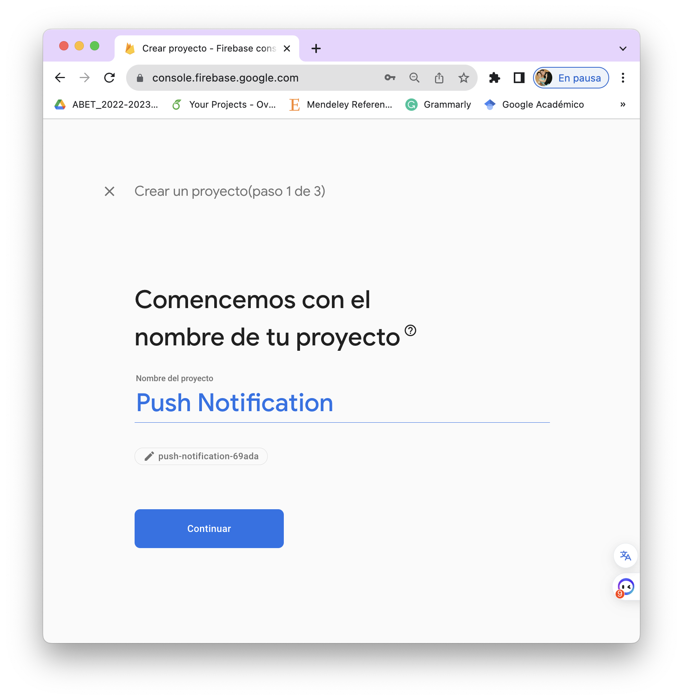
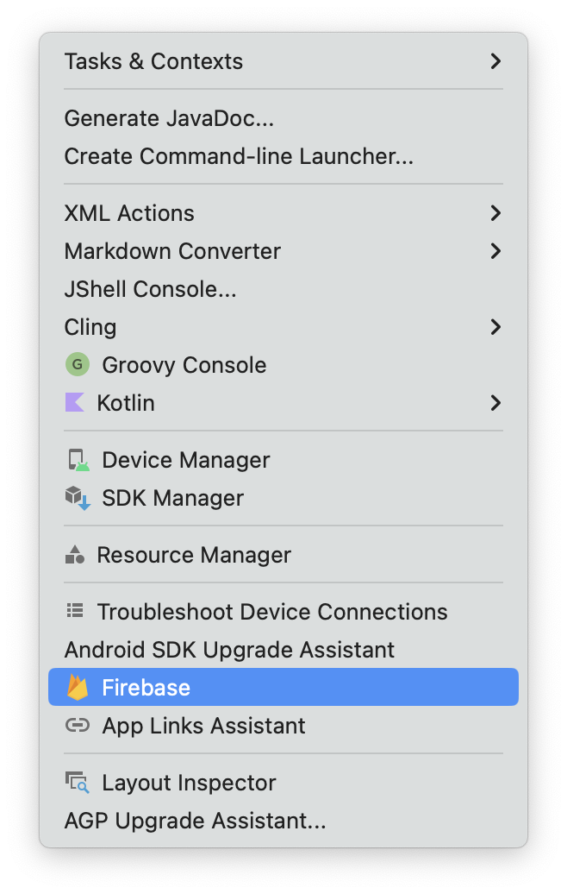

[Regresar](/Aplicaciones-Moviles-y-Servicios-Telematicos/)

# Práctica de Laboratorio 7
## DESARROLLO DE APLICACIÓN MÓVIL AVANZADA USANDO NOTIFICACIONES EN TIEMPO REAL

**Objetivo de Aprendizaje:** Diseñar aplicaciones que utilicen los sensores embebidos en dispositivos móviles para la entrega de información a los usuarios en tiempo real.

**Recursos:** Android Studio. Google Cloud.

**Duración:** 6 horas

**Introducción:**
Creación de una aplicación móvil capaz ejecutar hilos (runnables) para el seguimiento en soft-real time de los registros en una REST-API. Configuración de la aplicación móvil para recibir notificaciones mediante el servicio firebase cloud messaging.


**Actividades**
 
1)	Crear un proyecto en blanco con actividad vacía.  
El nombre del paquete será: 
- com.amst.grupo(número del grupo). Ejemplo: com.amst.grupo2. El nombre del proyecto será el número de grupo.
 
2)	Creamos una actividad vacía con el nombre de Registros, donde presentaremos la información. En la carpeta app > java > com.amst.grupo# damos clic derecho: New > Activity > Empty Activity.
 
3)	Creamos un menú sencillo para acceder a la actividad que acabamos de crear. 
Modificamos el archivo (res > layout > activity_main.xml) para agregar un título y un botón. 

```
<?xml version="1.0" encoding="utf-8"?>
<LinearLayout xmlns:android="http://schemas.android.com/apk/res/android"
    xmlns:app="http://schemas.android.com/apk/res-auto"
    xmlns:tools="http://schemas.android.com/tools"
    android:layout_width="match_parent"
    android:layout_height="match_parent"
    android:orientation="vertical"
    tools:context=".MainActivity">

    <TextView
        android:id="@+id/textView"
        android:layout_width="match_parent"
        android:layout_height="104dp"
        android:gravity="center"
        android:text="Recarga en tiempo real"
        android:textSize="30sp"/>

    <Button
        android:id="@+id/button"
        android:layout_width="match_parent"
        android:layout_height="wrap_content"
        android:onClick="abrirVistaRegistros"
        android:text="Bar Chart" />

</LinearLayout>
```

4)	Dentro de MainActivity.class creamos la función abrirVistaRegistros() para movernos entre vistas 

public void abrirVistaRegistros(View view) {
    Intent intent = new Intent(this, Registros.class);
    startActivity(intent);
}

5) Para la actividad registros, dentro de (res > layout > activity_registros.xml), agregamos un gráfico de barras y una lista para mostrar la información desde REST API. La declaración del gráfico de barras saldrá en error hasta que se agreguen las dependencias.

```
<?xml version="1.0" encoding="utf-8"?>
<androidx.constraintlayout.widget.ConstraintLayout xmlns:android="http://schemas.android.com/apk/res/android"
    xmlns:app="http://schemas.android.com/apk/res-auto"
    xmlns:tools="http://schemas.android.com/tools"
    android:layout_width="match_parent"
    android:layout_height="match_parent"
    tools:context=".Registros">

    <ScrollView xmlns:android="http://schemas.android.com/apk/res/android"
        android:layout_width="fill_parent"
        android:layout_height="fill_parent"
        android:fillViewport="true"
        android:scrollbars = "vertical"
        android:scrollbarStyle="insideInset">

        <LinearLayout
            android:layout_width="fill_parent"
            android:layout_height="fill_parent"
            android:orientation="vertical"
            android:padding="10dp"
            android:id="@+id/contenedor">

            <com.github.mikephil.charting.charts.BarChart
                android:id="@+id/barChart"
                android:layout_width="match_parent"
                android:layout_height="400dp">
            </com.github.mikephil.charting.charts.BarChart>

            <TextView
                android:id="@+id/textView2"
                android:layout_width="match_parent"
                android:layout_height="wrap_content"
                android:text="Registros de temperatura"
                android:textSize="24sp"
                android:textStyle="bold"/>

            <LinearLayout
                android:layout_width="match_parent"
                android:layout_height="wrap_content"
                android:orientation="horizontal">

                <TextView
                    android:id="@+id/textView3"
                    android:layout_width="wrap_content"
                    android:layout_height="wrap_content"
                    android:layout_weight="1"
                    android:background="#635D5D"
                    android:text="Fecha obtenida"
                    android:textColor="#FFFFFF"
                    android:textStyle="bold"/>

                <TextView
                    android:id="@+id/textView5"
                    android:layout_width="wrap_content"
                    android:layout_height="wrap_content"
                    android:layout_weight="1"
                    android:background="#635D5D"
                    android:text="Valor"
                    android:textColor="#FFFFFF"
                    android:textStyle="bold"/>
            </LinearLayout>

            <LinearLayout
                android:id="@+id/cont_temperaturas"
                android:layout_width="match_parent"
                android:layout_height="match_parent"
                android:orientation="vertical" >
            </LinearLayout>
        </LinearLayout>
    </ScrollView>

</androidx.constraintlayout.widget.ConstraintLayout>
```

6)	Agregar las dependencias Volley (para realizar http Request) y MAndroid (para cuadros 
estadísticos). Las dependencias se encuentran en build.gradle (Module:app).  

```
dependencies {
    implementation 'com.android.volley:volley:1.2.1'
    implementation 'com.github.PhilJay:MPAndroidChart:v3.1.0'
}
```

7)	Agregar los repositorios de MPandroid en settings.gradle (Project Settings).
***Nota: Luego de modificar el grandle siempre es necesario dar clic en Sync Now en la esquina superior derecha de la pantalla.***
 
```
dependencyResolutionManagement {
    repositoriesMode.set(RepositoriesMode.FAIL_ON_PROJECT_REPOS)
    repositories {
        google()
        mavenCentral()
        maven { url 'https://jitpack.io' }
    }
}
```

8)	Permitirle acceso a internet, incluyendo en el archivo (app > Manifest > AndroidManifest.xml). 

```
<?xml version="1.0" encoding="utf-8"?>
<manifest xmlns:android="http://schemas.android.com/apk/res/android"
    xmlns:tools="http://schemas.android.com/tools">

    <uses-permission android:name="android.permission.INTERNET"/>

    <application
        android:allowBackup="true"
        android:dataExtractionRules="@xml/data_extraction_rules"
        android:fullBackupContent="@xml/backup_rules"
        android:icon="@mipmap/ic_launcher"
        android:label="@string/app_name"
        android:roundIcon="@mipmap/ic_launcher_round"
        android:supportsRtl="true"
        android:theme="@style/Theme.AppCloudMessaging"
        tools:targetApi="31">
```
 
9)	Actualizar información en el archivo Registros.
 
Estructura del archivo (Nota: Deberá importar las librerías para widgets, estructuras y librerías. Si presenta algún problema puede utilizar el comando Ctrl + Alt). Recuerde generar un nuevo token. 

```
public class Registros extends AppCompatActivity {

    public BarChart graficoBarras;
    private RequestQueue ListaRequest = null;
    private LinearLayout contenedorTemperaturas;
    private Map<String, TextView> temperaturasTVs;
    private Map<String, TextView> fechasTVs;
    private Registros contexto;
    
    @Override
    protected void onCreate(Bundle savedInstanceState) {
 
    }

    public void iniciarGrafico() {}

    public void solicitarTemperaturas(){}

    private void mostrarTemperaturas(JSONArray temperaturas){ }

    private void actualizarGrafico(JSONArray temperaturas){ }

    private void llenarGrafico(ArrayList<BarEntry> dato_temp){}
}
```

- En la función onCreate la cual se ejecuta al momento de iniciar la actividad. Se encarga en iniciar las variables a utilizar y ejecutar las demás funciones. 
***Recomendación: onCreate es la función que debe tener la menor cantidad de código, únicamente usada para iniciar variables y llamar las otras funciones. No se inserta lógica.*** 

```
 @Override
protected void onCreate(Bundle savedInstanceState) {     
    super.onCreate(savedInstanceState);
    setContentView(R.layout.activity_registros);
    setTitle("Grafico de barras");
    temperaturasTVs = new HashMap<String,TextView>();     
    fechasTVs = new HashMap<String,TextView>();     
    ListaRequest = Volley.newRequestQueue(this);     
    contexto = this;
    /* GRAFICO */     
    this.iniciarGrafico();     
    this.solicitarTemperaturas(); 
}
```
 
- La función IniciarGrafico() obtiene el grafico desde la vista (layout) y coloca las propiedades de inicio. Propiedades como: tamaño, descripción, animaciones, títulos colocados en esta función. (Estas propiedades son finales y no cambian por ninguna condición.) 

```
public void iniciarGrafico() {
    graficoBarras = findViewById(R.id.barChart);     
    graficoBarras.getDescription().setEnabled(false);     
    graficoBarras.setMaxVisibleValueCount(60);     
    graficoBarras.setPinchZoom(false);     
    graficoBarras.setDrawBarShadow(false);     
    graficoBarras.setDrawGridBackground(false);
    XAxis xAxis = graficoBarras.getXAxis();     
    xAxis.setPosition(XAxis.XAxisPosition.BOTTOM);     
    xAxis.setDrawGridLines(false);
    graficoBarras.getAxisLeft().setDrawGridLines(false);     
    graficoBarras.animateY(1500);     
    graficoBarras.getLegend().setEnabled(false);
}
```

- La función solicitarTemperaturas() se encarga de llamar al RESTAPI obtener la información solicitada. En este caso estamos accediendo a la tabla logTres donde se encuentran datos de temperatura y velocidad. Esta funcion llama otras dos funciones: mostrarTemperatura() y actualizar grafico().

```
public void solicitarTemperaturas(){
    String url_registros = " https://amst-lab-api.herokuapp.com/api/lecturas";
    JsonArrayRequest requestRegistros = new JsonArrayRequest( Request.Method.GET, url_registros, null,
            response -> {
        mostrarTemperaturas(response);
                actualizarGrafico(response);
            }, error -> System.out.println(error)
    );
    ListaRequest.add(requestRegistros);
}
```
 
- La función mostrarTemperaturas() obtiene la información obtenida de la tabla logTres. Se encarga de filtrar los datos de temperatura y actualizarlos para mostrarlos en una lista al usuario. 

```
private void mostrarTemperaturas(JSONArray temperaturas){
    String registroId;
    JSONObject registroTemp;
    LinearLayout nuevoRegistro;
    TextView fechaRegistro;
    TextView valorRegistro;
    String fecharegistro_text;
    String registrovalue_text;

    contenedorTemperaturas = findViewById(R.id.cont_temperaturas);
    LinearLayout.LayoutParams parametrosLayout = new LinearLayout.LayoutParams(
            LinearLayout.LayoutParams.WRAP_CONTENT,
            LinearLayout.LayoutParams.WRAP_CONTENT, 1);
    try {
        for (int i = 0; i < temperaturas.length(); i++) {
            registroTemp =temperaturas.getJSONObject(i);
            registroId = registroTemp.getString("id");

            if (android.os.Build.VERSION.SDK_INT >= android.os.Build.VERSION_CODES.O) {
                        ZonedDateTime zonedDateTime = OffsetDateTime.parse(registroTemp.getString("date_created")).toZonedDateTime();
                        DateTimeFormatter formatter = DateTimeFormatter.ofPattern("yyyy-MM-dd HH:mm:ss");
                        fecharegistro_text = String.valueOf(zonedDateTime.format(formatter));
                    } else {
                        fecharegistro_text = registroTemp.getString("date_created");
                    }

                registrovalue_text = registroTemp.getString("value");
                if( temperaturasTVs.containsKey(registroId) && fechasTVs.containsKey(registroId) ){

                    fechaRegistro = fechasTVs.get(registroId);
                    valorRegistro = temperaturasTVs.get(registroId);

                    fechaRegistro.setText(fecharegistro_text);
                    valorRegistro.setText(registrovalue_text + " °C");

                } else {

                    nuevoRegistro = new LinearLayout(this);
                    nuevoRegistro.setOrientation(LinearLayout.HORIZONTAL);

                    fechaRegistro = new TextView(this);
                    fechaRegistro.setLayoutParams(parametrosLayout);
                    fechaRegistro.setText(fecharegistro_text);
                    nuevoRegistro.addView(fechaRegistro);

                    valorRegistro = new TextView(this);
                    valorRegistro.setLayoutParams(parametrosLayout);
                    valorRegistro.setText(registrovalue_text + " °C");
                    nuevoRegistro.addView(valorRegistro);
                    contenedorTemperaturas.addView(nuevoRegistro);
                    fechasTVs.put(registroId, fechaRegistro);
                    temperaturasTVs.put(registroId, valorRegistro);
                }
            }
    } catch (JSONException e) {
        e.printStackTrace();
        System.out.println("error");
    }
}
```

- La función actualizarGrafico() actualiza obtiene los datos de temperaturas para actualizar el grafico en el app. Llamamos a la función llenarGrafico() ingresando el nuevo dato obtenido. 
 
```
private void actualizarGrafico(JSONArray temperaturas){
    JSONObject registro_temp;
    String temp;
    String date;
    int count = 1;
    float temp_val;
    ArrayList<BarEntry> dato_temp = new ArrayList<>();
    try {
        for (int i = 0; i < temperaturas.length(); i++) {

            registro_temp =temperaturas.getJSONObject(i);
            if( registro_temp.getString("key").equals("temperatura")){
                temp =  registro_temp.getString("value");
                date =  registro_temp.getString("date_created");
                temp_val = Float.parseFloat(temp);
                dato_temp.add(new BarEntry(count, temp_val));
                count++;
            }
        }
    } catch (JSONException e) {
        e.printStackTrace();
        System.out.println("error");
    }
    llenarGrafico(dato_temp);
}
```
 
- En la función llenarGrafico() ocurrirá el Live Reload. Durante llenarGrafico() actualizaremos el grafico actual con el nuevo dato encontrado. Pero también ejecutaremos un Hilo (como Runnable) para ejecutar una acción de fondo, donde se volverá a buscar un nuevo dato (si es que este existe) al llamar nuevamente a la función solicitarTemperautra() iniciando el ciclo. 

```
private void llenarGrafico(ArrayList<BarEntry> dato_temp){
    BarDataSet temperaturasDataSet;
    if ( graficoBarras.getData() != null &&
            graficoBarras.getData().getDataSetCount() > 0) {
        temperaturasDataSet = (BarDataSet) graficoBarras.getData().getDataSetByIndex(0);
        temperaturasDataSet.setValues(dato_temp);
        graficoBarras.getData().notifyDataChanged();
        graficoBarras.notifyDataSetChanged();
    } else {
        temperaturasDataSet = new BarDataSet(dato_temp, "Data Set");
        temperaturasDataSet.setColors(ColorTemplate.VORDIPLOM_COLORS);
        temperaturasDataSet.setDrawValues(true);
        ArrayList<IBarDataSet> dataSets = new ArrayList<>();
        dataSets.add(temperaturasDataSet);
        BarData data = new BarData(dataSets);
        graficoBarras.setData(data);
        graficoBarras.setFitBars(true);
    }
    graficoBarras.invalidate();

    new Handler(Looper.getMainLooper()).postDelayed(() -> solicitarTemperaturas(), 3000);
}
```

- **Pantalla de Gráfico de Barras:**

<p align="center">
  
</p>
  

## Configuración: FIREBASE CLOUD MESSAGING (FCM)
- Firebase de Google brinda servicios gratuitos y de pago para aplicaciones moviles/web/iot. Durante este taller utilizaremos uno de sus servicios: Firebase cloud messaging, el cual nos permite realizar push notifications. 
 
- Push notifications: Igual que las notificaciones comunes de cualquier aplicación, estas muestran un evento que ocurre en la aplicación. Utilizadas por whatsapp para indicar cuando ha llegado un mensaje, o por Facebook para notificar el cumpleaños de un amigo. Push notifications se caracterizan por ser realizados del lado del servidor, el cliente / dueño del teléfono no ejecuta la acción sino es dueño del servidor o el cual requiere comunicar un evento a sus clientes. 
 
- Ejemplo: un dispositivo IOT detecta altos niveles de humedad en un cuarto, con fin de alertar al cliente, envía una notificación a su teléfono (El teléfono puede estar bloqueado y sin que la aplicación este abierta, llegara un mensaje en forma de notificación).
 
1) Creación de un proyecto de google 
- Para esta práctica se trabajará en un proyecto de Google, el cual debe ser creado por cada grupo. Deben indicar una cuenta Gmail que manejen para que se puedan agregar como colaboradores. El líder del grupo debe crear un nuevo proyecto en la consola de firebase. Para eso hará click en la consola y el botón agregar proyecto.

<p align="center">
  
</p>

<p align="center">
  
</p>
 
- De esta manera, aparecerá un formulario donde se llenarán los datos de acuerdo con la aplicación, habilitar google analitycs. 

<p align="center">
  
</p>
 
- El líder del grupo debe agregar a sus demás compañeros para realizar. Para eso va a la sección de configuración – usuarios y permisos.

<p align="center">
  
</p>
 
- Una vez agregados los usuarios, deben aceptar las invitaciones en sus correos Gmail. Dar clic en la invitación al proyecto de Firebase **Push Notification**, en el botón Open Firebase Console.

<p align="center">
  
</p>

***NOTA: Adicional, agregar el correo de la materia como visualizador.
Correo: amst.investigacion@gmail.com***

## Para usar Push Notifications es necesario configurar nuestra aplicación en Android Studio
 
1)	Dentro de nuestro proyecto en Android Studio, seleccionamos en la barra de menú > Tools > Firebase.

<p align="center">
  
</p>

2)	Del lado derecho, aparecerán todos los servicios que proporciona Firebase, por ahora seleccionaremos la opción Cloud Messaging > Set up Firebase Cloud Messaging.

<p align="center">
  
</p>
  
3.	Damos clic en el primer paso > Connect your app to Firebase.

<p align="center">
  
</p>

4.	Luego se abrirá un browser en el navegador de la consola de Google pidiendo que acepten los términos y condiciones, lanzando la conexión en el puerto 55253.
 
5.	Seleccionamos el proyecto creado y damos clic en CONECTAR:

<p align="center">
  
</p>
 
 
6.	Seleccionamos la opción de Add FCM to your App y luego damos clic en Accept Changes. (*) Esto agregará a nuestro Grandle las dependencias necesarias para usar el servicio.

<p align="center">
  
</p>


## Creando un servicio 
 
1)	En la carpeta app > java > com.amst.grupo# deberá crear un package (click derecho > new > Package) el cual llamaremos Services.

<p align="center">
  
</p>
 
2)	Dentro del paquete, crearemos una clase Java. Dar clic derecho > new > Java Class, la cual llamaremos MyFirebaseInstanceService.

<p align="center">
  
</p>
  
3)	Registramos el servicio en el AndroidManifest.xml

```
    </activity>
    <service 
    android:name="Services.MyFirebaseInstanceService">
        <intent-filter>
            <action android:name="com.google.firebase.MESSAGING_EVENT" />
        </intent-filter>
    </service>
</application>
```
 
4)	Modificamos MyFirebaseInstanceService.java para manejar el servicio.

```
public class MyFirebaseInstanceService extends FirebaseMessagingService {
    //Ctrl + O
    @Override
    public void onNewToken(String s) {
        super.onNewToken(s);
        Log.d("TOKENFIREBASE", s);
    }
    @Override
    public void onMessageReceived(RemoteMessage remoteMessage) {}
    private void showNotification(String title, String body){ }
}
```
 
- La función **onMessageRecieve** se encarga en manejar el evento cuando se ha enviado una notificación al teléfono. Esta funcion llama a showNotificacions() para finalmente mostrarla al usuario.

```
public void onMessageReceived(RemoteMessage remoteMessage) {     
    super.onMessageReceived(remoteMessage);
    showNotification(remoteMessage.getNotification().getTitle(),             
            remoteMessage.getNotification().getBody()); 
}
```

- La función **showNotifications** utiliza la librería de notifications para ejecutar una notificacion simple. Aqui se pueden instanciar propiedades como uso del led, vibraciones, iconos, etc. 

```
private void showNotification(String title, String body){
    NotificationManager notificationManager =
            (NotificationManager) getSystemService(Context.NOTIFICATION_SERVICE);
    String NOTIFICATION_CHANNEL_ID = "com.amst.firebasenotify.test";

    if(Build.VERSION.SDK_INT >= Build.VERSION_CODES.O){ 
        NotificationChannel notificationChannel =
            new NotificationChannel(NOTIFICATION_CHANNEL_ID, "Notification",                 
                    NotificationManager.IMPORTANCE_DEFAULT);         
        notificationChannel.setDescription("EDMT Channel");         
        notificationChannel.enableLights(true);         notificationChannel.setLightColor(Color.BLUE);
        notificationChannel.setVibrationPattern(new long[]{0, 1000, 500, 1000});         
        notificationManager.createNotificationChannel(notificationChannel);

    }

    NotificationCompat.Builder notificationBuilder =
            new NotificationCompat.Builder(this, NOTIFICATION_CHANNEL_ID);     
    notificationBuilder.setAutoCancel(true).setDefaults(Notification.DEFAULT_ALL)
            .setWhen(System.currentTimeMillis())
            .setContentTitle(title)
            .setContentText(body)
            .setContentInfo("info");

    notificationManager.notify(
            new Random().nextInt(), notificationBuilder.build());
}
```
 
 
## Descargar y usar la librería de Google services 
 
Nota: Realizar estos pasos si no encuentra el archivo google-services-json en el src de su proyecto.
Para cada aplicacion, es requerido una librería única de Google con las claves generadas automáticamente. Debemos agregar este archivo a nuestra aplicacion para que nuestro servicio pueda funcionar.  
 
1) Obtener el archivo Google-services.json. 
a.	Dentro de https://console.firebase.google.com/ deben encontrase los proyectos en los cuales esta trabajando. Selecciona el proyecto compartido con usted. 
 
 
b.	En el dashboard inicial del proyecto, damos clic en las aplicaciones y buscamos nuestra aplicación.

<p align="center">
  
</p>
 

c. Damos clic en el símbolo de Setting para ver las instrucciones del SDK.

<p align="center">
  
</p>

d.	Descargamos el archivo ***google-services.json.*** y lo agregamos en la vista de Proyecto.  En la ruta de la carpeta app > src.

f.	Podemos salir (dando clic en la X en el lado superior izquierdo). Los otros pasos ya los hemos realizado  
 
 
## Enviar una notificación de prueba 
Utilizamos la consola de firebase para enviar una [notificación](https://console.firebase.google.com).
 
1)	En el menú del lado izquierdo, seleccionamos el grupo Participación > Cloud messeging 
 
<p align="center">
  
</p>
 
2)	Si es necesario, damos clic en Crear la primera campaña.

<p align="center">
  
</p>

3) Seleccionamos tipos de mensaje y plataforma, y luego dar clic en Crear.

<p align="center">
  
</p>
 
4)	Aparecerá el formulario para ingresar una nueva notificación. Llenar título y cuerpo según convenga, también se puede enviar una imagen, y asignarle un nombre. Damos clic en Siguiente.

<p align="center">
  
</p>

5)	En orientación, seleccionamos nuestra aplicación y damos clic en siguiente.

<p align="center">
  
</p>
  
6.	En programación, dejamos Ahora para que se envíe de forma inmediata, luega damos clic en Revisar.

<p align="center">
  
</p>

7.	Revisamos los campos de la notificación, y damos clic en Publicar. 

 <p align="center">
  
</p>
  
 
**Pantalla con la notificación en tiempo real:**

  

 
**Investigación**
 
•	¿Cuál es la diferencia entre Soft Real time y Hard Real time?. 
•	En el dashboard, actualizamos una lista y un grafico donde presentamos las temperaturas. ¿Qué otros componentes podemos actualizar (como tablas, edittexts, etc)? 
•	Las apps de juegos utilizan hilos para el manejo de componentes (personaje, escenario, música), ¿Que otro tipo de aplicaciones (redes sociales, filtros de fotos, etc) utiliza hilos y con qué objetivo? 
•	¿Qué otros servicios de Firebase podrían ser útil para el desarrollo de dispositivos IOT y como los usaría? 
•	Durante el taller creamos un package Servicios, donde alojamos el servicio de could messaging. ¿Que otro servicio (no de Firebase) podemos utilizar en las aplicaciones móviles? 
	• 	 
 
**Desafío** 
1.	En el laboratorio:
Agregar una opción en la misma actividad o actividad nueva en la que se pueda eliminar o agregar una temperatura (DELETE y POST) para que puedan observar cómo se actualiza en tiempo real.
Pista: utilizar postman para saber cómo realizar los requerimientos, la url para DELETE es:
 https://amst-lab-api.herokuapp.com/api/lecturas/ID
Donde ID es el objeto al que hace referencia.
Para POST y GET se utiliza:
https://amst-lab-api.herokuapp.com/api/lecturas

Ninguna requiere autenticación.
Ejemplo de estructura JSON para el POST:
	{				
    "key":"temperatura",	
    "value": 60.10		
}				

2.	En su proyecto: 
2.1)	Implemente un hilo runable para la actualización automática del dashboard principal. 
2.2)	Configure su proyecto para poder recibir notificaciones via Firebase 
 
 
### **Formato de la práctica**
La práctica de laboratorio será desarrollado en el siguiente formato:

- Nombre del archivo: AMST_Práctica de Laboratorio A_Grupo B_Apellido1_Apellido2_Apellido3

- (*) Siendo A el número de la práctica y B el número del grupo
- Nombre de la materia
- Título de la práctica: Ejemplo: Trabajo Autónomo A - Tema
- Nombre de la profesora
- Número de grupo
- Nombres/Apellidos de los integrantes del grupo que hayan desarrollado el trabajo
- Fecha de inicio y fin del trabajo
- Resultados de las actividades planteadas: 
- Explicación de las actividades ejecutadas, incluyendo las imágenes del proceso. Además, incluir el enlace del repositorio del proyecto en Github y el archivo ejecutable (apk) de la aplicación móvil.
- Conclusiones y Recomendaciones: Respecto a lo aprendido durante el desarrollo del trabajo.
- Referencias bibliográficas: Colocar los documentos, enlaces web o libros consultados.