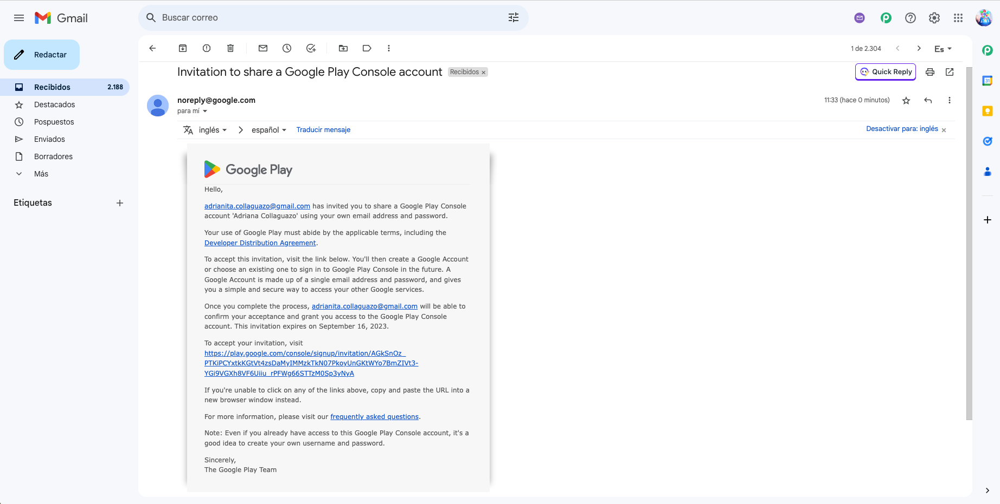
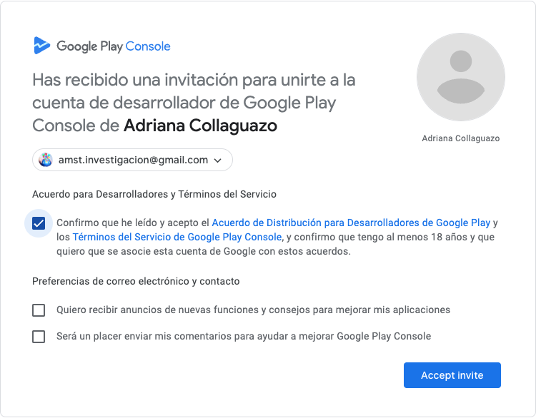
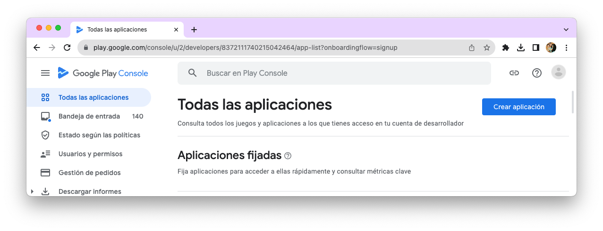
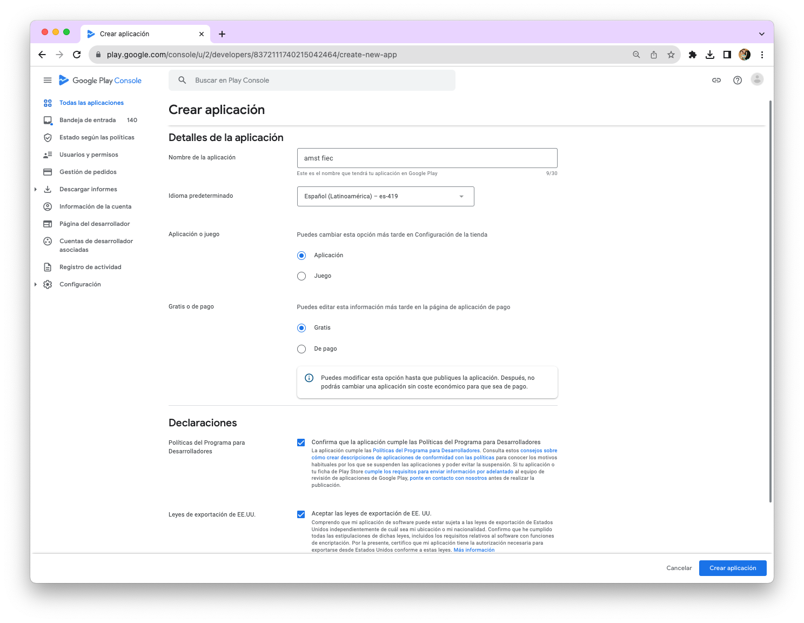

[Regresar](/Aplicaciones-Moviles-y-Servicios-Telematicos/)

# Práctica de Laboratorio 8
## PUBLICACIÓN DE UNA APLICACIÓN MÓVIL AVANZADAS EN GOOGLE PLAY STORE
 
**Objetivo de Aprendizaje:** Objetivo de Aprendizaje: Describir las características de sistemas telemáticos contemporáneos mediante la identificación de funcionalidades basadas en red.
Recursos: Android Studio. Google Play.
Duración: 3 horas

**Instrucciones:**
Para que la publicación de la aplicación desarrollada en Android o Flutter este disponible a los usuarios, se realizan dos tareas:
- Prepara la aplicación para su lanzamiento.
- Lanzamiento de la aplicación a los usuarios.

**Actividades:**
## Paso 1: Publicar de aplicación en el PlayStore

1.	[Informativo] La cuenta de desarrollador de Google cuesta $25, es un solo pago por cuenta google, esto fue realizado por la profesora del Itinerario de Aplicaciones móviles y servicios telemáticos. [https://play.google.com/apps/publish/signup/].
(*) Para esta práctica utilizar su cuenta de Gmail que se encuentra asociada a la cuenta adrianita.collaguazo@gmail.com. Para ello, a los líderes de cada grupo del proyecto, les envíe la invitación al correo proporcionado.

  

 
2.	Dar clic en el enlace que se encuentra en el correo de invitación para aceptar la invitación, como se muestra en la siguiente imagen.

  

3.	Dentro de la consola para desarrolladores, seleccionamos “Crear aplicación”.

  

 
4.	Creamos una aplicación. Seleccionamos el idioma, configuración básica y el nombre como ejemplo usaré **amst fiec**. En su caso utilizar el nombre de la aplicación de su proyecto. Colocar como tipo Aplicación y Gratis. Aceptamos todas las políticas necesarias. Damos clic en Crear Aplicación.

  

 
## Paso 2: Preparamos nuestra aplicación en modo de producción

1.	Removemos cualquier log o función de desarrollo (Ej: System.out.println  o    log.cat())
2.	Dentro del archivo MANIFEST, remover (Si no se ha removido automaticamente):
(propiedad) android:debuggable

3.	Dentro de MANIFEST, agregamos la versión del código a lanzar a producción, en este caso primera versión.
Version code, debe ser un número que automáticamente aumenta. Mientras que Version name, es el nombre que le damos a la versión lanzada y se muestra al usuario.
android:versionCode="1"
android:versionName="1.0"

4.	Generamos un APP bundle listo para subir (Este debe ser firmado para autenticar a su o sus desarrolladores). Damos clic en Build > Generate Signed Bundle
 

 

5.	Seleccionamos > Crear una nueva llave. Creamos una contraseña única y llenamos el resto de la información que nos solicita crear una clave (Ubicación, organización y nombres). Damos click en ok.
 
 
 

6.	Damos click en next, y luego nos pedirá seleccionar la ubicación de la app bundle y el variante de construcción donde indicaremos si es una versión de prueba o de producción. (Seleccionamos reléase por ser una versión de producción). Seleccionamos firmar v1. Damos click en finish.
 

7.	Al dar click en finish, se generara un .aap ubicado en [Carpeta del proyecto] > releases > 

 Información requerida por Google play

 

Audiencia objetivo
Del panel de control dar click en Audiencia objetivo y llenar el formulario presentado. Una vez finalizado, dar click a guardar.
 
Anuncios y aplicaciones de noticias
Regresar al panel de control y dar click en Anuncios para configurar el contenido y luego en guardar.
 
Realizar lo mismo con Aplicaciones de noticias
 
Versiones de la aplicación

Del menú lateral ir a la opción de producción y colocar en Crear nueva versión
 
En App bundles subir la app bundle (.aab) recién creada.
 
 
Detallar la versión. Dar click en guardar

 
Ficha de Google Play
Regresamos al panel de control y dar click en ficha de Google Play o en el menú lateral dirigirse a la opción de crecimiento > Presencia en Google Play > Ficha de Play Store principal
 
Aparecerá el título de la APP, agregamos una descripción corta y otra completa sobre el funcionamiento de la aplicación.
 
Agregamos las imágenes correspondientes en medidas específicas: 
•	Icono de la aplicación: 512 x 512 px 
•	Capturas de pantalla del teléfono: mínimo 380 px laterales 
•	Gráfico de funciones (Imagen destacada): 1024 x 500 px 
No es necesario llenar todas las imágenes, solo las requeridas arriba. Dar click en guardar
  
Configuración de la tienda
En el panel de control, dar click a seleccionar categoría de la aplicación o en el menú lateral ir a crecimiento > Configuración de la tienda. Llenar el formulario seleccionando la categoría e ingresando datos de contacto. Dar click a guardar.
 
 
 

Clasificación de contenido

En el menú izquierdo, se requiere seguir las tareas de políticas y llenar el formulario de clasificación de contenido.
 
Dar click a empezar el formulario.
 

Llenar el formulario, indicando el tipo de contenido que tiene la aplicación.

 
 
 

 
Una vez finalizado se activará el botón enviar.
Lanzar a producción

Una vez cumplidos los requisitos de producción nos dirigimos a la pestaña Lanzar > Producción > Países y regiones. Añadir los países donde se quiera publicar la aplicación.
  
 
Ahora dar click en editar versión
 

Damos clic en: Revisar versión
 
Finalmente, ya estará disponible para publicar nuestra app. En caso de haber algún error, la opción aparecerá en gris.

 
 

Finalmente nuestra aplicación, aparecerá en producción y disponible en el PlayStore: 
 

La aplicación entrará en proceso de revisión por Google para conocer que no existan errores o riegos para el usuario.
 

FORMATO DEL TRABAJO

El trabajo autónomo será desarrollado en el siguiente formato:

	Nombre del archivo: AMST_P01_Práctica de Laboratorio A_Grupo B_Apellido1_Apellido2_Apellido3
	(*) Siendo A el número de la práctica y B el número del grupo
	Nombre de la materia y paralelo 1
	Título del trabajo: Ejemplo: Práctica de Laboratorio A - Tema
	Nombre de la profesora
	Número de grupo
	Nombres/Apellidos de los integrantes del grupo que hayan desarrollado el trabajo
	Fecha de inicio y fin del trabajo
	Resultados de las actividades planteadas: Por esta actividad solamente se entregarán capturas de pantallas como evidencia y un resumen de la actividad.
