[Regresar](/Aplicaciones-Moviles-y-Servicios-Telematicos/)

# Práctica de Laboratorio 2
## DESARROLLO DE UNA APLICACIÓN MÓVIL CON INTEGRACIÓN DE BASE DE DATOS EXTERNA EN GOOGLE

## 🎯 Objetivo de Aprendizaje
Demostrar el acceso a los recursos en red para la programación de aplicaciones móviles avanzadas.

**Recursos:**
Android Studio, Google Cloud, FireBase.

**Duración:**
 7 horas


**Instrucciones**
- Crear una aplicación móvil que interactúe con una base de datos no relacional durante el desarrollo de la aplicación móvil.

**Actividades**

### **Paso 1:** Integra el servicio de FireBase a tu aplicación de Android Studio. (15 puntos)

1.	Crea un proyecto en Android Studio nombrado ***appAMST_labA_firebase*** donde A será el número de laboratorio.

-	Asegúrese de que su Minimum API level sea API 16 (Jelly Bean) o mayor.

-	Para este curso, el lenguaje a utilizar será JAVA.

-	No marcar “Use legacy android.support libraries”.


<p align="center">
  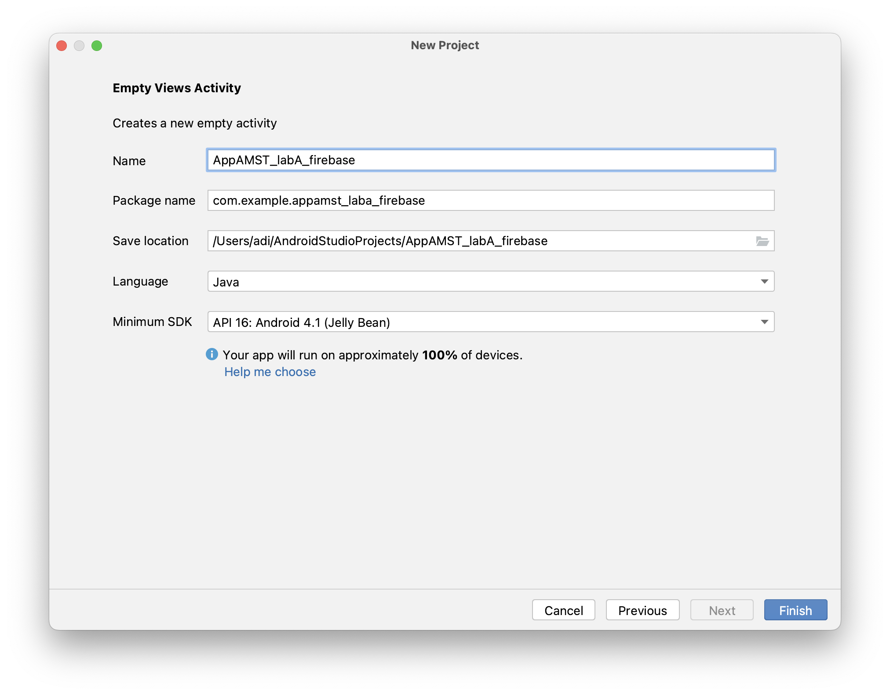
</p>

2.	Acceder a la [consola de FireBase](https://console.firebase.google.com/) usando una cuenta de gmail o de FIEC. Luego selecciona ***Crear un nuevo proyecto*** en que se mostrará el siguiente proceso.

<p align="center">
  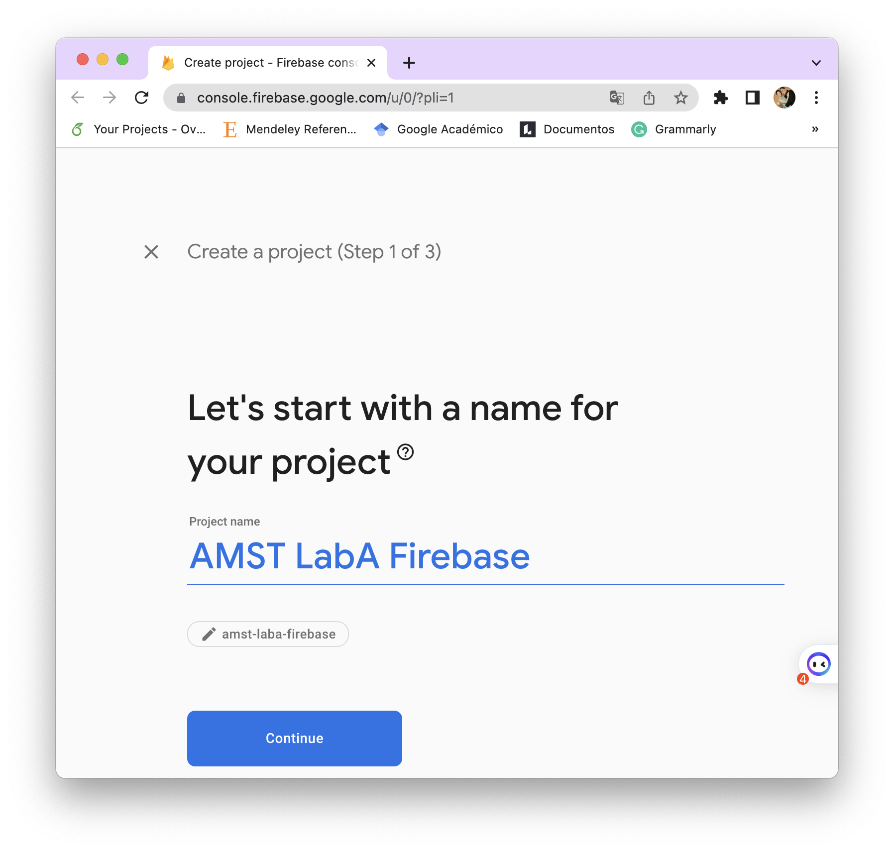
</p>

<p align="center">
  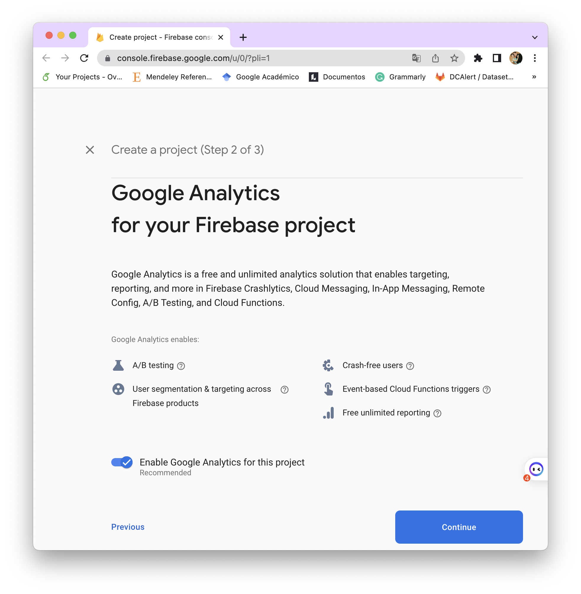
</p>

<p align="center">
  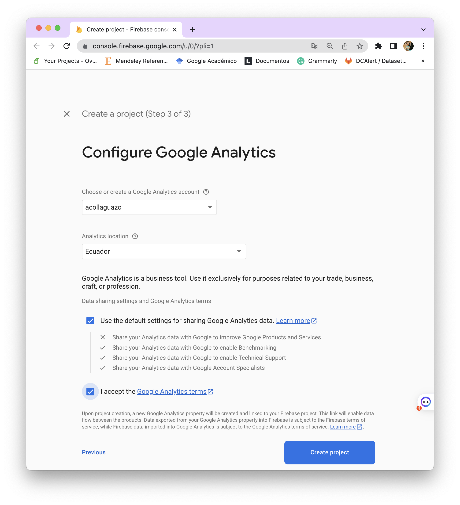
</p>

<p align="center">
  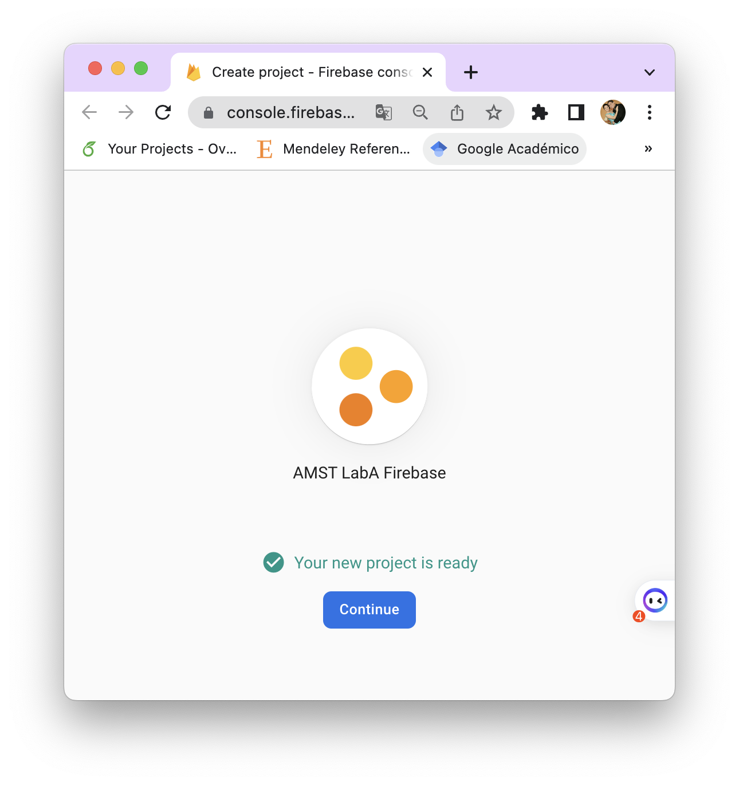
</p>

3.	Dentro del proyecto de FireBase creado recientemente, añadimos nuestra aplicación de Android en la consola, dando clic al icono de Android Studio.  

<p align="center">
  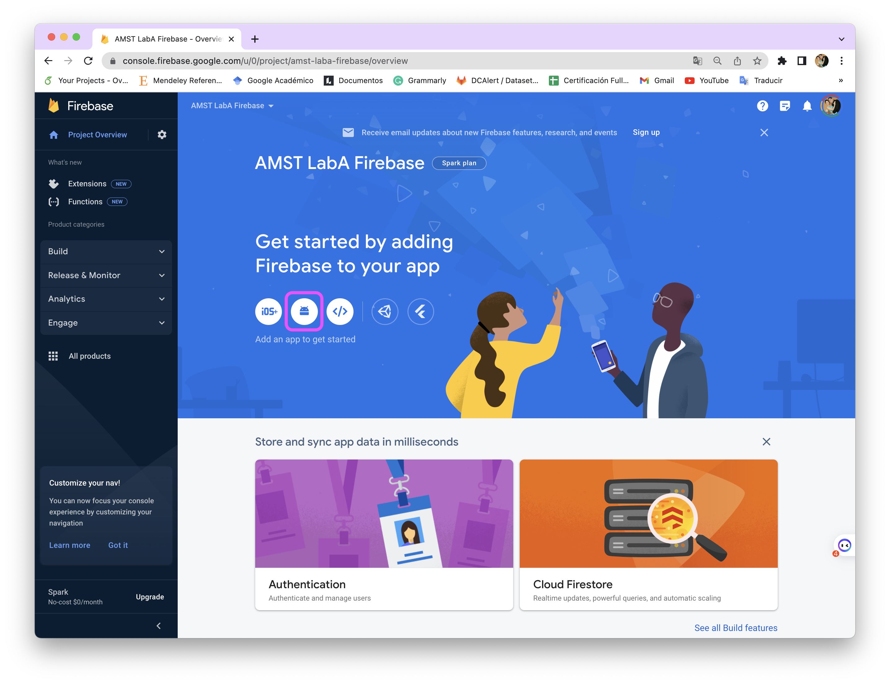
</p>

***En caso de que ya existan proyectos en el repositorio de Firebase, hacer clic en el siguiente botón de Agregar app:***

<p align="center">
  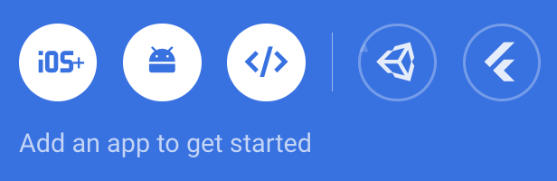
</p>

4.	Para completar los datos de la sección de Añadir Firebase a tu aplicación de Android, en Android Studio puedes encontrar el nombre del paquete de Android en el archivo de **build.gradde (module:app)** en la variable applicationId.

```
android {
    namespace 'com.example.appamst_laba_firebase'
    compileSdk 33

    defaultConfig {
        applicationId "com.example.appamst_laba_firebase"
        minSdk 16
        targetSdk 33
        versionCode 1
        versionName "1.0"
        testInstrumentationRunner "androidx.test.runner.AndroidJUnitRunner"
    }
}
```

5.	En app > manifests > AndroidManifest.xml dar permisos de acceso a Internet:

```
<?xml version="1.0" encoding="utf-8"?>
<manifest xmlns:android="http://schemas.android.com/apk/res/android"
    xmlns:tools="http://schemas.android.com/tools">
    <uses-permission android:name="android.permission.INTERNET" />
```

6. Para obtener el certificado de firma de depuración SHA-1 de Android Studio, debemos acceder a la ruta de File -> Settings -> Experimental. Luego, desmarcar la opción ***Only include test tasks in the Gradle task list generated during Gradle Sync***

<p align="center">
  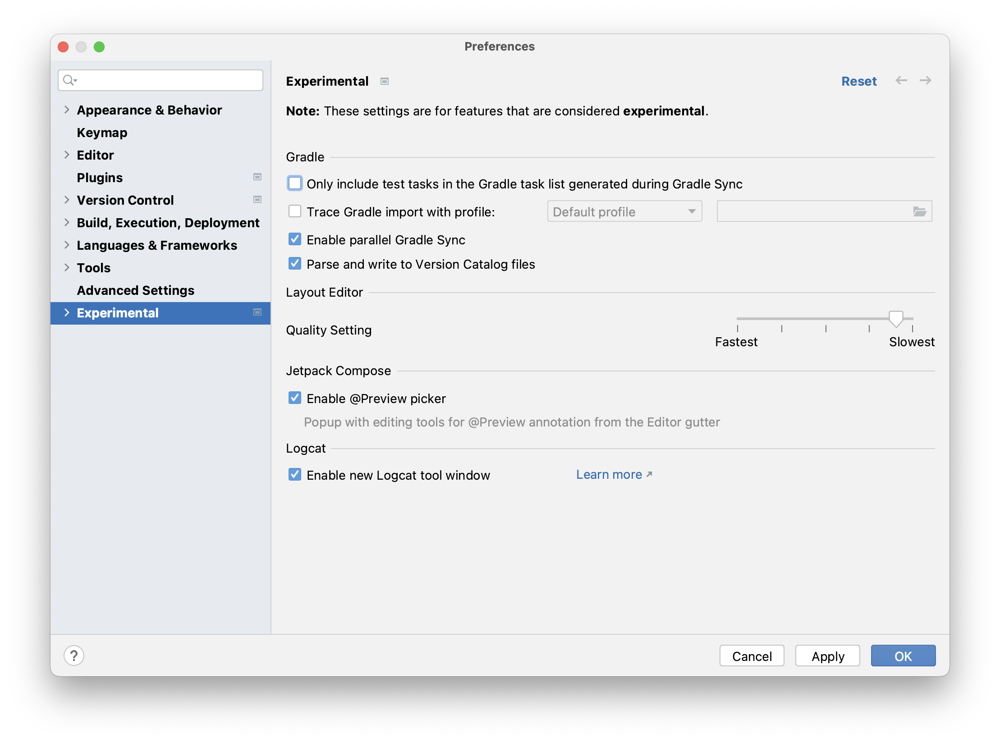
</p>

7. Ahora para actualizar el proyecto, selecciona Files -> Sync Project with Gradle Files.

<p align="center">
  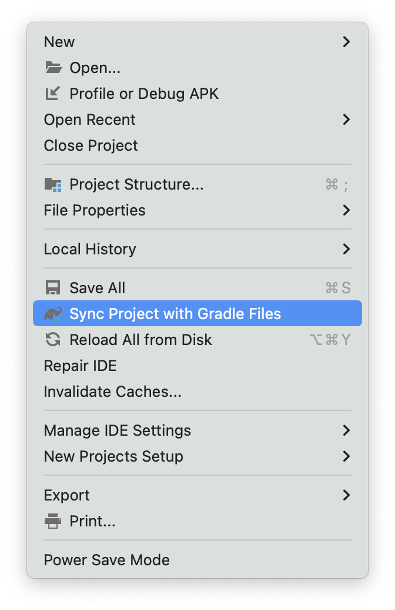
</p>

8.	Luego, ubicar la pestaña Gradle que se encuentra en la esquina superior derecha de la ventana, seleccionar la ruta Gradle -> app -> Tasks -> android -> signingReport, donde se encuentra el certificado de firma de depuración SHA-1.

<p align="center">
  
</p>

9.	Ahora si puede completar todos los datos (nombre del paquete, apodo, y el certificado de firma SHA-1 de depuración) en la consola de Firebase, ventana de Agrega Firebase a tú aplicación Android, y dar clic en ***Register Add***.

- Apodo: Es un identificador interno y conveniente que solo tú puedes ver en Firebase console.

- Certificado de firma SHA‑1 de depuración: Firebase Authentication.

- Importante: Para la autenticación, requiere agregar el certificado de firma SHA‑1 de depuración.


<p align="center">
  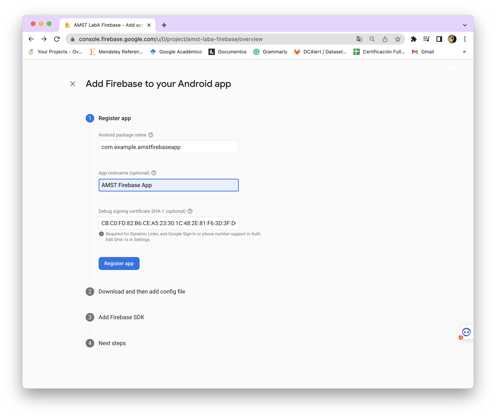
</p>

10.	Descargamos y agregamos el archivo de configuración ***google-services.json***.

<p align="center">
  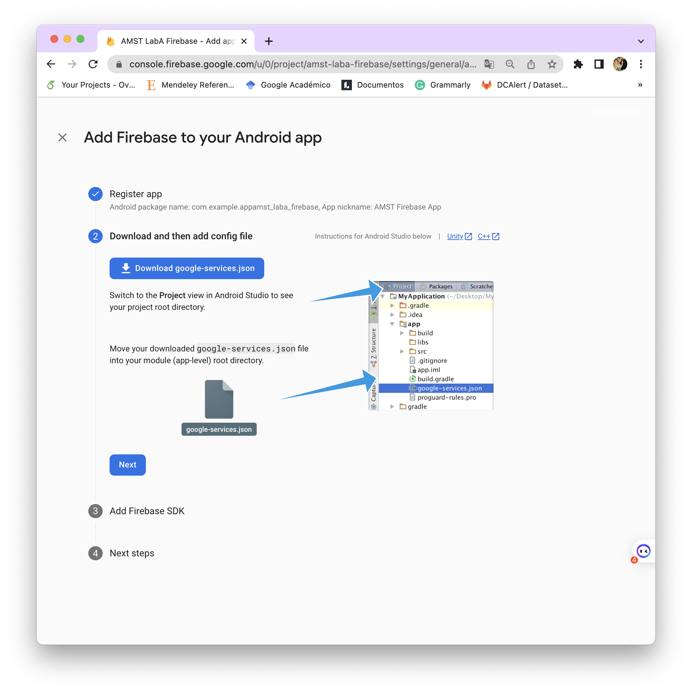
</p>

11.	En Android Studio cambiamos a la vista Proyecto, agregamos el archivo ***google-services.json*** dentro de la carpeta app de nuestro proyecto, tal como se muestra en la imagen.

<p align="center">
  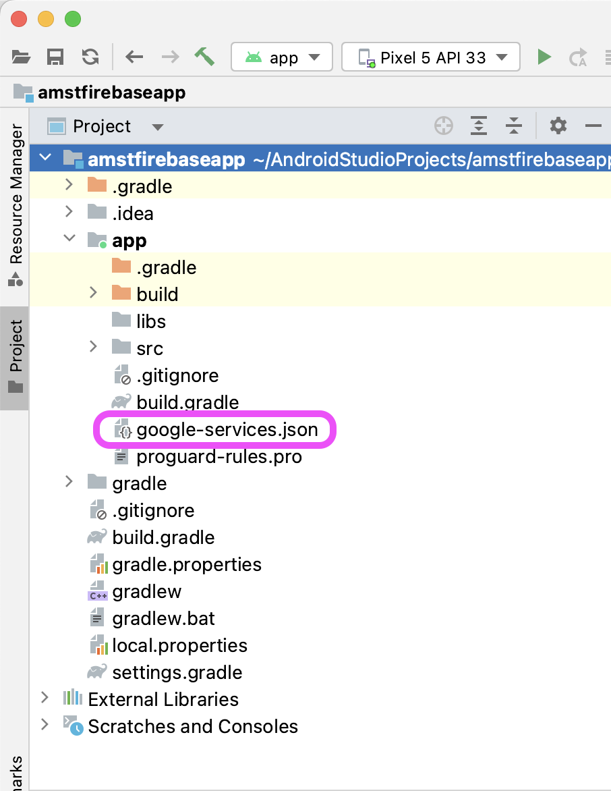
</p>

12.	Listo, ahora está sincronizado el proyecto y se puede ir a la consola.

<p align="center">
  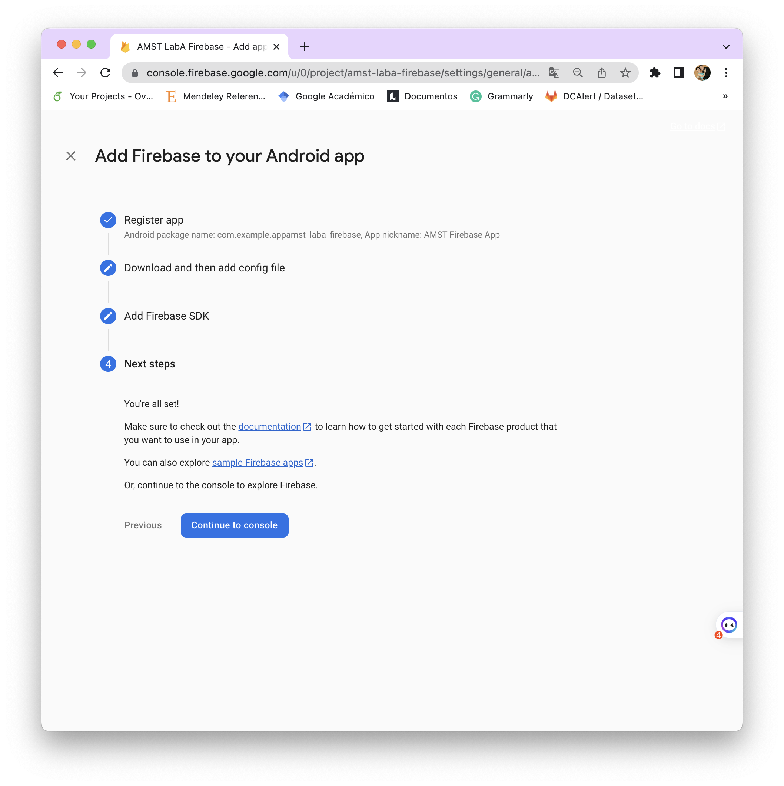
</p>

13.	Para que los SDK de Firebase puedan acceder a los valores de configuración de google-services.json, necesitas el complemento Gradle de los servicios de Google. Agrega el complemento como una dependencia buildscript a tu archivo build.gradle de nivel de proyecto. Luego, en el archivo build.gradle del módulo (nivel de app) agrega los complementos google-services y cualquier SDK de Firebase que quieras usar en tu app:

**Archivo: build.gradle (Project:amstfirebaseapp)**
```
// Top-level build file where you can add configuration options common to all sub-projects/modules.
buildscript {
    repositories {
        // Make sure that you have the following two repositories
        google()  // Google's Maven repository
        mavenCentral()  // Maven Central repository
    }

    dependencies {
        // Add the dependency for the Google services Gradle plugin
        classpath 'com.google.gms:google-services:4.3.15'
    }
}

plugins {
    id 'com.android.application' version '8.0.1' apply false
    id 'com.android.library' version '8.0.1' apply false
}
```

**Archivo: build.gradle (Module:app)**
```
plugins {
    id 'com.android.application'

    // Add the Google services Gradle plugin
    id 'com.google.gms.google-services'
}
    android {
    namespace 'com.example.amstfirebaseapp'
    compileSdk 33

    defaultConfig {
        applicationId "com.example.amstfirebaseapp"
        minSdk 19
        targetSdk 33
        versionCode 1
        versionName "1.0"

        testInstrumentationRunner "androidx.test.runner.AndroidJUnitRunner"
    }

    buildTypes {
        release {
            minifyEnabled false
            proguardFiles getDefaultProguardFile('proguard-android-optimize.txt'), 'proguard-rules.pro'
        }
    }
    compileOptions {
        sourceCompatibility JavaVersion.VERSION_1_8
        targetCompatibility JavaVersion.VERSION_1_8
    }
}

dependencies {
    implementation 'androidx.appcompat:appcompat:1.6.1'
    implementation 'com.google.android.material:material:1.5.0'
    implementation 'androidx.constraintlayout:constraintlayout:2.1.4'
    testImplementation 'junit:junit:4.13.2'
    androidTestImplementation 'androidx.test.ext:junit:1.1.5'
    androidTestImplementation 'androidx.test.espresso:espresso-core:3.5.1'

    // Import the Firebase BoM
    implementation platform('com.google.firebase:firebase-bom:32.1.0')

    // TODO: Add the dependencies for Firebase products you want to use
    // When using the BoM, don't specify versions in Firebase dependencies
    implementation 'com.google.firebase:firebase-analytics'

    // Add the dependencies for any other desired Firebase products
    // https://firebase.google.com/docs/android/setup#available-libraries

    implementation fileTree(dir: 'libs', include: ['*.jar'])

    // Firebase Authentication
    implementation 'com.google.firebase:firebase-auth'

    // Also add the dependency for the Google Play services library and specify its version
    implementation 'com.google.android.gms:play-services-auth:20.5.0'

    // FirebaseUI for Firebase Auth
    implementation 'com.firebaseui:firebase-ui-auth:8.0.2'

    //Visualizar la imagen de perfil
    implementation 'com.squareup.picasso:picasso:2.8'

    implementation 'com.google.firebase:firebase-database'
}
```

***Importante: Siempre que realices cambios en los archivos Gradle, recuerda volver a sincronizar tu proyecto para asegurarte el correcto funcionamiento de las nuevas librerías. Puedes dar clic en Sync Now en la parte superior derecha de la pantalla o dar clic en File > Sync Project with Gradle files.***


### **Paso 2:** Inicio de sesión con cuenta Google (10 puntos)

**Pre-requisito:** Habilitar el método de inicio de sesión mediante Google. Dentro de la consola del proyecto en FireBase seleccione del lado izquierdo la ruta de Build -> Authentication. Luego se mostrará el menú de Users, dar clic en el botón de Set up sign-in method y entre los proveedores adicionales habilitar ***Google***. 

<p align="center">
  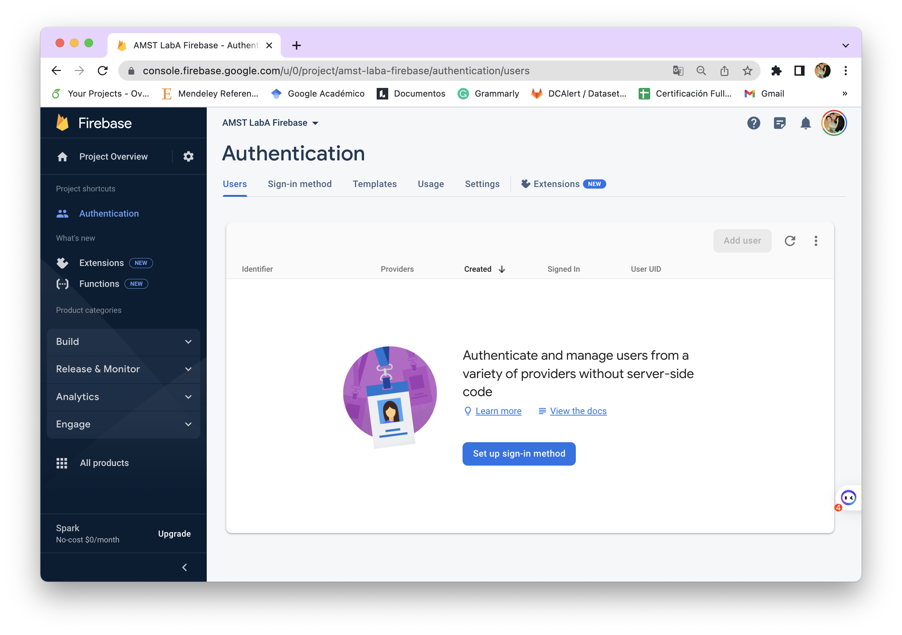
</p>

<p align="center">
  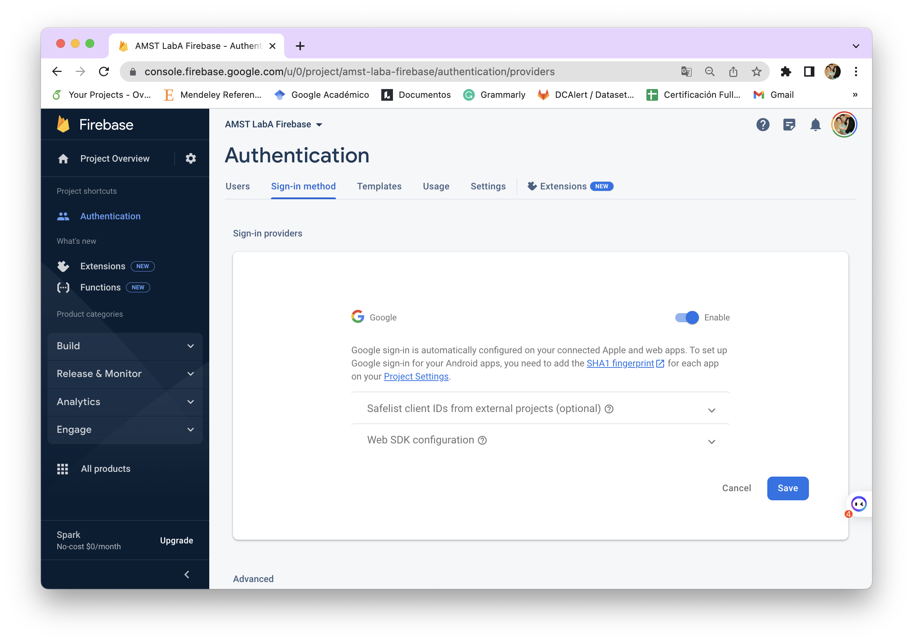
</p>

1.	Agregamos nuevas dependencias en build.gradle (module:app), y luego sincronizamos.

```
dependencies {
    implementation fileTree(dir: 'libs', include: ['*.jar'])

    // Firebase Authentication
    implementation 'com.google.firebase:firebase-auth'

    // Also add the dependency for the Google Play services library and specify its version
    implementation 'com.google.android.gms:play-services-auth:20.5.0'

    // FirebaseUI for Firebase Auth
    implementation 'com.firebaseui:firebase-ui-auth:8.0.2'
}
```

2.	Creamos una vista de inicio. Dentro de app/res/layout/activity_main.xml diseñamos la primera vista de la aplicación. Para esta vista agregaremos: ImageView, TextView, Button. Dentro de un Linear Layout.  

<p align="center">
  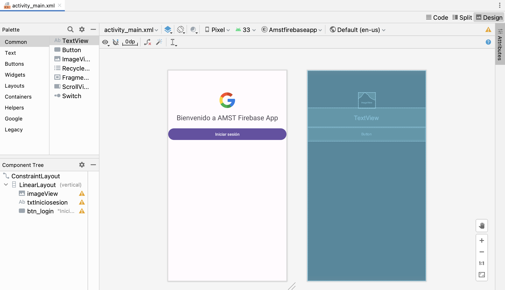
</p>

Código de archivo: activity_main.xml
```
<?xml version="1.0" encoding="utf-8"?>
<androidx.constraintlayout.widget.ConstraintLayout xmlns:android="http://schemas.android.com/apk/res/android"
    xmlns:app="http://schemas.android.com/apk/res-auto"
    xmlns:tools="http://schemas.android.com/tools"
    android:layout_width="match_parent"
    android:layout_height="match_parent"
    tools:context=".MainActivity">

    <LinearLayout
        android:layout_width="match_parent"
        android:layout_height="match_parent"
        android:orientation="vertical"
        tools:context=".MainActivity">

        <ImageView
            android:id="@+id/imageView"
            android:layout_width="59dp"
            android:layout_height="54dp"
            android:layout_gravity="center"
            android:layout_marginTop="200px"
            app:srcCompat="@drawable/google" />

        <TextView
            android:id="@+id/txtIniciosesion"
            android:layout_width="match_parent"
            android:layout_height="67dp"
            android:gravity="center"
            android:text="Bienvenido a AMST Firebase App"
            android:textSize="24sp" />

        <Button
            android:id="@+id/btn_login"
            android:layout_width="match_parent"
            android:layout_height="wrap_content"
            android:onClick="iniciarSesion"
            android:text="Iniciar sesión" />

    </LinearLayout>
</androidx.constraintlayout.widget.ConstraintLayout>
```

***Recordatorio: Agregar una imagen llamada google.png en src/main/res/drawable.***

### **Paso 3:** Configurar Inicio de sesión (15 puntos)

1.	Agregamos las siguientes variables públicas a MainActivity.java (Importar las librerías que sean necesarias)

```
public class MainActivity extends AppCompatActivity {
    FirebaseAuth mAuth;
    GoogleSignInClient mGoogleSignInClient;
```

2.	En la función onCreate (Función que se ejecuta al momento de iniciar la acción), instanciamos la configuración de inicio de Google y firebase.

```
    @Override
    protected void onCreate(Bundle savedInstanceState) {
        super.onCreate(savedInstanceState);
        setContentView(R.layout.activity_main);
        mAuth = FirebaseAuth.getInstance();
        GoogleSignInOptions gso = new GoogleSignInOptions.Builder(GoogleSignInOptions.DEFAULT_SIGN_IN)
                .requestIdToken(getString(R.string.default_web_client_id))
                .requestEmail()
                .build();
        mGoogleSignInClient = GoogleSignIn.getClient(this, gso);
        Intent intent = getIntent();
        String msg = intent.getStringExtra("msg");
        if(msg != null){
            if(msg.equals("cerrarSesion")){
                cerrarSesion();
            }
        }
    }
```

***Importante: default_web_client_id puede llegar a mantenerse en error hasta compilar por primera vez el programa.***

3.	Creamos la función pública de iniciar sesión dentro de la clase publica MainActivity. Dentro de esta función llamaremos al inicio de sesión por Google. (Importar las librerías que sean necesarias)

```
public void iniciarSesion(View view) {
        resultLauncher.launch(new Intent(mGoogleSignInClient.getSignInIntent()));
}
```

4.	Implementamos la función (sobrescrita) onActivityResult dentro de la clase publica MainActivity, que se ejecutara después verificar sesión. Obtendremos la información de sesión o mostraremos un error en el Log si el inicio de sesión ha fallado.

```
ActivityResultLauncher<Intent> resultLauncher = registerForActivityResult(new ActivityResultContracts.StartActivityForResult(), new ActivityResultCallback<ActivityResult>() {
        @Override
        public void onActivityResult(ActivityResult result) {
            if (result.getResultCode() == Activity.RESULT_OK) {
                Intent intent = result.getData();
                Task<GoogleSignInAccount> task = GoogleSignIn.getSignedInAccountFromIntent(intent);
                try {
                    GoogleSignInAccount account = task.getResult(ApiException.class);
                    if (account != null) firebaseAuthWithGoogle(account);
                } catch (ApiException e) {
                    Log.w("TAG", "Fallo el inicio de sesión con google.", e);
                }
            }
        }
    });
```

5.	Autenticamos sesión con Firebase (para acceder a la base de datos). Para ello usamos las credenciales de Google.

```
private void firebaseAuthWithGoogle(GoogleSignInAccount acct) {
        Log.d("TAG", "firebaseAuthWithGoogle:" + acct.getId());
        AuthCredential credential = GoogleAuthProvider.getCredential(acct.getIdToken(),
                null);
        mAuth.signInWithCredential(credential)
                .addOnCompleteListener(this, task -> {
                    if (task.isSuccessful()) {
                        FirebaseUser user = mAuth.getCurrentUser();
                        updateUI(user);
                    } else {
                        System.out.println("error");
                        updateUI(null);
                    }
                });
    }
```

6.	Obtenemos el usuario de Firebase. Podemos obtener el nombre, email y foto a partir de la cuenta. Por ello, en la función updateUI() agregar un Intent para empezar la nueva actividad y pasando la información del usuario. 

```
private void updateUI(FirebaseUser user) {
        if (user != null) {

            HashMap<String, String> info_user = new HashMap<String, String>();
            info_user.put("user_name", user.getDisplayName());
            info_user.put("user_email", user.getEmail());
            info_user.put("user_photo", String.valueOf(user.getPhotoUrl()));
            info_user.put("user_id", user.getUid());
            info_user.put("user_phone", user.getPhoneNumber());
            finish();
            Intent intent = new Intent(this, PerfilUsuario.class);
            intent.putExtra("info_user", info_user);
            startActivity(intent);
        } else {
            System.out.println("sin registrarse");

        }
    }
```

### **Paso 4:** Creación de perfil de usuario (15 puntos)

Ahora mostraremos la información de un del usuario en una nueva actividad e implementar.

1.	Creamos una nueva Actividad dando clic derecho en /app > New > Activity > Empty Views Activity.

2.	Asignamos un nombre a la nueva actividad como ***PerfilUsuario***, y damos clic en Finish.

3.	En app/res/layout/activity_perfil_usuario.xml, diseñamos la vista para el perfil de usuario donde colocaremos la información que del cliente.

<p align="center">
  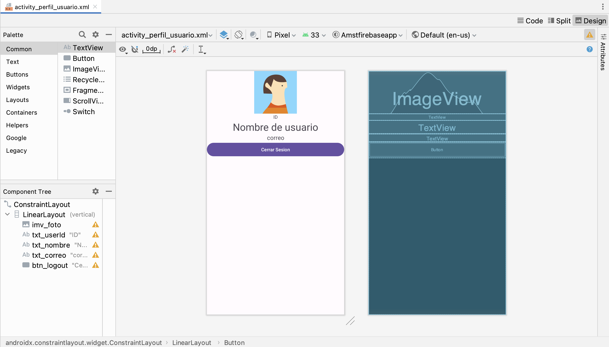
</p>

**Código de archivo: activity_perfil_usuario.xml**

```
<?xml version="1.0" encoding="utf-8"?>
<androidx.constraintlayout.widget.ConstraintLayout xmlns:android="http://schemas.android.com/apk/res/android"
    xmlns:app="http://schemas.android.com/apk/res-auto"
    xmlns:tools="http://schemas.android.com/tools"
    android:layout_width="match_parent"
    android:layout_height="match_parent"
    tools:context=".PerfilUsuario">

    <LinearLayout
        android:layout_width="match_parent"
        android:layout_height="match_parent"
        android:orientation="vertical"
        tools:context=".PerfilUsuario">

        <ImageView
            android:id="@+id/imv_foto"
            android:layout_width="match_parent"
            android:layout_height="wrap_content"
            tools:srcCompat="@tools:sample/avatars" />

        <TextView
            android:id="@+id/txt_userId"
            android:layout_width="match_parent"
            android:layout_height="wrap_content"
            android:gravity="center"
            android:text="ID" />

        <TextView
            android:id="@+id/txt_nombre"
            android:layout_width="match_parent"
            android:layout_height="wrap_content"
            android:gravity="center"
            android:text="Nombre de usuario"
            android:textSize="30sp" />

        <TextView
            android:id="@+id/txt_correo"
            android:layout_width="match_parent"
            android:layout_height="wrap_content"
            android:gravity="center"
            android:text="correo"
            android:textSize="18sp" />

        <Button
            android:id="@+id/btn_logout"
            android:layout_width="match_parent"
            android:layout_height="wrap_content"
            android:onClick="cerrarSesion"
            android:text="Cerrar Sesion" />
    </LinearLayout>

</androidx.constraintlayout.widget.ConstraintLayout>
```

5.	Para poder visualizar la imagen de perfil, agregamos la dependencia Picasso, en build.gradle(module:app)

```
dependencies {
    //Visualizar la imagen de perfil
    implementation 'com.squareup.picasso:picasso:2.8'
}
```

6.	En app/java/PerfilUsuario.java, vamos a obtener la información del usuario y presentarla en la pantalla que se diseño:

```
public class PerfilUsuario extends AppCompatActivity {
    TextView txt_id, txt_name, txt_email;
    ImageView imv_photo;
    DatabaseReference db_reference;


    @Override
    protected void onCreate(Bundle savedInstanceState) {
        super.onCreate(savedInstanceState);
        setContentView(R.layout.activity_perfil_usuario);
        Intent intent = getIntent();
        HashMap<String, String> info_user = (HashMap<String, String>) intent.getSerializableExtra("info_user");
        System.out.println("Informacion"+ info_user);
        txt_id = findViewById(R.id.txt_userId);
        txt_name = findViewById(R.id.txt_nombre);
        txt_email = findViewById(R.id.txt_correo);
        imv_photo = findViewById(R.id.imv_foto);


        txt_id.setText(info_user.get("user_id"));
        txt_name.setText(info_user.get("user_name"));
        txt_email.setText(info_user.get("user_email"));
        String photo = info_user.get("user_photo");
        Picasso.get().load(photo).into(imv_photo);
```

7.	También en el mismo archivo PerfilUsuario.java, implementamos la función CerrarSesion para desvincular nuestra cuenta con la aplicación.

```
public void cerrarSesion(View view) {
        FirebaseAuth.getInstance().signOut();
        finish();
        Intent intent = new Intent(this, MainActivity.class);
        intent.putExtra("msg", "cerrarSesion");
        startActivity(intent);
    }
```

8.	Modificamos el MainActivity.java para borrar los datos de la sesión de Google.

```
    @Override
    protected void onCreate(Bundle savedInstanceState) {
        super.onCreate(savedInstanceState);
        setContentView(R.layout.activity_main);
        mAuth = FirebaseAuth.getInstance();
        GoogleSignInOptions gso = new GoogleSignInOptions.Builder(GoogleSignInOptions.DEFAULT_SIGN_IN)
                .requestIdToken(getString(R.string.default_web_client_id))
                .requestEmail()
                .build();
        mGoogleSignInClient = GoogleSignIn.getClient(this, gso);
        Intent intent = getIntent();
        String msg = intent.getStringExtra("msg");
        if(msg != null){
            if(msg.equals("cerrarSesion")){
                cerrarSesion();
            }
        }
    }

    private void cerrarSesion() {
        mGoogleSignInClient.signOut().addOnCompleteListener(this,
                task -> updateUI(null));
    }
```

### **Paso 5:** Implementar Base de datos (25 puntos)
Implementaremos una base de datos para guardar tweets de un usuario específico. 

1.	Agregamos la dependencia de base de datos.

```
dependencies {
    //Base de datos de Firebase
    implementation 'com.google.firebase:firebase-database'
}
```

2.	Este paso es totalmente informativo, para la práctica seguirán al paso 3. Estructuraremos la base de datos. (Una base NO RELACIONAL, estructura de árbol). Para ello accedemos a la consola del proyecto en Firebase, en el menú del lado izquierdo seleccionar Build > Realtime Database. Luego dar clic en Create Database.

<p align="center">
  
</p>

3. Ahora configuramos la base de datos seleccionando su ubicación, luego dar clic en Next.

<p align="center">
  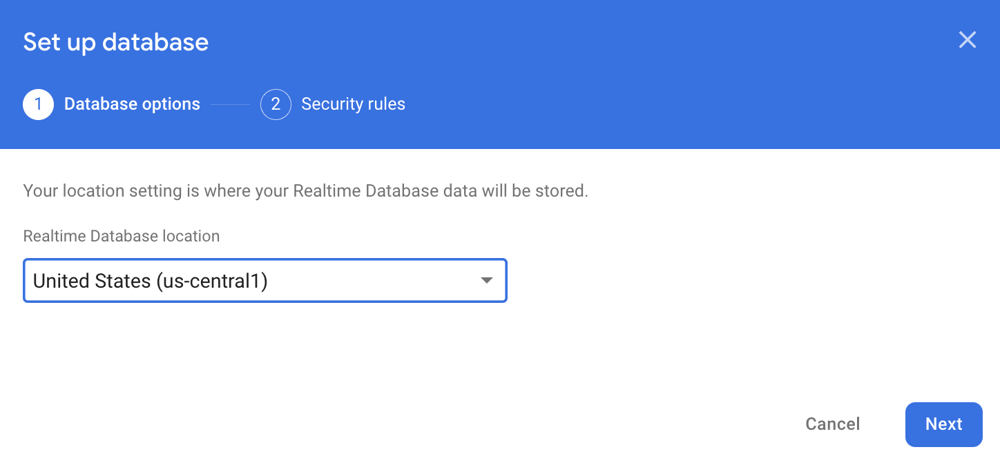
</p>

4. Configurar las reglas de seguridad de la base de datos.

<p align="center">
  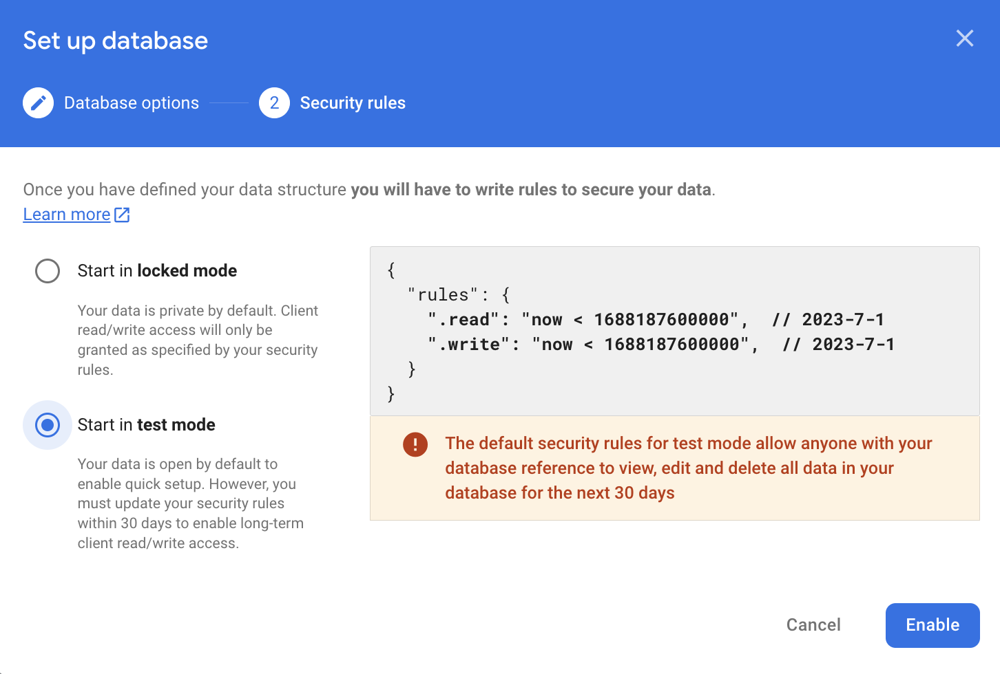
</p>

5. Definir el esquema de la base de datos. Nos ubicamos en en el nombre de la base de datos (https://amst-laba-firebase-default-rtdb.firebaseio.com/) y damos clic en [+] para agregar un nodo (child) en formato JSON con key y value.

<p align="center">
  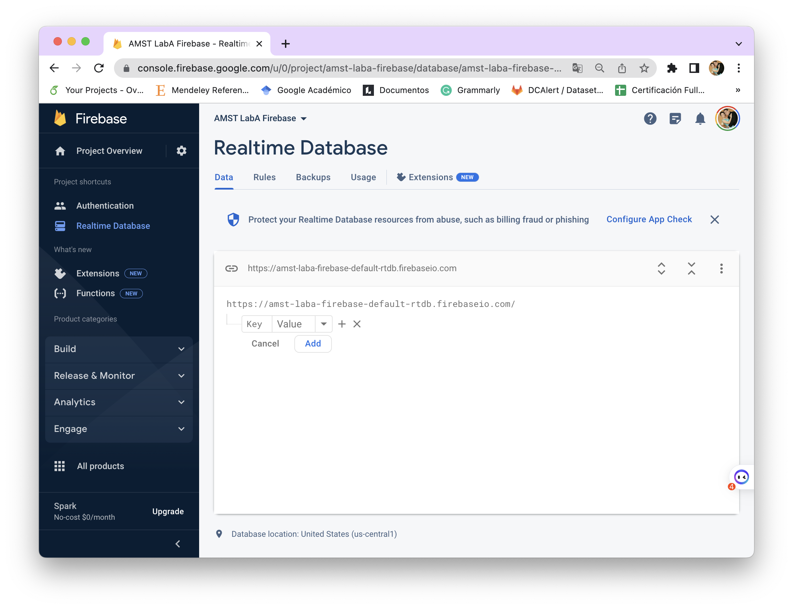
</p>

- Nombre: Grupo	Valor: Vacio, damos click en [+] para agregar otro nodo.

6. El esquema de la base de datos quedará de la siguiente forma:

**Estructura JSON**
```
Base de datos {
   Grupos { 
        GrupoN{
             Tweets {
	Hola firebase {
     autor: Adriana Collaguazo,
     fecha: 01-06-2023 }
                    }
              },
       Grupo1 {},
       Grupo2{},
       ….
   }
}
```

<p align="center">
  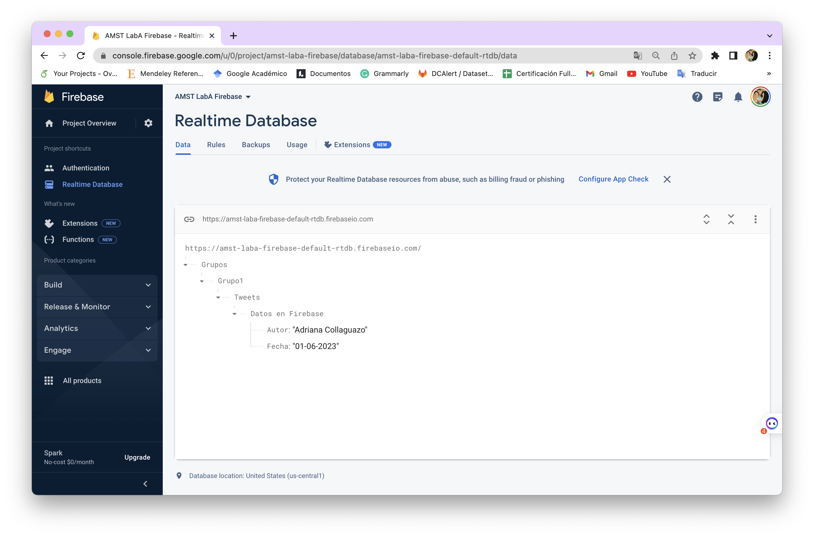
</p>
	
Se crea el siguiente árbol de estructura:

<p align="center">
  
</p>

***Importante: Así fue creado un árbol de estructura de forma gráfica. En los siguientes pasos se mostrará como hacerlo desde la aplicación.***

7.	Declaramos la variable pública de referencia a la base de datos en la clase PerfilUsuario.java.

```
public class PerfilUsuario extends AppCompatActivity {
    TextView txt_id, txt_name, txt_email;
    ImageView imv_photo;
    DatabaseReference db_reference;
```

8.	En el mismo archivo PerfilUsuario.java, iniciamos la variable de la base de datos y ejecutamos las funciones de prueba dentro de la funcion onCreate.

```
    @Override
    protected void onCreate(Bundle savedInstanceState) {
        super.onCreate(savedInstanceState);
        setContentView(R.layout.activity_perfil_usuario);
        Intent intent = getIntent();
        HashMap<String, String> info_user = (HashMap<String, String>) intent.getSerializableExtra("info_user");
        System.out.println("Informacion"+ info_user);
        txt_id = findViewById(R.id.txt_userId);
        txt_name = findViewById(R.id.txt_nombre);
        txt_email = findViewById(R.id.txt_correo);
        imv_photo = findViewById(R.id.imv_foto);


        txt_id.setText(info_user.get("user_id"));
        txt_name.setText(info_user.get("user_name"));
        txt_email.setText(info_user.get("user_email"));
        String photo = info_user.get("user_photo");
        Picasso.get().load(photo).into(imv_photo);

        iniciarBaseDeDatos();
        leerTweets();
        escribirTweets(info_user.get("user_name"));
    }
```

9.	En el mismo archivo PerfilUsuario.java, implementamos las funciones IniciarBaseDeDatos, leerTweets (obteniendo datos de la base), y escribirtweets (escribir en la base de datos). 
**Nota: Modificar el nombre del grupo según corresponda. **

```
public void iniciarBaseDeDatos() {
        db_reference = FirebaseDatabase.getInstance().getReference().child("Grupos");
    }
    public void leerTweets() {
        db_reference.child("Grupo1").child("tweets")
                .addValueEventListener(new ValueEventListener() {
                    @Override
                    public void onDataChange(DataSnapshot dataSnapshot) {
                        for (DataSnapshot snapshot : dataSnapshot.getChildren()) {
                            System.out.println(snapshot);
                        }
                    }

                    @Override
                    public void onCancelled(DatabaseError error) {
                        System.out.println(error.toException());
                    }
                });
    }

    public void escribirTweets(String autor){
        String tweet = "hola mundo firebase 2";
        String fecha = "03/11/2022"; //Fecha actual
        Map<String, String> hola_tweet = new HashMap<String, String>();
        hola_tweet.put("autor", autor);
        hola_tweet.put("fecha", fecha);
        DatabaseReference tweets = db_reference.child("Grupo1").child("tweets");
        tweets.setValue(tweet);
        tweets.child(tweet).child("autor").setValue(autor);
        tweets.child(tweet).child("fecha").setValue(fecha);
    }
```

10. Agregamos la función cerrarSesion en el mismo archivo PerfilUsuario.java para que sea habilitada cuando se de clic en el boton Cerrar Sesion.

```
public void cerrarSesion(View view) {
        FirebaseAuth.getInstance().signOut();
        finish();
        Intent intent = new Intent(this, MainActivity.class);
        intent.putExtra("msg", "cerrarSesion");
        startActivity(intent);
    }
```

11. Finalmente, ejecute la aplicación móvil amstfirebaseapp.

<p align="center">
  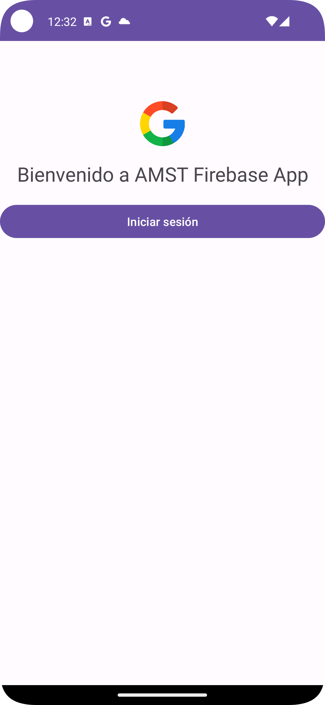
</p>

<p align="center">
  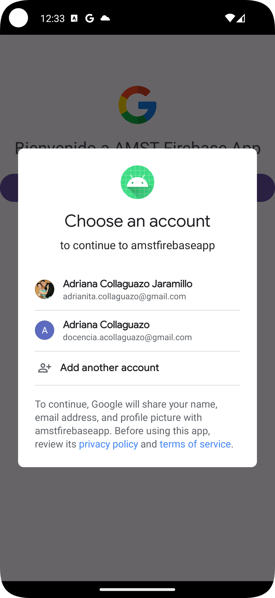
</p>

<p align="center">
  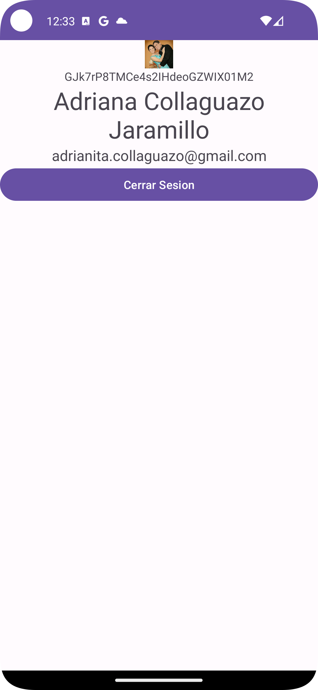
</p>

### **Desafíos (20 puntos)**:
- Mejorar el diseño del perfil de usuario. 
- Mostrar toda la información disponible desde su cuenta de Gmail del usuario como teléfono, bibliografía, entre otros.
- Agregar en la pantalla de inicio de sesión, otro proveedor de autenticación como Facebook, Twitter, o GitHub.
- Modificar la aplicación para que los tweets y la fecha sean ingresados por el usuario.
- Realizar un tweet por integrante en la rama designada en Firebase.
- Aplicar opciones de seguridad gratuitas ofrecidas por Google Cloud en la base de datos y en la aplicación móvil.

### **Formato del Trabajo**

La práctica de laboratorio será desarrollada en el siguiente formato:

- Nombre del archivo: AMST_LabA_GrupoB_Apellido1_Apellido2_Apellido3

  ***Siendo A el número del trabajo y B el número del grupo***
- Nombre de la materia y paralelo 1
- Título del trabajo: Ejemplo: Laboratorio A - Tema
- Nombre de la profesora
- Número de grupo
- Nombres/Apellidos de los integrantes del grupo que hayan desarrollado el trabajo
- Fecha de inicio y fin del trabajo
- Resultados de las actividades planteadas: Explicación de las actividades ejecutadas, incluyendo las imágenes del proceso. Colocar el enlace del repositorio de GitHub con su código fuente.
- Conclusiones y Recomendaciones: Respecto a lo aprendido durante el desarrollo del trabajo.
- Referencias bibliográficas: Colocar los documentos, enlaces web o libros consultados
