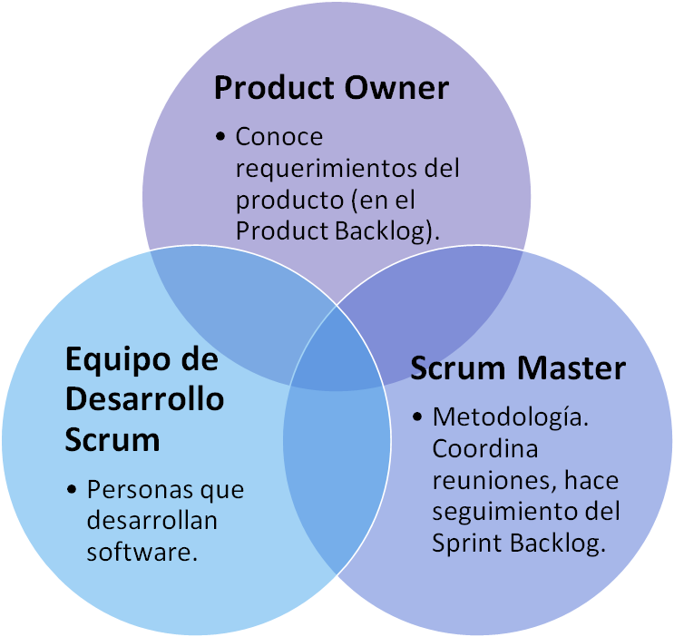
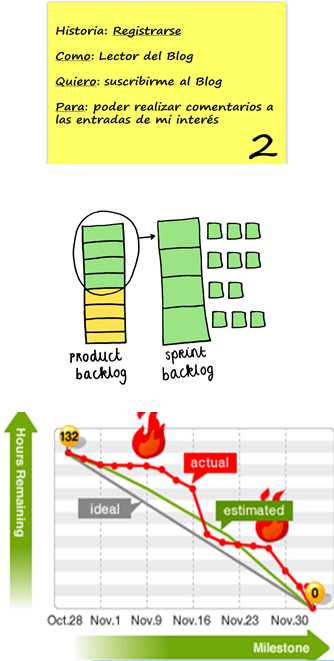
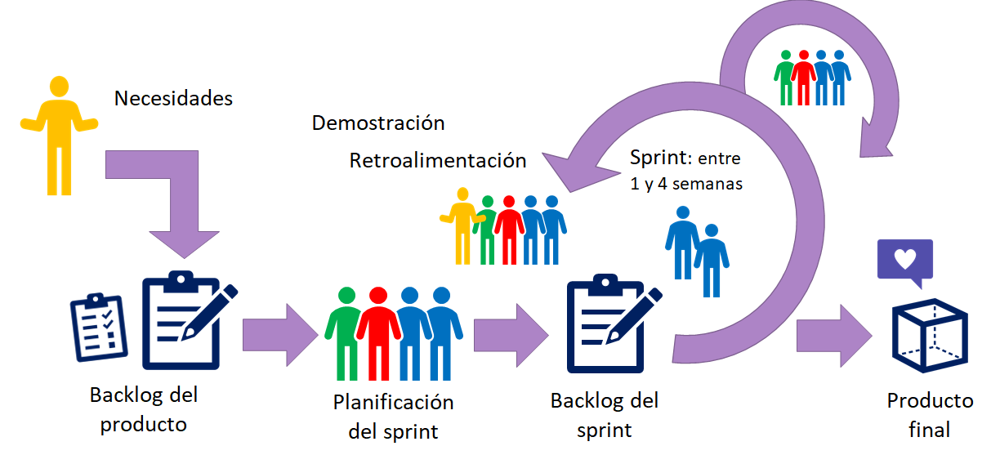
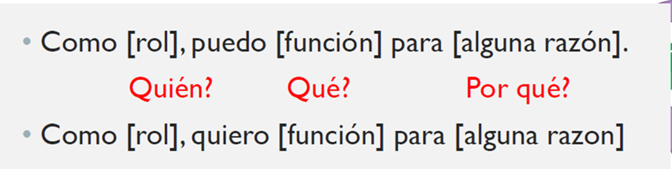
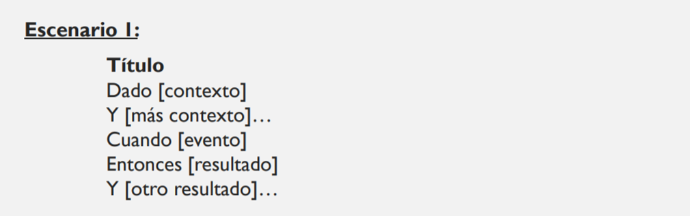

[Regresar](/Aplicaciones-Moviles-y-Servicios-Telematicos/)

**Itinerario de Aplicaciones Móviles y Servicios Telemáticos**

**Docente:** Adriana Collaguazo Jaramillo

**Facultad:** Facultad de Ingeniería en Electricidad y Computación (FIEC)

# MICRO-SESIÓN DE SOFTWARE 1: SCRUM

## **Marco de trabajo utilizado para el desarrollo ágil de proyectos**

**Scrum:**
Scrum es un marco ligero que ayuda a las personas, equipos y organizaciones a generar valor a través de
soluciones adaptativas para problemas/productos complejos.

**Sprint:** Iteración. Selección de las características del sistema a ser desarrolladas, se las implementa y entrega al usuario.
De 1 a 4 semanas. 

## ROLES

  

## ARTEFACTOS

  

- **Product Backlog:** Se definen todos los requerimientos del sistema y se priorizan. 

- **Sprint Backlog:** Lista de las tareas a desarrollar en un sprint.

## EVENTOS

- **Sprint Planning:** Reunión al inicio de cada Sprint.
Product Owner + Scrum Master + Equipo de Desarrollo

- **Scrum Master:** Monitorea el cumplimiento de la lista de tareas en el Sprint Backlog. 

- **Daily Scrum Meeting (SCRUM):** Reunión diaria de 15 minutos. Análisis  del avance de tareas y replanificación de tareas – si es necesario.

- **Sprint Review:** Inspección del producto desarrollado.

- **Sprint Retrospective:** Proponer mejoras para el siguiente sprint.

## Funcionamiento de SCRUM

  

### **HISTORIA DE USUARIOS (Requerimientos)**

  

### **CRITERIOS DE ACEPTACIÓN**

  

### **Ejemplos: **

**Como** [cuenta correntista], yo puedo [ver mi saldo en línea] **para** [conocer mi disponibilidad de dinero 24 horas al día].

**Como** [gerente de producción], **yo puedo** [generar un reporte de productos (producto y cantidad generada) mensual] **para** [saber qué departamentos necesitan mejorar su productividad].

**Como** [asegurado], **quiero** [recibir notificaciones cuando un reclamo sea comentado], **para** [estar al día con el estado del mismo].

### **CRITERIOS DE ACEPTACIÓN**

**Escenario 1:** El saldo de la cuenta está en 0.

**Dado que** [la cuenta no tiene dinero $0]
y [no hay depósitos realizados este día] **cuando** [ el dueño de la cuenta intenta retirar dinero del banco] **entonces** [el banco no permite la transacción] y [se envía un email con la notificación respectiva].

## OTRO EJEMPLO DE HARDWARE + SOFTWARE

**Historia de usuario:** Descargar un archivo de respaldo de la configuración.

**Como** Ingeniero de Networking **puedo** descargar el archivo de respaldo de la configuración de un dispositivo de red que se encuentra almacenado en un servidor **para** reconfigurar o resolver problemas con los dispositivos de red. 

### **CRITERIOS DE ACEPTACIÓN**

**Dado que** el usuario realiza la consulta de un archivo y selecciona un archivo de configuración **cuando** se da clic en descargar **entonces** se inicia la descarga del archivo de configuración y se crea el archivo que contiene la fecha/hora, nombre de usuario, nombre del dispositivo consultado y el mensaje de descarga de archivo realizada exitosamente. 

**Dado que** el usuario realiza la consulta de un archivo y selecciona un archivo de configuración, pero ocurre un error de conectividad con el servidor de archivos, **cuando** se da clic en descargar **entonces** se mostrará el mensaje de error "Falla de conexión con el servidor, inténtelo de nuevo" y se crea un archivo que contiene la fecha/hora, nombre del dispositivo y el mensaje de error.

**Dado que** el usuario no selecciona un archivo de configuración en la consulta **cuando** se da clic en descargar **entonces** se le mostrará el mensaje de error "No ha seleccionado un archivo para la consulta, inténtelo de nuevo". 

