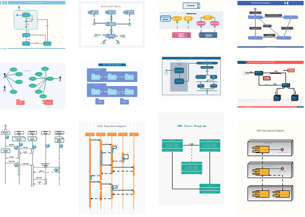
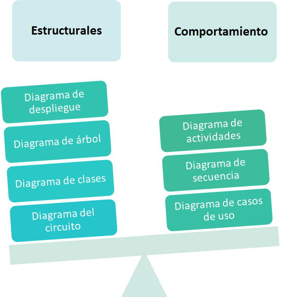
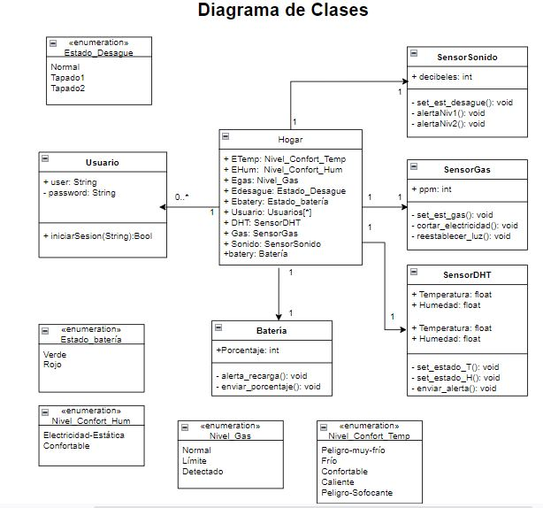
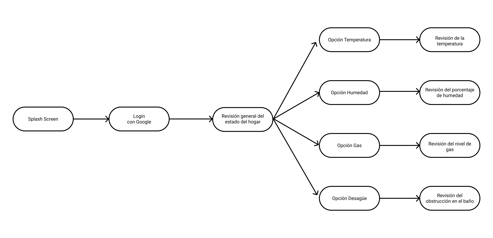
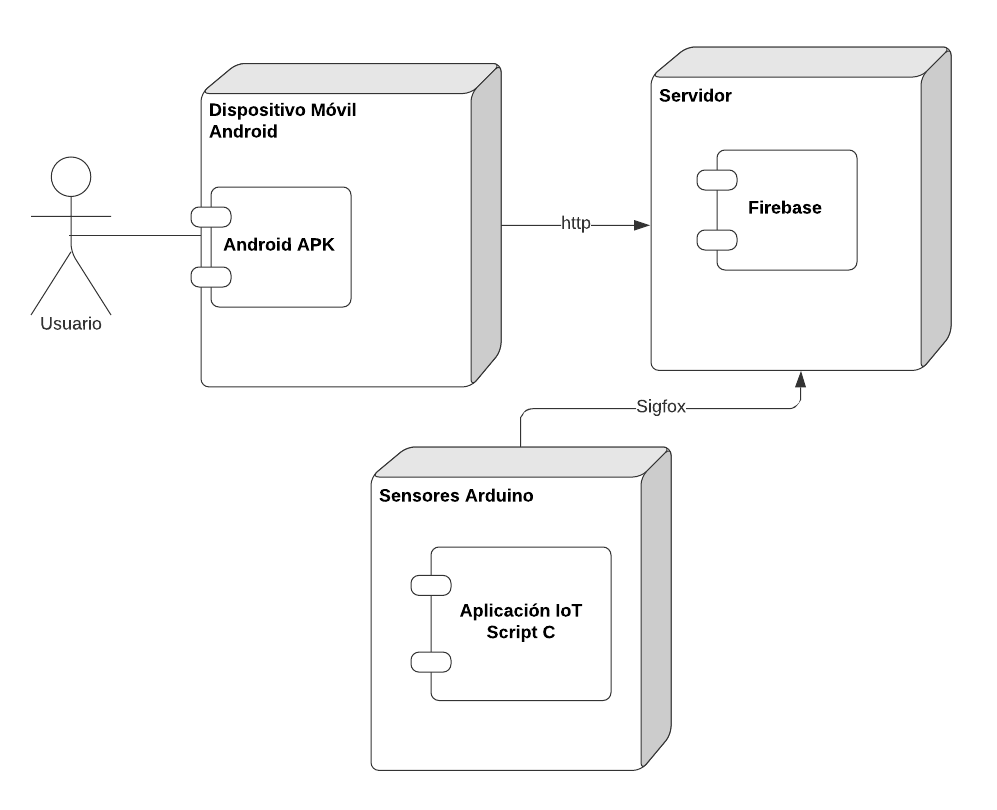
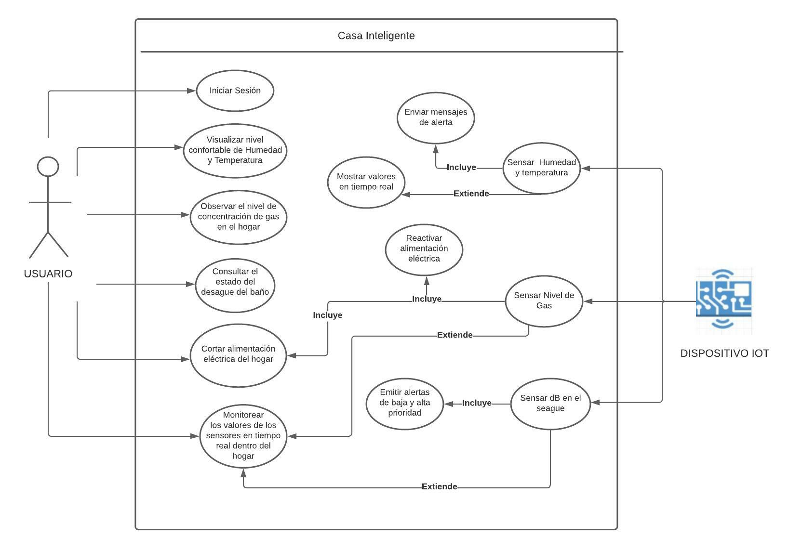
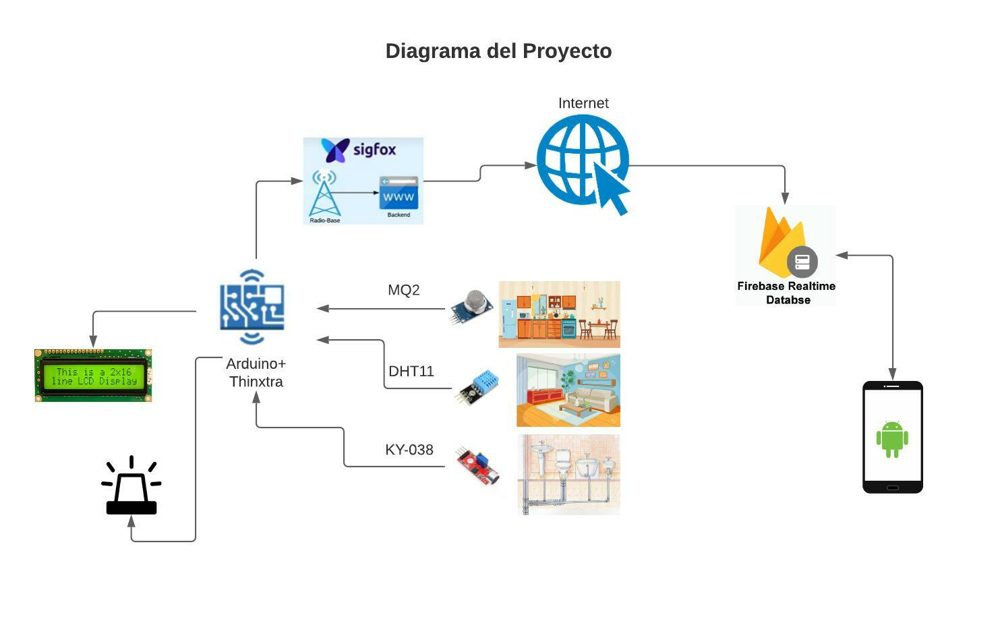

[Regresar](/Aplicaciones-Moviles-y-Servicios-Telematicos/)

**Itinerario de Aplicaciones Móviles y Servicios Telemáticos**

**Docente:** Adriana Collaguazo Jaramillo

**Facultad:** Facultad de Ingeniería en Electricidad y Computación (FIEC)

# MICRO-SESIÓN DE SOFTWARE 2: Diagramas UML (Lenguaje Unificado de Modelado)

Un lenguaje de modelado visual para la arquitectura, el diseño y la implementación de sistemas. 

  

## **Tipos de Diagramas UML**

  

## **Herramientas de libre uso**

- [Draw.io](#https://app.diagrams.net)
- [Lucidchart](#https://www.lucidchart.com/)

## **Diagrama de Clases**

  

  

## **Diagrama de Árbol**

  

## **Diagrama de Despliegue**

  

## **Diagrama de Casos de Uso**

  

## **Diagrama de Proyecto**

  

## **Diagrama de Circuito**

  

