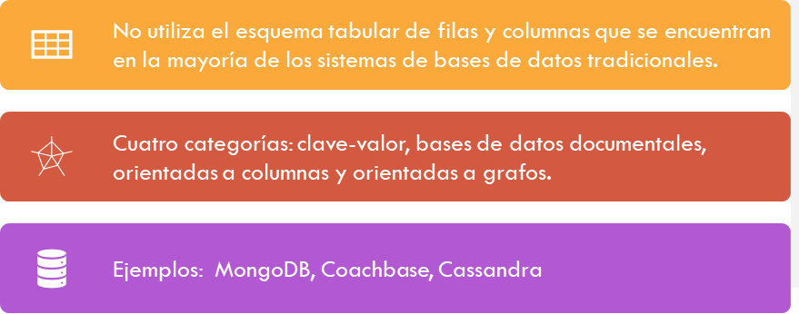
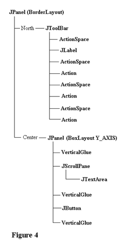
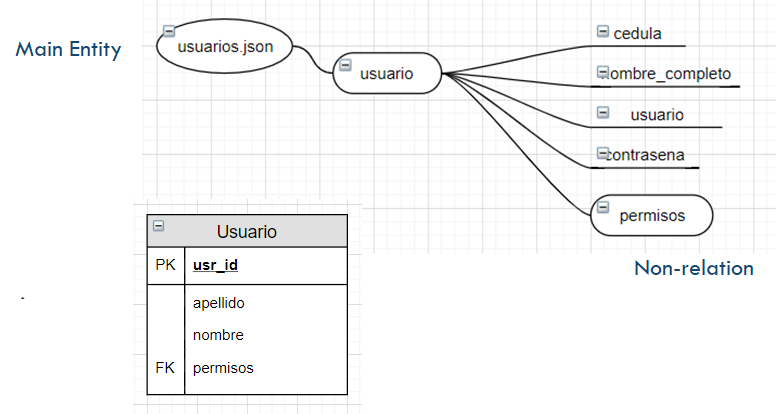
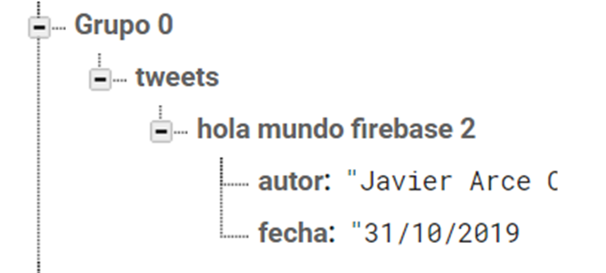

[Regresar](/Aplicaciones-Moviles-y-Servicios-Telematicos/)

# MICRO-SESIÓN DE SOFTWARE #3 

## **BASE DE DATOS NO RELACIONAL**

**Itinerario de Aplicaciones Móviles y Servicios Telemáticos**
**Docente:** Adriana Collaguazo Jaramillo 

### **¿Qué es una base de datos no relacional?**

  

**Ventajas**
- Funciona con datos semiestructurados
Escala horizontalmente
- Alta simultaneidad, gran volumen de lectura y escritura
- Almacenamiento masivo de datos
- Sin esquema
- Simplicidad de diseño
- Velocidad

**Desventajas**
- Datos desnormalizados, que requieren actualizaciones masivas
- Sin aplicación de relaciones
- Utiliza 10 -50 veces más espacio

### **Key – Value Stores**

Los valores se guardan en forma con llave-valor, llevando a una gran eficiencia pero con peligro a colisiones:

Cualquier cosa se puede almacenar como un valor, siempre que cada valor esté asociado con una clave o un nombre

### **Document Stores**

  

Los documentos que contienen este tipo de datos son jerarquicos, tree-like structures (JSON o XML)

### **Enfoque en Firebase**

  

  

### **Resumen**

Se elige No. SQL cuando:

- Los datos tienen mucho volumen y / o variedad
- Los datos no son relacionales / semiestructurados
- Puede relajar la consistencia transaccional: La escalabilidad y el rendimiento son más importantes
- Quiere servir a un gran número de usuarios que hacer cumplir reglas de negocio 

**Referencias**

https://www.mongodb.com/scale/types-of-nosql-databases
https://www.jamesserra.com/archive/2015/08/relational-databases-vs-non-relational-databases/
