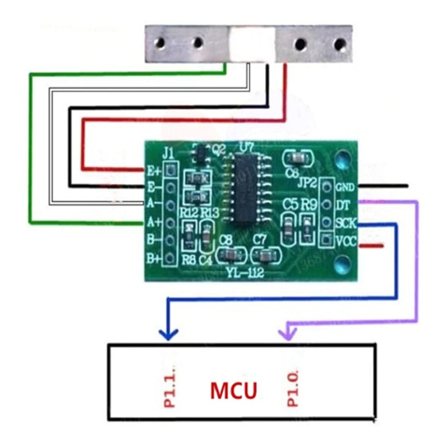
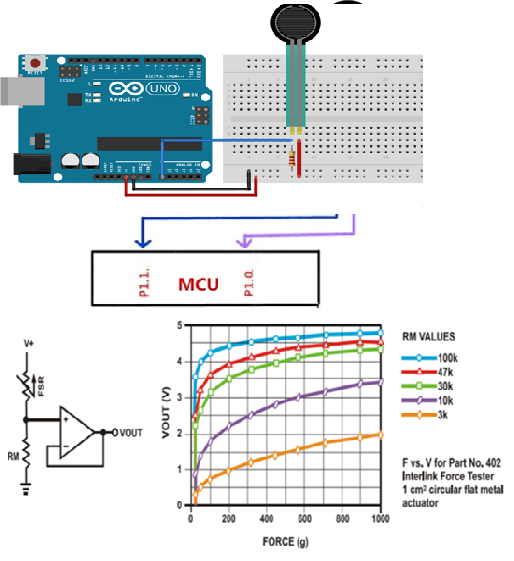

# MICRO-SESIÓN DE HARDWARE #2 CONEXIÓN  A ARDUINO

Itinerario de Aplicaciones Móviles y Servicios Telemáticos Docente: Adriana Collaguazo 

## Conectores del Arduino UNO

<p align="center">
  
</p>

### Tipos de conexión de alimentación

- **DC Power Jack:** se puede usar para alimentar su placa Arduino. La placa puede funcionar con 5-20 voltios, pero el fabricante recomienda mantenerla entre 7-12 voltios.    
- **Pin VIN:** se usa para alimentar la placa Arduino Uno utilizando una fuente de alimentación externa. 
- **Cable USB:** cuando está conectado a la computadora, proporciona 5 voltios a 500 mA. 

<p align="center">
  
</p>

## Diagrama de Pines del Arduino UNO

Los pines 0-13 del Arduino Uno sirven como pines de entrada / salida digital. 
En el Arduino Uno, los pines 3,5,6,9,10,11 tienen capacidad PWM. 
Los pines A0-A5 del Arduino son capaces de leer voltajes analógicos.
Es importante tener en cuenta que: 
Cada pin puede proporcionar/recibir hasta 40 mA máx. Pero la corriente recomendada es de 20 mA. 

## ¿Qué es la comunicación en serial? 
La comunicación serial se utiliza para intercambiar datos entre la placa Arduino y otro dispositivo. Cada placa Arduino tiene al menos un puerto serie. La comunicación en serie se produce en los pines digitales 0 (RX) y 1 (TX), así como a través de USB. Arduino también admite la comunicación en serie a través de pines digitales con la Biblioteca de SoftwareSerial. 

## USABILIDAD

Conexión con sensor Peso+Convertidor HX711

<p align="center">
  
</p>

### Módulo hx711

<p align="center">
  
</p>

Conexión entre la Celda de carga, módulo HX711 y Arduino

<p align="center">
  
</p>

<p align="center">
  
</p>

<p align="center">
  
</p>

**Conexión con  Force Sensing Resistor**


<p align="center">
  
</p>


Sentencia NMEA

<p align="center">
  
</p>

- Hora – 235317.000 equivale a 23:53 y 17.000 GMT
- "A" indicador de que el dato de posici[on est[a fijado y es correcto, si se tiene "V"sería no válido
- Longitud: 4003.9040, N Norte
- Latitud: 10512.5792, W Oeste
- Numero de satélites vistos: 08
- Altitud: 1577 metros


### CONFIGURACIÓN CON EL THINXTRA 

Los componentes mostrados fuera de la caja Thinxtra Dev Kit, son los que se entregan dentro del mismo para uso de sus proyectos IOT con conexión a Sigfox.


<p align="center">
  
</p>

### Disposición y Configuración de Pines del Thinxtra Xkit 

<p align="center">
  
</p>

Sin sensores  - Código

````
.........
void loop(){
  ….............
    //hacemos un arreglo de bytes para poder enviar byte por byte mas adelante 
    byte *float_byte = (byte *)&voltage;
     byte *int_byte = (byte *)&bateria; 
    //indicamos el tamaño de nuestro mensaje sabiendo que el   
   //máximo de 12 bits
   const uint8_t payloadSize = 9; 
    uint8_t buf_str[payloadSize]; 
    buf_str[0] = float_byte[0]; 
     buf_str[1] = float_byte[1]; 
     buf_str[2] = float_byte[2];
     buf_str[3] = float_byte[3];
     buf_str[4] = int_byte[0]; 
     buf_str[5] = int_byte[1]; 
    Send_Pload(buf_str, payloadSize); 
….....
 
````

## Sin sensores  - Simulación

**Código de Arduino**               


  **Ejecución**


<p align="center">
  
</p>

## Sin sensores  - Pruebas (Sigfox)

<p align="center">
  
</p>

## Con sensores  - Código

````
.........
void loop(){
  ….............
    //hacemos un arreglo de bytes para poder enviar byte por byte mas adelante 
    byte *float_byte = (byte *)&t; 
    byte *float_axeXb = (byte *)&axeX;
    //indicamos el tamaño de nuestro mensaje sabiendo que el   
   //máximo de 12 bits
   const uint8_t payloadSize = 9; 
    uint8_t buf_str[payloadSize]; 
    buf_str[0] = float_byte[0]; 
    buf_str[1] = float_byte[1]; 
    buf_str[2] = float_byte[2];
    buf_str[3] = float_byte[3];
    buf_str[4] = float_axeXb[0]; 
    buf_str[5] = float_axeXb[1]; 
    buf_str[6] = float_axeXb[2]; 
    buf_str[7] = float_axeXb[3];
    Send_Pload(buf_str, payloadSize); 
````

## Con sensores  - Simulación

Código de Arduino
Ejecución

<p align="center">
  
</p>

## Con sensores  - Pruebas (Sigfox)

<p align="center">
  
</p>

## Video de simulación de Pruebas 