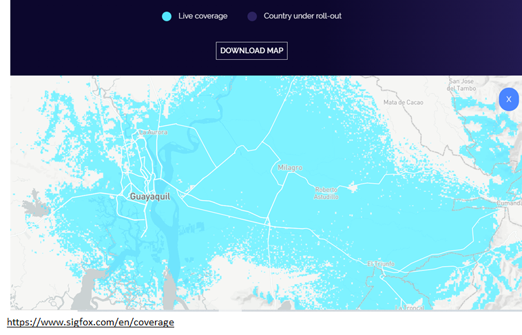
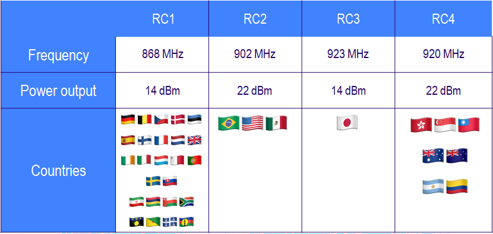
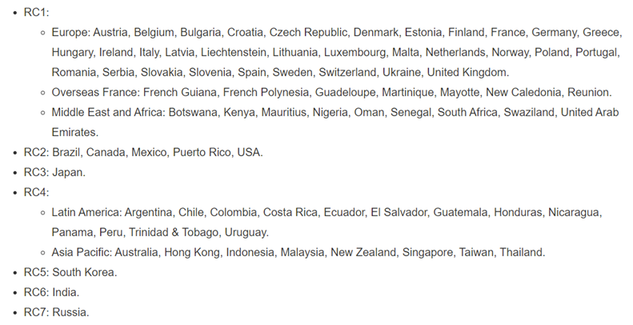
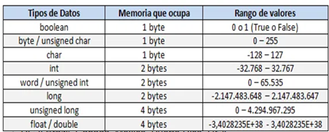
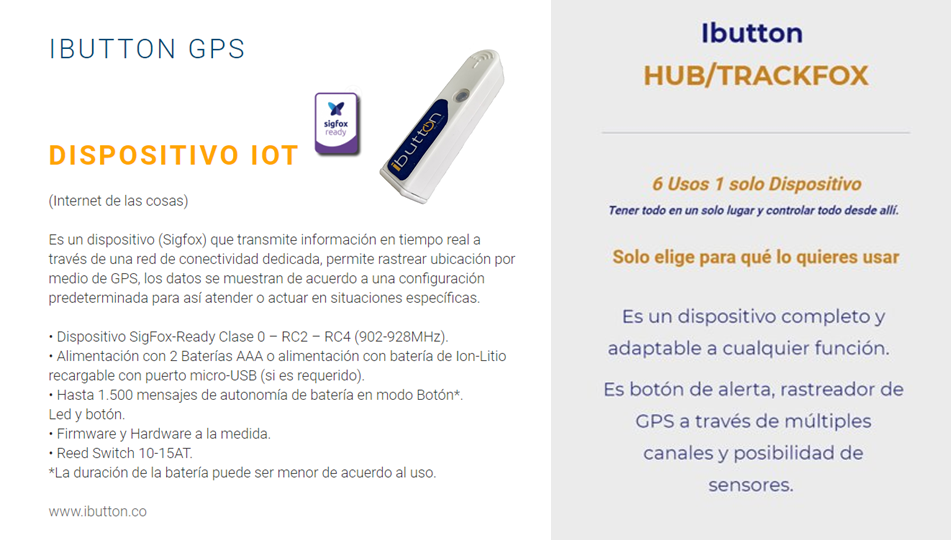
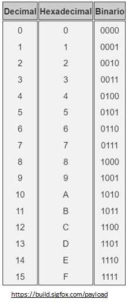
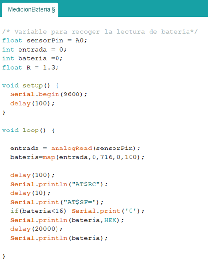
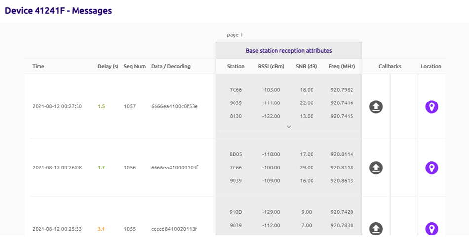
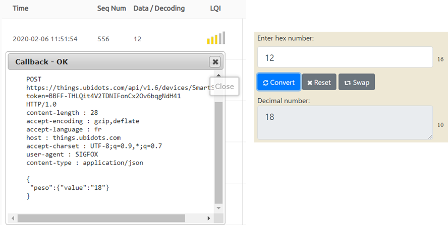

# MICRO-SESIÓN DE HARDWARE #3
**DESCRIPCIÓN GENERAL DE SIGFOX**

Itinerario de Aplicaciones Móviles y 
Servicios Telemáticos
**Docente:** Adriana Collaguazo ​

## **Sobre Sigfox**

Servicio de Comunicación IoT
Actualmente está disponible en 70 países 
Consumo bajo de Energía + Simplicidad
Chips de varios proveedores importantes de silicio

  

Sigfox  no vende chips
Sigfox no está construyendo soluciones conectadas
Sigfox ha inventado un protocolo de radio
Sigfox opera una red global

### **Sigfox Radio Configuration Zones**

  

  

### **Nuevas posibilidades**

- Soluciones existentes: Conexión más barata y duración de la batería extendida.
- Permite aplicaciones de IoT totalmente nuevas.
- Conectividad de copia de seguridad para dispositivos de mayor ancho de banda.

## Comunicación

**Propiedades**

Buena propagación en interiores (ISM)
Comunicación simple de 2 vías
Largo alcance entre emisor y receptores

**Comunicación bidireccional**

Los dispositivos pueden recibir actualizaciones enviadas desde el servidor de aplicaciones.
Cada comunicación es instigada por el dispositivo.

### Mensajes pequeños

  

Carga útil: hasta 12 bytes
Hasta 140 veces al día 
(contrato)  600 bits/s

**Bytes que usan ciertas variables**

Coordenadas GPS (lat x lng) : 6 bytes 
Temperatura:	2 bytes
Informe de estado : 1 byte

  

**Mensajes Sigfox**

El volumen de data que un objeto puede enviar en cada mensaje, a través de la red Sigfox, es de 12 bytes. Pero también se puede  enviar solo la data que se necesita mediante comandos AT.
Siempre y cuando el byte se conforme de dos caracteres hexadecimales.
AT$SF=01
AT$SF=0102
AT$SF=010203
AT$SF=01020304

  

**Ejemplo**

Tomar en cuenta que, 15 es el máximo número qué puedes escribir con 1 byte.
Entonces todo número que sea menor a 15 se debe agregar un cero para que cumple la regla de los dos hexadecimales. 
Ya que no se puede enviar solo F, debe ser 0F.

  

  

  

  

