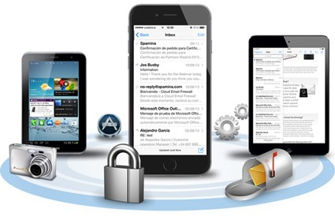
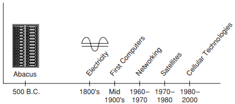

[Regresar](/Aplicaciones-Moviles-y-Servicios-Telematicos/)

# Unidad 1: Desarrollo de aplicaciones móviles
## 🎯 Objetivo de Aprendizaje
Al finalizar la clase el estudiante será capaz de:
- Desarrollar aplicaciones móviles sencillas considerando las características de la programación de dispositivos móviles.

# 1.1 Principios de computación móvil
- [Características](#caracteristicas)
    - [Portabilidad](#portabilidad)
    - [Conectividad](#conectividad)
    - [Interactividad](#interactividad)
    - [Individualidad](#individualidad)
- [Dimensiones de la movilidad](#dimensiones)

# 📲 Características

  

- Los **sistemas de computación móviles** son sistemas informáticos que pueden moverse fácilmente físicamente. Por ejemplo: computadoras portátiles, asistentes digitales personales (PDA) y teléfonos móviles.

- Entre los aspectos distintivos de los sistemas de computación móvil están la conectividad de red inalámbrica, tamaño pequeño, y fuente de energía.

- En algunos ambientes el **factor de la movilidad** juega un rol muy importante, por ejemplo: en el sector de la salud, en los sectores de atención de desastres, en sectores académicos.

- La integración de las disciplinas de desarrollo de aplicaciones y de ingeniería de software permite la obtención de software de calidad.

- Si bien existe una variedad de metodologías, técnicas, marcos y herramientas que se utilizan en el desarrollo de software para sistemas estacionarios, hay muy pocos para sistemas móviles.

  

## 🌐 Portabilidad
Dispositivos/nodos conectados dentro del sistema de computación móvil facilitan la movilidad.

## 🌐 Conectividad
 Esto define la calidad de servicio (QoS) de la conectividad de la red. 

## 🌐 Interactividad
 Los nodos que pertenecen a un sistema de computación móvil están conectados entre sí.

## 🌐 Individualidad
Un dispositivo portátil conectado a una red móvil a menudo denota un individuo.

Algunas de las formas más comunes de dispositivos de computación móvil son las siguientes:

- Computadoras portátiles
- Las tarjetas inteligentes
- Teléfonos celulares
- Computadoras usables (wearable)

Entre los principios de computación móvil los usuarios presentan las siguientes características:

- El usuario móvil se está moviendo, al menos ocasionalmente, entre ubicaciones conocidas o desconocidas.

- El usuario móvil generalmente no está enfocado en la tarea de computación.

- El usuario móvil con frecuencia requiere altos grados de inmediatez y capacidad de respuesta  del sistema.

- El usuario móvil está cambiando las tareas con frecuencia y / o abruptamente.

- El usuario móvil puede requerir acceso al sistema en cualquier lugar y en cualquier momento.

# 📲 Dimensiones de la movilidad

Es absolutamente crucial que se entienda las dimensiones de la movilidad y las tenga en cuenta durante todo el proceso de diseño e implementación de la aplicación móvil.

  

