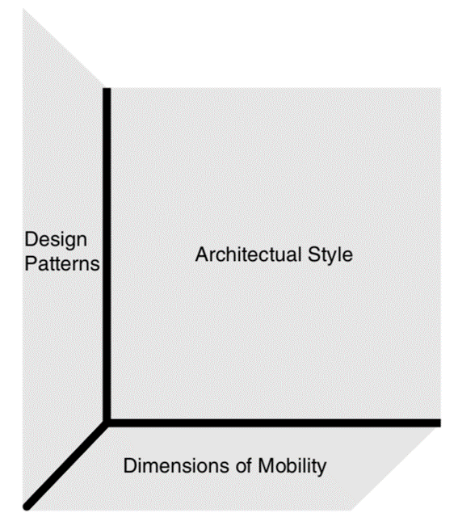

[Regresar](/Aplicaciones-Moviles-y-Servicios-Telematicos/)

# Unidad 1: Desarrollo de aplicaciones móviles
## 🎯 Objetivo de Aprendizaje
Al finalizar la clase el estudiante será capaz de:
- Desarrollar aplicaciones móviles sencillas considerando las características de la programación de dispositivos móviles.

# 1.1 Principios de computación móvil
- [Arquitectura de sofrware para servicios móviles](#arquitectura)

# 📲 Arquitectura de sotfware para servicios móviles
El primer paso para crear una aplicación de software, después del proceso de recopilación de requisitos, es establecer un plan de alto nivel sobre cómo será la aplicación cuando finalice. Se conoce a este plan de alto nivel de la aplicación móvil una "arquitectura de software móvil”.

  

