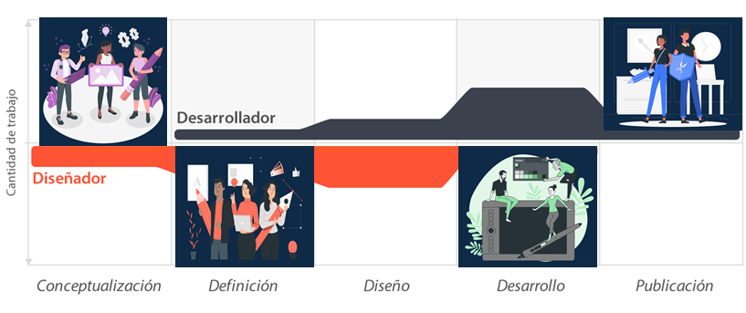
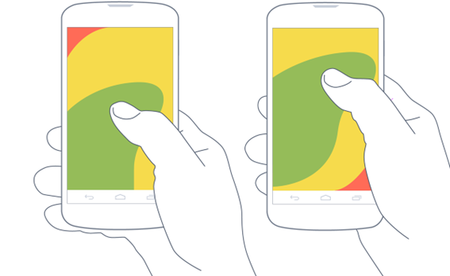
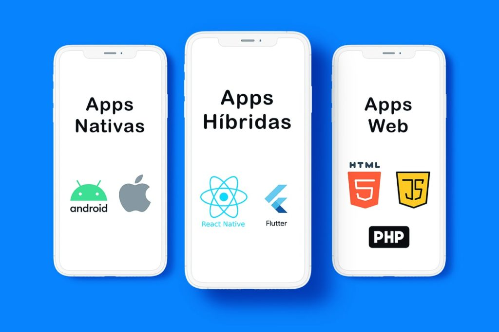
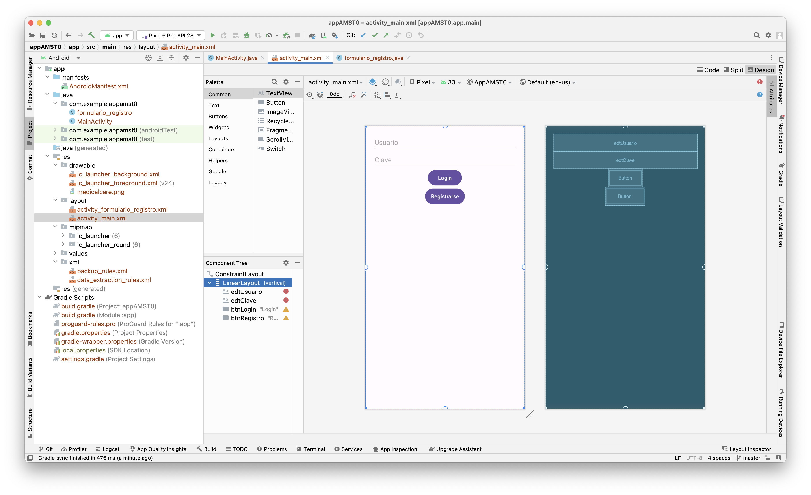

[Regresar](/Aplicaciones-Moviles-y-Servicios-Telematicos/)

# Unidad 1: Desarrollo de aplicaciones móviles

## 🎯 Objetivo de Aprendizaje
Al finalizar la clase el estudiante será capaz de:
- Desarrollar aplicaciones móviles sencillas considerando las características de la programación de dispositivos móviles.

# 1.3 Interfaz de usuario y ciclo de vida de actividades
- [Metodología de desarrollo de aplicaciones móviles](#metodologia)
- [Proceso de diseño y desarrollo de una aplicación](#proceso)
- [Patrones de diseño](#patrones)
- [Prototipado móvil](#prototipado)
- [Tipos de aplicaciones](#tipos)
- [Arquitectura de Android](#arquitectura)
- [Estructura de un proyecto](#estructura)
- [Componentes de una aplicación](#componenes)
- [Ciclo de vida de la actidad](#ciclo)

<a name="metodologia"> </a>

## 📲 Metodología de desarrollo de aplicaciones móviles

**¿Podemos o no podemos usar las mismas metodologías, marcos y herramientas para el desarrollo de aplicaciones móviles?**

La respuesta es más bien un "Sí" a medida que el software se acerca al hardware y más un "No" a medida que se aleja del hardware.

Los marcos de referencia que nos ayudan a escribir software que está "más cerca" del hardware, como compiladores y ensambladores. Sin embargo, los marcos de referencia y herramientas de alto nivel, como las herramientas de desarrollo de interfaz de usuario (HTML, JFC, Visual Basic).

**Marcos de referencia y herramientas completamente centralizados**
 Debido a esta naturaleza integrada de los sistemas móviles totalmente centralizados, los recursos del dispositivo no son una preocupación en el desarrollo de software: las capacidades del cliente se conocen de antemano. Por lo tanto, tres de las dimensiones de la movilidad, a saber, la proliferación de plataformas, las capacidades limitadas de los dispositivos y el soporte para una variedad de interfaces de usuario, no se aplican a las aplicaciones totalmente centralizadas. Ejemplo: Sistemas de campo de batalla utilizados para determinar la ubicación de un objetivo y enviarlo a un sistema centralizado, que luego lo transmite a otro sistema responsable del lanzamiento de un misil.

 **Marcos de referencia cliente-servidor N-TIER y herramientas**
  Las aplicaciones cliente, en el caso del desarrollo móvil, son típicamente aquellas que se ejecutan en dispositivos móviles. Por lo general, no es posible escribir aplicaciones grandes para que los dispositivos sirvan como cliente, principalmente debido a los recursos limitados en los dispositivos y la gran variedad de ellos. Entonces, la mayoría de las veces, las aplicaciones móviles se distribuyen.


<a name="proceso"> </a>

## 📲 Proceso de diseño y desarrollo de una aplicación

<p align="center">
  
</p>

**1. Conceptualización**
El resultado de esta etapa es una idea de aplicación, que tiene en cuenta las necesidades y problemas de los usuarios. La idea responde a una investigación preliminar y a la posterior comprobación de la viabilidad del concepto.
Ideación
Investigación
Formalización de la idea

**2. Definición (usuario y funcional)**
En este paso del proceso se describe con detalle a los usuarios para quienes se diseñará la aplicación, usando metodologías como «Personas» y «Viaje del usuario». También aquí se sientan las bases de la funcionalidad, lo cual determinará el alcance del proyecto y la complejidad de diseño y programación de la app.

**3. Diseño**
En la etapa de diseño se llevan a un plano tangible los conceptos y definiciones anteriores, primero en forma de wireframes, que permiten crear los primeros prototipos para ser probados con usuarios, y posteriormente, en un diseño visual acabado que será provisto al desarrollador, en forma de archivos separados y pantallas modelo, para la programación del código. Incluyendo wireframes, prototipos, test con usuarios, y diseño visual.

**4. Desarrollo**
El programador se encarga de dar vida a los diseños y crear la estructura sobre la cual se apoyará el funcionamiento de la aplicación. Una vez que existe la versión inicial, dedica gran parte del tiempo a corregir errores funcionales para asegurar el correcto desempeño de la app y la prepara para su aprobación en las tiendas. Esto incluye programación del código y corrección de bugs.

**5. Publicación**
La aplicación es finalmente puesta a disposición de los usuarios en las tiendas. Luego de este paso trascendental se realiza un seguimiento a través de analíticas, estadísticas y comentarios de usuarios, para evaluar el comportamiento y desempeño de la app, corregir errores, realizar mejoras y actualizarla en futuras versiones.

<a name="patrones"> </a>

## 📲 Patrones de diseño

La ***Ley del pulgar*** se refiere a la superficie de pantalla a la que este dedo tiene acceso sin mayores problemas y nos da pistas para organizar jerárquicamente los elementos en la interfaz.

<p align="center">
  
</p>


<a name="prototipado"> </a>

## 📲 Prototipado móvil

Las herramientas para el diseño del prototipado móvil son las siguientes:

- [Proto.io](https://proto.io)

- [Marvelapp](https://marvelapp.com)

- [Adobe XD](https://www.adobe.com/la/products/xd.html)

<a name="tipos"> </a>

## 📲 Tipos de aplicaciones

- Aplicaciones nativas
- Aplicaciones web
- Aplicaciones híbridas
- Aplicaciones avanzadas

<p align="center">
  
</p>

<a name="arquitectura"> </a>

## 📲 Arquitectura de Android

Android es una pila de software de código abierto basado en Linux creada para una variedad amplia de dispositivos y factores de forma.

<p align="center">
  
</p>


<a name="estructura"> </a>

## 📲 Estructura de un proyecto

<p align="center">
  
</p>

**app > java > com.example.myfirstapp > MainActivity**

Esta es la actividad principal (el punto de entrada para tu app). Cuando compilas y ejecutas la app, el sistema inicia una instancia de esta Activity y carga su diseño.

**app > res > layout > activity_main.xml**

Contiene recursos de aplicación, como archivos de elementos de diseño, de diseño y de strings de IU.

**Gradle Scripts > build.gradle (Module: app)**

Este archivo define las configuraciones de compilación específicas para el módulo.

**Gradle Scripts > build.gradle (Project: appAMST)**

Este archivo define tu configuración de compilación que se aplica a todos los módulos.

**app > manifests > AndroidManifest.xml**

Describe la naturaleza de la aplicación y cada uno de sus componentes


<a name="componentes"> </a>

## 📲 Componentes de una aplicación

- Activity: Una Actividad comprende los componentes visuales ("vistas") para una pantalla, así como el código que muestra los datos en esa pantalla y puede responder a los eventos del usuario en esa pantalla. Casi todas las aplicaciones tienen al menos una clase Activity.

- View: Son los componentes básicos con los que se construyen la interfaz gráfica de la aplicación.

- Service: Es un componente que no tiene interfaz de usuario, y puede ejecutarse durante un período de tiempo más largo que una Actividad.

- Content Provider: Los proveedores de contenido también son relativamente raros, y se utilizan cuando una aplicación necesita compartir sus datos con otras aplicaciones; también pueden utilizarse con adaptadores de sincronización.

- Broadcast Receiver: Los receptores de emisión son menos comunes, y se utilizan para responder a eventos que afectan a todo el sistema, como la pérdida o recuperación de la conectividad de la red, el agotamiento de la batería, el reinicio del sistema, etcétera.

- Widget: Son elementos visuales, interactivos, que pueden mostrarse en la pantalla principal.

- Intent: Es el elemento básico de comunicación entre los distintos componentes Android que hemos descrito anteriormente.


<a name="ciclo"> </a>

## 📲 Ciclo de vida de la actidad
Cuando un usuario navega por tu app, sale de ella y vuelve a entrar, las instancias de ```Activity``` de tu app pasan por diferentes estados de su ciclo de vida. La clase ```Activity``` proporciona una serie de devoluciones de llamada que permiten a la actividad saber que cambió un estado, es decir, que el sistema está creando, deteniendo o reanudando una actividad, o finalizando el proceso en el que se encuentra.

Dentro de los métodos de devolución de llamada de ciclo de vida, puedes declarar el comportamiento que tendrá tu actividad cuando el usuario la abandone y la reanude. Por ejemplo, si creas un reproductor de video en streaming, puedes pausar el video y cancelar la conexión de red cuando el usuario cambia a otra app. Cuando el usuario vuelve, puedes volver a establecer la conexión con la red y permitir que el usuario reanude el video desde el mismo punto. En otras palabras, cada devolución de llamada te permite realizar un trabajo específico que es apropiado para un cambio de estado en particular. Hacer el trabajo preciso en el momento adecuado y administrar las transiciones correctamente hace que tu app sea más sólida y eficiente. Por ejemplo, una buena implementación de las devoluciones de llamada de un ciclo de vida puede ayudar a garantizar que tu app:

- No falle si el usuario recibe una llamada telefónica o cambia a otra app mientras usa la tuya.
- No consuma recursos valiosos del sistema cuando el usuario no la use de forma activa.
- No pierda el progreso del usuario si este abandona tu app y regresa a ella posteriormente.
- No falle ni pierda el progreso del usuario cuando se gire la pantalla entre la orientación horizontal y la vertical.

Para navegar por las transiciones entre las etapas del ciclo de vida de una actividad, la clase Activity proporciona un conjunto básico de seis devoluciones de llamadas: ```onCreate()```, ```onStart()```, ```onResume()```, ```onPause()```, ```onStop()```, y ```onDestroy()```. El sistema invoca cada una de estas devoluciones de llamada cuando una operación entra en un nuevo estado. Es decir, que la aplicación móvil pasará de un estado a otro si Android llama a los siguientes métodos en la Actividad actual en el momento adecuado.

<p align="center">
  
</p>

```setContentView()```: Establece el contenido de la actividad a partir de un recurso de diseño. El recurso se inflará, añadiendo todas las vistas de nivel superior a la actividad.


```onCreate()```: Es la devolución de llamada que se activa cuando el sistema crea la actividad por primera vez. Se hace el trabajo de constructor, como configurar la "ventana principal" con ```setContentView()```. añadiendo listeners a los botones para que hagan su trabajo (incluyendo iniciar Actividades adicionales), y así sucesivamente. Este es el único método que incluso la actividad más simple de Android necesita.


***Código fuente: MainActivity.java***

```
@Override
    protected void onCreate(Bundle savedInstanceState) {
        super.onCreate(savedInstanceState);
        setContentView(R.layout.activity_main);

        //Referencias a los controles del diseño
        edtUsuario = (EditText) findViewById(R.id.edtUsuario);
        edtClave = (EditText) findViewById(R.id.edtClave);

        btnLogin = (Button) findViewById(R.id.btnLogin);
        btnRegistro = (Button) findViewById(R.id.btnRegistro);
    }
```

```onStart()```: Hace que el usuario pueda ver la actividad mientras la app se prepara para que esta entre en primer plano y se convierta en interactiva. Por ejemplo, este método es donde la app inicializa el código que mantiene la IU.


```onResume()```: Cuando la actividad entra en el estado Resumed, pasa al primer plano y, a continuación, el sistema invoca la devolución de llamada onResume(). Este es el estado en el que la app interactúa con el usuario. La app permanece en este estado hasta que ocurre algún evento que la quita de foco. Tal evento podría ser, por ejemplo, recibir una llamada telefónica, que el usuario navegue a otra actividad o que se apague la pantalla del dispositivo.

```
public class CameraComponent implements LifecycleObserver {

    ...

    @OnLifecycleEvent(Lifecycle.Event.ON_RESUME)
    public void initializeCamera() {
        if (camera == null) {
            getCamera();
        }
    }

    ...
}
```

```onPause()```: El sistema llama a este método a modo de primera indicación de que el usuario está abandonando tu actividad (aunque no siempre significa que está finalizando la actividad); esto indica que la actividad ya no está en primer plano (aunque puede seguir siendo visible si el usuario está en el modo multiventana). Utiliza el método onPause() para pausar o ajustar las operaciones que no deben continuar (o que deben continuar con moderación) mientras Activity se encuentra en estado Paused y que esperas reanudar en breve. Hay varias razones por las que una actividad puede entrar en este estado. Por ejemplo:

- Algunos eventos interrumpen la ejecución de la app, como se describe en la sección onResume(). Este es el caso más común.
- En Android 7.0 (API nivel 24) o versiones posteriores, varias apps se ejecutan en el modo multiventana. Debido a que solo una de las apps (ventanas) tiene foco en cualquier momento, el sistema pausa todas las demás.
- Se abre una nueva actividad semitransparente (como un diálogo). Mientras la actividad siga siendo parcialmente visible, pero no esté en foco, se mantendrá pausada.

```
public class JavaCameraComponent implements LifecycleObserver {

    ...

    @OnLifecycleEvent(Lifecycle.Event.ON_PAUSE)
    public void releaseCamera() {
        if (camera != null) {
            camera.release();
            camera = null;
        }
    }

    ...
}
```

```onStop()```: Cuando el usuario ya no puede ver tu actividad, significa que ha entrado en el estado Stopped, y el sistema invoca la devolución de llamada onStop(). Esto puede ocurrir, por ejemplo, cuando una actividad recién lanzada cubre toda la pantalla. El sistema también puede llamar a onStop() cuando haya terminado la actividad y esté a punto de finalizar.

```
@Override
protected void onStop() {
    // call the superclass method first
    super.onStop();

    // save the note's current draft, because the activity is stopping
    // and we want to be sure the current note progress isn't lost.
    ContentValues values = new ContentValues();
    values.put(NotePad.Notes.COLUMN_NAME_NOTE, getCurrentNoteText());
    values.put(NotePad.Notes.COLUMN_NAME_TITLE, getCurrentNoteTitle());

    // do this update in background on an AsyncQueryHandler or equivalent
    asyncQueryHandler.startUpdate (
            mToken,  // int token to correlate calls
            null,    // cookie, not used here
            uri,    // The URI for the note to update.
            values,  // The map of column names and new values to apply to them.
            null,    // No SELECT criteria are used.
            null     // No WHERE columns are used.
    );
}
```

```onDestroy()```: Se llama onDestroy() antes de que finalice la actividad. El sistema invoca esta devolución de llamada por los siguientes motivos:

- La actividad está terminando, debido a que el usuario la descarta por completo o a que se llama a ```finish()```.
- El sistema está finalizando temporalmente la actividad debido a un cambio de configuración (como la rotación del dispositivo o el modo multiventana).


## DISEÑO DE UNA APLICACIÓN MÓVIL

El splash/pantalla de bienvenida/pantalla de inicio, es la primera pantalla que verá el usuario al iniciar la app. Su uso está siendo cada vez más limitado, por lo que generalmente se muestra rápidamente la primera vez que se abre la aplicación. Esta pantalla sirve como presentación del contenido mientras se realiza la carga inicial, por tanto, es normal que se incluya un elemento indicativo de carga junto a los demás elementos gráficos.

imagen

+ Crear una aplicación donde se ingresa el nombre del usuario y la clave, al dar click en “Login” el usuario accederá a la aplicación.

imagen

## PROCESO DE CONSTRUCCIÓN DE ANDROID

imagen

## INTERFAZ DE USUARIO: LAYOUTS

### FrameLayout

imagen

Un FrameLayout coloca todos sus controles hijos alineados con su esquina superior izquierda, de forma que cada control quedará oculto por el control siguiente. 

### LinearLayout
imagen
Este layout apila uno tras otro todos sus  Elementos hijos de forma horizontal o Vertical según se establezca su propiedad Android:orientation


### TableLayout

imagen
Un TableLayout permite distribuir sus elementos hijos de forma tabular, definiendo las filas y columnas necesarias, y la posición de cada componente dentro de la tabla.

### RelativeLayout

imagen
Este layout permite especificar la posición de cada elemento de forma relativa a su elemento padre o a cualquier otro elemento incluido en el propio layout.

## INTERFAZ DE USUARIO: LAYOUTS

imagen

## LAYOUTS PROPIEDADES

+ ### Posición relativa a otro control:

Android:layout_above
Android:layout_below
Android:layout_toLeftOf
Android:layout_toRightOf
Android:layout_alignLeft
Android:layout_alignRight
Android:layout_alignTop
Android:layout_alignBottom
Android:layout_alignBaseline

+ ### Posición relativa al layout padre:

Android:layout_alignParentLeft
Android:layout_alignParentRight
android:layout_alignParentTop.
android:layout_alignParentBotto
android:layout_centerHorizontal.
android:layout_centerVertical
android:layout_centerInParent.

## LAYOUTS PROPIEDADES

+ ### Opciones de margen

android:layout_margin
android:layout_marginBottom
android:layout_marginTop
android:layout_marginLeft
android:layout_marginRight

### Opciones de espaciado o padding

android:padding
android:paddingBottom
android:paddingTop
android:paddingLeft
android:paddingRight

## INTERFAZ DE USUARIO: CONTROLES BÁSICOS

+ El SDK de Android nos proporciona tres tipos de botones:
+ El clásico (Button)
+ El de tipo on/off (ToggleButton)
+ El que puede contener una imagen (Imagebutton)


<?xml version="1.0" encoding="utf-8"?>
<LinearLayout xmlns:android="http://schemas.android.com/apk/res/android"
   xmlns:app="http://schemas.android.com/apk/res-auto"
   xmlns:tools="http://schemas.android.com/tools"
   android:id="@+id/linearLayout"
   android:layout_width="match_parent"
   android:layout_height="match_parent"
   android:orientation="vertical"
   tools:context=".MainActivity">

   <Button
       android:id="@+id/btnPulsame"
       android:layout_width="wrap_content"
       android:layout_height="wrap_content"
       android:layout_marginStart="156dp"
       android:layout_marginTop="24dp"
       android:text="@string/pulsame" />

   <ToggleButton
       android:id="@+id/tgbuttonEstado"
       android:layout_width="wrap_content"
       android:layout_height="wrap_content"
       android:layout_marginStart="156dp"
       android:layout_marginTop="100dp"
       android:checked="true"
       android:textOff="@string/off"
       android:textOn="@string/on" />

   <ImageButton
       android:id="@+id/imageButton3"
       android:layout_width="wrap_content"
       android:layout_height="269dp"
       android:layout_marginStart="156dp"
       android:layout_marginTop="100dp"
       android:layout_weight="1"
       android:contentDescription="@string/app_name"
       tools:srcCompat="@tools:sample/avatars" />

</LinearLayout>

## Eventos de un botón

btnBoton1 = (Button)findViewById(R.id.BtnBoton1);
btnBoton1.setOnClickListener(new View.OnClickListener() {
		    public void onClick(View arg0) {
		        lblMensaje.setText("Botón 1 pulsado!");
		    }
		});


btnBoton2 = (ToggleButton)findViewById(R.id.BtnBoton2);
btnBoton2.setOnClickListener(new View.OnClickListener() {
	public void onClick(View arg0) {
		if(btnBoton2.isChecked())
		            lblMensaje.setText("Botón 2: ON");
		        else
		            lblMensaje.setText("Botón 2: OFF");
		    }
		});


## Control ImageView


<ImageView android:id="@+id/ImgFoto"
		    layut
		    android:layout_height="wrap_content"
		    android:src="@drawable/icon"
		    android:contentDescription="@string/imagen_ejemplo" />

        ImageView img= (ImageView)findViewById(R.id.ImgFoto);
		img.setImageResource(R.drawable.icon);
    

## Control TextView

<TextView android:id="@+id/LblEtiqueta"
		    android:layout_width="matchfill_parent"
		    android:layout_height="wrap_content"
		    android:text="@string/escribe_algo"
		    android:background="#AA44FF"
		    android:typeface="monospace" />


final TextView lblEtiqueta = (TextView)findViewById(R.id.LblEtiqueta);
		String texto = lblEtiqueta.getText().toString();
		texto += "123";
		lblEtiqueta.setText(texto);
		lblEtiqueta.setBackgroundColor(Color.BLUE);


## Control EditText

<EditText android:id="@+id/txtTexto"
		    android:layout_width="match_parent"
		    android:layout_height="wrap_content"
		    android:inputType="text" />

final EditText txtTexto = (EditText)findViewById(R.id.txtTexto);
String texto = txtTexto.getText().toString();
txtTexto.setText("Hola mundo!");


## Control CheckBox

<CheckBox android:id="@+id/ChkMarcame"
	android:layout_width="wrap_content"
	android:layout_height="wrap_content"
	android:text="@string/marcame"
	android:checked="false" />


if (checkBox.isChecked()) {
	checkBox.setChecked(false);
}

## Control CheckBox Evento

private CheckBox cbMarcame;
cbMarcame = (CheckBox)findViewById(R.id.chkMarcame);		 
cbMarcame.setOnCheckedChangeListener(
	new CheckBox.OnCheckedChangeListener() {
	public void onCheckedChanged(CompoundButton buttonView, boolean isChecked) {
		            if (isChecked) {
		                cbMarcame.setText("Checkbox marcado!");
		            }
		            else {
		                cbMarcame.setText("Checkbox desmarcado!");
		            }
    }});


## Control RadioButton

<RadioGroup android:id="@+id/gruporb"
		    android:orientation="vertical"
		    android:layout_width="match_parent"
		    android:layout_height="match_parent" >
		 
		    <RadioButton android:id="@+id/radio1"
		        android:layout_width="wrap_content"
		        android:layout_height="wrap_content"
		        android:text="@string/opcion_1" />
		 
		    <RadioButton android:id="@+id/radio2"
		        android:layout_width="wrap_content"
		        android:layout_height="wrap_content"
		        android:text="@string/opcion_2" />
		</RadioGroup>

  
  RadioGroup rg = (RadioGroup)findViewById(R.id.gruporb);
		rg.clearCheck();
		rg.check(R.id.radio1);
		int idSeleccionado = rg.getCheckedRadioButtonId();

  
  private TextView lblMensaje;
private RadioGroup rgOpciones;		 
lblMensaje = (TextView)findViewById(R.id.LblSeleccion);
rgOpciones = (RadioGroup)findViewById(R.id.gruporb);
rgOpciones.setOnCheckedChangeListener(
	new RadioGroup.OnCheckedChangeListener() {
	public void onCheckedChanged(RadioGroup group, int checkedId) {
		lblMensaje.setText("ID opción seleccionada: " + checkedId);
	}
});

## INTERFAZ DE USUARIO: CONTROLES DE SELECCIÓN

1. ### ArrayAdapter: 
Es el más sencillo de todos los adaptadores, y provee de datos a un control de selección a partir de un array de objetos de cualquier tipo.

2. ### SimpleAdapter:
 Se utiliza para mapear datos sobre los diferentes controles definidos en un fichero XML de layout.

3. ### SimpleCursorAdapter: 
Se utiliza para mapear las columnas de un cursor abierto sobre una base de datos sobre los diferentes elementos visuales contenidos en el control de selección.

## ArrayAdapter

final String[] datos =
	new String[]{"Elem1","Elem2","Elem3","Elem4","Elem5"};
		 
ArrayAdapter<String> adaptador =
	new ArrayAdapter<String>(
		this, android.R.layout.simple_spinner_item, datos);

    <?xml version="1.0" encoding="utf-8"?>
<resources>
    <string-array name="valores_array">
        <item>Elem1</item>
        <item>Elem2</item>
        <item>Elem3</item>
        <item>Elem4</item>
        <item>Elem5</item>
    </string-array>
</resources>

ArrayAdapter<CharSequence> adapter =
    ArrayAdapter.createFromResource(this,
        R.array.valores_array,
        android.R.layout.simple_spinner_item);


## Spinner

Funcionan de forma similar al de cualquier control de este tipo, el usuario selecciona la lista, se muestra una especie de lista emergente al usuario con todas las opciones disponibles y al seleccionarse una de ellas ésta queda fijada en el control.

<Spinner android:id="@+id/CmbOpciones"
    android:layout_width="match_parent"
    android:layout_height="wrap_content" />

private Spinner cmbOpciones;
 
cmbOpciones = (Spinner)findViewById(R.id.CmbOpciones);
adaptador.setDropDownViewResource(android.R.layout.simple_spinner_dropdown_item);
cmbOpciones.setAdapter(adaptador);


Funcionan de forma similar al de cualquier control de este tipo, el usuario selecciona la lista, se muestra una especie de lista emergente al usuario con todas las opciones disponibles y al seleccionarse una de ellas ésta queda fijada en el control.

<Spinner android:id="@+id/CmbOpciones"
    android:layout_width="match_parent"
    android:layout_height="wrap_content" />

private Spinner cmbOpciones;
 
cmbOpciones = (Spinner)findViewById(R.id.CmbOpciones);
adaptador.setDropDownViewResource(android.R.layout.simple_spinner_dropdown_item);
cmbOpciones.setAdapter(adaptador);

 imagenes

 ## EVENTO CONTROL SPINNER

 cmbOpciones.setOnItemSelectedListener(
        new AdapterView.OnItemSelectedListener() {
        public void onItemSelected(AdapterView<?> parent,
            android.view.View v, int position, long id) {
                lblMensaje.setText("Seleccionado: " + datos[position]);
        }
 
        public void onNothingSelected(AdapterView<?> parent) {
            lblMensaje.setText("");
        }
});

## ListView

<ListView android:id="@+id/LstOpciones"
        android:layout_width="wrap_content"
        android:layout_height="wrap_content" />

final String[] datos = new String[]{"Elem1","Elem2","Elem3","Elem4","Elem5"};
 
ArrayAdapter<String> adaptador =
    new ArrayAdapter<String>(this, android.R.layout.simple_list_item_1, datos);
lstOpciones = (ListView)findViewById(R.id.LstOpciones); 
lstOpciones.setAdapter(adaptador);

## GridView

El control GridView de Android presenta al usuario un conjunto de opciones seleccionables distribuidas de forma tabular, o dicho de otra forma, divididas en filas y columnas. Dada la naturaleza del control ya podéis imaginar sus propiedades más importantes, que paso a enumerar a continuación:

<GridView android:id="@+id/GridOpciones"
    android:layout_width="match_parent"
    android:layout_height="match_parent"
    android:numColumns="auto_fit"
    android:columnWidth="80px"
    android:horizontalSpacing="5dp"
    android:verticalSpacing="10dp"
    android:stretchMode="columnWidth" />

imagen

private String[] datos = new String[25];
for(int i=1; i<=25; i++)
        datos[i-1] = "Dato " + i;
 ArrayAdapter<String> adaptador = 
new ArrayAdapter<String>(this, android.R.layout.simple_list_item_1, datos);
grdOpciones = (GridView)findViewById(R.id.GridOpciones);
grdOpciones.setAdapter(adaptador);

## Evento

grdOpciones.setOnItemClickListener(
   new AdapterView.OnItemClickListener() {
      public void onItemClick(AdapterView<?> parent,
         android.view.View v, int position, long id) {
            lblMensaje.setText("Opción seleccionada: " + datos[position]);
         }
   });


## INTERFAZ DE USUARIO: CONTROLES PERSONALIZADOS

Android admite por supuesto crear controles personalizados, y permite hacerlo de diferentes formas:

+ Extendiendo la funcionalidad de un control ya existente.
+ Combinando varios controles para formar otro más complejo.
+ Diseñando desde cero un nuevo control.

Vamos a extender el control EditText (cuadro de texto) para que muestre en todo momento el número de caracteres que contiene a medida que se escribe en él. Intentaríamos emular algo así como el editor de mensajes SMS del propio sistema operativo, que nos avisa del número de caracteres que contiene el mensaje.

imagen

Creación de controles compuestos, es decir, controles personalizados construidos a partir de varios controles estándar, combinando la funcionalidad de todos ellos en un sólo control reutilizable en otras aplicaciones.

imagen

Vamos a construir un control que nos permita seleccionar un color entre varios disponibles.

Los colores disponibles van a ser sólo cuatro, que se mostrarán en la franja superior del control. En la parte inferior se mostrará el color seleccionado en cada momento, o permanecerá negro si aún no se ha seleccionado ningún color.

imagen

## PESTAÑAS

1. Creamos un contenedor principal de nuestro conjunto de pestañas y deberá tener obligatoriamente como id el valor “@android:id/tabhost”. 

2. Dentro de éste vamos a incluir un LinearLayout que nos servirá para distribuir verticalmente las secciones principales del layout: la sección de pestañas en la parte superior y la sección de contenido en la parte inferior

3. La sección de pestañas se representará mediante un elemento TabWidget, que deberá tener como id el valor “@android:id/tabs”.

4. Como contenedor para el contenido de las pestañas añadiremos un FrameLayout con el id obligatorio “@android:id/tabcontent”.

5. Por último, dentro del FrameLayout  incluiremos el contenido de cada pestaña, normalmente cada uno dentro de su propio layout principal y con un id único que nos permita posteriormente hacer referencia a ellos fácilmente.

imagen

## MENÚS EN ANDROID

En Android podemos encontrar 3 tipos diferentes de menús:

   Menús Principales. Los más habituales, aparecen en la zona inferior de la pantalla al pulsar el botón ‘menu’ del teléfono.
   Submenús. Son menús secundarios que se pueden mostrar al pulsar sobre una opción de un menú principal.
   Menús Contextuales. Útiles en muchas ocasiones, aparecen al realizar una pulsación larga sobre algún elemento de la pantalla.

   imagen

## WIDGETS

Los pasos principales para la creación de un widget Android son los siguientes:

1. Definición de su interfaz gráfica (layout).
2. Configuración XML del widget (AppWidgetProviderInfo).
3. Implementación de la funcionalidad del widget (AppWidgetProvider) , especialmente su evento de actualización.
4. Declaración del widget en el Android Manifest de la aplicación.

Fórmula para ajustar las dimensiones de nuestro widget 
+  ancho_mínimo = (num_celdas * 70) – 30
+ alto_mínimo = (num_celdas * 70) – 30

### Métodos destacados:

   + onEnabled(): lanzado cuando se crea la primera instancia de un widget.
   + onUpdate(): lanzado periodicamente cada vez que se debe actualizar un widget, por ejemplo cada vez que se cumple el periodo de tiempo definido por el parámetro updatePeriodMillisantes descrito, o cuando se añade el widget al escritorio.
   + onDeleted(): lanzado cuando se elimina del escritorio una instancia de un widget.
   + onDisabled(): lanzado cuando se elimina del escritorio la última instancia de un widget.

   El widget se declarará como un elemento <receiver> y deberemos aportar la siguiente información:

   + Atributo name: Referencia a la clase java de nuestro widget, creada en el paso anterior.
   + Elemento <intent-filter>, donde indicaremos los “eventos” a los que responderá nuestro widget, 
   normalmente añadiremos el evento APPWIDGET_UPDATE, para detectar la acción de actualización.
   + Elemento <meta-data>, donde haremos referencia con su atributo resource al XML de configuración que creamos en el segundo paso del proceso.


## PREFERENCIAS EN ANDROID: SHARED PREFERENCES

    + MODE_PRIVATE. Sólo nuestra aplicación tiene acceso a estas preferencias.
    + MODE_WORLD_READABLE. Todas las aplicaciones pueden leer estas preferencias, pero sólo la nuestra puede modificarlas.
   + MODE_WORLD_WRITABLE. Todas las aplicaciones pueden leer y modificar estas preferencias.

    Estos ficheros XML se almacenan en una ruta que sigue el siguiente patrón:

/data/data/paquete.java/shared_prefs/nombre_coleccion.xml

Así, por ejemplo, en nuestro caso encontraríamos nuestro fichero de preferencias en la ruta:
/data/data/com.curso.android.preferences1/shared_prefs/MisPreferencias.xml

imagen

## PREFERENCIAS EN ANDROID: PREFERENCE ACTIVITY

imagen

CheckBoxPreference. Marca seleccionable.
   EditTextPreference. Cadena simple de texto.
   ListPreference. Lista de valores seleccionables (exclusiva).
   MultiSelectListPreference. Lista de valores seleccionables (múltiple).

###  CheckBoxPreference

Representa un tipo de opción que sólo puede tomar dos valores distintos: activada o desactivada. Es el equivalente a un control de tipo checkbox. En este caso tan sólo tendremos que especificar los atributos: nombre interno de la opción (android:key), texto a mostrar (android:title) y descripción de la opción (android:summary).

<CheckBoxPreference
    android:key="opcion1"
    android:title="Preferencia 1"
    android:summary="Descripción de la preferencia 1" />


### EditTextPreference

Representa un tipo de opción que puede contener como valor una cadena de texto. Al pulsar sobre una opción de este tipo se mostrará un cuadro de diálogo sencillo que solicitará al usuario el texto a almacenar. Para este tipo, además de los tres atributos comunes a todas las opciones (key, title y summary) también tendremos que indicar el texto a mostrar en el cuadro de diálogo, mediante el atributo android:dialogTitle

<EditTextPreference
   android:key="opcion2"
   android:title="Preferencia 2"
   android:summary="Descripción de la preferencia 2"
   android:dialogTitle="Introduce valor" />


### ListPreference

Representa un tipo de opción que puede tomar como valor un elemento, y sólo uno, seleccionado por el usuario entre una lista de valores predefinida. Al pulsar sobre una opción de este tipo se mostrará la lista de valores posibles y el usuario podrá seleccionar uno de ellos. Y en este caso seguimos añadiendo atributos. Además de los cuatro ya comentados (key, title, summary y dialogTitle) tendremos que añadir dos más, uno de ellos indicando la lista de valores a visualizar en la lista y el otro indicando los valores internos que utilizaremos para cada uno de los valores de la lista anterior 

<?xml version="1.0" encoding="utf-8" ?>
<resources>
   <string-array name="pais">
      <item>España</item>
      <item>Francia</item>
      <item>Alemania</item>
   </string-array>
   <string-array name="codigopais">
      <item>ESP</item>
      <item>FRA</item>
      <item>ALE</item>
   </string-array>
</resources>


<ListPreference
   android:key="opcion3"
   android:title="Preferencia 3"
   android:summary="Descripción preferencia3"
   android:dialogTitle="Indicar Pais"
   android:entries="@array/pais"
   android:entryValues="@array/codigopais" />


## MultiSele
## TRATAMIENTO DE XML

Los dos modelos más extendidos son SAX (Simple API for XML) y DOM (Document Object Model).


ctListPreference

Las opciones de este tipo son muy similares a las ListPreference, con la diferencia de que el usuario puede seleccionar varias de las opciones de la lista de posibles valores. Los atributos a asignar son por tanto los mismos que para el tipo anterior.

<MultiSelectListPreference
   android:key="opcion4"
   android:title="Preferencia 4"
   android:summary="Descripción de la preferencia 4"
   android:dialogTitle="Indicar Pais"
   android:entries="@array/pais"
   android:entryValues="@array/codigopais" />

## TRATAMIENTO DE XML

Los dos modelos más extendidos son SAX (Simple API for XML) y DOM (Document Object Model).

### SAX en Android


En el modelo SAX, el tratamiento de un XML se basa en un analizador (parser) que a medida que lee secuencialmente el documento XML va generando diferentes eventos con la información de cada elemento leido.
Así por ejemplo, a medida que lee el XML, si encuentra el comienzo de una etiqueta <title> generará un evento de comienzo de etiqueta, startElement(), con su información asociada, si después de esa etiqueta encuentra un fragmento de texto generará un evento characters() con toda la información necesaria, y así sucesivamente hasta el final del documento.

Los principales eventos que se pueden producir son los siguientes (consultar aquí la lista completa):

startDocument(): comienza el documento XML.
endDocument(): termina el documento XML.
startElement(): comienza una etiqueta XML.
endElement(): termina una etiqueta XML.
characters(): fragmento de texto.

Todos estos métodos están definidos en la clase org.xml.sax.helpers.DefaultHandler, de la cual deberemos derivar una clase propia donde se sobrescriban los eventos necesarios.

## NOTIFICACIONES: TOAST

Un toast es un mensaje que se muestra en pantalla durante unos segundos al usuario para luego volver a desaparecer automáticamente sin requerir ningún tipo de actuación por su parte, y sin recibir el foco en ningún momento (o dicho de otra forma, sin interferir en las acciones que esté realizando el usuario en ese momento). Aunque son personalizables, aparecen por defecto en la parte inferior de la pantalla, sobre un rectángulo gris ligeramente translúcido.

imagen

## NOTIFICACIONES: BARRA DE ESTADO

Las notificaciones de la barra de estado de Android. Estas notificaciones son las que se muestran en nuestro dispositivo por ejemplo cuando recibimos un mensaje SMS, cuando tenemos actualizaciones disponibles, cuando tenemos el reproductor de música abierto en segundo plano, … Estas notificaciones constan de un icono y un texto mostrado en la barra de estado superior, y adicionalmente un mensaje algo más descriptivo y una marca de fecha/hora que podemos consultar desplegando la bandeja del sistema.

imagen

## NOTIFICACIONES: DIÁLOGOS

Los diálogos de Android los podremos utilizar con distintos fines, en general:

Mostrar un mensaje.
Pedir una confirmación rápida.
Solicitar al usuario una elección (simple o múltiple) entre varias alternativas.


## DIÁLOGO DE ALERTA

Este tipo de diálogo se limita a mostrar un mensaje sencillo al usuario, y un único botón de OK para confirmar su lectura.

imagen

## DIÁLOGO DE CONFIRMACIÓN

Un diálogo de confirmación es muy similar al anterior, con la diferencia de que lo utilizaremos para solicitar al usuario que nos confirme una determinada acción, por lo que las posibles respuestas serán del tipo Sí/No.

imagen

## DIÁLOGO DE SELECCIÓN

Cuando las opciones a seleccionar por el usuario no son sólo dos, como en los diálogos de confirmación, sino que el conjunto es mayor podemos utilizar los diálogos de selección para mostrar una lista de opciones entre las que el usuario pueda elegir.

imagen

## PROCESOS Y SUBPROCESOS

+ Cuando se inicia un componente de la aplicación y la aplicación no tiene ningún otro componente en ejecución, el sistema Android inicia un nuevo proceso de Linux para la aplicación con un solo hilo de ejecución. 
+ Por defecto, todos los componentes de la misma aplicación se ejecutan en el mismo proceso y subproceso (llamado el subproceso "principal"). 
+ Si se inicia un componente de la aplicación y ya existe un proceso para esa aplicación (porque existe otro componente de la aplicación), entonces el componente se inicia dentro de ese proceso y utiliza el mismo hilo de ejecución. 
+ Sin embargo, puede organizar diferentes componentes en su aplicación para que se ejecuten en procesos separados, y puede crear hilos adicionales para cualquier proceso.
+ En el dispositivo móvil en la opción Ajustes > Opciones de desarrollador  > Estadísticas de procesos se muestran los procesos.

imagen

## PROCESOS Y SUBPROCESOS

Por defecto, todos los componentes de la misma aplicación se ejecutan en el mismo proceso y la mayoría de las aplicaciones no deberían cambiar esto. Sin embargo, si encuentra que necesita controlar a qué proceso pertenece un determinado componente, puede hacerlo en el archivo de manifiest.
La entrada de manifiest para cada tipo de elemento componente: <activity>, <service>, <receiver> y <provider>, admite un atributo android: process que puede especificar un proceso en el que se debe ejecutar ese componente.

# 1.4. HILOS (THREADS)

+ Cuando se inicia una aplicación, el sistema crea un hilo de ejecución para la aplicación, llamado "main". 
+ Este hilo es muy importante porque se encarga de enviar eventos a los widgets de interfaz de usuario apropiados, incluidos los eventos de dibujo. 
+ También es casi siempre el hilo en el que su aplicación interactúa con los componentes del kit de herramientas de la interfaz de usuario de Android (componentes de los paquetes android.widget y android.view). 
+ Como tal, el hilo principal también a veces se llama hilo de la interfaz de usuario. Sin embargo, en circunstancias especiales, el hilo principal de una aplicación podría no ser su hilo de interfaz de usuario.
+ El sistema no crea un hilo separado para cada instancia de un componente. Todos los componentes que se ejecutan en el mismo proceso se instancian en el subproceso de la interfaz de usuario, y las llamadas del sistema a cada componente se envían desde ese subproceso.

IMAGEN

## SERVICIOS

Estos son los tres tipos de servicios:

Primer plano
Segundo plano
Enlace

## SERVICIOS EN SEGUNDO PLANO

+ Un servicio es un componente de una aplicación que puede realizar operaciones de larga ejecución en segundo plano y que no proporciona una interfaz de usuario.

+ Otro componente de la aplicación puede iniciar un servicio y continuará ejecutándose en segundo plano aunque el usuario cambie a otra aplicación.

+ Por ejemplo, un servicio puede manejar transacciones de red, reproducir música, realizar I/O de archivos o interactuar con un proveedor de contenido, todo en segundo plano.

## DESARROLLO DE SOFTWARE EN CASCADA VS. ÁGIL

imagen 

Referencias
https://developer.android.com/guide/platform?hl=es-419
https://developer.android.com/reference/android/app/Activity#setContentView(int)
[Cómo interpretar el ciclo de vida de una actividad](https://developer.android.com/guide/components/activities/activity-lifecycle?hl=es-419#java)
