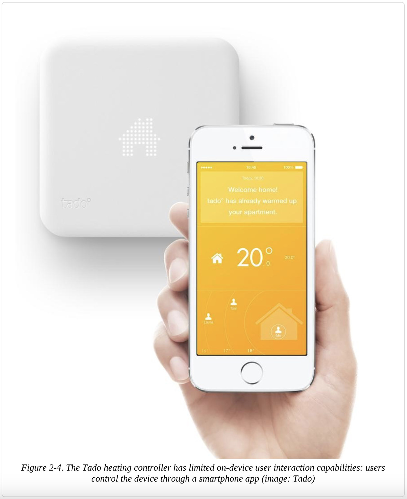
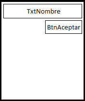
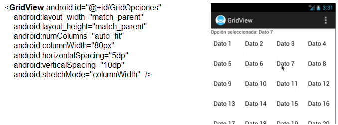
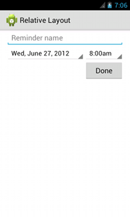
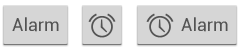
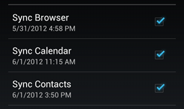
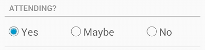

[Regresar](/Aplicaciones-Moviles-y-Servicios-Telematicos/)

# Unidad 1: Desarrollo de aplicaciones móviles

## 🎯 Objetivo de Aprendizaje
Al finalizar la clase el estudiante será capaz de:
- Desarrollar aplicaciones móviles sencillas considerando las características de la programación de dispositivos móviles.

# 1.3 Interfaz de usuario y ciclo de vida de actividades
- [Metodología de desarrollo de aplicaciones móviles](#metodologia)
- [Proceso de diseño y desarrollo de una aplicación](#proceso)
- [Prototipado móvil](#prototipado)
- [Patrones de diseño](#patrones)
- [Diseño de la pantalla de inicio](#inicio)
- [Tipos de aplicaciones](#tipos)
- [Arquitectura de Android](#arquitectura)
- [Estructura de un proyecto](#estructura)
- [Componentes de una aplicación](#componenes)
- [Ciclo de vida de la actidad](#ciclo)
- [Diseño en las vistas](#layout)
    -[Ejemplo de Relative Layout](#sample_relative)
- [Controles básicos](#controles_basicos)

<a name="metodologia"> </a>

# 📲 Metodología de desarrollo de aplicaciones móviles

**¿Podemos o no podemos usar las mismas metodologías, marcos y herramientas para el desarrollo de aplicaciones móviles?**

La respuesta es más bien un "Sí" a medida que el software se acerca al hardware y más un "No" a medida que se aleja del hardware.

Los marcos de referencia que nos ayudan a escribir software que está "más cerca" del hardware, como compiladores y ensambladores. Sin embargo, los marcos de referencia y herramientas de alto nivel, como las herramientas de desarrollo de interfaz de usuario (HTML, JFC, Visual Basic).

**Marcos de referencia y herramientas completamente centralizados**
 Debido a esta naturaleza integrada de los sistemas móviles totalmente centralizados, los recursos del dispositivo no son una preocupación en el desarrollo de software: las capacidades del cliente se conocen de antemano. Por lo tanto, tres de las dimensiones de la movilidad, a saber, la proliferación de plataformas, las capacidades limitadas de los dispositivos y el soporte para una variedad de interfaces de usuario, no se aplican a las aplicaciones totalmente centralizadas. Ejemplo: Sistemas de campo de batalla utilizados para determinar la ubicación de un objetivo y enviarlo a un sistema centralizado, que luego lo transmite a otro sistema responsable del lanzamiento de un misil.

 **Marcos de referencia cliente-servidor N-TIER y herramientas**
  Las aplicaciones cliente, en el caso del desarrollo móvil, son típicamente aquellas que se ejecutan en dispositivos móviles. Por lo general, no es posible escribir aplicaciones grandes para que los dispositivos sirvan como cliente, principalmente debido a los recursos limitados en los dispositivos y la gran variedad de ellos. Entonces, la mayoría de las veces, las aplicaciones móviles se distribuyen.


<a name="proceso"> </a>

# 📲 Proceso de diseño y desarrollo de una aplicación

<p align="center">
  
</p>

**1. Conceptualización**
El resultado de esta etapa es una idea de aplicación, que tiene en cuenta las necesidades y problemas de los usuarios. La idea responde a una investigación preliminar y a la posterior comprobación de la viabilidad del concepto.
Ideación
Investigación
Formalización de la idea

**2. Definición (usuario y funcional)**
En este paso del proceso se describe con detalle a los usuarios para quienes se diseñará la aplicación, usando metodologías como «Personas» y «Viaje del usuario». También aquí se sientan las bases de la funcionalidad, lo cual determinará el alcance del proyecto y la complejidad de diseño y programación de la app.

**3. Diseño**
En la etapa de diseño se llevan a un plano tangible los conceptos y definiciones anteriores, primero en forma de wireframes, que permiten crear los primeros prototipos para ser probados con usuarios, y posteriormente, en un diseño visual acabado que será provisto al desarrollador, en forma de archivos separados y pantallas modelo, para la programación del código. Incluyendo wireframes, prototipos, test con usuarios, y diseño visual.

**4. Desarrollo**
El programador se encarga de dar vida a los diseños y crear la estructura sobre la cual se apoyará el funcionamiento de la aplicación. Una vez que existe la versión inicial, dedica gran parte del tiempo a corregir errores funcionales para asegurar el correcto desempeño de la app y la prepara para su aprobación en las tiendas. Esto incluye programación del código y corrección de bugs.

**5. Publicación**
La aplicación es finalmente puesta a disposición de los usuarios en las tiendas. Luego de este paso trascendental se realiza un seguimiento a través de analíticas, estadísticas y comentarios de usuarios, para evaluar el comportamiento y desempeño de la app, corregir errores, realizar mejoras y actualizarla en futuras versiones.


<a name="prototipado"> </a>

# 📲 Prototipado móvil

Las herramientas para el diseño del prototipado móvil son las siguientes:

- [Proto.io](https://proto.io)

- [Marvelapp](https://marvelapp.com)

- [Adobe XD](https://www.adobe.com/la/products/xd.html)


<a name="patrones"> </a>

# 📲 Patrones de diseño

La ***Ley del pulgar*** se refiere a la superficie de pantalla a la que este dedo tiene acceso sin mayores problemas y nos da pistas para organizar jerárquicamente los elementos en la interfaz.

<p align="center">
  
</p>


<a name="inicio"> </a>

# 📲 Diseño de la pantalla de inicio

El splash de bienvenida que corresponde a la pantalla de inicio, es la primera pantalla que verá el usuario al iniciar la aplicación móvil. Su uso está siendo cada vez más limitado, por lo que generalmente se muestra rápidamente la primera vez que se abre la aplicación. Esta pantalla sirve como presentación del contenido mientras se realiza la carga inicial, por tanto, es normal que se incluya un elemento indicativo de carga junto a los demás elementos gráficos.

<p align="center">
  
</p>


<a name="tipos"> </a>

# 📲 Tipos de aplicaciones

- Aplicaciones nativas
- Aplicaciones web
- Aplicaciones híbridas
- Aplicaciones avanzadas

<p align="center">
  
</p>


<a name="arquitectura"> </a>

# 📲 Arquitectura de Android

Android es una pila de software de código abierto basado en Linux creada para una variedad amplia de dispositivos y factores de forma.

<p align="center">
  
</p>


<a name="estructura"> </a>

# 📲 Estructura de un proyecto

<p align="center">
  
</p>

**app > java > com.example.myfirstapp > MainActivity**

Esta es la actividad principal (el punto de entrada para tu app). Cuando compilas y ejecutas la app, el sistema inicia una instancia de esta Activity y carga su diseño.

**app > res > layout > activity_main.xml**

Contiene recursos de aplicación, como archivos de elementos de diseño, de diseño y de strings de IU.

**Gradle Scripts > build.gradle (Module: app)**

Este archivo define las configuraciones de compilación específicas para el módulo.

**Gradle Scripts > build.gradle (Project: appAMST)**

Este archivo define tu configuración de compilación que se aplica a todos los módulos.

**app > manifests > AndroidManifest.xml**

Describe la naturaleza de la aplicación y cada uno de sus componentes


<a name="componentes"> </a>

# 📲 Componentes de una aplicación

- Activity: Una Actividad comprende los componentes visuales ("vistas") para una pantalla, así como el código que muestra los datos en esa pantalla y puede responder a los eventos del usuario en esa pantalla. Casi todas las aplicaciones tienen al menos una clase Activity.

- View: Son los componentes básicos con los que se construyen la interfaz gráfica de la aplicación.

- Service: Es un componente que no tiene interfaz de usuario, y puede ejecutarse durante un período de tiempo más largo que una Actividad.

- Content Provider: Los proveedores de contenido también son relativamente raros, y se utilizan cuando una aplicación necesita compartir sus datos con otras aplicaciones; también pueden utilizarse con adaptadores de sincronización.

- Broadcast Receiver: Los receptores de emisión son menos comunes, y se utilizan para responder a eventos que afectan a todo el sistema, como la pérdida o recuperación de la conectividad de la red, el agotamiento de la batería, el reinicio del sistema, etcétera.

- Widget: Son elementos visuales, interactivos, que pueden mostrarse en la pantalla principal.

- Intent: Es el elemento básico de comunicación entre los distintos componentes Android que hemos descrito anteriormente.


<a name="ciclo"> </a>

# 📲 Ciclo de vida de la actidad
Cuando un usuario navega por tu app, sale de ella y vuelve a entrar, las instancias de ```Activity``` de tu app pasan por diferentes estados de su ciclo de vida. La clase ```Activity``` proporciona una serie de devoluciones de llamada que permiten a la actividad saber que cambió un estado, es decir, que el sistema está creando, deteniendo o reanudando una actividad, o finalizando el proceso en el que se encuentra.

Dentro de los métodos de devolución de llamada de ciclo de vida, puedes declarar el comportamiento que tendrá tu actividad cuando el usuario la abandone y la reanude. Por ejemplo, si creas un reproductor de video en streaming, puedes pausar el video y cancelar la conexión de red cuando el usuario cambia a otra app. Cuando el usuario vuelve, puedes volver a establecer la conexión con la red y permitir que el usuario reanude el video desde el mismo punto. En otras palabras, cada devolución de llamada te permite realizar un trabajo específico que es apropiado para un cambio de estado en particular. Hacer el trabajo preciso en el momento adecuado y administrar las transiciones correctamente hace que tu app sea más sólida y eficiente. Por ejemplo, una buena implementación de las devoluciones de llamada de un ciclo de vida puede ayudar a garantizar que tu app:

- No falle si el usuario recibe una llamada telefónica o cambia a otra app mientras usa la tuya.
- No consuma recursos valiosos del sistema cuando el usuario no la use de forma activa.
- No pierda el progreso del usuario si este abandona tu app y regresa a ella posteriormente.
- No falle ni pierda el progreso del usuario cuando se gire la pantalla entre la orientación horizontal y la vertical.

Para navegar por las transiciones entre las etapas del ciclo de vida de una actividad, la clase Activity proporciona un conjunto básico de seis devoluciones de llamadas: ```onCreate()```, ```onStart()```, ```onResume()```, ```onPause()```, ```onStop()```, y ```onDestroy()```. El sistema invoca cada una de estas devoluciones de llamada cuando una operación entra en un nuevo estado. Es decir, que la aplicación móvil pasará de un estado a otro si Android llama a los siguientes métodos en la Actividad actual en el momento adecuado.

<p align="center">
  
</p>

```setContentView()```: Establece el contenido de la actividad a partir de un recurso de diseño. El recurso se inflará, añadiendo todas las vistas de nivel superior a la actividad.


```onCreate()```: Es la devolución de llamada que se activa cuando el sistema crea la actividad por primera vez. Se hace el trabajo de constructor, como configurar la "ventana principal" con ```setContentView()```. añadiendo listeners a los botones para que hagan su trabajo (incluyendo iniciar Actividades adicionales), y así sucesivamente. Este es el único método que incluso la actividad más simple de Android necesita.


***Código fuente: MainActivity.java***

```
@Override
    protected void onCreate(Bundle savedInstanceState) {
        super.onCreate(savedInstanceState);
        setContentView(R.layout.activity_main);

        //Referencias a los controles del diseño
        edtUsuario = (EditText) findViewById(R.id.edtUsuario);
        edtClave = (EditText) findViewById(R.id.edtClave);

        btnLogin = (Button) findViewById(R.id.btnLogin);
        btnRegistro = (Button) findViewById(R.id.btnRegistro);
    }
```

```onStart()```: Hace que el usuario pueda ver la actividad mientras la app se prepara para que esta entre en primer plano y se convierta en interactiva. Por ejemplo, este método es donde la app inicializa el código que mantiene la IU.


```onResume()```: Cuando la actividad entra en el estado Resumed, pasa al primer plano y, a continuación, el sistema invoca la devolución de llamada onResume(). Este es el estado en el que la app interactúa con el usuario. La app permanece en este estado hasta que ocurre algún evento que la quita de foco. Tal evento podría ser, por ejemplo, recibir una llamada telefónica, que el usuario navegue a otra actividad o que se apague la pantalla del dispositivo.

```
public class CameraComponent implements LifecycleObserver {

    ...

    @OnLifecycleEvent(Lifecycle.Event.ON_RESUME)
    public void initializeCamera() {
        if (camera == null) {
            getCamera();
        }
    }

    ...
}
```

```onPause()```: El sistema llama a este método a modo de primera indicación de que el usuario está abandonando tu actividad (aunque no siempre significa que está finalizando la actividad); esto indica que la actividad ya no está en primer plano (aunque puede seguir siendo visible si el usuario está en el modo multiventana). Utiliza el método onPause() para pausar o ajustar las operaciones que no deben continuar (o que deben continuar con moderación) mientras Activity se encuentra en estado Paused y que esperas reanudar en breve. Hay varias razones por las que una actividad puede entrar en este estado. Por ejemplo:

- Algunos eventos interrumpen la ejecución de la app, como se describe en la sección onResume(). Este es el caso más común.
- En Android 7.0 (API nivel 24) o versiones posteriores, varias apps se ejecutan en el modo multiventana. Debido a que solo una de las apps (ventanas) tiene foco en cualquier momento, el sistema pausa todas las demás.
- Se abre una nueva actividad semitransparente (como un diálogo). Mientras la actividad siga siendo parcialmente visible, pero no esté en foco, se mantendrá pausada.

```
public class JavaCameraComponent implements LifecycleObserver {

    ...

    @OnLifecycleEvent(Lifecycle.Event.ON_PAUSE)
    public void releaseCamera() {
        if (camera != null) {
            camera.release();
            camera = null;
        }
    }

    ...
}
```

```onStop()```: Cuando el usuario ya no puede ver tu actividad, significa que ha entrado en el estado Stopped, y el sistema invoca la devolución de llamada onStop(). Esto puede ocurrir, por ejemplo, cuando una actividad recién lanzada cubre toda la pantalla. El sistema también puede llamar a onStop() cuando haya terminado la actividad y esté a punto de finalizar.

```
@Override
protected void onStop() {
    // call the superclass method first
    super.onStop();

    // save the note's current draft, because the activity is stopping
    // and we want to be sure the current note progress isn't lost.
    ContentValues values = new ContentValues();
    values.put(NotePad.Notes.COLUMN_NAME_NOTE, getCurrentNoteText());
    values.put(NotePad.Notes.COLUMN_NAME_TITLE, getCurrentNoteTitle());

    // do this update in background on an AsyncQueryHandler or equivalent
    asyncQueryHandler.startUpdate (
            mToken,  // int token to correlate calls
            null,    // cookie, not used here
            uri,    // The URI for the note to update.
            values,  // The map of column names and new values to apply to them.
            null,    // No SELECT criteria are used.
            null     // No WHERE columns are used.
    );
}
```

```onDestroy()```: Se llama onDestroy() antes de que finalice la actividad. El sistema invoca esta devolución de llamada por los siguientes motivos:

- La actividad está terminando, debido a que el usuario la descarta por completo o a que se llama a ```finish()```.
- El sistema está finalizando temporalmente la actividad debido a un cambio de configuración (como la rotación del dispositivo o el modo multiventana).


<a name="layout"> </a>

# 📲 Diseño en las vistas

**Linear Layout:** Un diseño que organiza a sus hijos en una única fila horizontal o vertical. Crea una barra de desplazamiento si la longitud de la ventana supera la longitud de la pantalla.

<p align="center">
  
</p>


**Relative Layout:** Permite especificar la ubicación de los objetos hijos entre sí (hijo A a la izquierda de hijo B) o con respecto al padre (alineado con la parte superior del padre).

<p align="center">
  
</p>


**List View:** Muestra una lista desplegable de una sola columna.

<p align="center">
  
</p>


**Grid View:** Muestra una cuadrícula desplazable de columnas y filas.

<p align="center">
  
</p>


<a name="sample_relative"> </a>

## 🌐 Ejemplo de Relative Layout

<p align="center">
  
</p>

```
<?xml version="1.0" encoding="utf-8"?>
<RelativeLayout xmlns:android="http://schemas.android.com/apk/res/android"
    android:layout_width="match_parent"
    android:layout_height="match_parent"
    android:paddingLeft="16dp"
    android:paddingRight="16dp" >
    <EditText
        android:id="@+id/name"
        android:layout_width="match_parent"
        android:layout_height="wrap_content"
        android:hint="@string/reminder" />
    <Spinner
        android:id="@+id/dates"
        android:layout_width="0dp"
        android:layout_height="wrap_content"
        android:layout_below="@id/name"
        android:layout_alignParentLeft="true"
        android:layout_toLeftOf="@+id/times" />
    <Spinner
        android:id="@id/times"
        android:layout_width="96dp"
        android:layout_height="wrap_content"
        android:layout_below="@id/name"
        android:layout_alignParentRight="true" />
    <Button
        android:layout_width="96dp"
        android:layout_height="wrap_content"
        android:layout_below="@id/times"
        android:layout_alignParentRight="true"
        android:text="@string/done" />
</RelativeLayout>
```

<a name="controles_basicos"> </a>

# 📲 Controles básicos

**Button:** Un botón consiste en un texto o un ícono (o ambos) que comunica la acción que ocurrirá cuando el usuario lo toque.

<p align="center">
  
</p>

En función de si deseas un botón con texto, un ícono o ambos, puedes crear el botón en tu diseño de tres maneras:

- Con texto, usando la clase ```Button```:

```
<Button
    android:layout_width="wrap_content"
    android:layout_height="wrap_content"
    android:text="@string/button_text"
    ... />
```

- Con un ícono, usando la clase ```ImageButton```:

```
<ImageButton
    android:layout_width="wrap_content"
    android:layout_height="wrap_content"
    android:src="@drawable/button_icon"
    android:contentDescription="@string/button_icon_desc"
    ... />
```

- Con texto y un ícono, usando la clase ```Button``` y el ```atributo android:drawableLeft```:

<Button
    android:layout_width="wrap_content"
    android:layout_height="wrap_content"
    android:text="@string/button_text"
    android:drawableLeft="@drawable/button_icon"
    ... />

**ImageView:** Muestra recursos de imagen, por ejemplo recursos Bitmap o Drawable.

```
<LinearLayout
     xmlns:android="http://schemas.android.com/apk/res/android"
     android:layout_width="match_parent"
     android:layout_height="match_parent">
     <ImageView
         android:layout_width="wrap_content"
         android:layout_height="wrap_content"
         android:src="@drawable/my_image"
         android:contentDescription="@string/my_image_description"
         />
 </LinearLayout>
``` 

**TextView:** Elemento de la interfaz de usuario que muestra texto al usuario.

```
 <LinearLayout
    xmlns:android="http://schemas.android.com/apk/res/android"
      android:layout_width="match_parent"
      android:layout_height="match_parent">
    <TextView
        android:id="@+id/text_view_id"
        android:layout_height="wrap_content"
        android:layout_width="wrap_content"
        android:text="@string/hello" />
 </LinearLayout>
 ```

**EditText:** Elemento de la interfaz de usuario para introducir y modificar texto. Al definir un widget de edición de texto, debe especificar el atributo R.styleable.TextView_inputType.

```
 <EditText
     android:id="@+id/plain_text_input"
     android:layout_height="wrap_content"
     android:layout_width="match_parent"
     android:inputType="text"/>
```

**CheckBox:** Las casillas de verificación permiten que el usuario seleccione una o más opciones de un conjunto. Por lo general, debes presentar cada opción de casilla de verificación en una lista vertical.

<p align="center">
  
</p>

```
<?xml version="1.0" encoding="utf-8"?>
<LinearLayout xmlns:android="http://schemas.android.com/apk/res/android"
    android:orientation="vertical"
    android:layout_width="fill_parent"
    android:layout_height="fill_parent">
    <CheckBox android:id="@+id/checkbox_meat"
        android:layout_width="wrap_content"
        android:layout_height="wrap_content"
        android:text="@string/meat"
        android:onClick="onCheckboxClicked"/>
    <CheckBox android:id="@+id/checkbox_cheese"
        android:layout_width="wrap_content"
        android:layout_height="wrap_content"
        android:text="@string/cheese"
        android:onClick="onCheckboxClicked"/>
</LinearLayout>
```

```
public void onCheckboxClicked(View view) {
    // Is the view now checked?
    boolean checked = ((CheckBox) view).isChecked();

    // Check which checkbox was clicked
    switch(view.getId()) {
        case R.id.checkbox_meat:
            if (checked)
                // Put some meat on the sandwich
            else
                // Remove the meat
            break;
        case R.id.checkbox_cheese:
            if (checked)
                // Cheese me
            else
                // I'm lactose intolerant
            break;
        // TODO: Veggie sandwich
    }
}
```


**RadioButton:** Los botones de opción permiten al usuario seleccionar una opción de un conjunto. Debe utilizar botones de opción para conjuntos opcionales que se excluyan mutuamente si cree que el usuario necesita ver todas las opciones disponibles una al lado de la otra.

<p align="center">
  
</p>

```
<?xml version="1.0" encoding="utf-8"?>
<RadioGroup xmlns:android="http://schemas.android.com/apk/res/android"
    android:layout_width="match_parent"
    android:layout_height="wrap_content"
    android:orientation="vertical">
    <RadioButton android:id="@+id/radio_pirates"
        android:layout_width="wrap_content"
        android:layout_height="wrap_content"
        android:text="@string/pirates"
        android:onClick="onRadioButtonClicked"/>
    <RadioButton android:id="@+id/radio_ninjas"
        android:layout_width="wrap_content"
        android:layout_height="wrap_content"
        android:text="@string/ninjas"
        android:onClick="onRadioButtonClicked"/>
</RadioGroup>
```

```
public void onRadioButtonClicked(View view) {
    // Is the button now checked?
    boolean checked = ((RadioButton) view).isChecked();

    // Check which radio button was clicked
    switch(view.getId()) {
        case R.id.radio_pirates:
            if (checked)
                // Pirates are the best
            break;
        case R.id.radio_ninjas:
            if (checked)
                // Ninjas rule
            break;
    }
}
```