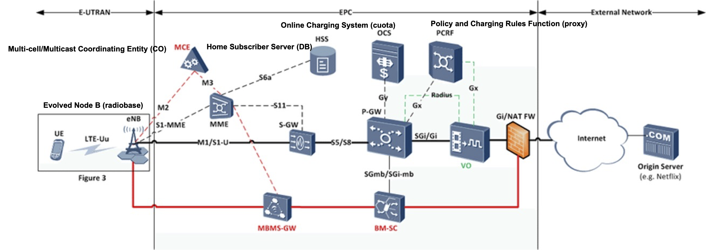

[Regresar](/Aplicaciones-Moviles-y-Servicios-Telematicos/)

# Unidad 2 Recursos en red para aplicaciones avanzadas

## 🎯 Objetivo de Aprendizaje
Al finalizar la clase el estudiante será capaz de:
- Demostrar el acceso a los recursos en red para la programación de aplicaciones móviles avanzadas.

# 2.1 Principios de Internet móvil
- [Internet móvil](#internet)

# 📲 Internet móvil
- Los objetivos de los sistemas celulares 5G son variados. Con la proliferación de los datos inalámbricos y el Internet de las cosas (IoT), se buscan sistemas inalámbricos 5G que permitan multiplicar por 100-1000 la capacidad de suma de redes, proporcionar conexiones para al menos 100.000 millones de dispositivos, comunicación de máquina a máquina a baja velocidad de datos, ofrezcan velocidades de datos máximas de 10 Gbps con latencias y tiempos de respuesta de submilisegundos, y proporcionen una fiabilidad muy alta. La baja latencia y la fiabilidad extremadamente alta serán esenciales para la automatización industrial móvil, la conectividad vehicular y la conducción automatizada, y otras aplicaciones IoT.
- El acceso radioeléctrico 5G se basará en tecnologías inalámbricas existentes evolucionadas, en particular LTE-A, LTE-A Pro y WiFi evolucionado.
- WiFi evolucionadas, al tiempo que se introducen nuevos medios de acceso radioeléctrico, en particular la tecnología celular de ondas milimétricas. 
- Las premisas básicas de la 5G celular son conectividad y capacidad masivas, una variedad creciente de aplicaciones de alta y baja velocidad de datos con requisitos de QoS, e interfaces de radio que operan simultáneamente en diferentes bandas de frecuencia.

  

- OCS: Online Charging System, es el lleva el control de la cuota (bytes), cuando de 1 gigabytes cuanto estoy gastando.
- Billing center: Convierte de bytes a dólares.
- En internet móvil se vende capacidad de descarga, en gigabytes.
- PCRF (Policy and Charging Rules Function): Convierte de políticas de navegación como un proxy, para los APN (Access-point network), define que URL son gratuitos.
- P-GW: Se somete a lo que diga el PCRF, OCS, asigna las direcciones IP y los APN. 
- FW: Se natea, compartir una dirección IP pública en varias IPs privadas.
- HSS: Es una base de datos de todos los usuarios, los IMSI (número que se encuentra atrás de mi chip, mac-address del chip) y los MSISDN (número telefónico), IMEI es similiar a la mac-address del telefóno.
- External Network: Es la red de internet, o la red de un cliente corporativo a la cual puedo llegar a través de una VPN site-to-site que se hace en FW.
- E-UTRAN: Red de acceso inalámbrico donde están los clientes con sus teléfonos.
- EPC: Packet Core.
- eNB (Evolved Node B): Nodo B es una radiobase que convierte de señales electromagnéticas a paquetes IP (pulsos de luz de las F.O.)
- VO: Equipos para la optimización de video.
- La conexión entre el teléfono y la radiobase se le llama interface Uu.
- MCE: Multi-cell/Multicast Coordinating Entity, es la central telefónica que interconecta todas las radiobases para el tráfico de voz, lo que se denota la central telefónica.
- Todo es paquetizado.