[Regresar](/Aplicaciones-Moviles-y-Servicios-Telematicos/)

# Unidad 2 Recursos en red para aplicaciones avanzadas

## 🎯 Objetivo de Aprendizaje
Al finalizar la clase el estudiante será capaz de:
- Demostrar el acceso a los recursos en red para la programación de aplicaciones móviles avanzadas.

# 2.2 Programación de sockets
- [Programación de sockets](#sockets)
- [Arquitectura general de los sistemas IoT utilizados en proyectos académicos](#arquitectura)
- [Taxonomía de problemas en el desarrollo de sistemas IoT](#taxonomia)
- [Frontend and Backend](#frontback)
- [Servicios web: API REST](#api)
- [Almacenamiento de datos y proveedores de contenido](#proveedores)
- [Referencias](#referencias)

# 📲 Sockets

+ Define las reglas que un programa ha de seguir para utilizar los servicios del nivel de transporte en una red TCP/IP. Esta interfaz se basa en el concepto de socket. 
+ Un socket es el punto final de una comunicación bidireccional entre dos programas que intercambian información a través de Internet.
+ Un socket se identifica por la dirección IP del dispositivo, más un número de puerto de 16 bits. 
+ Una conexión está determinada por un par de sockets, uno en cada extremo de la conexión. Existen dos tipos de socket: socket stream y socket datagram.
+ Permisos para el uso de internet por medio del teléfono celular en app > manifests > AndroidManifest.xml: 
<uses-permission android:name="android.permission.INTERNET"/>

https://www.iana.org/assignments/service-names-port-numbers/service-names-port-numbers.xml

# 📲 Arquitectura general de los sistemas IoT utilizados en proyectos académicos

  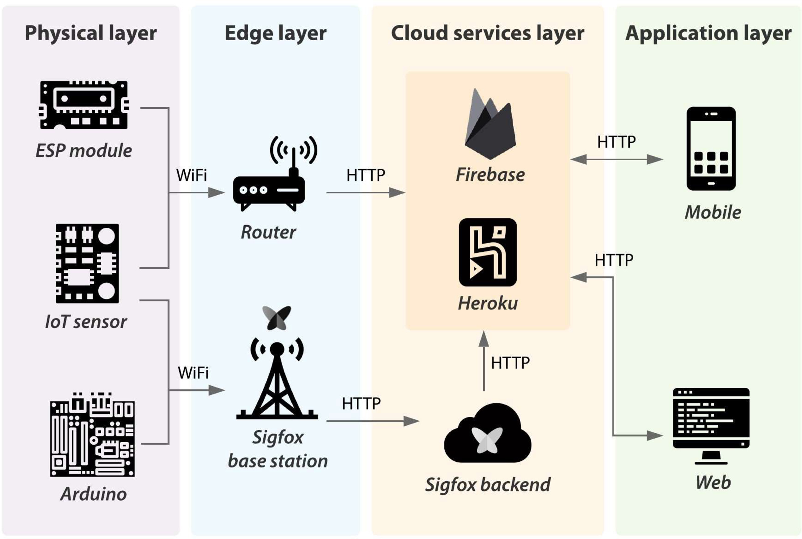

1. Physical layer: This layer corresponds to things that become intelligent by being programmed, integrating hardware development boards, sensors, and actuators to interact with the real world. Arduino and ThinkXtra Sigfox, iButton devices
with GPS sensors, and Suntech with GPS sensors were used in the AMST projects, whereas ESP8266 and ESP32 WiFi
modules were used in the PST projects. Weight sensors (HX711 sensor), gas (MQ-2 sensor), sound (KY-038 sensor), air quality
(MQ-135 sensor), and temperature and humidity (DHT11 sensor) were used in both courses.
2. Edge layer: This layer allows routing of the sensed data originating from the IoT devices from the physical layer to the cloud services
layer without manipulating them. This layer is based on communication protocols such as HTTP, which allows data to be sent
through wired or wireless technologies such as 0G, 3 G, 5 G, LTE, and IEEE 802.11.
3. Cloud services layer: This layer works bi-directionally with the application layer and is responsible for the storage and processing of
data required by software applications. Google Cloud services such as Firebase were used in some of the projects, and
Heroku, among others.
4. Application layer: This layer allows the monitoring of information by end users through combined and analyzed data, which can
contribute to decision-making. For AMST course projects, it is necessary to develop a mobile application, whereas, for PST,
these applications can be web or mobile depending on the type of project. The tools used for the development of mobile applications
were the Android Studio integrated development environment (IDE), and for web applications, the execution environment for
JavaScript Node.js, and the React library.

# 📲 Taxonomía de problemas en el desarrollo de sistemas IoT

  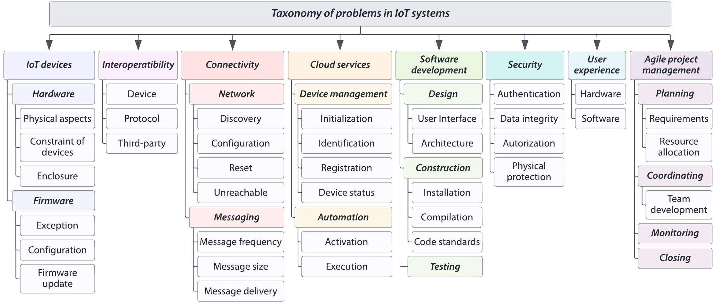

# 📲 Frontend and Backend

  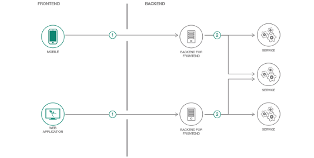

# 📲 The API concept
+ An API (Application Programming Interface) is software that allows other applications to access its data or services. It is a set of rules describing how one application can interact with another, and the instructions to allow the interaction to occur. The user sends an API request to a server asking for specific information and receives an API response in return from the server along with the requested information.

+ APIs are found almost everywhere. Amazon Web Services, Facebook, and home automation devices such as thermostats, refrigerators, and wireless lighting systems, all use APIs. They are also used for building programmable network automation.

  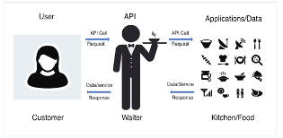

  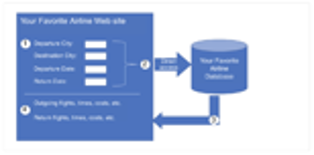

## Open, Internal, and partner APIS

  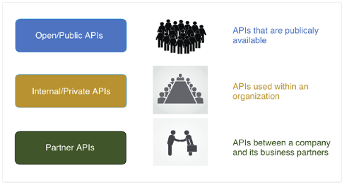

## Types of web service APIS

A web service is a service that is available over the internet, using the World Wide Web. There are four types of web service APIs:
+ Simple Object Access Protocol (SOAP)
+ Representational State Transfer (REST)
+ eXtensible Markup Language-Remote Procedure Call (XML-RPC)
+ JavaScript Object Notation-Remote Procedure Call (JSON-RPC)

  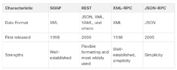

## REST and RESTful API

An API can be considered “RESTful” if it has the following features:

+ **Client-Server:** The client handles the front end and the server handles the back end. Either can be replaced independently of the other.
+ **Stateless:** No client data is stored on the server between requests. The session state is stored on the client.
+ **Cacheable:** Clients can cache responses to improve performance.

  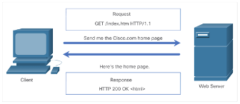

It is a collection of resources with four defined aspects:

+ The base Uniform Resource Identifier (URI) for the web service, such as http://example.com/resources.
+ The data format supported by the web service. This is often JSON, YAML, or XML but could be any other data format that is a valid hypertext standard.
+ The set of operations supported by the web service using HTTP methods.
+ The API must be hypertext driven.

  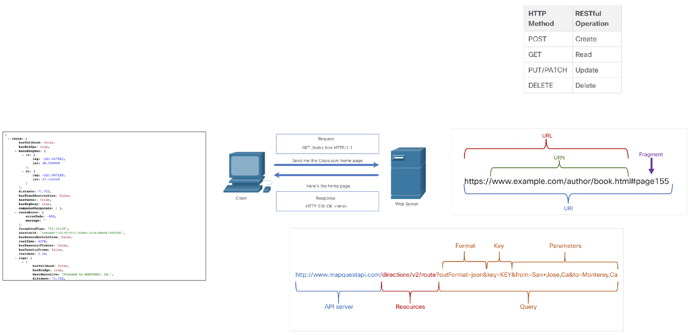

## Services

  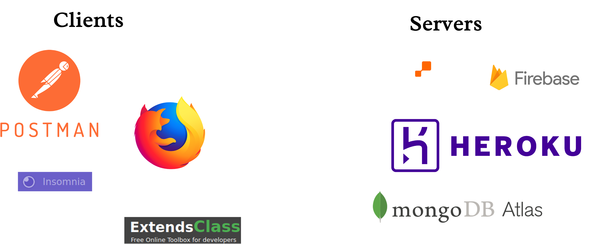

## HTTP staus messages

  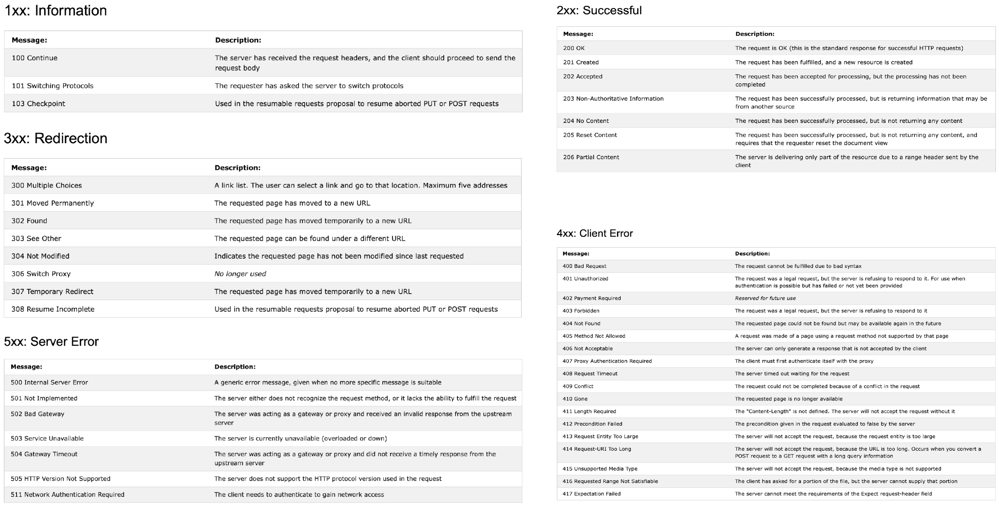

## Using postman with the Asana API

The Asana API is a RESTful interface, providing programmatic access to much of the data in the system. It provides predictable URLs for accessing resources, and uses built-in HTTP features to receive commands and return responses.
The API accepts JSON or form-encoded content in requests and returns JSON content in all of its responses, including errors.

1. Getting a Personal Access Token (PAT)
Open the Developer App Management page by using this permalink or following these steps:
* From within Asana, click your profile photo from the top bar and select "My Profile Settings"
* Click the "Apps" tab
* Click "Manage Developer Apps"
Click "+ Create New Personal Access Token"
+ Type a description of what you’ll use the Personal Access Token for.
+ Click "Create"
Copy your token. You will only see this one time, but you can always create another PAT later.

## Alicación “Postman”

Un completo entorno de desarrollo API REST.

## “Postman” User Interface (UI)

**Note:** The UI may vary depending on your platform and version of Postman.

## Request Method

+ HTTP request method drop-down box.
+ GET is the default.

## Request URL

Enter request URL.

## Authorization

+ Includes various types of authorization including Bearer Token and Oauth.
+ Cisco Webex Teams uses Bearer Token.

## Type: Bearer token

Copy and paste your access token from Cisco Webex Teams for Developers or your text editor.

## Headers: Content Type

+ Content-Type: application/json
+ Designates that the content be in JSON format (default)
+ Postman uses autocomplete for header values and keys.

## Params

Query Parameters can be entered using the Params tab or can be added to the URL using a ? followed by the key/value pair.

## Sending the URL Request

## Using postman with the webex teams API 
### List rooms using postman

**Cisco Webex for Developers**

**Postman**

1 **GET** method
2 URL of the API /rooms resource
3 Click the **Authorization** tab.
4 Authorization using **Bearer Token** 
5 Your access token
6 **Send** request.

## Response/Verification

+ **Status: 200 OK**
+ Response Body tab: JSON response

## Response data

## Response body

To see the response data in the proper format choose:
1 ***Body***
2 Pretty 
3 JSON

# 📲 Referencias
[An activity-based approach for the early identification and resolution of problems in the development of IoT systems in academic projects
](https://www.sciencedirect.com/science/article/pii/S2542660523002524)