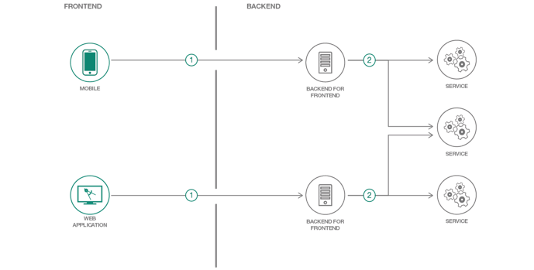
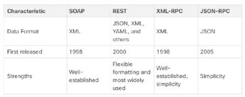

[Regresar](/Aplicaciones-Moviles-y-Servicios-Telematicos/)

# Unidad 2 Recursos en red para aplicaciones avanzadas

## 🎯 Objetivo de Aprendizaje
Al finalizar la clase el estudiante será capaz de:
- Demostrar el acceso a los recursos en red para la programación de aplicaciones móviles avanzadas.

# 2.3 Servicios web: API REST
- [Frontend and Backend](#frontback)
- [Conceptos de API](#api)
- [Tipos de APIs](#tipo_api)
- [Tipos de servicios web](#servicios_web)
- [REST and RESTful API](#rest)
- [Servicios](#servicios)
- [Estado de mensajes HTTP](#mensaje)
- [Usando Postman con el API de ASANA](#postman)
- [Referencias](#referencias)

# 📲 Frontend and Backend

  

# 📲 Conceptos de API
+ An API (Application Programming Interface) is software that allows other applications to access its data or services. It is a set of rules describing how one application can interact with another, and the instructions to allow the interaction to occur. The user sends an API request to a server asking for specific information and receives an API response in return from the server along with the requested information.

+ APIs are found almost everywhere. Amazon Web Services, Facebook, and home automation devices such as thermostats, refrigerators, and wireless lighting systems, all use APIs. They are also used for building programmable network automation.

  

  

# 📲 Tipos de APIs

  

# 📲 Tipos de servicios web

A web service is a service that is available over the internet, using the World Wide Web. There are four types of web service APIs:
+ Simple Object Access Protocol (SOAP)
+ Representational State Transfer (REST)
+ eXtensible Markup Language-Remote Procedure Call (XML-RPC)
+ JavaScript Object Notation-Remote Procedure Call (JSON-RPC)

  

# 📲 REST and RESTful API

An API can be considered “RESTful” if it has the following features:

+ **Client-Server:** The client handles the front end and the server handles the back end. Either can be replaced independently of the other.
+ **Stateless:** No client data is stored on the server between requests. The session state is stored on the client.
+ **Cacheable:** Clients can cache responses to improve performance.

  

It is a collection of resources with four defined aspects:

+ The base Uniform Resource Identifier (URI) for the web service, such as http://example.com/resources.
+ The data format supported by the web service. This is often JSON, YAML, or XML but could be any other data format that is a valid hypertext standard.
+ The set of operations supported by the web service using HTTP methods.
+ The API must be hypertext driven.

  

# 📲 Servicios

  

# 📲 Estado de mensajes HTTP

  

# 📲 Usando Postman con el API de ASANA

The Asana API is a RESTful interface, providing programmatic access to much of the data in the system. It provides predictable URLs for accessing resources, and uses built-in HTTP features to receive commands and return responses.
The API accepts JSON or form-encoded content in requests and returns JSON content in all of its responses, including errors.

1. Getting a Personal Access Token (PAT)
Open the Developer App Management page by using this permalink or following these steps:
* From within Asana, click your profile photo from the top bar and select "My Profile Settings"
* Click the "Apps" tab
* Click "Manage Developer Apps"
Click "+ Create New Personal Access Token"
+ Type a description of what you’ll use the Personal Access Token for.
+ Click "Create"
Copy your token. You will only see this one time, but you can always create another PAT later.

# 📲 Referencias
[An activity-based approach for the early identification and resolution of problems in the development of IoT systems in academic projects
](https://www.sciencedirect.com/science/article/pii/S2542660523002524)