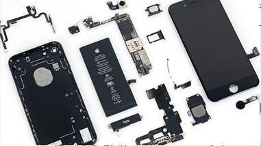
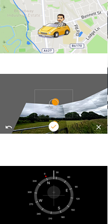
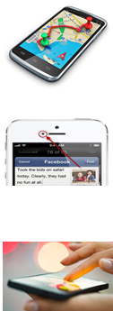
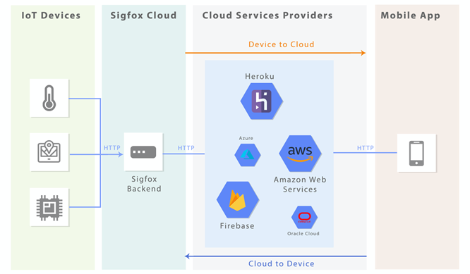
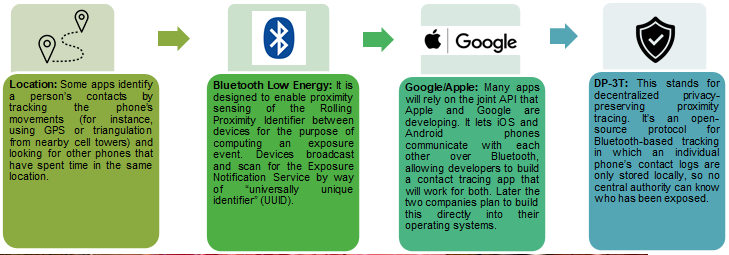
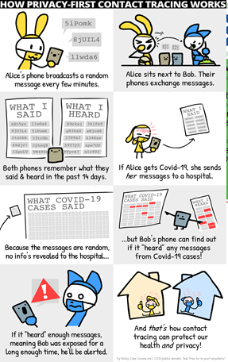
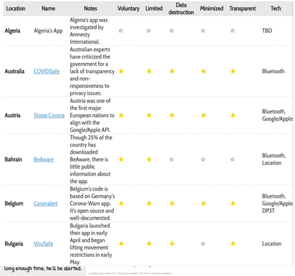
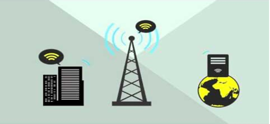
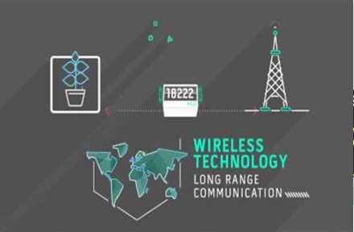
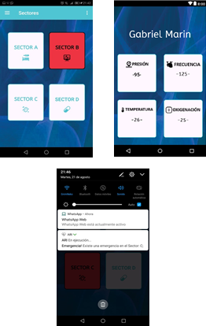

[Regresar](/Aplicaciones-Moviles-y-Servicios-Telematicos/)

# Unidad 3: Sensores embebidos

## 🎯 Objetivo de Aprendizaje
Al finalizar la sesión de clase, el estudiante será capaz de:

Diseñar aplicaciones que utilicen los sensores embebidos en dispositivos móviles para la entrega de información a los usuarios en tiempo real.


# 3.1 S

# 📲 Embedded sensors in mobile devices.
The smart phone's embedded sensors are a low-cost solution that allows interactions between humans, computers and the environment. 

Examples include applications designed to identify the user's location by GPS receiver, games that use accelerometers and/or gyroscope, Wi-Fi and Bluetooth antennas that exchange information between users, microphones that perceive user's gestural movements, and so on.


<p align="center">
  
</p>

+ **Accelerometers:** Handle axis-based motion sensing and can be found in fitness trackers as well as phones.

+ **Gyroscope** Helps the accelerometer out with understanding which way your phone is orientated, it adds another level of precision so those 360-degree photo spheres really look as impressive as possible.

+ **Magnetometer:** It measures magnetic fields and can thus tell you which way is north by varying its voltage output to the phone.

<p align="right">
  
</p>

+ **GPS** (Global Positioning System): Gets a ping from a satellite up in space to figure out which part of the planet you’re standing on (or driving through).

+ **Proximity sensor:** Usually sits up near the top speaker and combines an infrared LED and light detector to work out when you have the phone up to your ear, so that screen can be switched off.

+ **Ambient light sensor:** Meanwhile the ambient light sensor does exactly what you would expect, taking a measuring of the light in the room and adjusting your screen’s brightness accordingly (if indeed it’s set to auto-adjust).

<p align="right">
  
</p>

## Arquitectura del modelo de enseñanza basado en la nube de aplicaciones móviles avanzadas.


<p align="center">
  
</p>

## IoT sensors used in mobile applications


<p align="center">
  
</p>

## Location-based applications

What the Covid Tracing Tracker contains?
(*) The key terms about the basic technology underlying the contact tracing mobile application

<p align="center">
  
</p>


+ At the most basic level, we are compiling a list of automated contact tracing apps that are backed by national governments. 

+ These are apps designed to automatically tell users or public health officials whether somebody has potentially been exposed to covid-19; it’s what is generally known as “exposure notification.”

<p align="right">
  
</p>

Here’s the first version of that database.

So far we have documented 25 individual, significant automated contact tracing efforts globally, including details on what they are, how they work, and what policies and processes have been put in place around them.

<p align="right">
  
</p>

## [INV] Análisis de aplicaciones móviles de rastreo de contactos con sensores embebidos

## 🎯 Objetivo de Aprendizaje

Diseñar aplicaciones que utilicen los sensores embebidos en dispositivos móviles para la entrega de información a los usuarios en tiempo real.

### Actividades
1.Investigar sobre 3 aplicaciones móviles avanzadas que apliquen M2M, incluir detalles de la aplicación móvil. Por ejemplo: flota de buses que utilizan sensores en la batería del bus.
2. Hacer pruebas de usabilidad, por lo menos con 3 aplicaciones móviles de rastreo de contactos, considerando que usen los siguientes sensores embebidos: Bluetooth, GPS. 
Desarrollar una aplicación móvil que active uno de los sensores embebidos (Bluetooth, GPS, cámara).
3. Presentar diapositivas con los resultados de las actividades, incluyendo el enlace del repositorio de GitHub.

## Referencias bibliográficas
https://covid19-static.cdn-apple.com/applications/covid19/current/static/contact-tracing/pdf/ExposureNotification-BluetoothSpecificationv1.2.pdf?1
https://www.technologyreview.com/2020/05/07/1000961/launching-mittr-covid-tracing-tracker/
https://developer.android.com/guide/topics/connectivity/bluetooth
https://developer.android.com/training/camera
https://developer.android.com/guide/topics/sensors

### Data exchange protocols

LPWAN “low-power wide-area network” is a type of wireless telecommunication wide area network designed to allow long range communications at a low bit rate among things (connected objects), such as sensors operated on a battery.
There are a number of competing standards and vendors in the LPWAN space:


+ DASH7
+ Chirp spread spectrum based
+ LoRa
+ Sigfox

## Data exchange Protocols

**LoRaWAN**
+ LoRaWAN® network architecture is deployed in a star-of-stars topology in which gateways relay messages between end-devices and a central network server. 
+ The gateways are connected to the network server via standard IP connections and act as a transparent bridge, simply converting RF packets to IP packets and vice versa. 
+ All modes are capable of bi-directional communication.

<p align="center">
  
</p>

**Sigfox**
The Sigfox protocol focuses on: 
+ Autonomy. Extremely low energy consumption, allowing years of battery life.
Simplicity. No configuration, connection request or signaling. 
+ Cost efficiency. From the hardware used in the devices to our network, we optimize every step to be as cost-effective as possible.
+ Small messages. No large assets or media allowed on the network, only small notifications: up to 12 bytes.


<p align="center">
  
</p>

**Real-Time data capture**

+ Increased data generation has not only been limited to companies or large organizations. 

+ Individuals are also generating more personal data, known as digital traces.

+ Often, individuals can post and access historical and real time information about their environment, interests, and other variety of topics.


<p align="right">
  
</p>

+ In these applications, embedded systems must provide predictability both in response time and quality of the results. This feature raises them to the status of real-time systems. In such systems, the validity of the results is given not only for their correction but also because they are on time. That is, there are some restrictions that limit the time of its operation.

+ In a real-time remote monitoring set up, connected devices collect medical and other health data and use a Wi-Fi, zigbee, or cellular network to either transfer that data to a doctor or store it in the cloud where it may be accessible to doctors, care providers, patients, and consultants.

**Captura de datos en tiempo real**

Types of real time systems based on timing constraints:
+ Hard 
+ Firm
+ Soft

Reference model of real time system: Our reference model is characterized by three elements:

+ A workload model
+ A resource model
+ Algorithms

Otro factor que se debe tener en cuenta para decidir si el sistema es confiable para el uso en tiempo real, además de la latencia incurrida en el manejo de eventos externos, es la "variación" en esta latencia, es decir, para que un sistema se considere confiable para la aplicación en tiempo real, tiene que haber un límite superior sobre cuánta variación en la latencia puede ser tolerada por la aplicación en tiempo real. Hemos analizado nuestras mediciones experimentales con estos criterios en mente.

**Sensing and battery consumption**

+ Achieving low-power consumption in any embedded system is important. Embedded systems in space applications are an example where there is a defined, and typically low, power budget which must be met. 

+ Even in applications where at first it might appear that power consumption is a lower priority issue, such as in automotive applications, the growing use of embedded systems to replace mechanical systems has a large impact on quiescent power consumption.

## Utilization of storage and processing resources for sensing

+ This section provides a short summary of remote-sensing applications that use cloud-computing environments as well as a more detailed case study.
+ Project Matsu is an open-source project for processing satellite imaginary using a community cloud. This project, a collaboration between NASA and the Open Cloud Consortium (OCC), has been developed to process data from NASA’s EO-1 satellite and to develop open- source technology for public cloud-based processing of satellite imagery. Most computations were completed using a Hadoop framework running on 9 compute nodes with 54 compute cores AQ4 and 352GB of RAM. 

# Recomendaciones de estudio de la profesora

+ Asiste regularmente a las clases del componente teórico y práctico del Itinerario de Aplicaciones Móviles y Sistemas Telemáticos.
+ Participa en clase, en las actividades conjuntamente con la profesora.
+ Asiste a las ayudantías de docencia (hardware y software).
+ Investiga pro-activamente, para que aportes con ideas innovadoras.


```