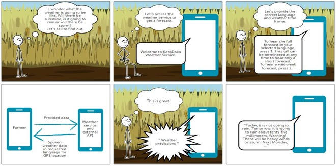

[Regresar](/Aplicaciones-Moviles-y-Servicios-Telematicos/)

**Unidad 4.** Sistemas telemáticos móviles

4.1 Salud móvil y reconocimiento de actividades
4.2 Principios de sensado colaborativo y participativo móvil
4.3 Aplicaciones para computación en el borde móvil
4.4 Aplicaciones telemáticas móviles y su impacto en la sociedad

## 🎯 Objetivo de Aprendizaje
Al finalizar la sesión de clase, el estudiante será capaz de:

Describir las características de sistemas telemáticos contemporáneos mediante la identificación de funcionalidades basadas en red.

## 📲 4.1 Salud móvil y reconocimiento de actividades
+ La “salud móvil” (mSalud) es un subconjunto de la cibersalud y se define como el uso de tecnologías inalámbricas móviles con fines de salud.

+ Una aplicación de salud es un software que proporciona información, consejos y comentarios sobre salud, estado físico o bienestar. Puede descargarse en un teléfono inteligente u otro dispositivo móvil.

+ Las aplicaciones pueden ayudar a mantener el bienestar, así como ayudar con el autocuidado y el control de síntomas de afecciones a largo plazo, como diabetes, enfermedades cardiovasculares y enfermedades pulmonares crónicas.

+ El monitoreo de la información de salud personal puede fomentar cambios de comportamiento.

## Principios de sensado colaborativo y participativo móvil

Los avances en las tecnologías móviles han dado lugar a una novedosa forma de innovación colaborativa (IC), a saber, la detección participativa, un proceso en el que individuos y comunidades utilizan dispositivos móviles cada vez más potentes, como teléfonos móviles e inteligentes, para recopilar y analizar datos sistemáticos.

Sensado participativo se refiere a un paradigma que implica el uso de dispositivos móviles para crear una red de sensores colaborativa que recopila, comparta, y analiza datos.

## Desarrollo de una nueva aplicación de salud.

+ Antes de poner en marcha o desarrollar una aplicación, el Ministerio recomienda que consulte la biblioteca de aplicaciones de “Health Navigator” y las tiendas de aplicaciones en línea para ver si existe una aplicación que satisfaga sus necesidades o las del consumidor.

+ La escala MARS, que se puede utilizar como lista de verificación y guía para el diseño y desarrollo de nuevas aplicaciones de salud.

+ Pautas para la creación de aplicaciones de vida saludable, Vic Health.

## Evaluación de aplicaciones móviles
Metodología MARS

La escala de calificación evalúa la calidad de la aplicación en cuatro dimensiones. 

Todos los elementos se califican en una escala de 5 puntos de “1. Inadecuado” a “5. Excelente”.

**Secciones:**

+ Compromiso
+ Funcionalidad
+ Estética
+ Información
+ Recomendaciones
+ Puntuación
+ Conciencia

Sección B: Funcionalidad

**Functionality-app functioning, easy to learn, navigation, flow logic, and gestural design of app**

**Performance:**  How accurately /fast do the features (functions) and components (buttons/menus) work?
App is broken; no/insufficient / inaccurate response (eg, crashes /bugs/ broken features, etc.)
Some functios work, but lagging or contains major technical problmes
App works overall. Some technical problmes need fixing / Slow at times
Mostly futional with minos / negligible problmes
Perfect / timely response; no technical bugs founf / contains a "loading time left" indicator.

**Caso de estudio**

Aplicación móvil para pronóstico del clima.

  

La salud móvil y el reconocimiento de actividad son áreas importantes en el ámbito de la tecnología y la salud. Aquí tienes información sobre ambos temas:

## Buscado en google:

**Salud Móvil:**
La salud móvil, también conocida como mHealth, se refiere al uso de dispositivos móviles, como teléfonos inteligentes y tabletas, para brindar servicios de atención médica. Esto puede incluir el monitoreo de la salud, el acceso a información médica, la gestión de enfermedades y la promoción de estilos de vida saludables. Las aplicaciones de salud móvil pueden ayudar a las personas a realizar un seguimiento de sus datos de salud, recibir recordatorios de medicamentos, acceder a información médica en tiempo real y más.

**Reconocimiento de Actividad:**
El reconocimiento de actividad se refiere a la capacidad de los dispositivos para identificar y entender las actividades que una persona está realizando. En el contexto de la salud móvil, esto podría implicar el seguimiento de la actividad física, como caminar, correr o hacer ejercicio. Los sensores en dispositivos móviles, como acelerómetros y giroscopios, se utilizan para recopilar datos sobre el movimiento y la actividad física del usuario. Estos datos pueden ser analizados para proporcionar información sobre el nivel de actividad física y apoyar objetivos de salud y bienestar.

**Aplicaciones Prácticas:**

**Seguimiento de la Actividad Física:** Las aplicaciones móviles pueden utilizar sensores para realizar un seguimiento de la cantidad de pasos dados, la distancia recorrida y las calorías quemadas.

**Monitoreo de la Salud:** Sensores en dispositivos móviles pueden medir parámetros de salud como la frecuencia cardíaca, la calidad del sueño y otros indicadores vitales.

**Promoción de Estilos de Vida Saludables:** Las aplicaciones pueden ofrecer consejos y recordatorios para fomentar hábitos saludables, como beber suficiente agua, mantener una dieta equilibrada, etc.
Desafíos:

**Privacidad y Seguridad:** La recopilación de datos de salud plantea preocupaciones sobre la privacidad y la seguridad de la información personal.

**Precisión del Reconocimiento:** Asegurar la precisión en la identificación de actividades es crucial para la utilidad de las aplicaciones de salud móvil.
En resumen, la salud móvil y el reconocimiento de actividad se están integrando cada vez más para proporcionar soluciones innovadoras que apoyan el bienestar y el cuidado de la salud.