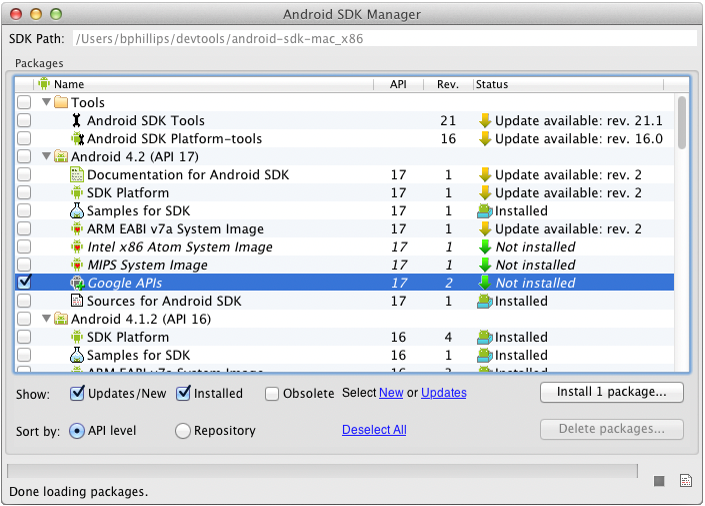
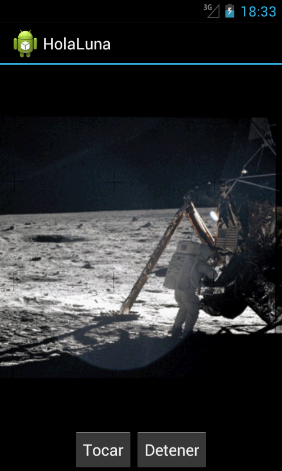
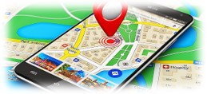
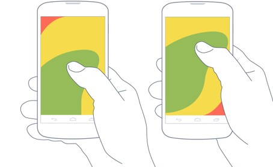
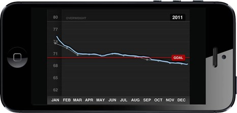
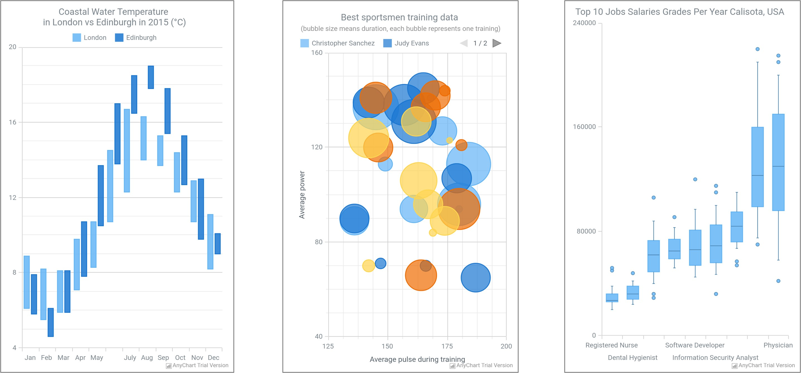
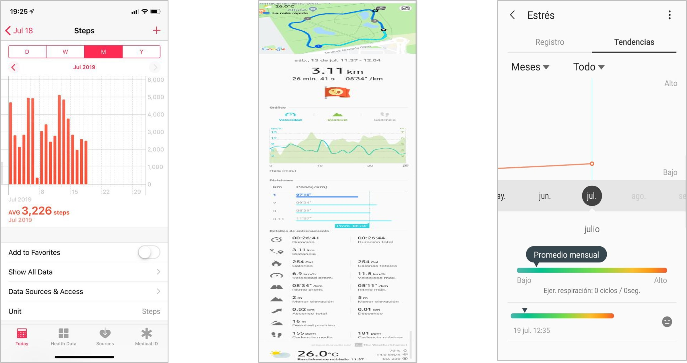

[Regresar](/Aplicaciones-Moviles-y-Servicios-Telematicos/)

# Unidad 4: Servicios basados en localización

## 🎯 Objetivo de Aprendizaje
Al finalizar la sesión de clase, el estudiante será capaz de:

Diseñar aplicaciones móviles basadas en la localización del dispositivo para la implementación de servicios personalizados de acuerdo a la ubicación de los usuarios.

# 4.1 Facilitaction od mobile device geolocation

More efficient mobile device location data can be obtained by estimating a most likely location point in a coverage pattern using a kernel density estimation technique. The kernel density estimation technique can provide a continuous estimate of the most frequented locations of a mobile device(s) within a coverage area. 

For each wireless sector, the collected location data can grouped to the closest geographic coordinate system, and an inference can be made based on the grouped data.

  

# 📲 Aplicaciones y servicios basados en localización 

Existen algunos trucos para obtener la localización:

+ Utilizando la última ubicación conocida del LocationManager para cualquier proveedor de ubicación.
+ Recuperar esa ubicación en la interfaz de usuario, y para eso simplemente puede transmitir un Intent como si fuera el LocationManager.

  

  

Múltiples son las aplicaciones y los servicios basados en localización, que buscan proveer servicios geográficos en tiempo real. A continuación serán enunciados algunos de los más relevantes.

+ **Rescate y salvamento:** En EE.UU. el servicio 911.
+ **Rastreo y navegación:** Navegación avanzada.
+ **Hogar:** Información preventiva sobre los lugares peligrosos.
+ **Privacidad:** DAA “Direct Anonymous Attestation”.
+ **Mensajería:** SIP “Session Initiation Protocol”.
+ **Sector commercial:** RFID “Radio Frequency Identification”.

  

## Visualización de datos sensados

La «Ley del pulgar» se refiere a la superficie de pantalla a la que este dedo tiene acceso sin mayores problemas y nos da pistas para organizar jerárquicamente los elementos en la interfaz.

  

+ SIP: con la intención de ser el estándar para la iniciación, modificación y finalización de sesiones interactivas de usuario donde intervienen elementos multimedia como el video, voz, mensajería instantánea, juegos en línea y realidad virtual.
+ RFID o  identificación por radiofrecuencia (del inglés Radio Frequency Identification) es un sistema de almacenamiento y recuperación de datos remoto que usa dispositivos denominados etiquetas, tarjetas o transpondedores RFID. El propósito fundamental de la tecnología RFID es transmitir la identidad de un objeto (similar a un número de serie único) mediante ondas de radio.

Tener en cuenta la orientación del dispositivo al utilizar la aplicación, significa aprovechar lo mejor de cada escenario.

  

## Visualización de datos sensados

  

Referencia: https://github.com/AnyChart/AnyChart-Android

https://github.com/AnyChart/AnyChart-Android
http://www.estadisticaparatodos.es/taller/graficas/cajas.html

**iOS - Steps**       
**Android -Steps**    
**Android - Stress**

  

http://appdesignbook.com/es/contenidos/patrones-interaccion-moviles/

